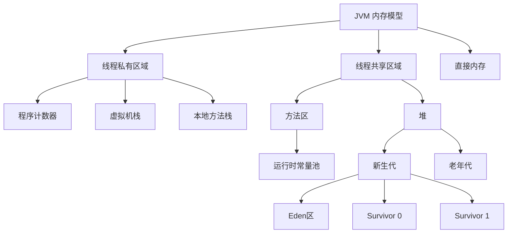
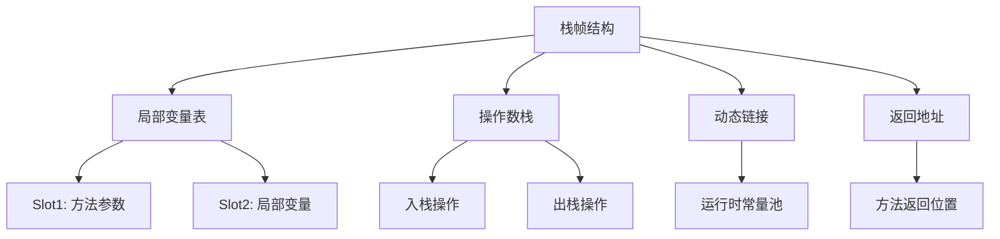
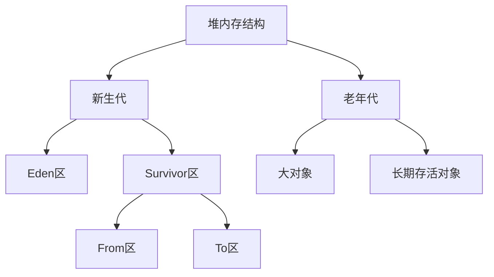
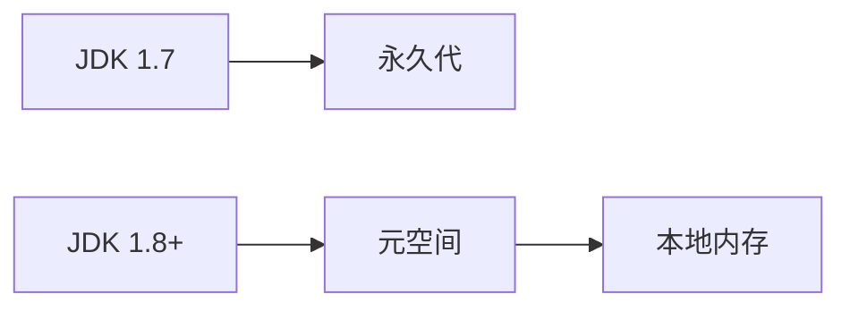
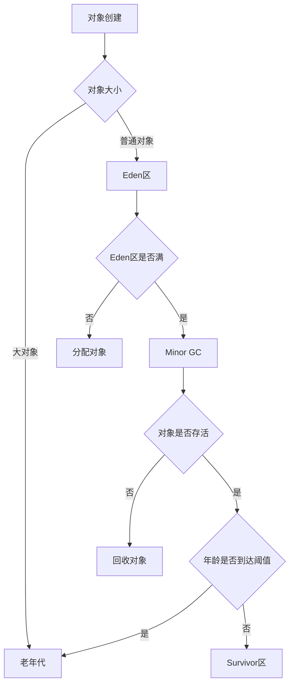
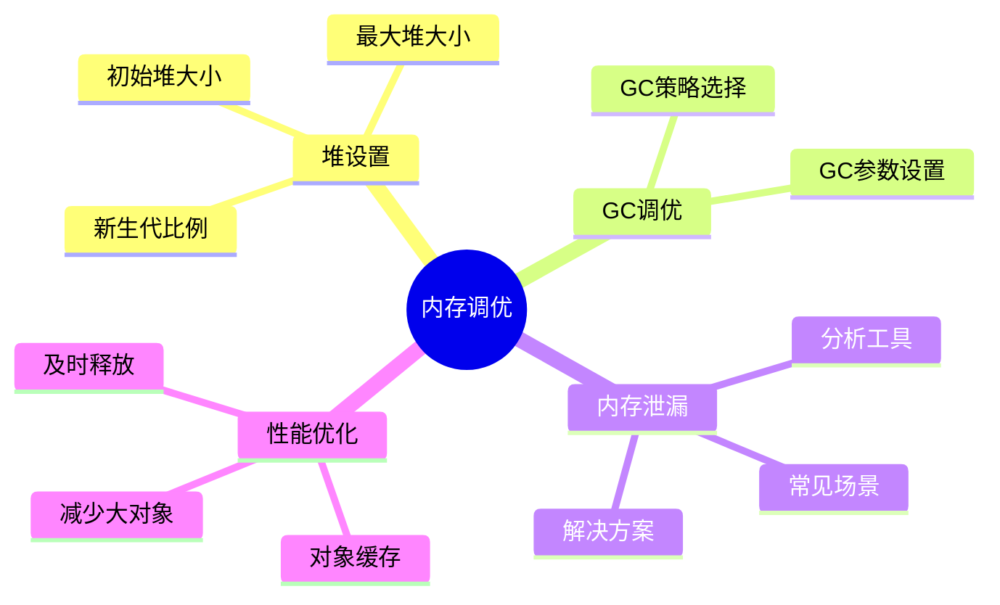
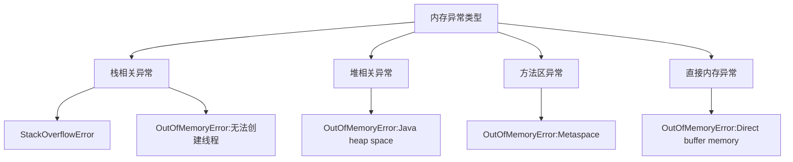
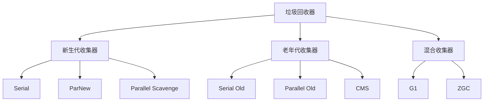
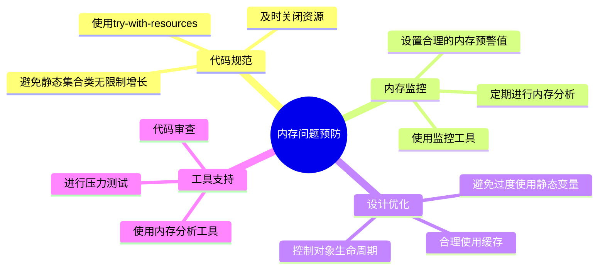
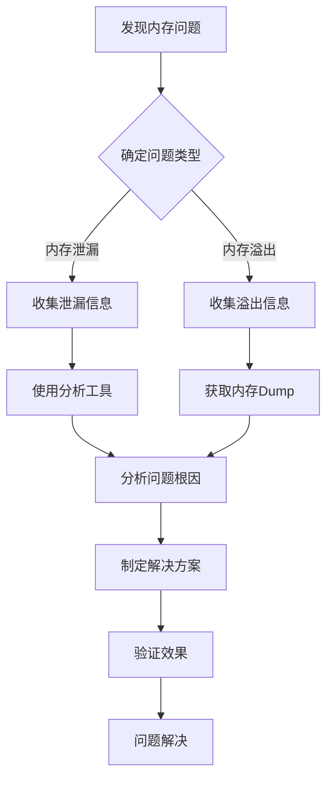

# 1 JVM内存区域与内存管理



## 1.1 运行时数据区

### 1.1.1 线程私有区域

#### 1.1.1.1 程序计数器（Program Counter Register）
- **定义**：当前线程所执行字节码的行号指示器
- **特点**：
  - 线程私有，每个线程都有自己的程序计数器
  - 唯一一个不会发生OutOfMemoryError的内存区域
  - 执行Native方法时，计数器值为空（Undefined）

#### 1.1.1.2 虚拟机栈（VM Stack）
- **定义**：描述Java方法执行的内存模型
- **栈帧结构**：
  ```java
  public class StackFrameDemo {
      public void method1(int param) {
          int localVar = param * 2;    // 局部变量表
          Object obj = new Object();    // 引用类型变量
          method2(localVar);           // 方法调用
      }
      
      private void method2(int param) {
          // 新的栈帧
      }
  }
  ```



#### 1.1.1.3 本地方法栈（Native Method Stack）
- **作用**：执行Native方法时使用
- **特点**：
  - 线程私有
  - 可能抛出StackOverflowError和OutOfMemoryError

### 1.1.2 线程共享区域

#### 1.1.2.1 堆（Heap）
- **定义**：存放对象实例的区域
- **特点**：
  - 内存最大的一块区域
  - 垃圾收集器管理的主要区域
  - 可以物理上不连续



- **分代划分**：
  ```java
  // 新生代对象创建示例
  public class HeapDemo {
      public static void main(String[] args) {
          // 在Eden区分配
          byte[] allocation1 = new byte[30900*1024];
          // 大对象直接进入老年代
          byte[] allocation2 = new byte[900000*1024];
      }
  }
  ```

#### 1.1.2.2 方法区（Method Area）
- **存储内容**：
  - 类信息（类的版本、字段、方法、接口等）
  - 常量池
  - 静态变量
  - JIT编译后的代码



#### 1.1.2.3 运行时常量池
- **特点**：
  - 方法区的一部分
  - Class文件中的常量池表
  - 运行期也可以添加新的常量

```java
// 运行时常量池示例
public class RuntimeConstantPoolDemo {
    public static void main(String[] args) {
        String str1 = "hello";
        String str2 = "world";
        String str3 = "hello" + "world";  // 编译期优化
        String str4 = str1 + str2;        // 运行期创建
        System.out.println(str3 == str4);  // false
    }
}
```

### 1.1.3 直接内存
- **定义**：不属于JVM运行时数据区
- **特点**：
  - 避免在Java堆和Native堆中来回复制数据
  - 被频繁使用时可以提高性能
  - 分配不当会导致OutOfMemoryError

```java
// 直接内存使用示例
import java.nio.ByteBuffer;

public class DirectMemoryDemo {
    public static void main(String[] args) {
        // 分配直接内存
        ByteBuffer buffer = ByteBuffer.allocateDirect(1024 * 1024);
        // 写入数据
        buffer.putInt(123);
        // 读取数据
        buffer.flip();
        System.out.println(buffer.getInt());
    }
}
```

## 1.2 内存分配与回收策略



### 1.2.1 对象优先在Eden分配
- **原则**：
  - 新对象优先分配在Eden区
  - Eden区满时触发Minor GC
  - 存活对象转移到Survivor区

### 1.2.2 大对象直接进入老年代
- **目的**：避免在Eden和Survivor区之间发生大量复制
- **策略**：超过阈值的大对象直接在老年代分配

### 1.2.3 长期存活对象进入老年代
- **年龄计数器**：每次Minor GC存活，年龄加1
- **晋升条件**：达到阈值（默认15）晋升到老年代

### 1.2.4 动态对象年龄判定
- **规则**：Survivor空间中相同年龄对象大小总和大于空间一半
- **效果**：年龄大于等于该年龄的对象直接进入老年代

## 1.3 实践建议



### 1.3.1 内存分配调优
- 合理设置堆大小
- 新生代和老年代的比例
- 直接内存的使用策略

### 1.3.2 内存泄漏排查
- 使用内存分析工具
- 常见泄漏场景分析
- 解决方案建议

### 1.3.3 性能优化建议
- 减少大对象的创建
- 合理利用对象缓存
- 及时释放不用的对象引用

## 1.4 内存区域对比分析

### 1.4.1 内存区域特点对比

| 内存区域       | 线程共享性 | 生命周期              | 异常类型                                | 垃圾回收      | 大小限制                    |
| ---------- | ----- | ----------------- | ----------------------------------- | --------- | ----------------------- |
| **程序计数器**  | 线程私有  | 线程创建时创建，线程结束时销毁   | 无                                   | 不需要回收     | 较小，固定大小                 |
| **虚拟机栈**   | 线程私有  | 线程创建时创建，线程结束时销毁   | StackOverflowError、OutOfMemoryError | 不需要回收     | -Xss参数设置                |
| **本地方法栈**  | 线程私有  | 线程创建时创建，线程结束时销毁   | StackOverflowError、OutOfMemoryError | 不需要回收     | 依赖具体JVM实现               |
| **堆**      | 线程共享  | JVM启动时创建，JVM关闭时销毁 | OutOfMemoryError                    | 垃圾回收的主要区域 | -Xms、-Xmx参数设置           |
| **方法区**    | 线程共享  | JVM启动时创建，JVM关闭时销毁 | OutOfMemoryError                    | 可以回收      | -XX:MaxMetaspaceSize    |
| **运行时常量池** | 线程共享  | 类加载时创建，类卸载时回收     | OutOfMemoryError                    | 可以回收      | 受方法区限制                  |
| **直接内存**   | 线程共享  | 显式分配和释放           | OutOfMemoryError                    | 手动释放或GC   | -XX:MaxDirectMemorySize |

### 1.4.2 内存区域存储内容对比

| 内存区域 | 主要存储内容 | 典型应用场景 | 优化建议 |
|---------|------------|-------------|----------|
| 程序计数器 | 当前线程执行字节码的行号 | 线程切换、异常处理 | 无需特别优化 |
| 虚拟机栈 | 局部变量表、操作数栈、动态链接、方法返回地址 | 方法调用、参数传递 | 合理设置栈大小，避免递归过深 |
| 本地方法栈 | Native方法的参数、局部变量 | JNI调用、底层操作 | 控制本地方法调用深度 |
| 堆 | 对象实例、数组 | 对象创建、数组分配 | 合理设置新生代和老年代比例，避免频繁GC |
| 方法区 | 类信息、常量、静态变量、JIT编译代码 | 类加载、反射调用 | 及时回收不用的类，控制类加载数量 |
| 运行时常量池 | 字面量、符号引用 | 字符串常量、类名常量 | 注意字符串常量池的大小设置 |
| 直接内存 | 堆外内存数据 | NIO操作、大数据缓冲 | 及时释放，避免内存泄漏 |

### 1.4.3 内存区域调优参数对比

| 内存区域 | JVM参数 | 默认值 | 调优建议 |
|---------|---------|--------|----------|
| 虚拟机栈 | -Xss | 1MB | 根据线程数和栈深度调整，一般512KB-1MB |
| 堆空间初始值 | -Xms | 物理内存/64 | 建议与-Xmx相同，避免堆大小调整 |
| 堆空间最大值 | -Xmx | 物理内存/4 | 根据应用需求设置，建议不超过物理内存的80% |
| 新生代大小 | -Xmn | - | 一般为堆大小的1/3或1/4 |
| 元空间初始值 | -XX:MetaspaceSize | 21MB | 根据类加载情况调整 |
| 元空间最大值 | -XX:MaxMetaspaceSize | 无限制 | 建议设置上限，防止OOM |
| 直接内存 | -XX:MaxDirectMemorySize | 与-Xmx相同 | 根据NIO操作频率调整 |

### 1.4.4 内存区域异常分析与解决方案



| 异常类型                                  | 可能原因          | 解决方案              |
| ------------------------------------- | ------------- | ----------------- |
| StackOverflowError                    | 递归调用过深、方法栈帧过大 | 优化递归算法、增加栈大小      |
| OutOfMemoryError:Java heap space      | 内存泄漏、大对象分配    | 检查内存泄漏、增加堆大小      |
| OutOfMemoryError:Metaspace            | 加载类过多、类信息过大   | 检查动态类加载、增加元空间大小   |
| OutOfMemoryError:Direct buffer memory | 直接内存未释放       | 及时释放直接内存、限制直接内存大小 |

## 1.5 垃圾回收机制

### 1.5.1 垃圾回收基本概念

#### 1.5.1.1 Minor GC
- **定义**：新生代的垃圾回收
- **触发条件**：
  - Eden区空间不足
  - 新创建对象的内存大于Eden区剩余空间
- **执行过程**：
  ```mermaid
  graph TB
      Start[Minor GC开始] --> Check[检查Eden区]
      Check --> Copy[复制存活对象]
      Copy --> Move[移动到Survivor区]
      Move --> Clean[清理Eden区]
      Clean --> End[Minor GC结束]
  ```
- **优点**：
  - 回收速度快
  - 停顿时间短
  - 频率较高但影响小
- **缺点**：
  - 可能产生对象晋升
  - Survivor区空间有限

#### 1.5.1.2 Full GC
- **定义**：整个堆内存和方法区的垃圾回收
- **触发条件**：
  1. 老年代空间不足
  2. 方法区空间不足
  3. 显式调用System.gc()
  4. 大对象直接进入老年代且空间不足
- **执行过程**：
  ```mermaid
  graph TB
      Start[Full GC开始] --> Stop[Stop The World]
      Stop --> Old[清理老年代]
      Old --> Method[清理方法区]
      Method --> Compact[内存整理]
      Compact --> Resume[恢复应用线程]
      Resume --> End[Full GC结束]
  ```
- **优点**：
  - 一次性清理所有垃圾对象
  - 内存碎片整理
  - 释放最大内存空间
- **缺点**：
  - 停顿时间长
  - 影响系统性能
  - 可能造成较大延迟

### 1.5.2 垃圾回收器分类[[垃圾回收机制]]



### 1.5.3 GC调优策略

#### 1.5.3.1 GC调优目标
- 降低Full GC频率
- 减少停顿时间
- 提高吞吐量
- 避免内存溢出

#### 1.5.3.2 调优参数
```java
// GC参数示例
public class GCTuningDemo {
    public static void main(String[] args) {
        // -XX:NewRatio=3 新生代和老年代比例1:3
        // -XX:SurvivorRatio=8 Eden和Survivor比例8:1:1
        // -XX:MaxTenuringThreshold=15 对象晋升阈值
        // -XX:PretenureSizeThreshold=3145728 大对象阈值
        
        // 模拟GC场景
        List<byte[]> list = new ArrayList<>();
        while (true) {
            list.add(new byte[1024 * 1024]); // 1MB
            Thread.sleep(100);
        }
    }
}
```

#### 1.5.3.3 调优实践
- **场景分析**：
  1. 高并发场景
  2. 大内存场景
  3. 低延迟场景

- **优化方向**：
  1. 合理设置内存分配
  2. 选择合适的垃圾收集器
  3. 优化代码减少对象创建

### 1.5.4 GC日志分析

```java
// GC日志示例
[GC (Allocation Failure) [PSYoungGen: 66560K->10748K(76800K)] 
    66560K->10748K(251392K), 0.0094119 secs] [Times: user=0.00 sys=0.00, real=0.01 secs]

[Full GC (Metadata GC Threshold) [PSYoungGen: 10748K->0K(76800K)] 
    [ParOldGen: 0K->10541K(174592K)] 10748K->10541K(251392K), 
    [Metaspace: 20856K->20856K(1069056K)], 0.0084183 secs]
```

- **日志解读**：
  1. GC类型（Minor/Full）
  2. GC原因
  3. 各分区内存变化
  4. GC耗时

## 1.6 内存泄漏与溢出分析

### 1.6.1 各内存区域泄漏与溢出特点

#### 1.6.1.1 堆区（Heap）
- **内存泄漏情况**：
  1. 静态集合类存储对象引用
  ```java
  public class HeapLeakDemo {
      private static List<Object> list = new ArrayList<>();
      public void addObject() {
          // 不断添加对象但从不释放
          list.add(new Object());
      }
  }
  ```
  2. 各种连接未关闭
  ```java
  public class ConnectionLeakDemo {
      public void dbOperation() {
          Connection conn = null;
          try {
              conn = DriverManager.getConnection("url");
              // 数据库操作
          } catch (Exception e) {
              e.printStackTrace();
          }
          // 未关闭连接，造成内存泄漏
      }
  }
  ```
  3. 内部类持有外部类引用
  ```java
  public class OuterClass {
      private byte[] data = new byte[100000];
      
      public class InnerClass {
          public void process() {
              // 内部类持有外部类引用，外部类无法被回收
              System.out.println(data.length);
          }
      }
  }
  ```

- **内存溢出情况**：
  1. 大量对象创建且无法被回收
  2. 单个对象过大超过堆空间
  3. 频繁创建大数组

#### 1.6.1.2 方法区（Method Area）
- **内存泄漏情况**：
  1. 动态生成类且未及时卸载
  ```java
  public class MethodAreaLeakDemo {
      public void generateClasses() {
          for (int i = 0; i < 100000; i++) {
              // 动态生成类
              Enhancer enhancer = new Enhancer();
              enhancer.setSuperclass(Object.class);
              enhancer.setCallback((MethodInterceptor) (obj, method, args, proxy) -> null);
              enhancer.create();
          }
      }
  }
  ```
  2. 静态字段持有大对象引用
  ```java
  public class StaticFieldLeakDemo {
      private static Map<String, byte[]> staticMap = new HashMap<>();
      
      public void addBigObject() {
          // 静态Map持续增加数据但不释放
          staticMap.put("key" + System.nanoTime(), new byte[1024 * 1024]);
      }
  }
  ```

- **内存溢出情况**：
  1. 加载过多的类信息
  2. 使用CGLib等动态代理框架创建大量类
  3. JSP应用重新部署时生成大量类信息

#### 1.6.1.3 虚拟机栈（VM Stack）
- **不会发生内存泄漏**：
  - 原因：栈帧随方法调用而创建，随方法结束而销毁
  - 特点：自动管理，无需手动释放

- **内存溢出情况**：
  1. 递归调用过深
  ```java
  public class StackOverflowDemo {
      public void recursion(int i) {
          // 无限递归调用
          recursion(i + 1);
      }
  }
  ```
  2. 创建过多线程
  ```java
  public class ThreadStackDemo {
      public void createThreads() {
          while (true) {
              // 不断创建新线程
              new Thread(() -> {
                  while (true) {
                      // 线程永不结束
                  }
              }).start();
          }
      }
  }
  ```

#### 1.6.1.4 本地方法栈（Native Method Stack）
- **不会发生内存泄漏**：
  - 原因：与虚拟机栈类似，由JVM自动管理
  - 特点：本地方法执行完毕后自动释放

- **内存溢出情况**：
  1. JNI调用层级过深
  2. 本地方法中申请大量本地内存未释放

#### 1.6.1.5 程序计数器（Program Counter Register）
- **不会发生内存泄漏和溢出**：
  - 原因：
    1. 线程私有且较小的内存空间
    2. 随线程创建而创建，线程结束而销毁
    3. 不会有额外的内存分配操作

#### 1.6.1.6 直接内存（Direct Memory）
- **内存泄漏情况**：
  1. DirectByteBuffer对象被回收但本地内存未释放
  ```java
  public class DirectMemoryLeakDemo {
      public void allocateDirectMemory() {
          while (true) {
              // 分配直接内存但不释放
              ByteBuffer.allocateDirect(1024 * 1024);
          }
      }
  }
  ```
  2. 手动管理直接内存未及时释放

- **内存溢出情况**：
  1. 直接内存总量超过限制
  2. 频繁申请大块直接内存

### 1.6.2 预防措施与最佳实践



#### 1.6.2.1 堆内存问题预防
```java
// 1. 使用WeakHashMap避免内存泄漏
private Map<String, byte[]> cache = new WeakHashMap<>();

// 2. 使用try-with-resources自动关闭资源
public void correctResourceHandling() {
    try (Connection conn = DriverManager.getConnection("url")) {
        // 数据库操作
    } catch (Exception e) {
        e.printStackTrace();
    }
}

// 3. 使用软引用管理缓存
public class CacheManager {
    private Map<String, SoftReference<byte[]>> cache = new HashMap<>();
    
    public void putData(String key, byte[] data) {
        cache.put(key, new SoftReference<>(data));
    }
    
    public byte[] getData(String key) {
        SoftReference<byte[]> ref = cache.get(key);
        return ref != null ? ref.get() : null;
    }
}
```

#### 1.6.2.2 方法区问题预防
```java
// 1. 控制动态类生成
public class ClassGenerationControl {
    private static final int MAX_CLASSES = 1000;
    private static int classCount = 0;
    
    public Class<?> generateClass() {
        if (classCount >= MAX_CLASSES) {
            throw new RuntimeException("Too many dynamic classes");
        }
        // 生成类的代码
        classCount++;
        return null; // 实际返回生成的类
    }
}

// 2. 使用弱引用管理类加载器
public class WeakClassLoaderReference {
    private WeakReference<ClassLoader> loaderRef;
    
    public void setClassLoader(ClassLoader loader) {
        this.loaderRef = new WeakReference<>(loader);
    }
}
```

#### 1.6.2.3 直接内存问题预防
```java
// 1. 使用内存池管理直接内存
public class DirectMemoryPool {
    private static final int BUFFER_SIZE = 1024 * 1024;
    private static final Queue<ByteBuffer> bufferPool = new ConcurrentLinkedQueue<>();
    
    public static ByteBuffer acquire() {
        ByteBuffer buffer = bufferPool.poll();
        if (buffer == null) {
            buffer = ByteBuffer.allocateDirect(BUFFER_SIZE);
        }
        return buffer;
    }
    
    public static void release(ByteBuffer buffer) {
        if (buffer != null) {
            buffer.clear();
            bufferPool.offer(buffer);
        }
    }
}
```

### 1.6.3 问题诊断与分析工具

#### 1.6.3.1 常用诊断工具
1. **JDK自带工具**
   - jmap：查看堆内存使用情况
   - jstack：查看线程堆栈信息
   - jstat：查看GC统计信息

2. **第三方工具**
   - MAT：内存泄漏分析
   - JProfiler：全面的性能分析
   - Arthas：在线诊断工具

#### 1.6.3.2 问题排查流程

