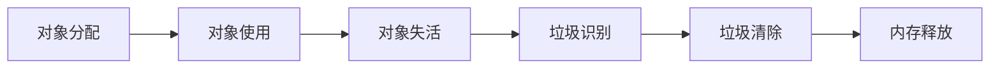
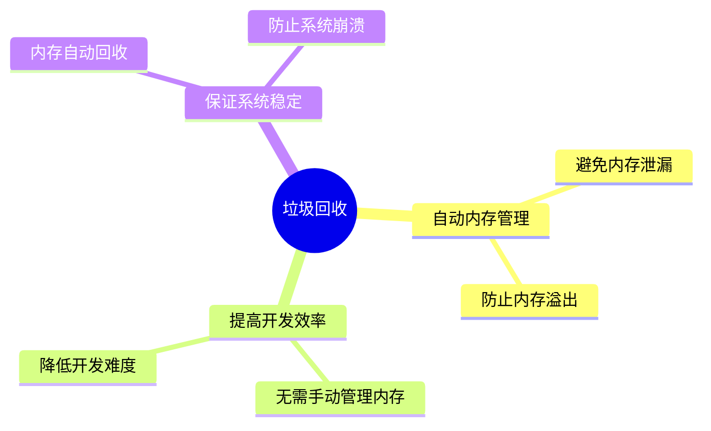
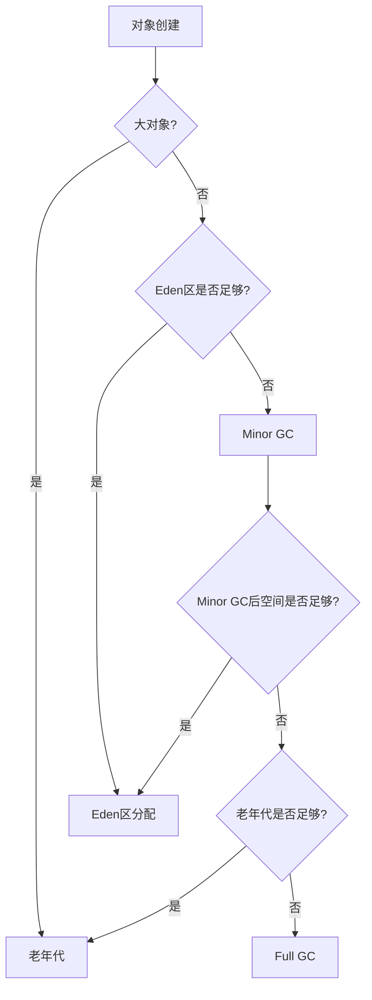
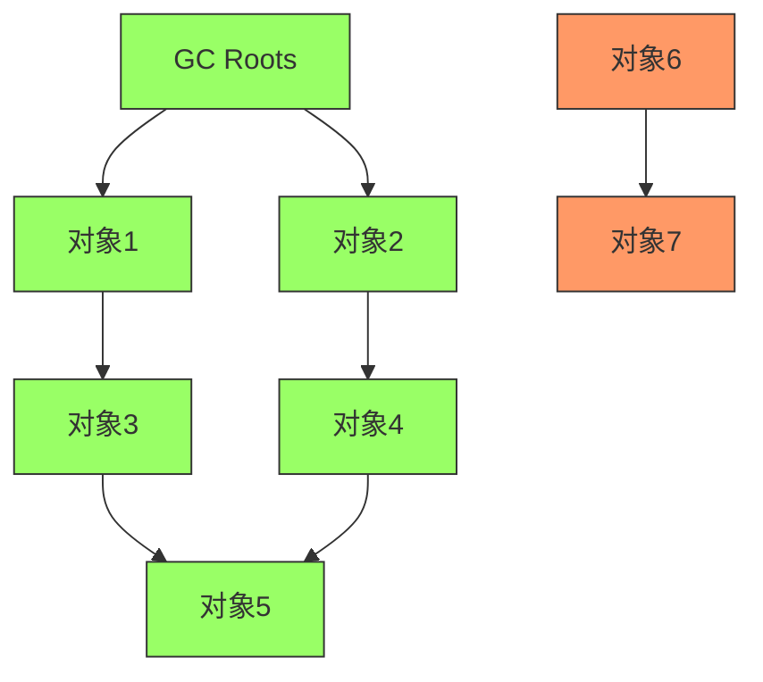
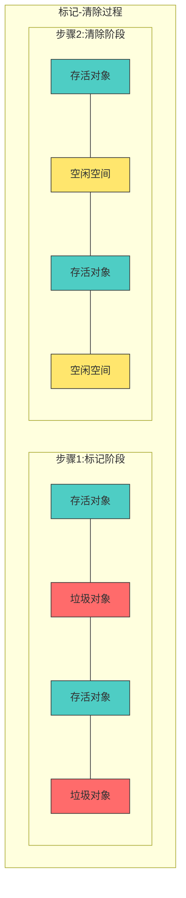
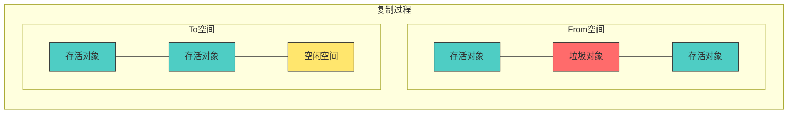
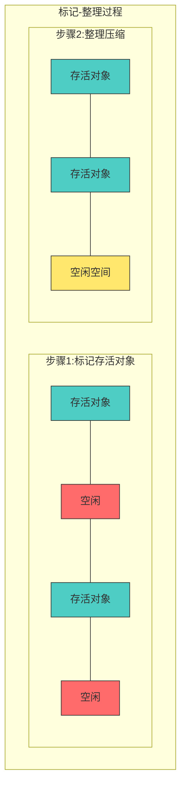
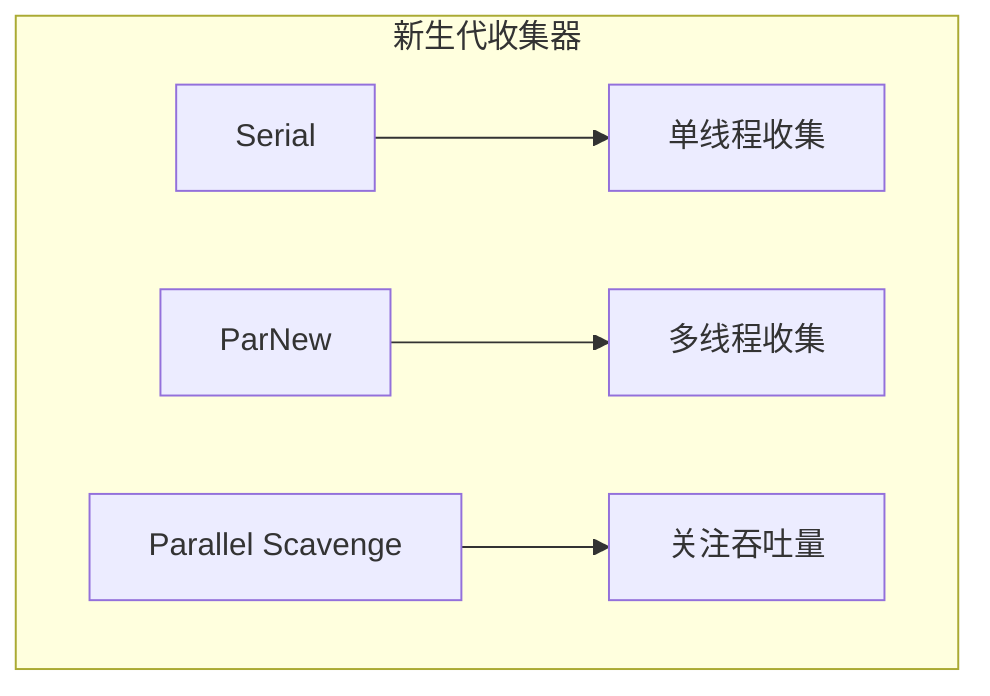
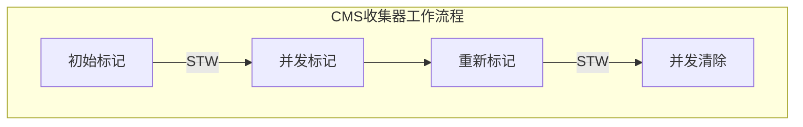
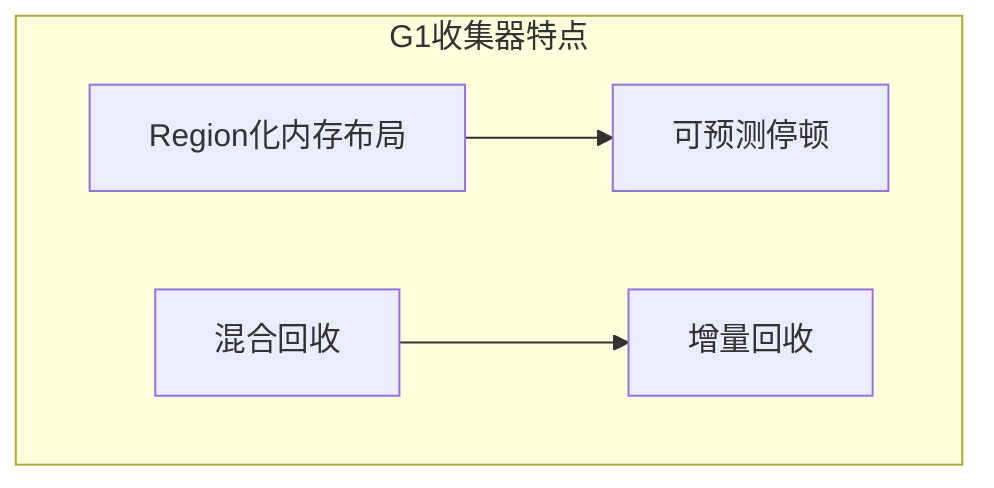

# 1 JVM 垃圾回收机制

## 1.1 概述

### 1.1.1 什么是垃圾回收

垃圾回收（Garbage Collection，GC）是 Java 虚拟机自动管理内存的一种机制，它能自动识别并清除不再使用的对象，释放内存空间，避免内存泄漏和溢出问题。

### 1.1.2 垃圾回收的基本流程



### 1.1.3 垃圾回收的重要性



### 1.1.4 内存分配策略



## 1.2 垃圾识别算法

### 1.2.1 引用计数法

- **原理**

  ```java
  public class ReferenceCountingDemo {
      private Object instance = null;
      private static final int _1MB = 1024 * 1024;
      private byte[] bigSize = new byte[2 * _1MB];

      public static void testGC() {
          ReferenceCountingDemo objA = new ReferenceCountingDemo();
          ReferenceCountingDemo objB = new ReferenceCountingDemo();
          objA.instance = objB;
          objB.instance = objA;

          objA = null;
          objB = null;

          System.gc(); // 可以被回收
      }
  }
  ```

  - 对象被引用计数加 1
  - 引用失效计数减 1
  - 计数为 0 时回收

- **优缺点**
  - 优点：实时性强，内存管理简单
  - 缺点：无法解决循环引用，计数器维护开销大

### 1.2.2 可达性分析



- **GC Roots 对象**
  GC Roots 是可达性分析算法的起点，是一组必须活跃的引用。在 Java 中，以下对象被认定为 GC Roots：

  1. **虚拟机栈引用的对象**

     - 线程栈帧中的局部变量表引用的对象
     - 每个线程都有自己的虚拟机栈，其中引用的对象都是 GC Roots

  2. **方法区中的静态属性引用的对象**

     - 类的静态变量引用的对象
     - 静态变量在类加载时就分配内存，生命周期长

  3. **方法区中的常量引用的对象**

     - 字符串常量池中的引用
     - final 修饰的常量引用的对象

  4. **本地方法栈中 JNI 引用的对象**

     - Native 方法引用的 Java 对象
     - JNI（Java Native Interface）调用中引用的对象

  5. **Java 虚拟机内部的引用**
     - 基本数据类型对应的 Class 对象
     - 系统类加载器
     - 异常对象（Exception）等

  ```java
  public class GCRootDemo {
      // 静态属性引用的对象（GC Root）
      private static GCRootDemo staticReference;

      // 常量引用的对象（GC Root）
      private static final GCRootDemo constantReference = new GCRootDemo();

      // 模拟JNI本地方法
      private native void nativeMethod();

      public static void main(String[] args) {
          method();
          // 系统类加载器（GC Root）
          ClassLoader systemClassLoader = ClassLoader.getSystemClassLoader();
      }

      public static void method() {
          // 虚拟机栈中的局部变量（GC Root）
          GCRootDemo localReference = new GCRootDemo();
          // 字符串常量（GC Root）
          String constant = "Hello, GC Root!";
      }
  }
  ```

- **引用类型**
  Java 中提供了四种引用类型，它们的强度依次减弱，用于不同的场景：

  1. **强引用（Strong Reference）**

     - 最常见的引用类型，如：`Object obj = new Object();`
     - 特点：只要强引用存在，对象就不会被回收
     - 应用场景：常用对象的引用，程序基本的数据结构

     ```java
     Object strongRef = new Object(); // 强引用示例
     ```

  2. **软引用（Soft Reference）**

     - 内存不足时会被回收的对象
     - 特点：在内存充足时保留，内存不足时回收
     - 应用场景：缓存，网页缓存、图片缓存等

     ```java
     // 软引用示例
     SoftReference<Bitmap> softRef = new SoftReference<>(new Bitmap());
     Bitmap bitmap = softRef.get(); // 获取软引用对象
     ```

  3. **弱引用（Weak Reference）**

     - 比软引用更弱，下一次 GC 时就会被回收
     - 特点：生命周期短，适合临时性的对象引用
     - 应用场景：WeakHashMap、观察者模式[[观察者模式]]

     ```java
     // 弱引用示例
     WeakReference<Cache> weakRef = new WeakReference<>(new Cache());
     // WeakHashMap示例
     WeakHashMap<Key, Value> weakMap = new WeakHashMap<>();
     ```

  4. **虚引用（Phantom Reference）**
     - 最弱的引用，随时可能被回收
     - 特点：不能通过虚引用获取对象，必须和引用队列一起使用
     - 应用场景：跟踪对象的回收状态，堆外内存的释放
     ```java
     // 虚引用示例
     ReferenceQueue<Object> refQueue = new ReferenceQueue<>();
     PhantomReference<Object> phantomRef =
         new PhantomReference<>(new Object(), refQueue);
     ```

  ```mermaid
  graph TB
    A[引用类型] --> B[强引用]
    A --> C[软引用]
    A --> D[弱引用]
    A --> E[虚引用]

    B --> F[特点：永不回收]
    B --> B1[场景：常用对象]

    C --> G[特点：内存不足时回收]
    C --> C1[场景：缓存实现]

    D --> H[特点：GC时回收]
    D --> D1[场景：WeakHashMap]

    E --> I[特点：随时回收]
    E --> E1[场景：对象回收跟踪]

    style B fill:#f9f,stroke:#333
    style C fill:#bbf,stroke:#333
    style D fill:#ddf,stroke:#333
    style E fill:#fdd,stroke:#333
  ```

## 1.3 垃圾收集算法

### 1.3.1 标记-清除算法

- **原理**：首先标记出所有需要回收的对象，在标记完成后统一回收掉所有被标记的对象。



- **特点**
  - 优点：实现简单，不需要移动对象
  - 缺点：会产生大量内存碎片，可能导致无法分配大对象

### 1.3.2 复制算法

- **原理**：将可用内存按容量划分为大小相等的两块，每次只使用其中的一块。当这一块内存用完了，就将还存活着的对象复制到另外一块上面，然后再把已使用过的内存空间一次清理掉。



- **特点**
  - 优点：内存整齐，运行高效
  - 缺点：内存利用率低，只使用了一半的内存空间

### 1.3.3 标记-整理算法

- **原理**：标记过程与标记-清除算法一样，但后续步骤不是直接清理可回收对象，而是让所有存活的对象都向一端移动，然后直接清理掉边界以外的内存。



- **特点**
  - 优点：内存整齐，解决了内存碎片问题
  - 缺点：需要移动对象，处理效率较低

## 1.4 垃圾收集器

### 1.4.1 新生代收集器



1. **Serial 收集器**

   - **工作原理**：单线程收集器，进行垃圾收集时必须暂停所有工作线程（Stop The World）
   - **算法**：复制算法
   - **优点**
     - 简单高效，单线程没有线程切换开销
     - 对于单 CPU 环境来说是最高效的收集器
   - **缺点**：收集过程中需要暂停所有工作线程
   - **适用场景**：Client 模式下的默认新生代收集器，适合单 CPU 和小内存场景
   - **参数设置**：`-XX:+UseSerialGC`

2. **ParNew 收集器**

   - **工作原理**：Serial 收集器的多线程版本
   - **算法**：复制算法
   - **优点**
     - 多线程收集，适合多 CPU 环境
     - 与 CMS 收集器配合使用
   - **缺点**：在单 CPU 环境下表现不如 Serial 收集器
   - **适用场景**：多 CPU 环境下的 Server 模式首选
   - **参数设置**
     ```java
     -XX:+UseParNewGC          // 使用ParNew收集器
     -XX:ParallelGCThreads=n   // 设置垃圾收集线程数
     ```

3. **Parallel Scavenge 收集器**
   - **工作原理**：关注吞吐量的多线程收集器
   - **算法**：复制算法
   - **特点**
     - 可控制的吞吐量
     - 自适应调节策略
   - **参数设置**
     ```java
     -XX:+UseParallelGC        // 使用Parallel收集器
     -XX:MaxGCPauseMillis=n    // 最大垃圾收集停顿时间
     -XX:GCTimeRatio=n         // 吞吐量大小
     ```
   - **使用建议**：注重吞吐量的后台运算服务器建议使用

### 1.4.2 老年代收集器



1. **Serial Old 收集器**

   - **工作原理**：Serial 收集器的老年代版本，单线程收集器
   - **算法**：标记-整理算法
   - **使用场景**
     - Client 模式下的默认老年代收集器
     - CMS 收集器的后备方案

2. **Parallel Old 收集器**

   - **工作原理**：Parallel Scavenge 的老年代版本
   - **算法**：标记-整理算法
   - **特点**：多线程，注重吞吐量
   - **参数设置**：`-XX:+UseParallelOldGC`

3. **CMS 收集器（Concurrent Mark Sweep）**
   - **工作原理**：以获取最短回收停顿时间为目标的收集器
   - **算法**：标记-清除算法
   - **运作过程**
     1. **初始标记**（STW）：标记 GC Roots 能直接关联的对象
     2. **并发标记**：进行 GC Roots Tracing
     3. **重新标记**（STW）：修正并发标记期间的变动
     4. **并发清除**：清除标记的垃圾对象
   - **优点**
     - 并发收集，低停顿
     - 互联网站或 B/S 系统的首选收集器
   - **缺点**
     - 对 CPU 资源敏感
     - 无法处理浮动垃圾
     - 产生空间碎片
   - **参数设置**
     ```java
     -XX:+UseConcMarkSweepGC    // 使用CMS收集器
     -XX:CMSInitiatingOccupancyFraction=68  // 触发CMS的内存占用阈值
     -XX:+UseCMSCompactAtFullCollection     // Full GC后整理碎片
     ```

### 1.4.3 G1 收集器



1. **G1（Garbage First）收集器**

   - **设计目标**：替代 CMS，成为服务端应用的首选收集器
   - **内存布局**
     - 将堆划分为多个大小相等的 Region
     - 每个 Region 可以扮演 Eden、Survivor、Old 等角色
     - 维护优先列表，优先处理回收价值最大的 Region
   - **运作过程**
     1. **初始标记**（STW）
     2. **并发标记**
     3. **最终标记**（STW）
     4. **筛选回收**（STW）
   - **优点**
     - 可预测的停顿时间
     - 区域化内存布局，增量回收
     - 解决 CMS 的碎片问题
   - **使用场景**
     - 服务端应用
     - 需要低停顿时间
     - 大内存（>6GB）应用
   - **参数设置**
     ```java
     -XX:+UseG1GC                // 使用G1收集器
     -XX:G1HeapRegionSize=n      // Region大小
     -XX:MaxGCPauseMillis=200    // 最大停顿时间
     ```

2. **ZGC 收集器**
   - **特点**
     - 可伸缩的低延迟垃圾收集器
     - 停顿时间不超过 10ms
     - 支持 TB 级内存
   - **核心技术**
     - 着色指针
     - 读屏障
     - 并发处理
   - **使用场景**
     - 对延迟要求极高的应用
     - 大内存服务器
   - **参数设置**
     ```java
     -XX:+UseZGC                 // 使用ZGC收集器
     -XX:ZAllocationSpikeTolerance // 内存分配速率容忍度
     ```

### 1.4.4 收集器选择建议

1. **场景选择**

   - 小内存（<4GB）：Serial + Serial Old
   - 中等内存（4-8GB）：ParNew + CMS
   - 大内存（>8GB）：G1
   - 超大内存（>32GB）：ZGC

2. **业务场景**

   - 后台计算型：Parallel Scavenge + Parallel Old
   - 在线服务型：ParNew + CMS 或 G1
   - 实时交易型：G1 或 ZGC

3. **调优建议**
   - 优先调整内存大小和比例
   - 合理设置垃圾回收线程数
   - 关注 GC 日志，及时调整参数
   - 选择合适的垃圾回收器组合
