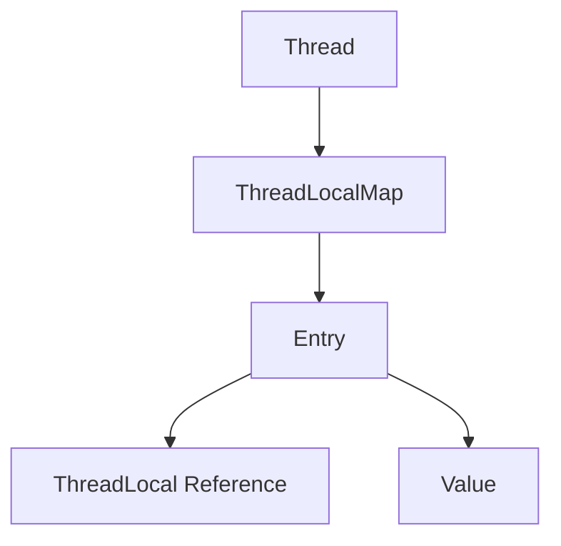

# 1 Java ThreadLocal

## 1.1 ThreadLocal 基本概念

### 1.1.1 什么是 ThreadLocal

ThreadLocal 是 Java 提供的线程本地变量机制，它允许每个线程独立地存储和访问自己的变量副本，实现了线程的数据隔离。

### 1.1.2 ThreadLocal 特点

1. **线程隔离**
   - 每个线程都有自己的变量副本
   - 线程间的变量互不干扰
   - 避免了线程安全问题

2. **数据独立**
   - 同一个 ThreadLocal 在不同线程中的值是独立的
   - 一个线程修改值不会影响其他线程
   - 适合处理线程私有的数据

3. **生命周期**
   - 与线程生命周期绑定
   - 线程结束时需要主动清理
   - 防止内存泄漏风险

## 1.2 ThreadLocal 实现原理

### 1.2.1 基本结构

```java
public class ThreadLocal<T> {
    // 每个线程都有一个 ThreadLocalMap
    static class ThreadLocalMap {
        // Entry 继承自 WeakReference
        static class Entry extends WeakReference<ThreadLocal<?>> {
            Object value;
            Entry(ThreadLocal<?> k, Object v) {
                super(k);
                value = v;
            }
        }
    }
}
```

### 1.2.2 工作原理

1. **存储结构**
   - Thread 类中有一个 ThreadLocalMap 成员变量
   - ThreadLocalMap 使用 ThreadLocal 作为 key
   - 使用**弱引用避免内存泄漏**

2. **数据存取**
   - set() 方法将值存入当前线程的 ThreadLocalMap
   - get() 方法从当前线程的 ThreadLocalMap 获取值
   - remove() 方法清除当前线程的对应值

3. **内存模型**


## 1.3 ThreadLocal 使用场景

### 1.3.1 常见应用

1. **用户会话管理**
```java
public class UserContext {
    private static final ThreadLocal<User> userHolder = new ThreadLocal<>();
    
    public static void setUser(User user) {
        userHolder.set(user);
    }
    
    public static User getUser() {
        return userHolder.get();
    }
    
    public static void clear() {
        userHolder.remove();
    }
}
```

2. **数据库连接管理**
```java
public class ConnectionManager {
    private static final ThreadLocal<Connection> connectionHolder = new ThreadLocal<>();
    
    public static Connection getConnection() {
        Connection conn = connectionHolder.get();
        if (conn == null) {
            conn = createConnection();
            connectionHolder.set(conn);
        }
        return conn;
    }
    
    private static Connection createConnection() {
        // 创建数据库连接
        return null;
    }
}
```

3. **事务上下文**
```java
public class TransactionContext {
    private static final ThreadLocal<Transaction> txHolder = new ThreadLocal<>();
    
    public static void beginTransaction() {
        Transaction tx = new Transaction();
        txHolder.set(tx);
    }
    
    public static Transaction getCurrentTransaction() {
        return txHolder.get();
    }
    
    public static void endTransaction() {
        txHolder.remove();
    }
}
```

### 1.3.2 最佳实践

1. **正确的使用模式**
```java
try {
    threadLocal.set(value);
    // 业务逻辑
} finally {
    threadLocal.remove();
}
```

2. **避免内存泄漏**
   - 使用完及时调用 remove()
   - 避免使用静态的 ThreadLocal 变量
   - 注意线程池场景的使用

3. **合理的设计方案**
   - 封装 ThreadLocal 的操作
   - 统一的上下文管理
   - 遵循最小权限原则

## 1.4 ThreadLocal 与内存泄漏

### 1.4.1 内存泄漏原因

1. **引用链**
   - Thread -> ThreadLocalMap -> Entry -> Value
   - ThreadLocal 使用弱引用
   - Value 仍然是强引用

2. **生命周期问题**
   - 线程池中的线程生命周期较长
   - ThreadLocal 被回收后 Value 无法被回收
   - 累积的 Value 造成内存泄漏

### 1.4.2 防止内存泄漏

1. **主动清理**
```java
public class SafeThreadLocal<T> {
    private final ThreadLocal<T> threadLocal = new ThreadLocal<>();
    
    public void set(T value) {
        threadLocal.set(value);
    }
    
    public T get() {
        return threadLocal.get();
    }
    
    public void remove() {
        threadLocal.remove();
    }
    
    @Override
    protected void finalize() {
        threadLocal.remove();
    }
}
```

2. **使用完即清理**
   - 使用 try-finally 确保清理
   - 在方法结束时调用 remove()
   - 避免使用静态 ThreadLocal

## 1.5 ThreadLocal 性能考虑

### 1.5.1 性能优势

1. **减少同步**
   - 避免了线程同步的开销
   - 提高了并发性能
   - 降低了线程竞争

2. **局部性原理**
   - 数据存在线程本地
   - 访问速度快
   - 缓存命中率高

### 1.5.2 性能优化

1. **合理使用**
   - 控制 ThreadLocal 变量数量
   - 及时清理不用的数据
   - 避免频繁创建 ThreadLocal

2. **注意事项**
   - 考虑内存占用
   - 注意线程池场景
   - 权衡使用场景

## 1.6 InheritableThreadLocal

### 1.6.1 基本概念

InheritableThreadLocal 是 ThreadLocal 的子类，它允许子线程访问父线程中的值。

### 1.6.2 使用场景

```java
public class InheritableContext {
    private static final InheritableThreadLocal<String> context = 
        new InheritableThreadLocal<>();
    
    public static void set(String value) {
        context.set(value);
    }
    
    public static String get() {
        return context.get();
    }
    
    public static void clear() {
        context.remove();
    }
}
```

### 1.6.3 注意事项

1. **线程池问题**
   - 线程池复用线程时不会继承值
   - 需要特殊处理线程池场景
   - 考虑使用其他方案

2. **数据一致性**
   - 父子线程数据独立
   - 修改不会相互影响
   - 注意并发安全
