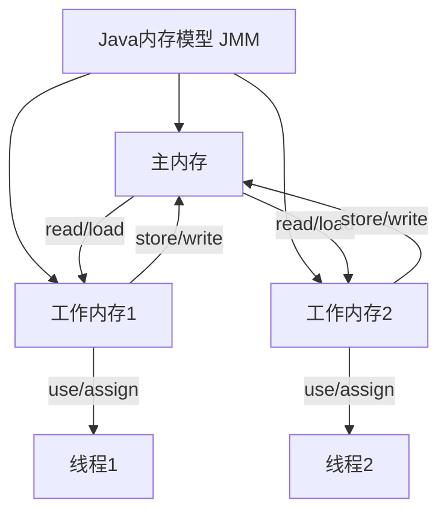
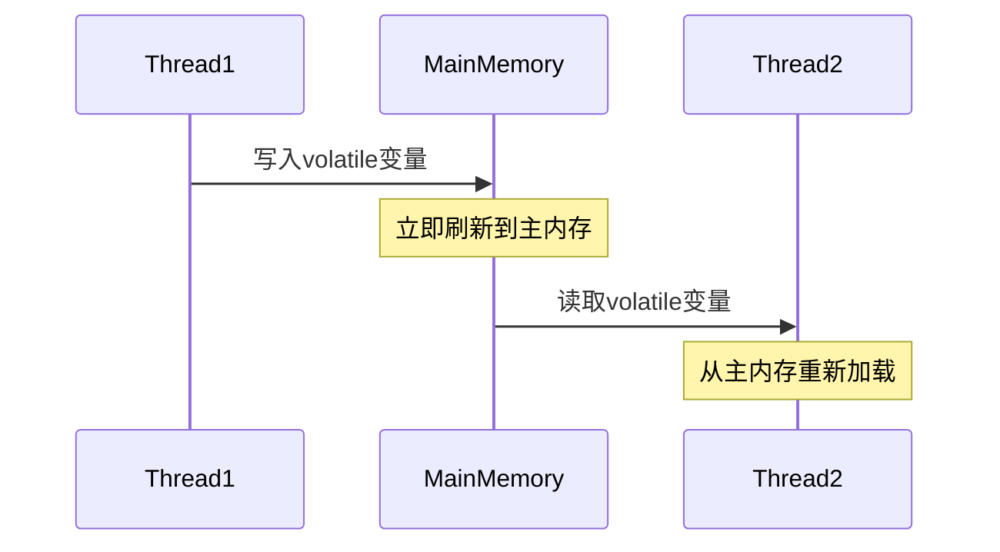
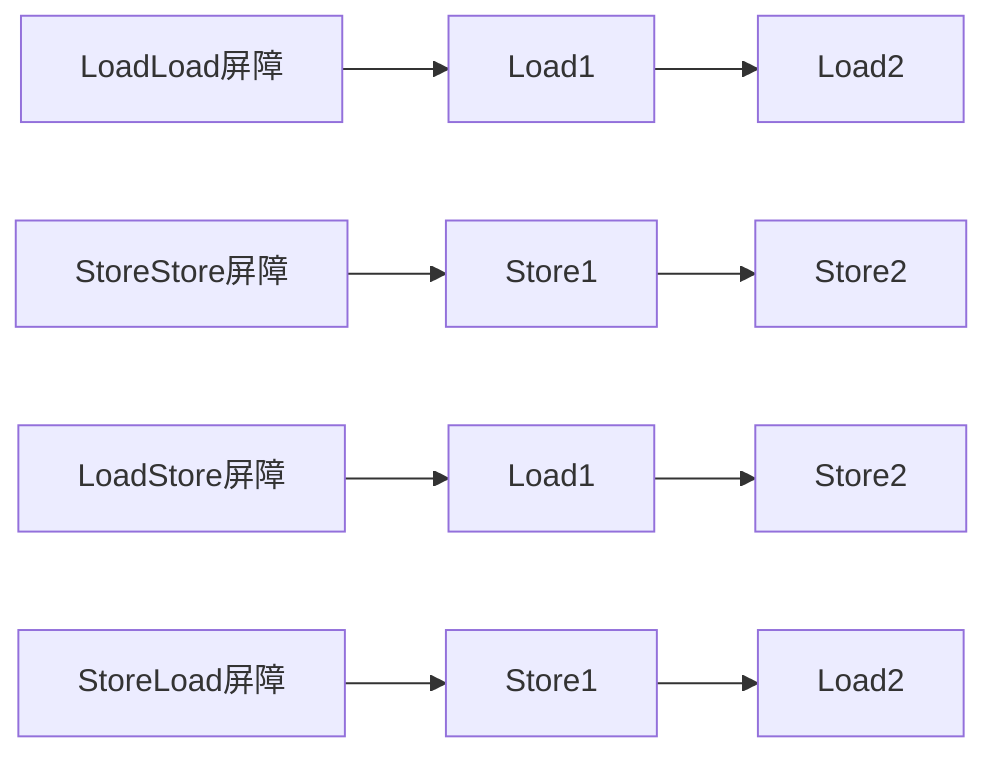

# 1 Java内存模型（JMM）详解

## 1.1 JMM基础概念

### 1.1.1 什么是Java内存模型

Java内存模型（Java Memory Model，简称JMM）是一种规范，它定义了Java程序中各个变量（线程共享变量）的访问规则，即在虚拟机中将变量存储到内存和从内存中取出变量这样的底层细节。



### 1.1.2 为什么需要JMM

JMM 的核心目标是确保多线程环境下的**可见性、有序性和原子性**，从而避免由于硬件和编译器优化带来的不一致问题。

- **可见性**：确保一个线程对变量的修改，能及时被其他线程看到。关键字 `volatile` 就是用来保证可见性的，它强制线程每次读写时都直接从主内存中获取最新值。
- **有序性**：指线程执行操作的顺序。JMM 允许某些指令重排序以提高性能，但会保证线程内的操作顺序不会被破坏，并通过 `happens-before` 关系保证跨线程的有序性。
- **原子性**：是指操作不可分割，线程不会在执行过程中被中断。例如，`synchronized` 关键字能确保方法或代码块的原子性。

## 1.2 JMM核心内容

### 1.2.1 内存交互操作

主内存与工作内存之间的具体交互协议，即一个变量如何从主内存拷贝到工作内存、如何从工作内存同步回主内存这样的实现细节：

1. **read（读取）**：从主内存读取数据
2. **load（载入）**：将读取的数据写入工作内存
3. **use（使用）**：从工作内存读取数据来计算
4. **assign（赋值）**：计算结果写入工作内存
5. **store（存储）**：工作内存数据写入主内存
6. **write（写入）**：将store的数据写入主内存
7. **lock（锁定）**：将主内存变量加锁
8. **unlock（解锁）**：将主内存变量解锁

### 1.2.2 内存可见性问题

```java
public class VisibilityExample {
    private boolean flag = false;
    
    public void write() {
        flag = true; // 线程A修改变量
    }
    
    public void read() {
        while (!flag) { // 线程B读取变量
            // 循环等待
        }
    }
}
```

在没有同步的情况下，线程A对flag的修改可能对线程B不可见，导致线程B无限循环。

## 1.3 volatile关键字详解

### 1.3.1 volatile的作用

1. **保证可见性**：一个线程修改了volatile变量的值，其他线程立即能够看到修改后的值
2. **禁止指令重排序**：防止编译器和处理器对volatile变量操作的重排序

### 1.3.2 volatile的内存语义



### 1.3.3 volatile使用场景

1. **状态标志**：
```java
public class ShutdownExample {
    private volatile boolean shutdownRequested = false;
    
    public void shutdown() {
        shutdownRequested = true;
    }
    
    public void doWork() {
        while (!shutdownRequested) {
            // 执行业务操作
        }
    }
}
```

2. **双重检查锁定**：
```java
public class Singleton {
    private volatile static Singleton instance;
    
    public static Singleton getInstance() {
        if (instance == null) {
            synchronized (Singleton.class) {
                if (instance == null) {
                    instance = new Singleton();
                }
            }
        }
        return instance;
    }
}
```

## 1.4 happens-before原则

### 1.4.1 什么是happens-before

happens-before是Java内存模型中定义的两个操作之间的偏序关系，如果操作A happens-before操作B，那么操作A在内存上的变化对操作B是可见的。

### 1.4.2 重要的happens-before规则

1. **程序顺序规则**：同一个线程中，前面的操作happens-before后面的操作
2. **volatile规则**：对volatile变量的写操作happens-before后续对该变量的读操作
3. **传递性规则**：如果A happens-before B，B happens-before C，那么A happens-before C
4. **锁定规则**：解锁happens-before后续对同一个锁的加锁

```java
public class HappenBeforeExample {
    private int value = 0;
    private volatile boolean flag = false;
    
    public void write() {
        value = 42;    // 1
        flag = true;   // 2
    }
    
    public void read() {
        if (flag) {    // 3
            System.out.println(value); // 4
        }
    }
}
```

根据happens-before规则：
- 操作1 happens-before 操作2（程序顺序规则）
- 操作2 happens-before 操作3（volatile规则）
- 操作3 happens-before 操作4（程序顺序规则）
- 因此操作1 happens-before 操作4（传递性）

## 1.5 内存屏障

### 1.5.1 什么是内存屏障

内存屏障（Memory Barrier）是一种CPU指令，用于控制特定条件下的重排序和内存可见性问题。

### 1.5.2 四种屏障类型

1. **LoadLoad屏障**：确保Load1数据的装载先于Load2及其后所有装载指令完成
2. **StoreStore屏障**：确保Store1数据对其他处理器可见先于Store2及其后所有存储指令的存储
3. **LoadStore屏障**：确保Load1数据装载先于Store2及其后所有存储指令完成
4. **StoreLoad屏障**：确保Store1数据对其他处理器变得可见先于Load2及其后所有装载指令的装载



## 1.6 实践应用

### 1.6.1 volatile的最佳实践

1. **适用场景**：
   - 作为状态标志
   - 单例模式的双重检查
   - 独立观察（独立值）

2. **不适用场景**：
   - 复合操作
   - 依赖之前的值
   - 运算结果依赖其他变量

### 1.6.2 代码示例

```java
// 正确使用volatile的示例
public class VolatileCounter {
    private volatile boolean flag = false;
    private int count = 0;
    
    public void toggle() {
        flag = !flag; // 原子操作，适合使用volatile
    }
    
    public void increment() {
        count++; // 非原子操作，不适合使用volatile
    }
}

// 使用synchronized确保复合操作的原子性
public class SafeCounter {
    private int count = 0;
    
    public synchronized void increment() {
        count++;
    }
    
    public synchronized int getCount() {
        return count;
    }
}
```

## 1.7 总结

1. **JMM的重要性**
   - 规范了Java程序的内存访问行为
   - 保证了Java程序在各种平台下的正确性

2. **volatile的核心特性**
   - 保证可见性
   - 禁止指令重排序
   - 不保证原子性

3. **实践建议**
   - 正确理解happens-before规则
   - 合理使用volatile关键字
   - 注意内存屏障的性能影响


