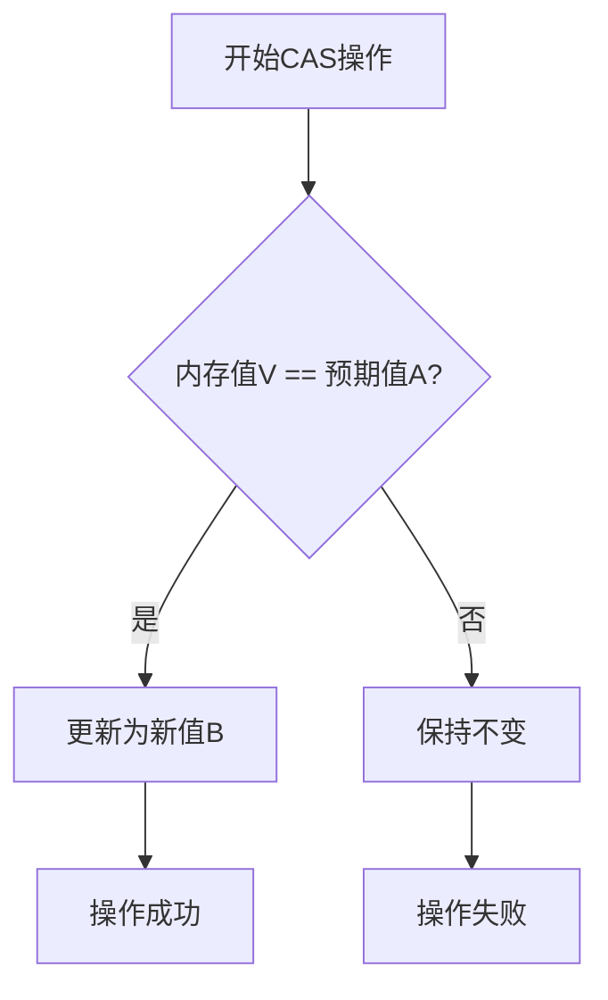

# 1 Java并发编程核心机制

## 1.1 CAS机制详解

### 1.1.1 CAS基本概念

CAS（Compare And Swap）是一种实现并发算法时常用的技术，它是一种无锁算法的实现。CAS包含三个操作数：
- 内存值V：当前实际存储的值
- 旧的预期值A：操作前期望的值
- 要修改的新值B：将要更新的值



### 1.1.2 CAS实现原理

1. **硬件级别保证**
   - CPU的cmpxchg指令：实现原子的比较和交换
   - 缓存锁定：
     - 总线锁：锁定总线，其他CPU无法访问内存
     - 缓存锁：锁定缓存行，性能更好

2. **Java实现**
```java
// Unsafe类提供的CAS操作
public final class Unsafe {
    public final native boolean compareAndSwapInt(
        Object obj,    // 对象
        long offset,   // 偏移量
        int expect,    // 预期值
        int update     // 更新值
    );
}

// AtomicInteger中的应用
public class AtomicInteger {
    private volatile int value;
    
    public final boolean compareAndSet(int expect, int update) {
        return unsafe.compareAndSwapInt(this, valueOffset, expect, update);
    }
    
    public final int incrementAndGet() {
        for (;;) {
            int current = get();
            int next = current + 1;
            if (compareAndSet(current, next))
                return next;
        }
    }
}
```

### 1.1.3 CAS的优缺点

1. **优点**
   - 无锁操作，避免线程切换和调度的开销
   - 适合高并发场景，性能较好
   - 是非阻塞算法的基础

2. **缺点**
   - ABA问题：值从A变成B又变回A，CAS会误认为没有变化
   - 循环时间长开销大：自旋时间过长会占用CPU
   - 只能保证一个共享变量的原子操作

### 1.1.4 CAS的应用场景

1. **原子类**
```java
// 基本类型原子类
AtomicInteger count = new AtomicInteger(0);
count.incrementAndGet(); // 原子递增

// 引用类型原子类
AtomicReference<User> userRef = new AtomicReference<>();
userRef.compareAndSet(oldUser, newUser);

// 带版本号的原子引用（解决ABA问题）
AtomicStampedReference<String> stampedRef = 
    new AtomicStampedReference<>("A", 0);
stampedRef.compareAndSet("A", "B", 0, 1);
```

2. **并发工具类实现**
```java
// ConcurrentHashMap中的CAS操作
static final class Node<K,V> {
    volatile V val;
    final K key;
    
    Node(K key, V val) {
        this.key = key;
        this.val = val;
    }
    
    final V casVal(V oldVal, V newVal) {
        return UNSAFE.compareAndSwapObject(this, valueOffset, oldVal, newVal);
    }
}
```

## 1.2 AQS框架详解

### 1.2.1 AQS基本概念

AQS（AbstractQueuedSynchronizer）是Java并发包中的核心基础组件，是用来构建锁或者其他同步组件的基础框架。它使用一个int成员变量表示同步状态，通过内置的FIFO队列来完成资源获取线程的排队工作。

### 1.2.2 AQS 核心特性

1. **状态管理**
   - 使用volatile int state维护同步状态
   - 子类通过getState()、setState()、compareAndSetState()进行操作
   - 独占模式和共享模式下的不同状态含义

2. **队列管理**
   - 基于CLH变种的FIFO双向队列
   - 支持独占锁和共享锁
   - 通过CAS操作实现无锁化的队列操作

3. **线程调度**
   - park/unpark机制实现线程等待和唤醒
   - 支持中断和超时机制
   - 提供独占和共享两种模式的调度

## 1.3 AQS 实现原理

### 1.3.1 同步队列


1. **节点结构**
```java
public abstract class AbstractQueuedSynchronizer {
    // 同步状态
    private volatile int state;
    
    // 等待队列的头节点
    private transient volatile Node head;
    
    // 等待队列的尾节点
    private transient volatile Node tail;
    
    // 节点定义
    static final class Node {
        volatile Node prev;       // 前驱节点
        volatile Node next;       // 后继节点
        volatile Thread thread;   // 当前线程
        volatile int waitStatus; // 等待状态
    }
}
```

### 1.3.2 AQS工作流程

1. **独占模式获取锁**
```java
// 获取锁的模板方法
public final void acquire(int arg) {
    if (!tryAcquire(arg) &&
        acquireQueued(addWaiter(Node.EXCLUSIVE), arg))
        selfInterrupt();
}
```

2. **释放锁流程**
```java
final boolean release(int arg) {
    if (tryRelease(arg)) {
        Node h = head;
        if (h != null && h.waitStatus != 0)
            unparkSuccessor(h);
        return true;
    }
    return false;
}
```

2. **共享模式获取锁**
```java
public final void acquireShared(int arg) {
    if (tryAcquireShared(arg) < 0)
        doAcquireShared(arg);
}

// 共享模式释放锁
public final boolean releaseShared(int arg) {
    if (tryReleaseShared(arg)) {
        doReleaseShared();
        return true;
    }
    return false;
}
```

### 1.3.3 AQS实践应用

1. **自定义互斥锁**
```java
public final void acquire(int arg) {
    if (!tryAcquire(arg) &&
        acquireQueued(addWaiter(Node.EXCLUSIVE), arg))
        selfInterrupt();
}
```

2. **共享式获取**
```java
public final void acquireShared(int arg) {
    if (tryAcquireShared(arg) < 0)
        doAcquireShared(arg);
}
```

3. **条件变量支持**
```java
public final void await() throws InterruptedException {
    if (Thread.interrupted())
        throw new InterruptedException();
    Node node = addConditionWaiter();
    int savedState = fullyRelease(node);
    int interruptMode = 0;
    while (!isOnSyncQueue(node)) {
        LockSupport.park(this);
        if ((interruptMode = checkInterruptWhileWaiting(node)) != 0)
            break;
    }
    // ...
}
```

### 1.3.4 实现细节

1. **状态维护**
   - volatile保证可见性
   - CAS保证原子性
   - 状态变化的有序性

2. **队列维护**
   - 入队和出队的原子性
   - 节点状态的变化
   - 前驱节点的唤醒机制

## 1.4 AQS 应用场景

### 1.4.1 ReentrantLock

```java
public class ReentrantLock implements Lock {
    private final Sync sync;
    
    abstract static class Sync extends AbstractQueuedSynchronizer {
        // 实现tryAcquire和tryRelease
    }
    
    static final class NonfairSync extends Sync {
        // 非公平锁实现
    }
    
    static final class FairSync extends Sync {
        // 公平锁实现
    }
}
```

### 1.4.2 Semaphore

```java
public class Semaphore implements java.io.Serializable {
    private final Sync sync;
    
    abstract static class Sync extends AbstractQueuedSynchronizer {
        // 实现tryAcquireShared和tryReleaseShared
    }
}
```

### 1.4.3 CountDownLatch

```java
public class CustomSemaphore {
    private final Sync sync;
    
    private static final class Sync extends AbstractQueuedSynchronizer {
        Sync(int permits) {
            setState(permits);
        }
        
        protected int tryAcquireShared(int acquires) {
            for (;;) {
                int available = getState();
                int remaining = available - acquires;
                if (remaining < 0 || 
                    compareAndSetState(available, remaining))
                    return remaining;
            }
        }
        
        protected boolean tryReleaseShared(int releases) {
            for (;;) {
                int current = getState();
                int next = current + releases;
                if (compareAndSetState(current, next))
                    return true;
            }
        }
    }
}
```

2. **使用建议**
   - 优先使用已有的同步器
   - 明确独占/共享语义
   - 保证状态变化的原子性
   - 考虑公平性需求

### 1.4.4 性能优化

1. **减少竞争**
   - 缩短锁持有时间
   - 降低锁粒度
   - 避免锁重入

2. **提高吞吐量**
   - 使用共享模式
   - 批量释放
   - 适当的自旋

### 1.4.5 注意事项

1. **死锁预防**
   - 避免嵌套获取锁
   - 使用超时机制
   - 保持获取顺序一致

2. **性能考虑**
   - 避免过度使用条件队列
   - 合理设置超时时间
   - 避免锁的长时间等待

3. **常见问题**
   - 死锁：多个线程相互等待对方持有的锁
   - 活锁：线程虽然没有阻塞，但是由于某些条件不满足，导致一直重试
   - 饥饿：优先级低的线程长时间无法获取到锁

## 1.5 总结

1. **CAS机制**
   - 无锁算法的基础
   - 硬件级别的原子操作
   - 需要注意ABA问题

2. **AQS框架**
   - 构建同步器的基础框架
   - 提供了独占和共享两种模式
   - 基于FIFO队列实现线程管理
   - 使用CAS和volatile保证并发安全

2. **应用场景**
   - 实现各种类型的锁
   - 实现同步工具类
   - 自定义同步器

3. **最佳实践**
   - 遵循设计模式
   - 注意性能优化
   - 防止死锁
   - 合理使用API

