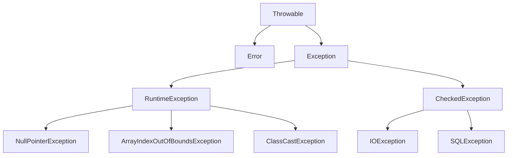
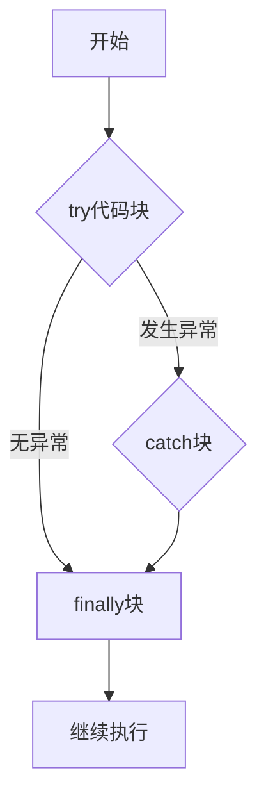
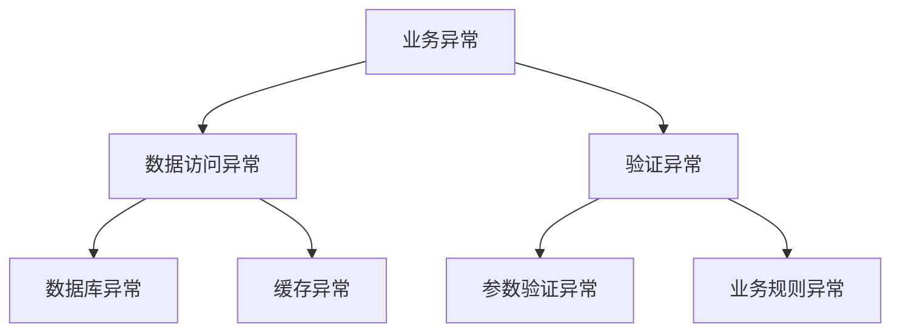

# 1 Java异常处理

## 1.1 异常基础概念

### 1.1.1 什么是异常？
- **定义**：程序运行时出现的意外情况
- **作用**：
  - 提供错误处理机制
  - 保证程序健壮性
  - 提高代码可维护性

### 1.1.2 异常的分类


1. **Error（错误）**
   - 系统级别的严重问题
   - 程序无法处理
   - 例如：OutOfMemoryError、StackOverflowError

2. **Exception（异常）**
   - **CheckedException（受检异常）**
     - 必须显式处理
     - 编译时检查
     - 例如：IOException、SQLException
   
   - **RuntimeException（运行时异常）**
     - 可以不显式处理
     - 运行时检查
     - 例如：NullPointerException、ArrayIndexOutOfBoundsException

## 1.2 异常处理机制

### 1.2.1 try-catch-finally


1. **基本语法**
```java
try {
    // 可能抛出异常的代码
} catch (ExceptionType1 e1) {
    // 异常处理代码1
} catch (ExceptionType2 e2) {
    // 异常处理代码2
} finally {
    // 总是执行的代码
}
```

2. **执行顺序**
   - try块：包含可能抛出异常的代码
   - catch块：捕获并处理特定类型的异常
   - finally块：无论是否发生异常都会执行

3. **注意事项**
   - catch块可以有多个，从上到下匹配
   - finally块可以省略
   - finally块中的return会覆盖try/catch中的return

### 1.2.2 throw和throws
1. **throw**
   - 用于手动抛出异常
   - 在方法内部使用
```java
if (value < 0) {
    throw new IllegalArgumentException("值不能为负数");
}
```

2. **throws**
   - 用于声明方法可能抛出的异常
   - 在方法签名中使用
```java
public void readFile() throws IOException {
    // 读取文件的代码
}
```

## 1.3 自定义异常

### 1.3.1 创建自定义异常
```java
public class CustomException extends Exception {
    public CustomException() {
        super();
    }
    
    public CustomException(String message) {
        super(message);
    }
    
    public CustomException(String message, Throwable cause) {
        super(message, cause);
    }
}
```

### 1.3.2 使用自定义异常
```java
public class BusinessService {
    public void processData(String data) throws CustomException {
        if (data == null) {
            throw new CustomException("数据不能为空");
        }
        // 处理数据的代码
    }
}
```

## 1.4 异常处理最佳实践

### 1.4.1 异常处理原则
1. **只处理可恢复的情况**
   - 不要捕获Error
   - 不要捕获RuntimeException
   - 只捕获可以处理的异常

2. **保持异常的原始信息**
   - 使用异常链
   - 包含原始异常信息
```java
try {
    // 可能抛出异常的代码
} catch (SQLException e) {
    throw new CustomException("数据库操作失败", e);
}
```

3. **合理使用异常层次结构**


### 1.4.2 性能考虑
1. **避免使用异常控制流程**
```java
// 不好的实践
try {
    if (map.get(key) != null) {
        // 使用值
    }
} catch (NullPointerException e) {
    // 处理空值
}

// 好的实践
if (map.containsKey(key)) {
    // 使用值
} else {
    // 处理空值
}
```

2. **合理使用finally**
```java
public class ResourceManager {
    private Resource resource;
    
    public void processResource() {
        try {
            resource = acquireResource();
            // 使用资源
        } finally {
            if (resource != null) {
                resource.close();
            }
        }
    }
}
```

### 1.4.3 日志记录
1. **记录异常详细信息**
```java
try {
    // 业务代码
} catch (Exception e) {
    logger.error("操作失败: {}", e.getMessage(), e);
    throw new BusinessException("操作失败", e);
}
```

2. **选择合适的日志级别**
- ERROR：系统错误、业务错误
- WARN：警告信息
- INFO：重要业务信息
- DEBUG：调试信息

## 1.5 Java 7特性：try-with-resources

### 1.5.1 基本用法
```java
try (FileInputStream fis = new FileInputStream("file.txt");
     BufferedReader br = new BufferedReader(new InputStreamReader(fis))) {
    // 使用资源
    String line = br.readLine();
} catch (IOException e) {
    // 处理异常
}
// 资源自动关闭
```

### 1.5.2 自定义AutoCloseable
```java
public class CustomResource implements AutoCloseable {
    public void doWork() {
        // 资源操作
    }
    
    @Override
    public void close() throws Exception {
        // 清理资源
    }
}
```

## 1.6 实际应用示例

### 1.6.1 分层异常处理
1. **概念**
   - 分层异常处理是一种将异常按照应用架构分层进行处理的策略
   - 每一层负责处理自己特定的异常类型
   - 通过异常转换实现异常的向上传递

2. **应用场景**
   - 多层架构应用（如MVC、DDD架构）
   - 微服务系统
   - 复杂业务系统

3. **处理策略**
   - DAO层：处理数据访问异常，转换为DAOException
   - Service层：处理业务异常，转换为ServiceException
   - Controller层：处理展示层异常，转换为用户友好的错误信息

```java
// 数据访问层异常
public class DAOException extends Exception {
    public DAOException(String message) {
        super(message);
    }
}

// 业务层异常
public class ServiceException extends Exception {
    public ServiceException(String message, Throwable cause) {
        super(message, cause);
    }
}

// 数据访问层
public class UserDAO {
    public User findById(Long id) throws DAOException {
        try {
            // 数据库操作
        } catch (SQLException e) {
            throw new DAOException("查询用户失败");
        }
    }
}

// 业务层
public class UserService {
    private UserDAO userDAO;
    
    public User getUser(Long id) throws ServiceException {
        try {
            return userDAO.findById(id);
        } catch (DAOException e) {
            throw new ServiceException("获取用户信息失败", e);
        }
    }
}
```

### 1.6.2 统一异常处理
1. **概念**
   - 在应用的统一入口处理所有异常
   - 提供一致的异常处理机制
   - 统一异常返回格式

2. **应用场景**
   - Web应用统一错误处理
   - API接口统一响应格式
   - 微服务统一异常处理

3. **处理策略**
   - 定义统一的异常处理器
   - 实现全局异常处理
   - 提供统一的错误响应格式

```java
// 统一错误响应格式
public class ErrorResponse {
    private String code;
    private String message;
    private String detail;
    
    // 构造方法和getter/setter
}

// 全局异常处理器（Spring MVC示例）
@ControllerAdvice
public class GlobalExceptionHandler {
    private static final Logger logger = LoggerFactory.getLogger(GlobalExceptionHandler.class);
    
    @ExceptionHandler(ServiceException.class)
    public ResponseEntity<ErrorResponse> handleServiceException(ServiceException e) {
        logger.error("业务异常", e);
        ErrorResponse error = new ErrorResponse("500", "业务处理失败", e.getMessage());
        return new ResponseEntity<>(error, HttpStatus.INTERNAL_SERVER_ERROR);
    }
    
    @ExceptionHandler(ValidationException.class)
    public ResponseEntity<ErrorResponse> handleValidationException(ValidationException e) {
        logger.warn("参数验证失败", e);
        ErrorResponse error = new ErrorResponse("400", "参数验证失败", e.getMessage());
        return new ResponseEntity<>(error, HttpStatus.BAD_REQUEST);
    }
}
```

### 1.6.3 事务异常处理
1. **概念**
   - 在事务操作中进行异常处理
   - 确保事务的一致性
   - 正确处理事务回滚

2. **应用场景**
   - 数据库事务操作
   - 分布式事务
   - 复杂业务流程

3. **处理策略**
   - 区分检查异常和运行时异常
   - 合理设置事务回滚规则
   - 正确处理事务嵌套

```java
@Service
public class TransferService {
    @Autowired
    private AccountDAO accountDAO;
    
    @Transactional(rollbackFor = {ServiceException.class})
    public void transfer(String fromAccount, String toAccount, BigDecimal amount) throws ServiceException {
        try {
            // 检查账户余额
            if (!accountDAO.checkBalance(fromAccount, amount)) {
                throw new ServiceException("余额不足");
            }
            
            // 转账操作
            accountDAO.deduct(fromAccount, amount);
            accountDAO.add(toAccount, amount);
            
        } catch (DAOException e) {
            // 转换为业务异常并回滚事务
            throw new ServiceException("转账失败", e);
        }
    }
}
```

### 1.6.4 资源关闭异常处理
1. **概念**
   - 确保资源正确关闭
   - 防止资源泄露
   - 优雅处理资源关闭异常

2. **应用场景**
   - 文件操作
   - 数据库连接
   - 网络连接

3. **处理策略**
   - 使用try-with-resources语法
   - 实现AutoCloseable接口
   - 确保资源正确关闭

```java
public class ResourceManager implements AutoCloseable {
    private final Connection connection;
    private final Statement statement;
    
    public ResourceManager() throws SQLException {
        connection = DriverManager.getConnection("jdbc:mysql://localhost:3306/test");
        statement = connection.createStatement();
    }
    
    public void doWork() throws SQLException {
        // 使用资源进行操作
    }
    
    @Override
    public void close() throws Exception {
        try {
            if (statement != null) {
                statement.close();
            }
        } finally {
            if (connection != null) {
                connection.close();
            }
        }
    }
}

// 使用示例
public class ResourceExample {
    public void processResource() {
        try (ResourceManager manager = new ResourceManager()) {
            manager.doWork();
        } catch (Exception e) {
            logger.error("资源处理失败", e);
        }
    }
}
```

### 1.6.5 异常处理最佳实践总结
1. **异常粒度控制**
   - 合理定义异常类型
   - 适当的异常粒度
   - 清晰的异常层次结构

2. **异常信息处理**
   - 提供有意义的异常信息
   - 包含必要的上下文信息
   - 适当的日志记录级别

3. **性能考虑**
   - 避免使用异常控制流程
   - 合理使用异常捕获
   - 正确处理异常栈信息

4. **可维护性**
   - 统一的异常处理策略
   - 清晰的异常处理文档
   - 规范的异常命名
