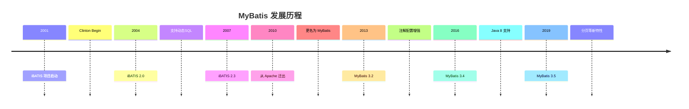
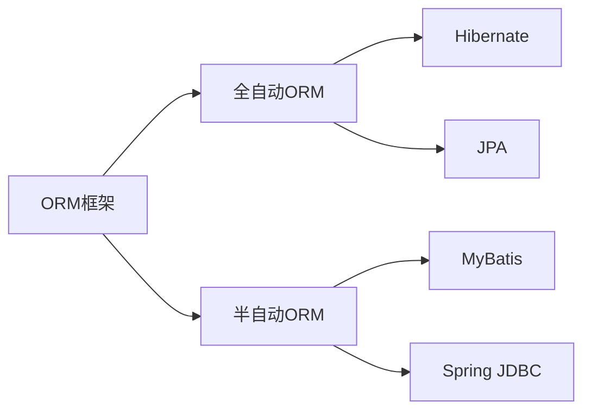
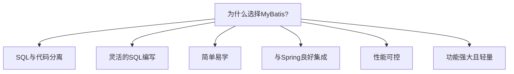
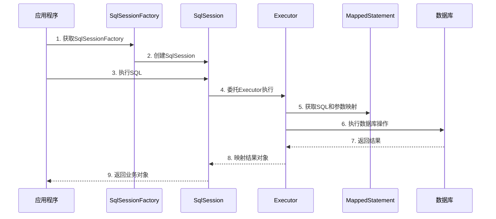

# 1 MyBatis 介绍

## 1.1 什么是 MyBatis

MyBatis 是一款优秀的持久层框架，它支持定制化 SQL、存储过程以及高级映射。MyBatis 避免了几乎所有的 JDBC 代码和手动设置参数以及获取结果集的工作。MyBatis 可以使用简单的 XML 或注解来配置和映射原生类型、接口和 Java 的 POJO（Plain Old Java Objects）为数据库中的记录。

MyBatis 的核心特点是将 SQL 语句与程序代码分离，使得程序员可以专注于 SQL 的编写和优化，而不必关心繁琐的 JDBC 细节。这种"半自动化"的 ORM 框架允许开发者在获得 ORM 便利性的同时，保持对 SQL 的完全控制。

## 1.2 MyBatis 的历史



- **iBATIS 时代（2001-2010）**：

  - 2001 年，Clinton Begin 创建了 iBATIS 项目
  - 最初是为了简化 JDBC 操作，专注于将 SQL 从代码中分离出来
  - 2004 年，iBATIS 2.0 发布，引入动态 SQL 支持
  - 项目在 Apache 软件基金会下发展壮大

- **MyBatis 时代（2010-至今）**：
  - 2010 年，项目从 Apache 迁出，更名为 MyBatis
  - 代码完全重构，API 设计更加简洁
  - 添加了更强大的动态 SQL 功能
  - 增强了与 Java 注解集成的能力
  - 支持现代 Java 特性

## 1.3 MyBatis 与其他 ORM 框架的比较

### 1.3.1 ORM 框架概览



### 1.3.2 MyBatis vs Hibernate

| 特性       | MyBatis                              | Hibernate                       |
| ---------- | ------------------------------------ | ------------------------------- |
| SQL 控制   | 高度灵活，手写 SQL                   | 自动生成 SQL，控制有限          |
| 学习曲线   | 较平缓，容易上手                     | 较陡峭，概念较多                |
| 映射粒度   | SQL 语句到对象                       | 数据表到对象                    |
| 性能调优   | 可以针对 SQL 优化                    | 依赖 Hibernate 内部机制         |
| 适用场景   | 复杂查询、性能要求高、SQL 掌控需求高 | 简单 CRUD、快速开发、标准化应用 |
| 缓存机制   | 简单的一级、二级缓存                 | 复杂的多级缓存策略              |
| 开发工作量 | SQL 编写工作量大                     | SQL 编写工作量小                |

### 1.3.3 MyBatis vs JPA

| 特性     | MyBatis                      | JPA (Java Persistence API)          |
| -------- | ---------------------------- | ----------------------------------- |
| 设计哲学 | SQL 映射框架                 | 标准化 ORM 规范                     |
| 实现方式 | 具体实现                     | 接口规范（通常由 Hibernate 等实现） |
| 查询方式 | 手写 SQL 或注解              | JPQL, Criteria API, 方法名约定查询  |
| 开发效率 | 手写 SQL 耗时                | 简单 CRUD 操作效率高                |
| 可维护性 | SQL 集中管理，易于审查和优化 | 对象关系映射相对透明                |
| 灵活性   | 高，支持复杂 SQL             | 中等，复杂查询可能需要原生 SQL      |

### 1.3.4 MyBatis vs Spring JDBC

| 特性       | MyBatis              | Spring JDBC            |
| ---------- | -------------------- | ---------------------- |
| 抽象级别   | 中等抽象             | 低级抽象               |
| SQL 处理   | 声明式 SQL           | 命令式 SQL             |
| 映射能力   | 强大的对象映射       | 基本的行映射           |
| 动态 SQL   | 内置支持             | 需手动拼接             |
| 缓存机制   | 支持                 | 不支持                 |
| 使用复杂度 | 配置较多，但使用简单 | 配置简单，但使用较繁琐 |

## 1.4 为什么选择 MyBatis



MyBatis 的优势主要包括：

1. **SQL 与代码分离**：

   - SQL 存放在 XML 文件中，便于管理和优化
   - 降低了程序代码与 SQL 语句的耦合度
   - 便于 DBA 和开发人员分工协作

2. **灵活的 SQL 控制**：

   - 可以编写任意复杂的 SQL 语句
   - 支持存储过程调用
   - 强大的动态 SQL 能力

3. **简单易学**：

   - 概念少，容易理解
   - 与 JDBC 接近，学习曲线平缓
   - 文档完善，社区活跃

4. **与 Spring 良好集成**：

   - MyBatis-Spring 提供无缝集成
   - 可以利用 Spring 的事务管理
   - 自动装配简化配置

5. **性能可控**：

   - 可以针对特定场景优化 SQL
   - 缓存机制提升性能
   - 批处理操作支持

6. **功能强大且轻量**：
   - 体积小巧，不引入过多依赖
   - 提供了足够的功能支持
   - 扩展性好，可以自定义插件

## 1.5 MyBatis 适用场景

MyBatis 特别适合以下场景：

1. **需要精确控制 SQL 的项目**：

   - 复杂的报表查询
   - 跨表连接和复杂聚合操作
   - 特定数据库特性的利用

2. **性能要求较高的系统**：

   - 高并发的 Web 应用
   - 需要优化 SQL 的数据密集型应用
   - 大数据量查询场景

3. **遗留系统集成**：

   - 与已有数据库结构对接
   - 复杂存储过程的调用
   - 非规范化数据库设计

4. **与其他 ORM 框架混合使用**：

   - 简单操作使用 JPA/Hibernate
   - 复杂查询使用 MyBatis
   - 获取两种框架的优势

5. **中小型项目**：
   - 开发团队熟悉 SQL
   - 项目复杂度适中
   - 需要快速上手和实现

## 1.6 MyBatis 工作原理



MyBatis 的核心工作流程如下：

1. **配置解析**：

   - 读取 XML 配置文件或注解
   - 创建 Configuration 对象
   - 加载映射器和 SQL 语句

2. **SqlSessionFactory 初始化**：

   - 作为 MyBatis 的入口
   - 负责创建 SqlSession 实例
   - 通常是单例模式

3. **SqlSession 操作**：

   - 提供数据库操作 API
   - 管理数据库连接生命周期
   - 执行 SQL 语句并返回结果

4. **SQL 执行过程**：

   - Executor 执行器负责 SQL 执行
   - 参数映射将 Java 对象转为 SQL 参数
   - 结果映射将结果集转为 Java 对象

5. **插件机制**：

   - 拦截执行过程中的关键步骤
   - 提供扩展和定制能力

## 1.7 MyBatis 的基本组件

MyBatis 的核心组件包括：

1. **Configuration**：

   - 存储 MyBatis 的所有配置信息
   - 映射器注册表
   - 各种缓存和工具类的集合

2. **SqlSessionFactory**：

   - 创建 SqlSession 的工厂
   - 通常使用构建器模式创建

3. **SqlSession**：

   - 执行 SQL 的主要接口
   - 类似于 JDBC 的 Connection
   - 非线程安全，使用后需要关闭

4. **Executor**：

   - SQL 执行的核心接口
   - 有多种实现：SIMPLE, REUSE, BATCH

5. **MappedStatement**：

   - 表示一个 SQL 语句的抽象
   - 包含 SQL 语句、参数映射和结果映射

6. **StatementHandler**：

   - 处理 JDBC Statement 的创建和执行

7. **ParameterHandler**：

   - 设置预编译语句的参数

8. **ResultSetHandler**：

   - 将结果集转换为 Java 对象

9. **Mapper 接口**：
   - 定义访问数据库的方法
   - 通过动态代理实现

## 1.8 快速入门示例

下面是一个 MyBatis 的简单示例，展示其基本用法：

### 1.8.1 Maven 依赖

```xml
<dependency>
    <groupId>org.mybatis</groupId>
    <artifactId>mybatis</artifactId>
    <version>3.5.9</version>
</dependency>
<dependency>
    <groupId>mysql</groupId>
    <artifactId>mysql-connector-java</artifactId>
    <version>8.0.28</version>
</dependency>
```

### 1.8.2 MyBatis 配置文件

```xml
<?xml version="1.0" encoding="UTF-8" ?>
<!DOCTYPE configuration
  PUBLIC "-//mybatis.org//DTD Config 3.0//EN"
  "http://mybatis.org/dtd/mybatis-3-config.dtd">
<configuration>
  <environments default="development">
    <environment id="development">
      <transactionManager type="JDBC"/>
      <dataSource type="POOLED">
        <property name="driver" value="com.mysql.cj.jdbc.Driver"/>
        <property name="url" value="jdbc:mysql://localhost:3306/mydb"/>
        <property name="username" value="root"/>
        <property name="password" value="password"/>
      </dataSource>
    </environment>
  </environments>
  <mappers>
    <mapper resource="UserMapper.xml"/>
  </mappers>
</configuration>
```

### 1.8.3 实体类

```java
public class User {
    private Integer id;
    private String name;
    private String email;

    // 构造函数、getter和setter
}
```

### 1.8.4 Mapper 接口

```java
public interface UserMapper {
    User getUserById(Integer id);
    List<User> getAllUsers();
    void insertUser(User user);
    void updateUser(User user);
    void deleteUser(Integer id);
}
```

### 1.8.5 XML 映射文件

```xml
<?xml version="1.0" encoding="UTF-8" ?>
<!DOCTYPE mapper
  PUBLIC "-//mybatis.org//DTD Mapper 3.0//EN"
  "http://mybatis.org/dtd/mybatis-3-mapper.dtd">
<mapper namespace="com.example.mapper.UserMapper">
  <select id="getUserById" resultType="com.example.model.User">
    SELECT * FROM users WHERE id = #{id}
  </select>

  <select id="getAllUsers" resultType="com.example.model.User">
    SELECT * FROM users
  </select>

  <insert id="insertUser" parameterType="com.example.model.User">
    INSERT INTO users (name, email) VALUES (#{name}, #{email})
  </insert>

  <update id="updateUser" parameterType="com.example.model.User">
    UPDATE users SET name = #{name}, email = #{email} WHERE id = #{id}
  </update>

  <delete id="deleteUser" parameterType="int">
    DELETE FROM users WHERE id = #{id}
  </delete>
</mapper>
```

### 1.8.6 使用 MyBatis

```java
public class App {
    public static void main(String[] args) {
        try {
            // 加载配置文件
            String resource = "mybatis-config.xml";
            InputStream inputStream = Resources.getResourceAsStream(resource);
            SqlSessionFactory sqlSessionFactory = new SqlSessionFactoryBuilder().build(inputStream);

            // 获取 SqlSession
            try (SqlSession session = sqlSessionFactory.openSession()) {
                // 获取 Mapper
                UserMapper userMapper = session.getMapper(UserMapper.class);

                // 使用 Mapper 执行 SQL
                User user = userMapper.getUserById(1);
                System.out.println("User: " + user.getName());

                // 插入新用户
                User newUser = new User();
                newUser.setName("John");
                newUser.setEmail("john@example.com");
                userMapper.insertUser(newUser);

                // 提交事务
                session.commit();
            }
        } catch (Exception e) {
            e.printStackTrace();
        }
    }
}
```

## 1.9 小结

MyBatis 是一个灵活的持久层框架，它通过将 SQL 与程序代码分离，保持了 SQL 语句的可控性和优化能力，同时提供了 ORM 的便利性。相比于全自动 ORM 框架如 Hibernate，MyBatis 更适合需要精确控制 SQL 的场景，以及对性能要求较高的应用。

MyBatis 易于学习和使用，与 Spring 集成良好，有活跃的社区支持，是 Java 生态系统中广泛使用的持久层解决方案之一。通过灵活的映射机制和强大的动态 SQL 能力，MyBatis 能够满足从简单到复杂的各类持久层需求。

尽管 MyBatis 需要手写更多的 SQL 代码，但这种方式带来了更精细的控制力，使开发者能够充分利用关系型数据库的特性，编写出性能更优、功能更强的应用程序。

