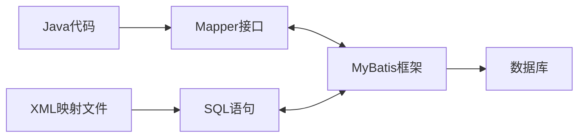
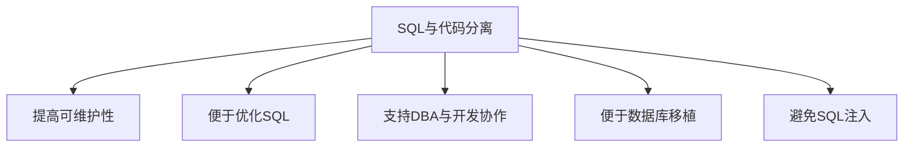
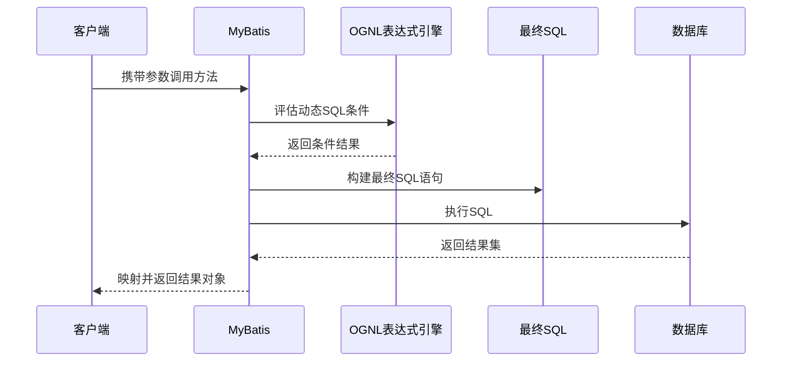
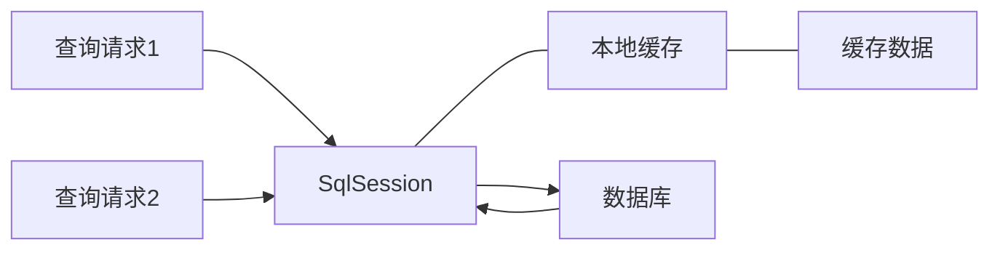
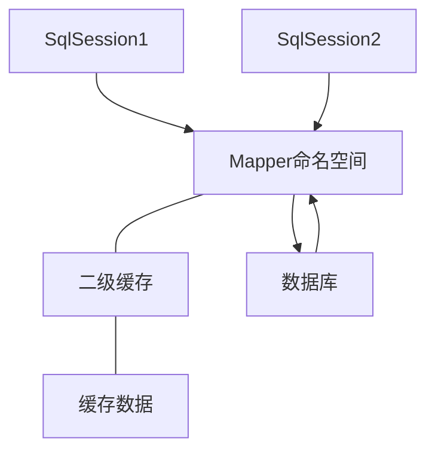
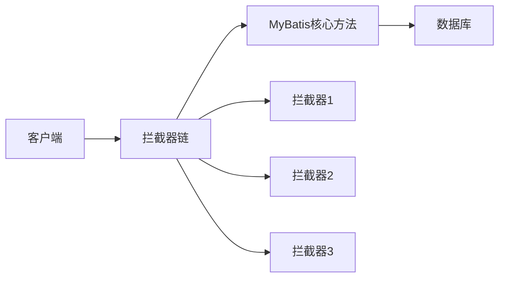
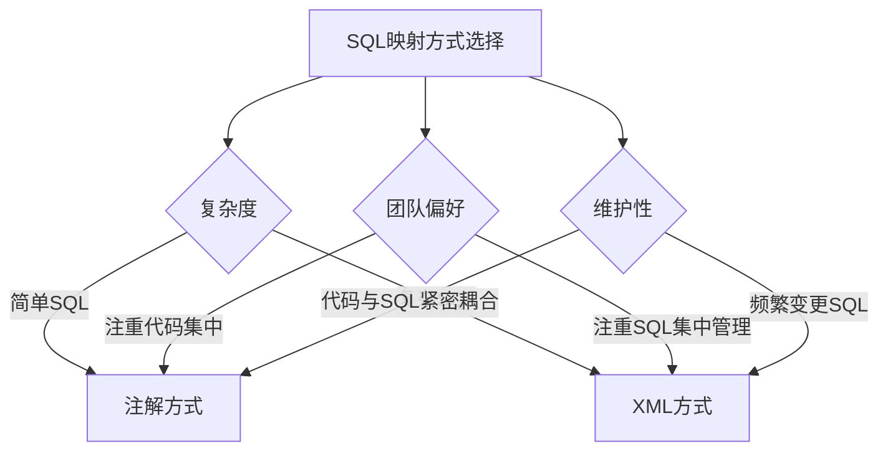

# 1 MyBatis 核心特性

MyBatis 作为一款优秀的持久层框架，拥有多项强大的核心特性，这些特性使其在处理数据库操作时既灵活又高效。本文将详细介绍 MyBatis 的核心特性及其实际应用。

## 1.1 SQL 与代码分离

SQL 与代码分离是 MyBatis 最基本也是最核心的特性，它极大地提高了应用程序的可维护性和灵活性。

### 1.1.1 工作原理



在 MyBatis 中，SQL 语句主要通过以下方式与代码分离：

1. **XML 映射文件**：SQL 语句存放在单独的 XML 文件中
2. **注解方式**：SQL 语句通过注解定义在接口方法上

### 1.1.2 XML 映射方式示例

```java
// Mapper 接口
public interface UserMapper {
    User getUserById(Integer id);
}
```

```xml
<!-- XML 映射文件 -->
<mapper namespace="com.example.mapper.UserMapper">
  <select id="getUserById" resultType="User">
    SELECT * FROM users WHERE id = #{id}
  </select>
</mapper>
```

### 1.1.3 注解方式示例

```java
public interface UserMapper {
    @Select("SELECT * FROM users WHERE id = #{id}")
    User getUserById(Integer id);
}
```

### 1.1.4 SQL 与代码分离的优势



- **提高可维护性**：修改 SQL 不需要修改 Java 代码，减少编译部署流程
- **便于 SQL 优化**：DBA 可以直接优化 SQL 而不涉及业务逻辑代码
- **支持专业分工**：开发人员和 DBA 可以各自发挥专长
- **提高安全性**：参数绑定机制可以有效防止 SQL 注入
- **便于数据库移植**：可以为不同的数据库提供不同的 SQL 实现

## 1.2 动态 SQL

动态 SQL 是 MyBatis 的强大特性之一，它允许根据不同条件构建不同的 SQL 语句，大大减少了代码量和维护成本。

### 1.2.1 动态 SQL 元素

MyBatis 提供了多种动态 SQL 元素：

| 元素                  | 作用                | 示例场景                     |
| --------------------- | ------------------- | ---------------------------- |
| if                    | 条件判断            | 可选查询条件                 |
| choose/when/otherwise | 多条件分支          | 根据不同条件使用不同查询策略 |
| where                 | 智能处理 WHERE 子句 | 动态拼接多个查询条件         |
| set                   | 智能处理 SET 子句   | 动态更新字段                 |
| foreach               | 迭代集合            | IN 查询条件、批量操作        |
| bind                  | 创建变量            | 在 OGNL 表达式中创建局部变量 |
| trim                  | 前缀/后缀处理       | 自定义条件拼接规则           |

### 1.2.2 动态 SQL 示例

#### 1.2.2.1 if 元素

```xml
<select id="findUsers" resultType="User">
  SELECT * FROM users WHERE 1=1
  <if test="username != null">
    AND username LIKE #{username}
  </if>
  <if test="email != null">
    AND email = #{email}
  </if>
</select>
```

#### 1.2.2.2 choose, when, otherwise 元素

```xml
<select id="findUsers" resultType="User">
  SELECT * FROM users
  <where>
    <choose>
      <when test="id != null">
        id = #{id}
      </when>
      <when test="username != null">
        username LIKE #{username}
      </when>
      <otherwise>
        status = 'ACTIVE'
      </otherwise>
    </choose>
  </where>
</select>
```

#### 1.2.2.3 where 元素

```xml
<select id="findUsers" resultType="User">
  SELECT * FROM users
  <where>
    <if test="username != null">
      username LIKE #{username}
    </if>
    <if test="email != null">
      AND email = #{email}
    </if>
  </where>
</select>
```

#### 1.2.2.4 foreach 元素

```xml
<select id="getUsersByIds" resultType="User">
  SELECT * FROM users
  WHERE id IN
  <foreach collection="list" item="id" open="(" separator="," close=")">
    #{id}
  </foreach>
</select>
```

### 1.2.3 动态 SQL 的工作原理



1. MyBatis 解析 XML 或注解中的动态 SQL 语句
2. 使用 OGNL 表达式引擎评估条件
3. 根据条件构建最终的 SQL 语句
4. 执行 SQL 语句并处理结果集

### 1.2.4 动态 SQL 最佳实践

- 使用 `where` 和 `set` 元素自动处理条件语句
- 合理设计查询参数对象，便于条件组合
- 对于复杂条件，考虑使用 SQL 片段重用
- 善用 `bind` 元素处理复杂表达式
- 当有多个可选条件时，使用 `choose` 元素确保性能

## 1.3 结果映射

MyBatis 提供了强大的结果映射功能，可以将查询结果灵活地映射到 Java 对象中。

### 1.3.1 自动映射

当列名和属性名匹配时，MyBatis 可以自动映射：

```xml
<select id="getUser" resultType="User">
  SELECT id, username, email FROM users WHERE id = #{id}
</select>
```

自动映射规则：

- 默认情况下，列名使用下划线转驼峰映射（可配置）
- 匹配基于 JavaBean 属性名（getter/setter）

### 1.3.2 ResultMap 映射

对于复杂映射，MyBatis 提供了 `resultMap` 元素：

```xml
<resultMap id="userMap" type="User">
  <id property="id" column="user_id"/>
  <result property="username" column="user_name"/>
  <result property="email" column="user_email"/>
</resultMap>

<select id="getUser" resultMap="userMap">
  SELECT user_id, user_name, user_email FROM users WHERE user_id = #{id}
</select>
```

### 1.3.3 关联映射

MyBatis 支持一对一、一对多关联映射：

#### 1.3.3.1 一对一关联

```xml
<resultMap id="userMap" type="User">
  <id property="id" column="user_id"/>
  <result property="username" column="user_name"/>
  <association property="profile" javaType="Profile">
    <id property="id" column="profile_id"/>
    <result property="bio" column="profile_bio"/>
  </association>
</resultMap>
```

#### 1.3.3.2 一对多关联

```xml
<resultMap id="userMap" type="User">
  <id property="id" column="user_id"/>
  <result property="username" column="user_name"/>
  <collection property="orders" ofType="Order">
    <id property="id" column="order_id"/>
    <result property="amount" column="order_amount"/>
  </collection>
</resultMap>
```

### 1.3.4 高级映射特性

MyBatis 的映射功能还包括：

- **延迟加载**：按需加载关联对象
- **鉴别器映射**：根据列值决定使用不同的映射规则
- **嵌套查询**：使用独立的查询加载关联数据
- **结果集转换器**：自定义结果转换规则

```xml
<!-- 延迟加载示例 -->
<resultMap id="userMap" type="User">
<!-- 映射主键 -->
  <id property="id" column="id"/>
  <!-- 映射普通属性 -->
  <result property="username" column="username"/>
  <!-- 关联映射，使用延迟加载 -->
  <association property="profile"
               select="getProfileById"
               column="profile_id"
               fetchType="lazy"/>
</resultMap>
```

## 1.4 缓存机制

MyBatis 内置了两级缓存机制，可以有效提升应用性能。

### 1.4.1 一级缓存（会话级缓存）



特点：

- **默认启用，作用域为 SqlSession**
- 当同一个 SqlSession 执行相同的 SQL 语句时，会直接从缓存返回结果
- 任何更新操作都会清空一级缓存
- 不同 SqlSession 之间缓存数据隔离

### 1.4.2 二级缓存（命名空间级缓存）



特点：

- 需要手动开启，作用域为 Mapper 的命名空间
- 可以在多个 SqlSession 之间共享缓存数据
- 事务提交后才会更新缓存
- 可配置缓存策略、过期时间等

### 1.4.3 缓存配置

#### 1.4.3.1 全局缓存配置

```xml
<settings>
  <!-- 全局性地开启或关闭所有映射器配置文件中已配置的任何缓存 -->
  <setting name="cacheEnabled" value="true"/>
</settings>
```

#### 1.4.3.2 命名空间缓存配置

```xml
<cache
  eviction="LRU"
  flushInterval="60000"
  size="512"
  readOnly="true"/>
```

缓存参数：

- **eviction**：缓存回收策略（LRU, FIFO, SOFT, WEAK）
- **flushInterval**：刷新间隔，单位毫秒
- **size**：缓存引用数量
- **readOnly**：是否只读
- **type**：自定义缓存实现类

### 1.4.4 自定义缓存

MyBatis 支持集成第三方缓存，如 EhCache, Redis：

```xml
<cache type="org.mybatis.caches.ehcache.EhcacheCache"/>
```

或通过实现 Cache 接口自定义缓存：

```java
public class CustomCache implements Cache {
    // 实现Cache接口的方法
}
```

### 1.4.5 缓存使用建议

- 对于读多写少的数据，考虑启用二级缓存
- 对于经常更新的数据，谨慎使用缓存
- 对于复杂查询，可以使用缓存提高性能
- 对于分布式环境，考虑使用集中式缓存（如 Redis）
- 使用 `useCache` 和 `flushCache` 属性精细控制缓存行为

## 1.5 插件机制

MyBatis 提供了强大的插件机制，可以拦截和修改 MyBatis 的核心方法行为。

### 1.5.1 插件原理



MyBatis 允许拦截的方法包括：

- **Executor** 的方法：update, query, flushStatements, commit, rollback 等
- **ParameterHandler** 的方法：getParameterObject, setParameters
- **ResultSetHandler** 的方法：handleResultSets, handleOutputParameters 等
- **StatementHandler** 的方法：prepare, parameterize, batch, update, query 等

### 1.5.2 插件实现

创建插件需要实现 Interceptor 接口并使用 @Intercepts 注解：

```java
@Intercepts({
  @Signature(
    type = Executor.class,
    method = "update",
    args = {MappedStatement.class, Object.class}
  )
})
public class ExamplePlugin implements Interceptor {
  @Override
  public Object intercept(Invocation invocation) throws Throwable {
    // 前置处理
    Object result = invocation.proceed();
    // 后置处理
    return result;
  }

  @Override
  public Object plugin(Object target) {
    return Plugin.wrap(target, this);
  }

  @Override
  public void setProperties(Properties properties) {
    // 设置属性
  }
}
```

### 1.5.3 注册插件

在 MyBatis 配置文件中注册插件：

```xml
<plugins>
  <plugin interceptor="com.example.ExamplePlugin">
    <property name="someProperty" value="100"/>
  </plugin>
</plugins>
```

### 1.5.4 常用插件示例

#### 1.5.4.1 分页插件

```java
@Intercepts({
  @Signature(
    type = StatementHandler.class,
    method = "prepare",
    args = {Connection.class, Integer.class}
  )
})
public class PaginationPlugin implements Interceptor {
  @Override
  public Object intercept(Invocation invocation) throws Throwable {
    StatementHandler handler = (StatementHandler) invocation.getTarget();
    BoundSql boundSql = handler.getBoundSql();

    // 获取原SQL
    String sql = boundSql.getSql();

    // 添加分页语句
    String pageSql = sql + " LIMIT ?, ?";

    // 替换SQL
    Field field = boundSql.getClass().getDeclaredField("sql");
    field.setAccessible(true);
    field.set(boundSql, pageSql);

    return invocation.proceed();
  }
  // 其他方法实现...
}
```

#### 1.5.4.2 性能监控插件

```java
@Intercepts({
  @Signature(
    type = Executor.class,
    method = "query",
    args = {MappedStatement.class, Object.class, RowBounds.class, ResultHandler.class}
  )
})
public class PerformancePlugin implements Interceptor {
  @Override
  public Object intercept(Invocation invocation) throws Throwable {
    long startTime = System.currentTimeMillis();
    Object result = invocation.proceed();
    long endTime = System.currentTimeMillis();

    MappedStatement ms = (MappedStatement) invocation.getArgs()[0];
    String sqlId = ms.getId();

    System.out.println("SQL: " + sqlId + " 执行时间: " + (endTime - startTime) + "ms");

    return result;
  }
  // 其他方法实现...
}
```

### 1.5.5 常用第三方插件

1. **PageHelper**：最流行的 MyBatis 分页插件
2. **MyBatis-Plus**：提供分页、CRUD 增强等功能
3. **MyBatis Generator**：代码生成插件
4. **Mybatis-PageHelper**：分页插件
5. **MyBatis Dynamic SQL**：动态 SQL 工具

## 1.6 类型处理器

MyBatis 使用类型处理器（TypeHandler）在 Java 类型和 JDBC 类型之间进行转换。

### 1.6.1 内置类型处理器

MyBatis 内置了常见 Java 类型到 JDBC 类型的处理器：

| Java 类型        | JDBC 类型        | 类型处理器            |
| ---------------- | ---------------- | --------------------- |
| String           | CHAR, VARCHAR    | StringTypeHandler     |
| Integer, int     | INTEGER, NUMERIC | IntegerTypeHandler    |
| Long, long       | BIGINT, NUMERIC  | LongTypeHandler       |
| Boolean, boolean | BOOLEAN, BIT     | BooleanTypeHandler    |
| Date             | TIMESTAMP, DATE  | DateTypeHandler       |
| BigDecimal       | DECIMAL, NUMERIC | BigDecimalTypeHandler |
| Byte[]           | BLOB, BINARY     | ByteArrayTypeHandler  |
| Enum             | VARCHAR, INTEGER | EnumTypeHandler       |

### 1.6.2 自定义类型处理器

当内置类型处理器不满足需求时，可以创建自定义类型处理器：

```java
@MappedJdbcTypes(JdbcType.VARCHAR)
@MappedTypes(String.class)
public class CustomStringTypeHandler extends BaseTypeHandler<String> {
  @Override
  public void setNonNullParameter(PreparedStatement ps, int i, String parameter, JdbcType jdbcType) throws SQLException {
    ps.setString(i, parameter.trim());
  }

  @Override
  public String getNullableResult(ResultSet rs, String columnName) throws SQLException {
    return rs.getString(columnName);
  }

  @Override
  public String getNullableResult(ResultSet rs, int columnIndex) throws SQLException {
    return rs.getString(columnIndex);
  }

  @Override
  public String getNullableResult(CallableStatement cs, int columnIndex) throws SQLException {
    return cs.getString(columnIndex);
  }
}
```

### 1.6.3 注册类型处理器

在 MyBatis 配置文件中注册自定义类型处理器：

```xml
<typeHandlers>
  <typeHandler handler="com.example.CustomStringTypeHandler"/>
</typeHandlers>
```

或通过包扫描注册：

```xml
<typeHandlers>
  <package name="com.example.typehandlers"/>
</typeHandlers>
```

### 1.6.4 类型处理器使用场景

- **枚举类型转换**：将 Java 枚举映射为数据库字符串或整数
- **JSON 处理**：将 Java 对象自动转换为 JSON 字符串存储
- **特殊格式处理**：如日期格式、货币格式等自定义转换
- **加密处理**：在数据库操作过程中自动加解密数据

#### 1.6.4.1 JSON 类型处理器示例

```java
public class JsonTypeHandler<T> extends BaseTypeHandler<T> {
    private Class<T> clazz;
    private ObjectMapper objectMapper = new ObjectMapper();

    public JsonTypeHandler(Class<T> clazz) {
        this.clazz = clazz;
    }

    @Override
    public void setNonNullParameter(PreparedStatement ps, int i, T parameter, JdbcType jdbcType) throws SQLException {
        try {
            ps.setString(i, objectMapper.writeValueAsString(parameter));
        } catch (Exception e) {
            throw new SQLException("Error converting JSON", e);
        }
    }

    @Override
    public T getNullableResult(ResultSet rs, String columnName) throws SQLException {
        return parse(rs.getString(columnName));
    }

    @Override
    public T getNullableResult(ResultSet rs, int columnIndex) throws SQLException {
        return parse(rs.getString(columnIndex));
    }

    @Override
    public T getNullableResult(CallableStatement cs, int columnIndex) throws SQLException {
        return parse(cs.getString(columnIndex));
    }

    private T parse(String json) {
        try {
            if (json == null || json.isEmpty()) return null;
            return objectMapper.readValue(json, clazz);
        } catch (Exception e) {
            throw new RuntimeException("Error parsing JSON", e);
        }
    }
}
```

## 1.7 批量操作

MyBatis 提供了多种批量操作的方式，适用于大数据量处理场景。

### 1.7.1 批处理执行器

MyBatis 提供了三种执行器类型：

- **SIMPLE**：默认执行器，每次执行都创建新的预处理语句
- **REUSE**：重用预处理语句
- **BATCH**：批量执行所有更新语句

使用批处理执行器：

```java
// 创建使用批处理执行器的 SqlSession
SqlSession sqlSession = sqlSessionFactory.openSession(ExecutorType.BATCH);
try {
    UserMapper mapper = sqlSession.getMapper(UserMapper.class);

    // 批量插入
    for (User user : userList) {
        mapper.insertUser(user);
    }

    // 执行批处理
    sqlSession.commit();
} finally {
    sqlSession.close();
}
```

### 1.7.2 动态 SQL 批量操作

使用 foreach 元素进行批量操作：

```xml
<!-- 批量插入 -->
<insert id="batchInsert" parameterType="list">
  INSERT INTO users (username, email) VALUES
  <foreach collection="list" item="user" separator=",">
    (#{user.username}, #{user.email})
  </foreach>
</insert>

<!-- 批量更新 -->
<update id="batchUpdate" parameterType="list">
  <foreach collection="list" item="user" separator=";">
    UPDATE users
    SET username = #{user.username}, email = #{user.email}
    WHERE id = #{user.id}
  </foreach>
</update>

<!-- 批量删除 -->
<delete id="batchDelete" parameterType="list">
  DELETE FROM users WHERE id IN
  <foreach collection="list" item="id" open="(" separator="," close=")">
    #{id}
  </foreach>
</delete>
```

### 1.7.3 批量操作最佳实践

- 对于大量数据，分批处理可以减少内存消耗
- 结合事务管理，确保批量操作的原子性
- 根据数据库特性优化 SQL 语句
- 监控批量操作性能，及时调整批次大小

```java
// 分批处理示例
int batchSize = 1000;
SqlSession sqlSession = sqlSessionFactory.openSession(ExecutorType.BATCH);
try {
    UserMapper mapper = sqlSession.getMapper(UserMapper.class);

    for (int i = 0; i < userList.size(); i++) {
        mapper.insertUser(userList.get(i));

        if (i > 0 && i % batchSize == 0) {
            // 每 batchSize 条数据提交一次
            sqlSession.flushStatements();
        }
    }

    // 提交剩余的批量操作
    sqlSession.commit();
} finally {
    sqlSession.close();
}
```

## 1.8 注解开发

除了 XML 映射，MyBatis 还支持通过注解方式配置 SQL 映射。

### 1.8.1 基本 CRUD 注解

```java
public interface UserMapper {
    @Select("SELECT * FROM users WHERE id = #{id}")
    User getUserById(Integer id);

    @Insert("INSERT INTO users(username, email) VALUES(#{username}, #{email})")
    @Options(useGeneratedKeys = true, keyProperty = "id")
    int insertUser(User user);

    @Update("UPDATE users SET username = #{username}, email = #{email} WHERE id = #{id}")
    int updateUser(User user);

    @Delete("DELETE FROM users WHERE id = #{id}")
    int deleteUser(Integer id);
}
```

### 1.8.2 结果映射注解

```java
public interface UserMapper {
    @Results(id = "userMap", value = {
        @Result(property = "id", column = "user_id", id = true),
        @Result(property = "username", column = "user_name"),
        @Result(property = "email", column = "user_email")
    })
    @Select("SELECT user_id, user_name, user_email FROM users WHERE user_id = #{id}")
    User getUserById(Integer id);

    @ResultMap("userMap")
    @Select("SELECT user_id, user_name, user_email FROM users")
    List<User> getAllUsers();
}
```

### 1.8.3 关联映射注解

```java
public interface UserMapper {
    @Results({
        @Result(property = "id", column = "id"),
        @Result(property = "username", column = "username"),
        @Result(property = "orders", javaType = List.class, column = "id",
                many = @Many(select = "getOrdersByUserId"))
    })
    @Select("SELECT * FROM users WHERE id = #{id}")
    User getUserWithOrders(Integer id);

    @Select("SELECT * FROM orders WHERE user_id = #{userId}")
    List<Order> getOrdersByUserId(Integer userId);
}
```

### 1.8.4 动态 SQL 注解

对于简单的动态 SQL，可以使用 `<script>` 标签：

```java
public interface UserMapper {
    @Select("<script>" +
            "SELECT * FROM users" +
            "<where>" +
            "  <if test='username != null'>username = #{username}</if>" +
            "  <if test='email != null'>AND email = #{email}</if>" +
            "</where>" +
            "</script>")
    List<User> findUsers(User user);
}
```

### 1.8.5 注解 vs XML 的选择



- **注解方式适合**：简单 SQL、小型项目、快速开发
- **XML 方式适合**：复杂 SQL、大型项目、团队协作、需要 DBA 参与

## 1.9 小结

MyBatis 的核心特性包括：

1. **SQL 与代码分离**：提高可维护性和灵活性
2. **动态 SQL**：根据条件构建 SQL 语句，减少代码冗余
3. **强大的结果映射**：灵活处理对象与表的映射关系
4. **缓存机制**：提高查询性能
5. **插件机制**：扩展 MyBatis 的核心功能
6. **类型处理器**：处理 Java 类型与 JDBC 类型的转换
7. **批量操作支持**：高效处理大量数据
8. **注解与 XML 配置并存**：适应不同开发偏好

这些特性使 MyBatis 成为一个既灵活又强大的持久层框架，能够满足从简单到复杂的各种数据库操作需求。MyBatis 的设计理念是在保持灵活性的同时提供足够的便利性，使开发者能够精确控制 SQL 执行，同时减少样板代码的编写。

