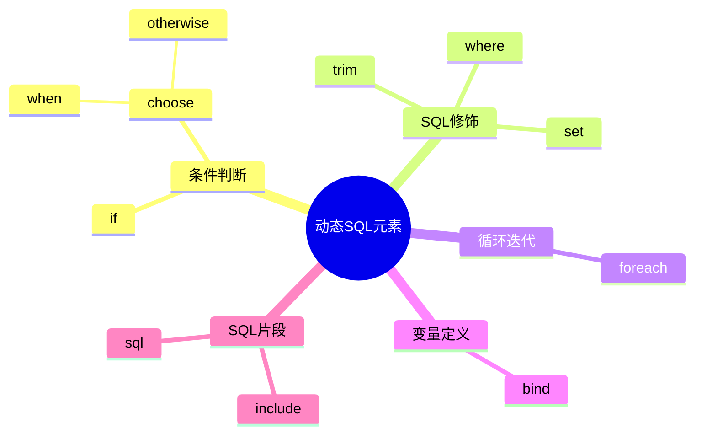
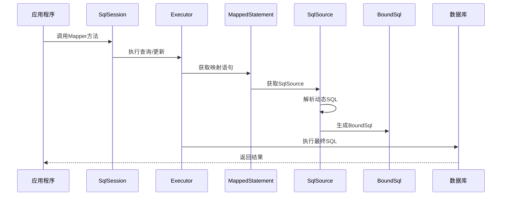

# 1 MyBatis 动态 SQL

动态 SQL 是 MyBatis 最强大的特性之一，它使得 SQL 可以根据不同的条件动态构建，极大地增强了 SQL 的灵活性，减少了代码冗余，提高了开发效率。本文将详细介绍 MyBatis 动态 SQL 的各种元素及其使用场景和技巧。

## 1.1 为什么需要动态 SQL

在实际开发中，我们经常会遇到以下场景：

- **条件查询**：用户可以输入不同的查询条件，如姓名、年龄、职位等，这些条件可能有值也可能为空
- **排序规则**：根据不同的用户选择，采用不同的排序规则
- **批量操作**：向数据库批量插入、更新或删除数据
- **多表关联**：根据不同情况构建不同的关联查询

传统的做法可能是在 Java 代码中拼接 SQL 字符串，但这样做既容易出错，也容易引发 SQL 注入风险，且代码可读性差。MyBatis 的动态 SQL 功能就是为了解决这一问题而设计的。

## 1.2 动态 SQL 元素总览

MyBatis 提供了多种动态 SQL 元素，它们各自针对不同的场景和需求：



## 1.3 if 元素

`if` 元素是最基本的条件判断元素，用于根据条件决定是否包含某段 SQL 片段。

### 1.3.1 基本语法

```xml
<if test="条件表达式">
  SQL片段
</if>
```

条件表达式使用 OGNL 表达式，常见的有：

- 比较：`==`, `!=`, `>`, `>=`, `<`, `<=`
- 逻辑：`and`, `or`, `not`
- 方法调用：`property.method()`
- 判空：`property != null`
- 字符串判空：`property != null and property != ''`
- 集合判空：`collection != null and collection.size() > 0`

### 1.3.2 常用场景

#### 1.3.2.1 单条件查询

```xml
<select id="findUsers" resultType="User">
  SELECT * FROM users WHERE 1=1
  <if test="username != null and username != ''">
    AND username LIKE CONCAT('%', #{username}, '%')
  </if>
</select>
```

#### 1.3.2.2 多条件组合查询

```xml
<select id="findUsers" resultType="User">
  SELECT * FROM users WHERE 1=1
  <if test="username != null and username != ''">
    AND username LIKE CONCAT('%', #{username}, '%')
  </if>
  <if test="email != null and email != ''">
    AND email = #{email}
  </if>
  <if test="startDate != null">
    AND create_time >= #{startDate}
  </if>
  <if test="endDate != null">
    AND create_time <= #{endDate}
  </if>
</select>
```

#### 1.3.2.3 更新操作中的条件

```xml
<update id="updateUser" parameterType="User">
  UPDATE users
  SET
    <if test="username != null and username != ''">
      username = #{username},
    </if>
    <if test="email != null">
      email = #{email},
    </if>
    <if test="age != null">
      age = #{age},
    </if>
    update_time = NOW()
  WHERE id = #{id}
</update>
```

### 1.3.3 注意事项

- `if` 元素中的条件不满足时，对应的 SQL 片段将被忽略
- 使用 `if` 元素时要注意 SQL 语法的完整性，特别是逗号、AND、OR 等连接符
- 使用 1=1 作为初始条件可以简化 `if` 的使用，但可能会影响性能
- 对于更新操作，最好使用 `set` 元素来处理最后一个逗号

## 1.4 choose, when, otherwise 元素

`choose` 元素类似于 Java 中的 switch 语句，它提供了一种多条件分支的能力，确保只有一个条件会被应用。

### 1.4.1 基本语法

```xml
<choose>
  <when test="条件表达式1">
    SQL片段1
  </when>
  <when test="条件表达式2">
    SQL片段2
  </when>
  ...
  <otherwise>
    默认SQL片段
  </otherwise>
</choose>
```

### 1.4.2 常用场景

#### 1.4.2.1 多条件分支查询

```xml
<select id="findUsers" resultType="User">
  SELECT * FROM users
  <where>
    <choose>
      <when test="id != null">
        id = #{id}
      </when>
      <when test="username != null and username != ''">
        username LIKE CONCAT('%', #{username}, '%')
      </when>
      <when test="email != null and email != ''">
        email = #{email}
      </when>
      <otherwise>
        status = 'ACTIVE'
      </otherwise>
    </choose>
  </where>
</select>
```

#### 1.4.2.2 动态排序

```xml
<select id="findUsers" resultType="User">
  SELECT * FROM users
  <where>
    status = 'ACTIVE'
  </where>
  <choose>
    <when test="sortBy == 'username'">
      ORDER BY username
    </when>
    <when test="sortBy == 'email'">
      ORDER BY email
    </when>
    <when test="sortBy == 'age'">
      ORDER BY age
    </when>
    <otherwise>
      ORDER BY create_time DESC
    </otherwise>
  </choose>
</select>
```

### 1.4.3 注意事项

- `choose` 元素类似于 switch 语句，只会执行第一个条件满足的 `when` 分支
- 如果所有 `when` 条件都不满足，则执行 `otherwise` 中的内容
- `otherwise` 元素是可选的，但建议提供，以确保 SQL 语句的完整性
- 在 `when` 元素中可以使用各种复杂的条件表达式

## 1.5 where 元素

`where` 元素用于智能处理 WHERE 子句，可以自动处理前缀 AND/OR 以及在所有条件都不满足时不生成 WHERE 子句。

### 1.5.1 基本语法

```xml
<where>
  <if test="条件1">
    AND/OR 条件SQL1
  </if>
  <if test="条件2">
    AND/OR 条件SQL2
  </if>
  ...
</where>
```

### 1.5.2 智能处理机制

- 如果 `where` 元素内部有返回内容，则生成 WHERE 关键字
- 如果内部内容以 AND 或 OR 开头，则自动去除这些前缀
- 如果内部没有返回任何内容，则不生成 WHERE 子句

### 1.5.3 使用示例

```xml
<select id="findUsers" resultType="User">
  SELECT * FROM users
  <where>
    <if test="username != null and username != ''">
      username LIKE CONCAT('%', #{username}, '%')
    </if>
    <if test="email != null and email != ''">
      AND email = #{email}
    </if>
    <if test="status != null">
      AND status = #{status}
    </if>
  </where>
</select>
```

### 1.5.4 与 1=1 方式的比较

传统的 1=1 方式：

```xml
<select id="findUsers" resultType="User">
  SELECT * FROM users WHERE 1=1
  <if test="username != null and username != ''">
    AND username LIKE CONCAT('%', #{username}, '%')
  </if>
  <if test="email != null and email != ''">
    AND email = #{email}
  </if>
</select>
```

使用 `where` 元素的方式：

```xml
<select id="findUsers" resultType="User">
  SELECT * FROM users
  <where>
    <if test="username != null and username != ''">
      username LIKE CONCAT('%', #{username}, '%')
    </if>
    <if test="email != null and email != ''">
      AND email = #{email}
    </if>
  </where>
</select>
```

`where` 元素更为简洁、智能，不需要使用 1=1 这样的技巧，更符合 SQL 语句的本意。

## 1.6 set 元素

`set` 元素用于动态更新操作，自动处理需要更新的字段和最后一个逗号问题。

### 1.6.1 基本语法

```xml
<update id="updateEntity" parameterType="Entity">
  UPDATE table_name
  <set>
    <if test="field1 != null">
      field1 = #{field1},
    </if>
    <if test="field2 != null">
      field2 = #{field2},
    </if>
    ...
  </set>
  WHERE id = #{id}
</update>
```

### 1.6.2 智能处理机制

- 自动插入 SET 关键字
- 自动删除末尾多余的逗号
- 如果所有条件都不满足，则不会生成 SET 子句（但这会导致 SQL 错误）

### 1.6.3 使用示例

```xml
<update id="updateUser" parameterType="User">
  UPDATE users
  <set>
    <if test="username != null and username != ''">
      username = #{username},
    </if>
    <if test="email != null">
      email = #{email},
    </if>
    <if test="age != null">
      age = #{age},
    </if>
    update_time = NOW()
  </set>
  WHERE id = #{id}
</update>
```

### 1.6.4 最佳实践

- 在 `set` 元素内部的每个属性后面都添加逗号，由 MyBatis 自动处理最后一个逗号
- 添加一个固定的字段（如更新时间）作为最后一个字段，确保 SET 子句非空
- 在更新前验证参数，确保至少有一个字段需要更新

## 1.7 trim 元素

`trim` 元素是一个更灵活的工具，可以用来定制前缀/后缀以及要去除的前缀/后缀，`where` 和 `set` 元素都可以用 `trim` 元素来实现。

### 1.7.1 基本语法

```xml
<trim prefix="前缀" prefixOverrides="要去除的前缀列表" suffix="后缀" suffixOverrides="要去除的后缀列表">
  SQL片段
</trim>
```

参数说明：

- **prefix**：要添加的前缀
- **prefixOverrides**：要删除的前缀列表，用 `|` 分隔多个值
- **suffix**：要添加的后缀
- **suffixOverrides**：要删除的后缀列表，用 `|` 分隔多个值

### 1.7.2 使用 trim 实现 where

```xml
<select id="findUsers" resultType="User">
  SELECT * FROM users
  <trim prefix="WHERE" prefixOverrides="AND |OR ">
    <if test="username != null and username != ''">
      AND username LIKE CONCAT('%', #{username}, '%')
    </if>
    <if test="email != null and email != ''">
      AND email = #{email}
    </if>
  </trim>
</select>
```

### 1.7.3 使用 trim 实现 set

```xml
<update id="updateUser" parameterType="User">
  UPDATE users
  <trim prefix="SET" suffixOverrides=",">
    <if test="username != null and username != ''">
      username = #{username},
    </if>
    <if test="email != null">
      email = #{email},
    </if>
    <if test="age != null">
      age = #{age},
    </if>
    update_time = NOW()
  </trim>
  WHERE id = #{id}
</update>
```

### 1.7.4 自定义 trim 用法

构建 IN 查询条件：

```xml
<select id="findUsersByRoles" resultType="User">
  SELECT * FROM users
  <if test="roles != null and roles.size() > 0">
    <trim prefix="WHERE role_id IN (" suffix=")" suffixOverrides=",">
      <foreach collection="roles" item="role">
        #{role},
      </foreach>
    </trim>
  </if>
</select>
```

构建复杂条件查询：

```xml
<select id="findUsersWithFilter" resultType="User">
  SELECT * FROM users
  <trim prefix="WHERE (" suffix=")" prefixOverrides="AND |OR ">
    <if test="username != null">
      AND username LIKE CONCAT('%', #{username}, '%')
    </if>
    <if test="email != null">
      AND email = #{email}
    </if>
  </trim>
  <if test="status != null">
    AND status = #{status}
  </if>
</select>
```

## 1.8 foreach 元素

`foreach` 元素用于迭代集合，构建 IN 条件、批量插入等 SQL 语句。

### 1.8.1 基本语法

```xml
<foreach collection="集合名" item="项名" index="索引名" open="开始字符" separator="分隔符" close="结束字符">
  迭代内容
</foreach>
```

参数说明：

- **collection**：要迭代的集合名称或表达式
- **item**：迭代项的别名，用于在内部引用当前项
- **index**：当前迭代的索引，对于 List 是数字，对于 Map 是键
- **open**：迭代开始前要添加的字符串
- **separator**：迭代项之间的分隔符
- **close**：迭代结束后要添加的字符串

### 1.8.2 常用场景

#### 1.8.2.1 IN 查询条件

```xml
<select id="findUsersByIds" resultType="User">
  SELECT * FROM users
  WHERE id IN
  <foreach collection="idList" item="id" open="(" separator="," close=")">
    #{id}
  </foreach>
</select>
```

#### 1.8.2.2 批量插入

```xml
<insert id="batchInsertUsers" parameterType="list">
  INSERT INTO users (username, email, age) VALUES
  <foreach collection="list" item="user" separator=",">
    (#{user.username}, #{user.email}, #{user.age})
  </foreach>
</insert>
```

#### 1.8.2.3 批量更新

```xml
<update id="batchUpdateUsers" parameterType="list">
  <foreach collection="list" item="user" separator=";">
    UPDATE users
    <set>
      <if test="user.username != null">
        username = #{user.username},
      </if>
      <if test="user.email != null">
        email = #{user.email},
      </if>
      update_time = NOW()
    </set>
    WHERE id = #{user.id}
  </foreach>
</update>
```

#### 1.8.2.4 复杂条件组合

```xml
<select id="findUsersWithComplexCondition" resultType="User">
  SELECT * FROM users
  <where>
    <if test="ids != null and ids.size() > 0">
      <foreach collection="ids" item="id" index="index"
               open="id IN (" separator="," close=")">
        #{id}
      </foreach>
    </if>
    <if test="usernames != null and usernames.size() > 0">
      AND
      <foreach collection="usernames" item="name" index="index"
               open="username IN (" separator="," close=")">
        #{name}
      </foreach>
    </if>
  </where>
</select>
```

### 1.8.3 不同参数类型的处理

`foreach` 可以处理不同类型的集合参数：

#### 1.8.3.1 List 类型

```xml
<select id="findByIdList" resultType="User">
  SELECT * FROM users
  WHERE id IN
  <foreach collection="list" item="id" open="(" separator="," close=")">
    #{id}
  </foreach>
</select>
```

#### 1.8.3.2 数组类型

```xml
<select id="findByIdArray" resultType="User">
  SELECT * FROM users
  WHERE id IN
  <foreach collection="array" item="id" open="(" separator="," close=")">
    #{id}
  </foreach>
</select>
```

#### 1.8.3.3 Map 类型

```xml
<select id="findByParams" resultType="User">
  SELECT * FROM users
  <where>
    <if test="ids != null">
      <foreach collection="ids" item="id" open="id IN (" separator="," close=")">
        #{id}
      </foreach>
    </if>
  </where>
</select>
```

#### 1.8.3.4 自定义类型

```xml
<select id="findByUserQuery" parameterType="UserQuery" resultType="User">
  SELECT * FROM users
  <where>
    <if test="ids != null and ids.size() > 0">
      <foreach collection="ids" item="id" open="id IN (" separator="," close=")">
        #{id}
      </foreach>
    </if>
  </where>
</select>
```

### 1.8.4 最佳实践

- 对于大量数据的批量操作，考虑分批进行，避免单条 SQL 过长
- 在 `foreach` 中结合 `if` 元素进行条件判断，增加灵活性
- 注意数据库对 IN 子句中参数数量的限制
- 批量更新时，根据数据库类型选择适当的语法（有些数据库不支持多语句）

## 1.9 bind 元素

`bind` 元素用于创建一个变量，可以在 OGNL 表达式中使用。

### 1.9.1 基本语法

```xml
<bind name="变量名" value="OGNL表达式"/>
```

### 1.9.2 常用场景

#### 1.9.2.1 模糊查询

```xml
<select id="findByName" resultType="User">
  <bind name="pattern" value="'%' + name + '%'" />
  SELECT * FROM users
  WHERE username LIKE #{pattern}
</select>
```

#### 1.9.2.2 日期计算

```xml
<select id="findRecentUsers" resultType="User">
  <bind name="weekAgo" value="new java.util.Date(System.currentTimeMillis() - 7*24*60*60*1000)" />
  SELECT * FROM users
  WHERE create_time > #{weekAgo}
</select>
```

#### 1.9.2.3 字符串处理

```xml
<select id="findByEmail" resultType="User">
  <bind name="emailLower" value="email.toLowerCase()" />
  SELECT * FROM users
  WHERE LOWER(email) = #{emailLower}
</select>
```

### 1.9.3 注意事项

- `bind` 元素创建的变量只在当前 SQL 语句范围内有效
- 变量赋值使用 OGNL 表达式，可以调用 Java 方法
- `bind` 元素可以避免在不同数据库中使用不同的函数（如 CONCAT）
- 不要在 `bind` 中执行复杂的计算或操作，这可能会影响性能

## 1.10 sql 和 include 元素

`sql` 和 `include` 元素用于定义可重用的 SQL 片段，提高代码的可维护性。

### 1.10.1 基本语法

定义 SQL 片段：

```xml
<sql id="片段ID">
  SQL片段内容
</sql>
```

引用 SQL 片段：

```xml
<include refid="片段ID" />
```

### 1.10.2 常用场景

#### 1.10.2.1 列名清单

```xml
<sql id="userColumns">
  id, username, email, age, status, create_time, update_time
</sql>

<select id="findById" resultType="User">
  SELECT <include refid="userColumns" />
  FROM users
  WHERE id = #{id}
</select>

<select id="findAll" resultType="User">
  SELECT <include refid="userColumns" />
  FROM users
  ORDER BY create_time DESC
</select>
```

#### 1.10.2.2 通用 WHERE 条件

```xml
<sql id="userWhereClause">
  <where>
    <if test="username != null and username != ''">
      AND username LIKE CONCAT('%', #{username}, '%')
    </if>
    <if test="email != null and email != ''">
      AND email = #{email}
    </if>
    <if test="status != null">
      AND status = #{status}
    </if>
  </where>
</sql>

<select id="findUsers" resultType="User">
  SELECT <include refid="userColumns" />
  FROM users
  <include refid="userWhereClause" />
</select>
```

#### 1.10.2.3 带参数的 SQL 片段

```xml
<sql id="limitClause">
  <if test="offset != null and limit != null">
    LIMIT #{offset}, #{limit}
  </if>
</sql>

<select id="findUsersWithPaging" resultType="User">
  SELECT <include refid="userColumns" />
  FROM users
  <include refid="userWhereClause" />
  ORDER BY ${sortField} ${sortOrder}
  <include refid="limitClause" />
</select>
```

### 1.10.3 嵌套使用

SQL 片段可以嵌套使用：

```xml
<sql id="baseColumns">
  id, username, email
</sql>

<sql id="allColumns">
  <include refid="baseColumns" />, age, status, create_time, update_time
</sql>

<select id="findById" resultType="User">
  SELECT <include refid="allColumns" />
  FROM users
  WHERE id = #{id}
</select>
```

### 1.10.4 最佳实践

- 将常用的列名、条件等定义为 SQL 片段，提高代码复用
- 合理命名 SQL 片段，让其具有自描述性
- 对不同的 SQL 语句类型定义不同的片段
- 避免过度拆分，过多的片段反而会降低可读性
- 将全局通用的片段放在通用的 Mapper 文件中

## 1.11 动态 SQL 的工作原理

MyBatis 动态 SQL 的工作原理主要涉及 OGNL 表达式解析和 XML 节点处理。

### 1.11.1 处理流程



1. 应用程序调用 Mapper 接口方法
2. MyBatis 找到对应的 MappedStatement
3. 解析动态 SQL，处理各种动态元素
4. 根据参数值求值，生成最终的 SQL 字符串
5. 执行 SQL 语句并返回结果

### 1.11.2 OGNL 表达式

MyBatis 使用 OGNL（Object Graph Navigation Language）表达式来访问和求值参数对象的属性。常见的表达式包括：

- 属性访问：`username`, `user.address.city`
- 方法调用：`username.toLowerCase()`, `list.size()`
- 比较运算：`age > 18`, `role == 'ADMIN'`
- 逻辑运算：`username != null and username != ''`
- 集合操作：`list.isEmpty()`, `map.containsKey('id')`

### 1.11.3 参数处理

MyBatis 根据参数类型和注解将 Java 方法的参数传递给 SQL：

- 单个简单类型参数：可以直接使用 `#{param}` 或 `${param}`
- 多个参数：通过 `@Param` 注解命名，或使用 `#{param1}`, `#{param2}` 引用
- JavaBean 对象：使用 `#{property}` 访问属性
- Map 参数：使用 `#{key}` 访问 Map 中的值
- 集合参数：通过 `collection`, `list`, `array` 等特殊名称引用

## 1.12 复杂动态 SQL 示例

### 1.12.1 高级查询条件组合

这个例子展示如何构建具有复杂条件组合的查询：

```xml
<select id="findUsersWithComplexCondition" resultType="User">
  SELECT u.*
  FROM users u
  <where>
    <if test="keyword != null and keyword != ''">
      AND (
        u.username LIKE CONCAT('%', #{keyword}, '%')
        OR u.email LIKE CONCAT('%', #{keyword}, '%')
      )
    </if>
    <if test="status != null">
      AND u.status = #{status}
    </if>
    <if test="roles != null and roles.size() > 0">
      AND EXISTS (
        SELECT 1 FROM user_roles ur
        WHERE ur.user_id = u.id
        AND ur.role_id IN
        <foreach collection="roles" item="roleId" open="(" separator="," close=")">
          #{roleId}
        </foreach>
      )
    </if>
    <if test="startDate != null">
      AND u.create_time >= #{startDate}
    </if>
    <if test="endDate != null">
      AND u.create_time <= #{endDate}
    </if>
    <if test="departmentId != null">
      AND u.department_id = #{departmentId}
    </if>
  </where>
  <choose>
    <when test="sortBy != null and sortBy != ''">
      ORDER BY ${sortBy} ${sortDirection == 'desc' ? 'DESC' : 'ASC'}
    </when>
    <otherwise>
      ORDER BY u.create_time DESC
    </otherwise>
  </choose>
  <if test="offset != null and limit != null">
    LIMIT #{offset}, #{limit}
  </if>
</select>
```

### 1.12.2 动态 JOIN 查询

根据条件决定是否关联其他表：

```xml
<select id="findUsersWithDetails" resultMap="userDetailMap">
  SELECT u.id, u.username, u.email
  FROM users u
  <if test="includeProfile">
    LEFT JOIN user_profiles p ON u.id = p.user_id
  </if>
  <if test="includeOrders">
    LEFT JOIN orders o ON u.id = o.user_id
  </if>
  <where>
    <if test="status != null">
      AND u.status = #{status}
    </if>
    <if test="includeProfile and profileType != null">
      AND p.profile_type = #{profileType}
    </if>
    <if test="includeOrders and minOrderAmount != null">
      AND o.amount >= #{minOrderAmount}
    </if>
  </where>
</select>
```

### 1.12.3 动态批量更新

根据不同条件进行批量更新：

```xml
<update id="batchUpdateUsers">
  <foreach collection="updates" item="update" separator=";">
    UPDATE users
    <set>
      <if test="update.status != null">
        status = #{update.status},
      </if>
      <if test="update.email != null">
        email = #{update.email},
      </if>
      <if test="update.departmentId != null">
        department_id = #{update.departmentId},
      </if>
      <if test="update.clearLoginAttempts">
        login_attempts = 0,
      </if>
      <if test="update.incrementLoginAttempts">
        login_attempts = login_attempts + 1,
      </if>
      update_time = NOW()
    </set>
    <where>
      <choose>
        <when test="update.id != null">
          id = #{update.id}
        </when>
        <when test="update.username != null">
          username = #{update.username}
        </when>
        <otherwise>
          id IN
          <foreach collection="update.ids" item="id" open="(" separator="," close=")">
            #{id}
          </foreach>
        </otherwise>
      </choose>
    </where>
  </foreach>
</update>
```

### 1.12.4 递归查询（CTE）

使用公共表表达式（CTE）进行递归查询（MySQL 8.0+ 支持）：

```xml
<select id="findMenuTreeByParentId" resultType="Menu">
  WITH RECURSIVE menu_tree AS (
    SELECT * FROM menus WHERE parent_id = #{parentId}
    UNION ALL
    SELECT m.* FROM menus m
    INNER JOIN menu_tree mt ON m.parent_id = mt.id
  )
  SELECT * FROM menu_tree
  ORDER BY level, sort_order
</select>
```

## 1.13 动态 SQL 最佳实践

### 1.13.1 性能优化

- 避免不必要的条件判断，减少 SQL 解析的复杂度
- 对于复杂查询，考虑使用存储过程或视图
- 使用 `<if>` 判断集合是否为空，避免空集合导致的 IN 子句错误
- 注意 `LIKE` 条件的索引使用情况，前缀模糊查询可能无法使用索引
- 对于大量数据的批量操作，考虑分批处理
- 使用 `include` 复用 SQL 片段，提高解析效率

### 1.13.2 代码风格

- 合理缩进 XML 代码，提高可读性
- 使用有意义的命名，特别是 SQL 片段的 ID
- 较长的 SQL 片段考虑分行书写
- 复杂条件使用括号明确优先级
- 动态 SQL 元素内的空白字符会被保留，注意格式
- 对于需要切换数据库的项目，建议使用数据库无关的 SQL 语法

### 1.13.3 安全考虑

- 使用 `#{}` 而非 `${}` 来防止 SQL 注入（除非必须使用字符串拼接）
- 如果必须使用 `${}` 进行动态排序等操作，对输入进行严格验证
- 敏感操作添加权限控制，不仅依赖于 SQL 层面的安全
- 记录 SQL 执行日志，便于审计和问题排查

### 1.13.4 调试技巧

- 开启 MyBatis 的 SQL 日志，查看最终生成的 SQL
- 使用 `bind` 元素辅助调试，将中间变量绑定出来
- 复杂的动态 SQL 建议先写静态版本，验证正确后再改为动态版本
- 使用单元测试验证各种条件组合下生成的 SQL 是否符合预期

```java
// 开启 MyBatis 日志示例
<configuration>
  <settings>
    <setting name="logImpl" value="STDOUT_LOGGING" />
  </settings>
</configuration>
```

## 1.14 小结

MyBatis 动态 SQL 是一个强大的特性，它使我们能够：

1. 根据不同条件生成不同的 SQL 语句
2. 复用 SQL 片段，提高代码维护性
3. 实现复杂的查询逻辑，同时保持代码的清晰和可读
4. 优化数据库操作的性能和安全性

通过熟练掌握 `if`、`choose`、`where`、`set`、`foreach`、`trim`、`bind` 等动态 SQL 元素，以及它们的组合使用，我们可以构建出几乎任何复杂度的 SQL 语句，同时保持代码的简洁和可维护性。

实际开发中，根据项目的具体需求和复杂度，选择合适的动态 SQL 元素组合，并遵循最佳实践，将极大地提高开发效率和系统质量。

