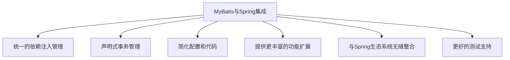

# 1 MyBatis 与 Spring 集成

MyBatis 是一款优秀的持久层框架，而 Spring 是 Java 领域最流行的应用开发框架。将 MyBatis 与 Spring 集成，不仅可以获得各自框架的优势，还能使应用开发变得更加简洁和高效。本文将详细介绍 MyBatis 与 Spring 的集成方法、配置步骤以及最佳实践。

## 1.1 为什么要集成 Spring 和 MyBatis

Spring 和 MyBatis 的集成带来了多方面的好处：



1. **统一的依赖注入管理**：可以通过 Spring 容器管理 MyBatis 的对象，如 SqlSessionFactory 和 Mapper
2. **声明式事务管理**：可以使用 Spring 的事务管理功能，统一管理 MyBatis 的数据库操作事务
3. **简化配置和代码**：减少样板代码，简化 MyBatis 的配置过程
4. **提供更丰富的功能扩展**：结合 Spring 的 AOP 等功能，可以为 MyBatis 提供更丰富的扩展
5. **与 Spring 生态系统无缝整合**：可以与 Spring 的其他模块（如 Spring MVC、Spring Boot）无缝整合
6. **更好的测试支持**：借助 Spring 的测试框架，更方便地进行单元测试和集成测试

## 1.2 集成所需依赖

要将 MyBatis 与 Spring 集成，需要添加以下依赖：

### 1.2.1 Maven 依赖

```xml
<!-- MyBatis -->
<dependency>
    <groupId>org.mybatis</groupId>
    <artifactId>mybatis</artifactId>
    <version>3.5.13</version>
</dependency>

<!-- MyBatis-Spring 集成包 -->
<dependency>
    <groupId>org.mybatis</groupId>
    <artifactId>mybatis-spring</artifactId>
    <version>2.1.1</version>
</dependency>

<!-- Spring 核心依赖 -->
<dependency>
    <groupId>org.springframework</groupId>
    <artifactId>spring-context</artifactId>
    <version>5.3.29</version>
</dependency>

<!-- Spring JDBC 支持 -->
<dependency>
    <groupId>org.springframework</groupId>
    <artifactId>spring-jdbc</artifactId>
    <version>5.3.29</version>
</dependency>

<!-- Spring 事务支持 -->
<dependency>
    <groupId>org.springframework</groupId>
    <artifactId>spring-tx</artifactId>
    <version>5.3.29</version>
</dependency>

<!-- 数据库驱动（以 MySQL 为例） -->
<dependency>
    <groupId>mysql</groupId>
    <artifactId>mysql-connector-java</artifactId>
    <version>8.0.33</version>
</dependency>

<!-- 数据库连接池（以 HikariCP 为例） -->
<dependency>
    <groupId>com.zaxxer</groupId>
    <artifactId>HikariCP</artifactId>
    <version>4.0.3</version>
</dependency>
```

## 1.3 基础配置

MyBatis 与 Spring 集成的基础配置包括：

1. 配置数据源 (DataSource)
2. 配置 SqlSessionFactory
3. 配置 SqlSessionTemplate
4. 配置 Mapper 接口扫描
5. 配置事务管理器

下面分别介绍基于 XML 和基于 Java 配置类的方式。

### 1.3.1 基于 XML 的配置

#### 1.3.1.1 Spring 配置文件 (applicationContext.xml)

```xml
<?xml version="1.0" encoding="UTF-8"?>
<beans xmlns="http://www.springframework.org/schema/beans"
       xmlns:xsi="http://www.w3.org/2001/XMLSchema-instance"
       xmlns:context="http://www.springframework.org/schema/context"
       xmlns:tx="http://www.springframework.org/schema/tx"
       xmlns:mybatis="http://mybatis.org/schema/mybatis-spring"
       xsi:schemaLocation="
        http://www.springframework.org/schema/beans
        http://www.springframework.org/schema/beans/spring-beans.xsd
        http://www.springframework.org/schema/context
        http://www.springframework.org/schema/context/spring-context.xsd
        http://www.springframework.org/schema/tx
        http://www.springframework.org/schema/tx/spring-tx.xsd
        http://mybatis.org/schema/mybatis-spring
        http://mybatis.org/schema/mybatis-spring.xsd">

    <!-- 加载属性文件 -->
    <context:property-placeholder location="classpath:database.properties"/>

    <!-- 启用注解扫描 -->
    <context:component-scan base-package="com.example.service"/>

    <!-- 配置数据源 -->
    <bean id="dataSource" class="com.zaxxer.hikari.HikariDataSource" destroy-method="close">
        <property name="driverClassName" value="${jdbc.driver}"/>
        <property name="jdbcUrl" value="${jdbc.url}"/>
        <property name="username" value="${jdbc.username}"/>
        <property name="password" value="${jdbc.password}"/>
        <!-- 连接池配置 -->
        <property name="maximumPoolSize" value="10"/>
        <property name="minimumIdle" value="2"/>
        <property name="connectionTimeout" value="30000"/>
    </bean>

    <!-- 配置 SqlSessionFactory -->
    <bean id="sqlSessionFactory" class="org.mybatis.spring.SqlSessionFactoryBean">
        <property name="dataSource" ref="dataSource"/>
        <!-- MyBatis 配置文件位置 -->
        <property name="configLocation" value="classpath:mybatis-config.xml"/>
        <!-- 映射文件位置 -->
        <property name="mapperLocations" value="classpath:mapper/**/*.xml"/>
        <!-- 别名包 -->
        <property name="typeAliasesPackage" value="com.example.entity"/>
        <!-- 分页插件等插件配置 -->
        <property name="plugins">
            <array>
                <bean class="com.github.pagehelper.PageInterceptor">
                    <property name="properties">
                        <value>
                            helperDialect=mysql
                            reasonable=true
                        </value>
                    </property>
                </bean>
            </array>
        </property>
    </bean>

    <!-- 配置 SqlSessionTemplate -->
    <bean id="sqlSessionTemplate" class="org.mybatis.spring.SqlSessionTemplate">
        <constructor-arg index="0" ref="sqlSessionFactory"/>
    </bean>

    <!-- 配置 Mapper 扫描器 -->
    <mybatis:scan base-package="com.example.mapper"/>

    <!-- 配置事务管理器 -->
    <bean id="transactionManager" class="org.springframework.jdbc.datasource.DataSourceTransactionManager">
        <property name="dataSource" ref="dataSource"/>
    </bean>

    <!-- 启用事务注解 -->
    <tx:annotation-driven transaction-manager="transactionManager"/>
</beans>
```

#### 1.3.1.2 数据库配置文件 (database.properties)

```properties
jdbc.driver=com.mysql.cj.jdbc.Driver
jdbc.url=jdbc:mysql://localhost:3306/mydatabase?useSSL=false&serverTimezone=UTC
jdbc.username=root
jdbc.password=password
```

#### 1.3.1.3 MyBatis 配置文件 (mybatis-config.xml)

在与 Spring 集成时，大部分 MyBatis 配置已经在 Spring 配置中完成，mybatis-config.xml 主要用于配置一些 MyBatis 特有的设置。

```xml
<?xml version="1.0" encoding="UTF-8" ?>
<!DOCTYPE configuration
  PUBLIC "-//mybatis.org//DTD Config 3.0//EN"
  "http://mybatis.org/dtd/mybatis-3-config.dtd">
<configuration>
    <!-- 全局设置 -->
    <settings>
        <!-- 开启驼峰命名自动映射 -->
        <setting name="mapUnderscoreToCamelCase" value="true"/>
        <!-- 开启二级缓存 -->
        <setting name="cacheEnabled" value="true"/>
        <!-- 允许 JDBC 支持自动生成主键 -->
        <setting name="useGeneratedKeys" value="true"/>
        <!-- 配置默认的执行器 -->
        <setting name="defaultExecutorType" value="REUSE"/>
        <!-- 设置超时时间 -->
        <setting name="defaultStatementTimeout" value="25"/>
    </settings>

    <!-- 类型处理器 -->
    <typeHandlers>
        <typeHandler handler="com.example.typehandler.CustomEnumTypeHandler"
                     javaType="com.example.enums.StatusEnum"/>
    </typeHandlers>
</configuration>
```

### 1.3.2 基于 Java 配置类

#### 1.3.2.1 数据源配置类

```java
@Configuration
@PropertySource("classpath:database.properties")
public class DataSourceConfig {

    @Autowired
    private Environment env;

    @Bean
    public DataSource dataSource() {
        HikariDataSource dataSource = new HikariDataSource();
        dataSource.setDriverClassName(env.getProperty("jdbc.driver"));
        dataSource.setJdbcUrl(env.getProperty("jdbc.url"));
        dataSource.setUsername(env.getProperty("jdbc.username"));
        dataSource.setPassword(env.getProperty("jdbc.password"));
        dataSource.setMaximumPoolSize(10);
        dataSource.setMinimumIdle(2);
        dataSource.setConnectionTimeout(30000);
        return dataSource;
    }
}
```

#### 1.3.2.2 MyBatis 配置类

```java
@Configuration
@EnableTransactionManagement
@MapperScan("com.example.mapper") // 扫描 Mapper 接口
public class MyBatisConfig {

    @Bean
    public SqlSessionFactory sqlSessionFactory(DataSource dataSource) throws Exception {
        SqlSessionFactoryBean factoryBean = new SqlSessionFactoryBean();
        factoryBean.setDataSource(dataSource);

        // 设置 MyBatis 配置文件位置
        factoryBean.setConfigLocation(new ClassPathResource("mybatis-config.xml"));

        // 设置映射文件位置
        factoryBean.setMapperLocations(new PathMatchingResourcePatternResolver()
                .getResources("classpath:mapper/**/*.xml"));

        // 设置别名包
        factoryBean.setTypeAliasesPackage("com.example.entity");

        // 配置分页插件
        PageInterceptor pageInterceptor = new PageInterceptor();
        Properties properties = new Properties();
        properties.setProperty("helperDialect", "mysql");
        properties.setProperty("reasonable", "true");
        pageInterceptor.setProperties(properties);
        factoryBean.setPlugins(new Interceptor[]{pageInterceptor});

        return factoryBean.getObject();
    }

    @Bean
    public SqlSessionTemplate sqlSessionTemplate(SqlSessionFactory sqlSessionFactory) {
        return new SqlSessionTemplate(sqlSessionFactory);
    }

    @Bean
    public DataSourceTransactionManager transactionManager(DataSource dataSource) {
        return new DataSourceTransactionManager(dataSource);
    }
}
```

#### 1.3.2.3 应用配置类

```java
@Configuration
@ComponentScan("com.example.service")
@Import({DataSourceConfig.class, MyBatisConfig.class})
public class AppConfig {
    // 应用其他配置
}
```

## 1.4 Mapper 接口开发

在 MyBatis 与 Spring 集成环境中，推荐使用 Mapper 接口方式进行开发。

### 1.4.1 定义实体类

```java
public class User {
    private Long id;
    private String username;
    private String email;
    private Date createTime;

    // getter 和 setter 方法
}
```

### 1.4.2 创建 Mapper 接口

```java
public interface UserMapper {
    List<User> findAll();

    User findById(Long id);

    int insert(User user);

    int update(User user);

    int delete(Long id);
}
```

### 1.4.3 编写映射文件

```xml
<?xml version="1.0" encoding="UTF-8" ?>
<!DOCTYPE mapper
  PUBLIC "-//mybatis.org//DTD Mapper 3.0//EN"
  "http://mybatis.org/dtd/mybatis-3-mapper.dtd">
<mapper namespace="com.example.mapper.UserMapper">
    <select id="findAll" resultType="User">
        SELECT * FROM users ORDER BY create_time DESC
    </select>

    <select id="findById" parameterType="long" resultType="User">
        SELECT * FROM users WHERE id = #{id}
    </select>

    <insert id="insert" parameterType="User" useGeneratedKeys="true" keyProperty="id">
        INSERT INTO users (username, email, create_time)
        VALUES (#{username}, #{email}, #{createTime})
    </insert>

    <update id="update" parameterType="User">
        UPDATE users
        SET username = #{username}, email = #{email}
        WHERE id = #{id}
    </update>

    <delete id="delete" parameterType="long">
        DELETE FROM users WHERE id = #{id}
    </delete>
</mapper>
```

### 1.4.4 使用 @Mapper 注解

如果使用的是 Java 配置类方式且不使用 @MapperScan 注解，则需要在每个 Mapper 接口上添加 @Mapper 注解：

```java
@Mapper
public interface UserMapper {
    // 方法定义
}
```

## 1.5 事务管理

事务管理是数据库操作的重要部分，Spring 提供了声明式事务管理，可以很方便地与 MyBatis 集成。

### 1.5.1 配置事务管理器

在 XML 配置中：

```xml
<!-- 配置事务管理器 -->
<bean id="transactionManager" class="org.springframework.jdbc.datasource.DataSourceTransactionManager">
    <property name="dataSource" ref="dataSource"/>
</bean>

<!-- 启用事务注解 -->
<tx:annotation-driven transaction-manager="transactionManager"/>
```

在 Java 配置类中：

```java
@Configuration
@EnableTransactionManagement
public class TransactionConfig {

    @Bean
    public DataSourceTransactionManager transactionManager(DataSource dataSource) {
        return new DataSourceTransactionManager(dataSource);
    }
}
```

### 1.5.2 使用 @Transactional 注解

在 Service 类或方法上使用 @Transactional 注解来声明事务：

```java
@Service
public class UserServiceImpl implements UserService {

    @Autowired
    private UserMapper userMapper;

    @Override
    @Transactional(readOnly = true)
    public User getById(Long id) {
        return userMapper.findById(id);
    }

    @Override
    @Transactional
    public void save(User user) {
        if (user.getId() == null) {
            user.setCreateTime(new Date());
            userMapper.insert(user);
        } else {
            userMapper.update(user);
        }
    }

    @Override
    @Transactional
    public void deleteById(Long id) {
        userMapper.delete(id);
    }

    @Override
    @Transactional
    public void batchSave(List<User> users) {
        for (User user : users) {
            save(user);
        }
    }
}
```

### 1.5.3 事务属性配置

@Transactional 注解支持多种事务属性配置：

```java
@Transactional(
    propagation = Propagation.REQUIRED,    // 事务传播行为
    isolation = Isolation.READ_COMMITTED,  // 事务隔离级别
    timeout = 30,                          // 超时时间（秒）
    readOnly = false,                      // 是否只读
    rollbackFor = Exception.class,         // 触发回滚的异常类
    noRollbackFor = IOException.class      // 不触发回滚的异常类
)
public void complexOperation() {
    // 业务操作
}
```

#### 1.5.3.1 事务传播行为

Spring 支持 7 种事务传播行为：

| 传播行为        | 描述                                                | 常用场景               |
| --------------- | --------------------------------------------------- | ---------------------- |
| REQUIRED (默认) | 如有事务，加入；无则创建新事务                      | 一般业务方法           |
| SUPPORTS        | 如有事务，加入；无则非事务执行                      | 查询方法               |
| MANDATORY       | 必须在事务中执行，无则抛异常                        | 确保方法在事务中运行   |
| REQUIRES_NEW    | 总是创建新事务，挂起当前事务                        | 独立事务操作           |
| NOT_SUPPORTED   | 总是非事务执行，挂起当前事务                        | 非事务操作             |
| NEVER           | 总是非事务执行，有事务则抛异常                      | 确保方法不在事务中运行 |
| NESTED          | 嵌套事务，当前有事务则创建嵌套事务，无则同 REQUIRED | 可单独回滚的子操作     |

#### 1.5.3.2 事务隔离级别

Spring 支持 5 种事务隔离级别：

| 隔离级别         | 描述                                       | 问题                   |
| ---------------- | ------------------------------------------ | ---------------------- |
| DEFAULT          | 使用数据库默认隔离级别                     | 依赖数据库设置         |
| READ_UNCOMMITTED | 读未提交，允许读取未提交的事务数据         | 脏读、不可重复读、幻读 |
| READ_COMMITTED   | 读已提交，只允许读取已提交的事务数据       | 不可重复读、幻读       |
| REPEATABLE_READ  | 可重复读，在一个事务中多次读取数据结果一致 | 幻读                   |
| SERIALIZABLE     | 串行化，完全隔离，事务串行执行             | 无并发问题，但性能最差 |

### 1.5.4 编程式事务管理

除了声明式事务，Spring 也支持编程式事务管理：

```java
@Service
public class UserServiceImpl implements UserService {

    @Autowired
    private PlatformTransactionManager transactionManager;

    public void complexOperation() {
        // 定义事务属性
        DefaultTransactionDefinition def = new DefaultTransactionDefinition();
        def.setPropagationBehavior(TransactionDefinition.PROPAGATION_REQUIRED);
        def.setIsolationLevel(TransactionDefinition.ISOLATION_READ_COMMITTED);
        def.setTimeout(30); // 30 秒

        // 开始事务
        TransactionStatus status = transactionManager.getTransaction(def);

        try {
            // 业务操作
            // ...

            // 提交事务
            transactionManager.commit(status);
        } catch (Exception e) {
            // 回滚事务
            transactionManager.rollback(status);
            throw e;
        }
    }
}
```

### 1.5.5 事务最佳实践

1. **事务粒度**：尽量在 Service 层而非 DAO 层声明事务，以确保业务逻辑的原子性
2. **只读事务**：对于查询操作，使用 readOnly=true 提高性能
3. **异常处理**：明确定义 rollbackFor 和 noRollbackFor，避免因异常处理不当导致事务回滚失败
4. **事务超时**：为长时间运行的事务设置超时时间，避免资源长时间占用
5. **传播行为选择**：根据业务需求选择合适的传播行为，避免事务嵌套过深
6. **避免事务陷阱**：注意自调用、私有方法、异步方法等场景下的事务可能失效
7. **使用 AOP 增强事务**：可以结合 AOP 对事务进行增强，如添加日志、性能监控等

## 1.6 MyBatis-Spring 集成进阶

### 1.6.1 多数据源配置

有时我们需要在一个应用中访问多个数据库，可以通过配置多数据源来实现。

#### 1.6.1.1 XML 配置方式

```xml
<!-- 主数据源 -->
<bean id="primaryDataSource" class="com.zaxxer.hikari.HikariDataSource" destroy-method="close">
    <property name="driverClassName" value="${primary.jdbc.driver}"/>
    <property name="jdbcUrl" value="${primary.jdbc.url}"/>
    <property name="username" value="${primary.jdbc.username}"/>
    <property name="password" value="${primary.jdbc.password}"/>
</bean>

<!-- 辅助数据源 -->
<bean id="secondaryDataSource" class="com.zaxxer.hikari.HikariDataSource" destroy-method="close">
    <property name="driverClassName" value="${secondary.jdbc.driver}"/>
    <property name="jdbcUrl" value="${secondary.jdbc.url}"/>
    <property name="username" value="${secondary.jdbc.username}"/>
    <property name="password" value="${secondary.jdbc.password}"/>
</bean>

<!-- 主数据源的 SqlSessionFactory -->
<bean id="primarySqlSessionFactory" class="org.mybatis.spring.SqlSessionFactoryBean">
    <property name="dataSource" ref="primaryDataSource"/>
    <property name="mapperLocations" value="classpath:mapper/primary/**/*.xml"/>
    <property name="typeAliasesPackage" value="com.example.entity.primary"/>
</bean>

<!-- 辅助数据源的 SqlSessionFactory -->
<bean id="secondarySqlSessionFactory" class="org.mybatis.spring.SqlSessionFactoryBean">
    <property name="dataSource" ref="secondaryDataSource"/>
    <property name="mapperLocations" value="classpath:mapper/secondary/**/*.xml"/>
    <property name="typeAliasesPackage" value="com.example.entity.secondary"/>
</bean>

<!-- 主数据源的 Mapper 扫描器 -->
<bean class="org.mybatis.spring.mapper.MapperScannerConfigurer">
    <property name="basePackage" value="com.example.mapper.primary"/>
    <property name="sqlSessionFactoryBeanName" value="primarySqlSessionFactory"/>
</bean>

<!-- 辅助数据源的 Mapper 扫描器 -->
<bean class="org.mybatis.spring.mapper.MapperScannerConfigurer">
    <property name="basePackage" value="com.example.mapper.secondary"/>
    <property name="sqlSessionFactoryBeanName" value="secondarySqlSessionFactory"/>
</bean>

<!-- 主数据源的事务管理器 -->
<bean id="primaryTransactionManager" class="org.springframework.jdbc.datasource.DataSourceTransactionManager">
    <property name="dataSource" ref="primaryDataSource"/>
</bean>

<!-- 辅助数据源的事务管理器 -->
<bean id="secondaryTransactionManager" class="org.springframework.jdbc.datasource.DataSourceTransactionManager">
    <property name="dataSource" ref="secondaryDataSource"/>
</bean>
```

#### 1.6.1.2 Java 配置类方式

```java
@Configuration
public class MultiDataSourceConfig {

    @Bean
    @Primary
    @ConfigurationProperties(prefix = "spring.datasource.primary")
    public DataSource primaryDataSource() {
        return DataSourceBuilder.create().type(HikariDataSource.class).build();
    }

    @Bean
    @ConfigurationProperties(prefix = "spring.datasource.secondary")
    public DataSource secondaryDataSource() {
        return DataSourceBuilder.create().type(HikariDataSource.class).build();
    }

    @Bean
    @Primary
    public SqlSessionFactory primarySqlSessionFactory() throws Exception {
        SqlSessionFactoryBean factoryBean = new SqlSessionFactoryBean();
        factoryBean.setDataSource(primaryDataSource());
        factoryBean.setMapperLocations(new PathMatchingResourcePatternResolver()
                .getResources("classpath:mapper/primary/**/*.xml"));
        factoryBean.setTypeAliasesPackage("com.example.entity.primary");
        return factoryBean.getObject();
    }

    @Bean
    public SqlSessionFactory secondarySqlSessionFactory() throws Exception {
        SqlSessionFactoryBean factoryBean = new SqlSessionFactoryBean();
        factoryBean.setDataSource(secondaryDataSource());
        factoryBean.setMapperLocations(new PathMatchingResourcePatternResolver()
                .getResources("classpath:mapper/secondary/**/*.xml"));
        factoryBean.setTypeAliasesPackage("com.example.entity.secondary");
        return factoryBean.getObject();
    }

    @Bean
    @Primary
    public PlatformTransactionManager primaryTransactionManager() {
        return new DataSourceTransactionManager(primaryDataSource());
    }

    @Bean
    public PlatformTransactionManager secondaryTransactionManager() {
        return new DataSourceTransactionManager(secondaryDataSource());
    }
}

@Configuration
@MapperScan(basePackages = "com.example.mapper.primary",
            sqlSessionFactoryRef = "primarySqlSessionFactory")
public class PrimaryDataSourceConfig {
}

@Configuration
@MapperScan(basePackages = "com.example.mapper.secondary",
            sqlSessionFactoryRef = "secondarySqlSessionFactory")
public class SecondaryDataSourceConfig {
}
```

#### 1.6.1.3 使用多数据源的事务管理

使用多数据源时，需要在 @Transactional 注解中指定事务管理器：

```java
@Service
public class UserServiceImpl implements UserService {

    @Autowired
    private PrimaryUserMapper primaryUserMapper;

    @Autowired
    private SecondaryUserMapper secondaryUserMapper;

    @Transactional(transactionManager = "primaryTransactionManager")
    public void saveInPrimary(User user) {
        primaryUserMapper.insert(user);
    }

    @Transactional(transactionManager = "secondaryTransactionManager")
    public void saveInSecondary(User user) {
        secondaryUserMapper.insert(user);
    }
}
```

### 1.6.2 分页查询

MyBatis 本身不提供分页功能，但可以通过 PageHelper 等插件实现分页。

#### 1.6.2.1 添加 PageHelper 依赖

```xml
<dependency>
    <groupId>com.github.pagehelper</groupId>
    <artifactId>pagehelper</artifactId>
    <version>5.3.2</version>
</dependency>
```

#### 1.6.2.2 配置 PageHelper 插件

XML 配置：

```xml
<bean id="sqlSessionFactory" class="org.mybatis.spring.SqlSessionFactoryBean">
    <!-- 其他配置 -->
    <property name="plugins">
        <array>
            <bean class="com.github.pagehelper.PageInterceptor">
                <property name="properties">
                    <value>
                        helperDialect=mysql
                        reasonable=true
                        supportMethodsArguments=true
                        params=count=countSql
                    </value>
                </property>
            </bean>
        </array>
    </property>
</bean>
```

Java 配置：

```java
@Bean
public PageInterceptor pageInterceptor() {
    PageInterceptor interceptor = new PageInterceptor();
    Properties properties = new Properties();
    properties.setProperty("helperDialect", "mysql");
    properties.setProperty("reasonable", "true");
    properties.setProperty("supportMethodsArguments", "true");
    properties.setProperty("params", "count=countSql");
    interceptor.setProperties(properties);
    return interceptor;
}

@Bean
public SqlSessionFactory sqlSessionFactory(DataSource dataSource) throws Exception {
    SqlSessionFactoryBean factoryBean = new SqlSessionFactoryBean();
    factoryBean.setDataSource(dataSource);
    // 其他配置
    factoryBean.setPlugins(new Interceptor[]{pageInterceptor()});
    return factoryBean.getObject();
}
```

#### 1.6.2.3 使用 PageHelper 进行分页查询

```java
@Service
public class UserServiceImpl implements UserService {

    @Autowired
    private UserMapper userMapper;

    @Override
    public PageInfo<User> findByPage(int pageNum, int pageSize) {
        // 开始分页
        PageHelper.startPage(pageNum, pageSize);
        // 执行查询
        List<User> users = userMapper.findAll();
        // 封装分页结果
        return new PageInfo<>(users);
    }
}
```

### 1.6.3 批量操作

MyBatis 与 Spring 集成后，可以使用批量执行器提高批量操作性能。

#### 1.6.3.1 配置批量执行器

```java
@Bean
public SqlSessionTemplate sqlSessionTemplate(SqlSessionFactory sqlSessionFactory) {
    return new SqlSessionTemplate(sqlSessionFactory, ExecutorType.BATCH);
}
```

但这会影响所有操作，更灵活的方式是创建一个专用的批量 SqlSession：

```java
@Service
public class BatchServiceImpl implements BatchService {

    @Autowired
    private SqlSessionFactory sqlSessionFactory;

    @Override
    @Transactional
    public void batchInsert(List<User> users) {
        SqlSession sqlSession = sqlSessionFactory.openSession(ExecutorType.BATCH);
        try {
            UserMapper mapper = sqlSession.getMapper(UserMapper.class);
            for (int i = 0; i < users.size(); i++) {
                mapper.insert(users.get(i));
                if (i > 0 && i % 1000 == 0) {
                    // 每1000条刷新一次，避免内存溢出
                    sqlSession.flushStatements();
                }
            }
            sqlSession.flushStatements();
        } finally {
            sqlSession.close();
        }
    }
}
```

### 1.6.4 动态数据源切换

有时需要在运行时根据条件动态切换数据源，可以使用 Spring 的 AbstractRoutingDataSource 实现。

#### 1.6.4.1 创建动态数据源

```java
public class DynamicDataSource extends AbstractRoutingDataSource {

    @Override
    protected Object determineCurrentLookupKey() {
        return DataSourceContextHolder.getDataSourceType();
    }
}

public class DataSourceContextHolder {
    private static final ThreadLocal<String> contextHolder = new ThreadLocal<>();

    public static void setDataSourceType(String dataSourceType) {
        contextHolder.set(dataSourceType);
    }

    public static String getDataSourceType() {
        return contextHolder.get();
    }

    public static void clearDataSourceType() {
        contextHolder.remove();
    }
}
```

#### 1.6.4.2 配置动态数据源

```java
@Configuration
public class DataSourceConfig {

    @Bean
    public DataSource primaryDataSource() {
        // 配置主数据源
    }

    @Bean
    public DataSource secondaryDataSource() {
        // 配置辅助数据源
    }

    @Bean
    @Primary
    public DataSource dynamicDataSource() {
        DynamicDataSource dynamicDataSource = new DynamicDataSource();

        Map<Object, Object> targetDataSources = new HashMap<>();
        targetDataSources.put("PRIMARY", primaryDataSource());
        targetDataSources.put("SECONDARY", secondaryDataSource());

        dynamicDataSource.setTargetDataSources(targetDataSources);
        dynamicDataSource.setDefaultTargetDataSource(primaryDataSource());

        return dynamicDataSource;
    }
}
```

#### 1.6.4.3 创建数据源切换注解

```java
@Target({ElementType.METHOD, ElementType.TYPE})
@Retention(RetentionPolicy.RUNTIME)
@Documented
public @interface DataSource {
    String value() default "PRIMARY";
}
```

#### 1.6.4.4 使用 AOP 实现数据源切换

```java
@Aspect
@Component
public class DataSourceAspect {

    @Pointcut("@annotation(com.example.annotation.DataSource)")
    public void dataSourcePointcut() {
    }

    @Before("dataSourcePointcut() && @annotation(dataSource)")
    public void switchDataSource(JoinPoint point, DataSource dataSource) {
        DataSourceContextHolder.setDataSourceType(dataSource.value());
    }

    @After("dataSourcePointcut()")
    public void restoreDataSource(JoinPoint point) {
        DataSourceContextHolder.clearDataSourceType();
    }
}
```

#### 1.6.4.5 使用动态数据源

```java
@Service
public class UserServiceImpl implements UserService {

    @Autowired
    private UserMapper userMapper;

    @Override
    @DataSource("PRIMARY")
    public User getFromPrimary(Long id) {
        return userMapper.findById(id);
    }

    @Override
    @DataSource("SECONDARY")
    public User getFromSecondary(Long id) {
        return userMapper.findById(id);
    }
}
```

## 1.7 Spring Boot 集成 MyBatis

Spring Boot 提供了更简化的方式集成 MyBatis。

### 1.7.1 添加依赖

```xml
<dependency>
    <groupId>org.mybatis.spring.boot</groupId>
    <artifactId>mybatis-spring-boot-starter</artifactId>
    <version>2.3.1</version>
</dependency>

<dependency>
    <groupId>mysql</groupId>
    <artifactId>mysql-connector-java</artifactId>
    <scope>runtime</scope>
</dependency>
```

### 1.7.2 配置属性

```properties
# 数据源配置
spring.datasource.url=jdbc:mysql://localhost:3306/mydatabase?useSSL=false&serverTimezone=UTC
spring.datasource.username=root
spring.datasource.password=password
spring.datasource.driver-class-name=com.mysql.cj.jdbc.Driver

# MyBatis 配置
mybatis.config-location=classpath:mybatis-config.xml
mybatis.mapper-locations=classpath:mapper/**/*.xml
mybatis.type-aliases-package=com.example.entity
mybatis.configuration.map-underscore-to-camel-case=true
```

### 1.7.3 启用 MapperScan

```java
@SpringBootApplication
@MapperScan("com.example.mapper")
public class Application {

    public static void main(String[] args) {
        SpringApplication.run(Application.class, args);
    }
}
```

### 1.7.4 整合 PageHelper

```xml
<dependency>
    <groupId>com.github.pagehelper</groupId>
    <artifactId>pagehelper-spring-boot-starter</artifactId>
    <version>1.4.6</version>
</dependency>
```

配置文件：

```properties
# PageHelper 配置
pagehelper.helperDialect=mysql
pagehelper.reasonable=true
pagehelper.supportMethodsArguments=true
pagehelper.params=count=countSql
```

## 1.8 集成测试

### 1.8.1 单元测试 Mapper

使用 Spring 测试框架测试 Mapper 接口：

```java
@RunWith(SpringRunner.class)
@SpringBootTest
public class UserMapperTest {

    @Autowired
    private UserMapper userMapper;

    @Test
    public void testFindById() {
        User user = userMapper.findById(1L);
        assertNotNull(user);
        assertEquals("admin", user.getUsername());
    }

    @Test
    public void testInsert() {
        User user = new User();
        user.setUsername("testuser");
        user.setEmail("test@example.com");
        user.setCreateTime(new Date());

        int result = userMapper.insert(user);
        assertEquals(1, result);
        assertNotNull(user.getId());
    }
}
```

### 1.8.2 配置事务回滚

为了避免测试数据污染数据库，可以配置测试方法的事务自动回滚：

```java
@RunWith(SpringRunner.class)
@SpringBootTest
@Transactional  // 开启事务
@Rollback       // 测试完成后回滚事务
public class UserServiceTest {

    @Autowired
    private UserService userService;

    @Test
    public void testSave() {
        User user = new User();
        user.setUsername("testuser");
        user.setEmail("test@example.com");

        userService.save(user);

        User savedUser = userService.getById(user.getId());
        assertNotNull(savedUser);
        assertEquals("testuser", savedUser.getUsername());
    }
}
```

### 1.8.3 使用测试数据库

为了彻底隔离测试环境，可以为测试配置单独的数据库：

```properties
# application-test.properties
spring.datasource.url=jdbc:mysql://localhost:3306/test_db
spring.datasource.username=test
spring.datasource.password=test
```

然后在测试类上指定使用测试配置：

```java
@RunWith(SpringRunner.class)
@SpringBootTest
@ActiveProfiles("test")  // 激活 test 配置文件
public class UserMapperTest {
    // 测试代码
}
```

### 1.8.4 使用内存数据库

更轻量级的方式是使用内存数据库如 H2 进行测试：

```xml
<dependency>
    <groupId>com.h2database</groupId>
    <artifactId>h2</artifactId>
    <scope>test</scope>
</dependency>
```

```properties
# application-test.properties
spring.datasource.url=jdbc:h2:mem:testdb;MODE=MySQL
spring.datasource.driver-class-name=org.h2.Driver
spring.datasource.username=sa
spring.datasource.password=
spring.sql.init.schema-locations=classpath:schema-h2.sql
spring.sql.init.data-locations=classpath:data-h2.sql
```

## 1.9 常见问题与解决方案

### 1.9.1 事务不生效

可能的原因：

1. 方法不是 public 的
2. 类内部自调用（Spring AOP 的限制）
3. 异常被捕获但未抛出
4. 抛出的异常不在回滚范围内

解决方案：

1. 确保事务方法是 public 的
2. 使用 AopContext 获取代理对象进行自调用
3. 确保异常正确抛出或使用 TransactionAspectSupport 手动回滚
4. 配置 rollbackFor 属性包含正确的异常类型

```java
@Service
public class UserServiceImpl implements UserService {

    @Autowired
    private UserMapper userMapper;

    @Override
    @Transactional
    public void saveWithRollback(User user) {
        try {
            userMapper.insert(user);
            // 业务逻辑可能抛出异常
            if (someCondition) {
                throw new BusinessException("业务错误");
            }
        } catch (Exception e) {
            // 手动回滚
            TransactionAspectSupport.currentTransactionStatus().setRollbackOnly();
            throw e; // 重新抛出异常
        }
    }

    @Override
    @Transactional
    public void saveWithSelfInvocation() {
        User user = new User();
        // 错误方式：直接调用自身方法，事务不生效
        anotherTransactionalMethod(user);

        // 正确方式：通过代理对象调用
        UserService proxy = (UserService) AopContext.currentProxy();
        proxy.anotherTransactionalMethod(user);
    }

    @Override
    @Transactional
    public void anotherTransactionalMethod(User user) {
        // 业务逻辑
    }
}

// 启用 aspectJ 代理
@EnableAspectJAutoProxy(exposeProxy = true)
@Configuration
public class AppConfig {
    // 配置
}
```

### 1.9.2 懒加载失败

MyBatis 的懒加载依赖于活动的 SqlSession，在 Spring 中可能会导致会话已关闭的问题。

解决方案：

1. 配置 SqlSessionTemplate 延迟关闭会话

```java
@Bean
public SqlSessionTemplate sqlSessionTemplate(SqlSessionFactory sqlSessionFactory) {
    return new SqlSessionTemplate(sqlSessionFactory, ExecutorType.SIMPLE, new DefaultSqlSessionTransactionManager());
}
```

2. 使用 Spring 的 Open Session In View 模式

```properties
spring.jpa.open-in-view=true
```

3. 在需要的地方手动触发加载

```java
@Service
public class UserServiceImpl implements UserService {

    @Override
    @Transactional(readOnly = true)
    public User getUserWithOrders(Long id) {
        User user = userMapper.findById(id);
        // 手动触发懒加载
        if (user != null) {
            Hibernate.initialize(user.getOrders());
        }
        return user;
    }
}
```

### 1.9.3 Type Handler 不生效

解决方案：

1. 确保 TypeHandler 正确注册

```xml
<typeHandlers>
    <package name="com.example.typehandler"/>
</typeHandlers>
```

2. 检查 TypeHandler 类上的注解是否正确

```java
@MappedTypes(StatusEnum.class)
@MappedJdbcTypes(JdbcType.INTEGER)
public class StatusEnumTypeHandler extends BaseTypeHandler<StatusEnum> {
    // 实现方法
}
```

3. 在映射文件中明确指定 TypeHandler

```xml
<result column="status" property="status" typeHandler="com.example.typehandler.StatusEnumTypeHandler"/>
```

### 1.9.4 多数据源事务问题

多数据源环境中，默认的事务管理器只能处理单一数据源的事务。

解决方案：使用 JTA 事务管理器处理分布式事务

```xml
<dependency>
    <groupId>org.springframework.boot</groupId>
    <artifactId>spring-boot-starter-jta-atomikos</artifactId>
</dependency>
```

```java
@Configuration
public class JtaConfig {

    @Bean
    public AtomikosDataSourceBean primaryDataSource() {
        // 配置 XA 数据源
        AtomikosDataSourceBean dataSource = new AtomikosDataSourceBean();
        dataSource.setUniqueResourceName("primaryDataSource");
        dataSource.setXaDataSourceClassName("com.mysql.cj.jdbc.MysqlXADataSource");
        Properties props = new Properties();
        props.setProperty("URL", "jdbc:mysql://localhost:3306/primary_db");
        props.setProperty("user", "root");
        props.setProperty("password", "password");
        dataSource.setXaProperties(props);
        return dataSource;
    }

    @Bean
    public AtomikosDataSourceBean secondaryDataSource() {
        // 配置第二个 XA 数据源
        // ...
    }

    @Bean
    public JtaTransactionManager transactionManager() {
        return new JtaTransactionManager();
    }
}
```

## 1.10 小结

本文详细介绍了 MyBatis 与 Spring 的集成方法，包括基础配置、Mapper 接口开发、事务管理、多数据源配置、分页查询等进阶内容，以及常见问题的解决方案。

MyBatis 与 Spring 的无缝集成为开发者提供了更简洁、高效的持久层解决方案，可以充分利用两者的优势：MyBatis 的灵活性和 SQL 控制能力，以及 Spring 的依赖注入和事务管理。

在实际项目中，推荐使用 Spring Boot 集成 MyBatis，这可以进一步简化配置，提高开发效率。

