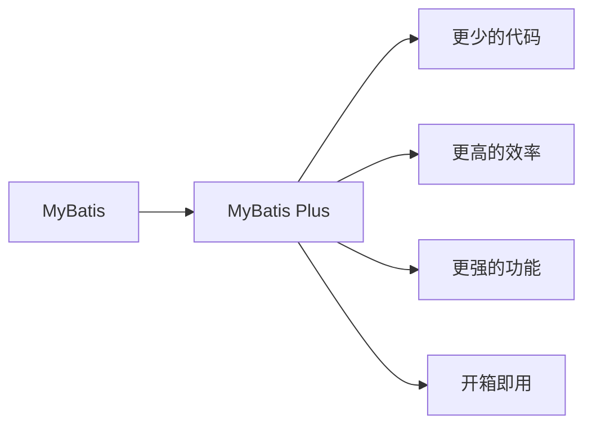
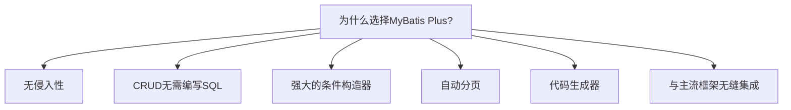

# 1 MyBatis Plus 详解

MyBatis Plus（简称 MP）是一个强大的 MyBatis 增强工具，它在 MyBatis 的基础上只做增强不做改变，为简化开发、提高效率而生。

## 1.1 MyBatis Plus 简介

MyBatis Plus 是国内优秀的开源框架，由苞米豆开源组织开发并维护。它基于 MyBatis 框架，提供了许多便捷的扩展功能，极大地简化了 MyBatis 的开发流程，提高了开发效率。



### 1.1.1 MyBatis Plus 与 MyBatis 的关系

MyBatis Plus 完全兼容 MyBatis，它构建在 MyBatis 之上，没有改变 MyBatis 的任何核心接口和实现。你可以将 MyBatis Plus 理解为 MyBatis 的一个增强工具包，它提供了一系列的增强功能。

| 特性           | MyBatis    | MyBatis Plus |
| -------------- | ---------- | ------------ |
| SQL 与代码分离 | ✓          | ✓            |
| 动态 SQL       | ✓          | ✓            |
| 通用 CRUD 操作 | ✗          | ✓            |
| 条件构造器     | ✗          | ✓            |
| 代码生成器     | 有限支持   | 全面支持     |
| 分页插件       | 需自行实现 | 内置支持     |
| 逻辑删除       | 需自行实现 | 内置支持     |
| SQL 注入器     | ✗          | ✓            |

### 1.1.2 为什么选择 MyBatis Plus



MyBatis Plus 的主要优势：

1. **无侵入**：只做增强不做改变，引入它不会对现有 MyBatis 项目产生任何影响
2. **CRUD 操作无需编写 SQL**：内置通用 Mapper 和通用 Service，可以实现单表大部分 CRUD 操作
3. **强大的条件构造器**：以 Lambda 表达式的形式创建查询条件，使代码更加简洁可读
4. **自动分页**：基于 MyBatis 物理分页，无需关心具体操作
5. **代码生成器**：可以快速生成实体类、Mapper、Service、Controller 等代码
6. **多种主键策略**：支持多达 4 种主键策略，可自由配置
7. **SQL 注入器**：支持自定义全局操作方法注入
8. **与主流框架无缝集成**：Spring Boot、JPA 等

## 1.2 快速开始

### 1.2.1 添加依赖

在 Maven 项目中添加 MyBatis Plus 依赖：

```xml
<!-- Maven 依赖 -->
<dependency>
    <groupId>com.baomidou</groupId>
    <artifactId>mybatis-plus-boot-starter</artifactId>
    <version>3.5.3</version>
</dependency>
```

Spring Boot 项目配置：

```yaml
# application.yml
spring:
  datasource:
    driver-class-name: com.mysql.cj.jdbc.Driver
    url: jdbc:mysql://localhost:3306/test?serverTimezone=Asia/Shanghai
    username: root
    password: password

mybatis-plus:
  mapper-locations: classpath*:/mapper/**/*.xml # XML 映射文件位置
  type-aliases-package: com.example.entity # 实体类包路径
  configuration:
    map-underscore-to-camel-case: true # 开启驼峰命名
  global-config:
    db-config:
      id-type: auto # 全局主键策略
      logic-delete-field: deleted # 逻辑删除字段
      logic-delete-value: 1 # 逻辑已删除值
      logic-not-delete-value: 0 # 逻辑未删除值
```

### 1.2.2 定义实体类

```java
@Data
@TableName("user")
public class User {

    @TableId(type = IdType.AUTO)
    private Long id;

    private String name;

    private Integer age;

    private String email;

    @TableField(fill = FieldFill.INSERT)
    private LocalDateTime createTime;

    @TableField(fill = FieldFill.INSERT_UPDATE)
    private LocalDateTime updateTime;

    @TableLogic
    private Integer deleted;
}
```

### 1.2.3 创建 Mapper 接口

```java
public interface UserMapper extends BaseMapper<User> {
    // 已经拥有了基础的CRUD方法，无需编写任何代码
    // 可以添加自定义方法
}
```

### 1.2.4 使用 Service 层

```java
@Service
public class UserServiceImpl extends ServiceImpl<UserMapper, User> implements UserService {
    // 已经拥有了基础的CRUD方法，无需编写任何代码
    // 可以添加自定义业务逻辑
}
```

### 1.2.5 简单使用示例

```java
@RestController
@RequestMapping("/users")
public class UserController {

    @Autowired
    private UserService userService;

    @GetMapping
    public List<User> list() {
        // 查询所有用户
        return userService.list();
    }

    @GetMapping("/{id}")
    public User getById(@PathVariable Long id) {
        // 根据ID查询用户
        return userService.getById(id);
    }

    @PostMapping
    public boolean save(@RequestBody User user) {
        // 保存用户
        return userService.save(user);
    }

    @PutMapping
    public boolean update(@RequestBody User user) {
        // 更新用户
        return userService.updateById(user);
    }

    @DeleteMapping("/{id}")
    public boolean delete(@PathVariable Long id) {
        // 删除用户
        return userService.removeById(id);
    }
}
```

## 1.3 核心功能

### 1.3.1 通用 CRUD 接口

MyBatis Plus 提供了两个重要的接口用于实现通用 CRUD 操作：

#### BaseMapper 接口

`BaseMapper` 接口提供了基础的 CRUD 方法：

```java
// 插入数据
int insert(T entity);

// 根据ID删除
int deleteById(Serializable id);

// 根据条件删除
int delete(Wrapper<T> wrapper);

// 批量删除
int deleteBatchIds(Collection<? extends Serializable> idList);

// 根据ID更新
int updateById(T entity);

// 根据条件更新
int update(T entity, Wrapper<T> updateWrapper);

// 根据ID查询
T selectById(Serializable id);

// 查询所有
List<T> selectList(Wrapper<T> queryWrapper);

// 查询总记录数
Integer selectCount(Wrapper<T> queryWrapper);

// 批量查询
List<T> selectBatchIds(Collection<? extends Serializable> idList);

// 分页查询
<E extends IPage<T>> E selectPage(E page, Wrapper<T> queryWrapper);
```

#### IService 接口

`IService` 接口在 `BaseMapper` 的基础上提供了更多的批量操作和链式调用支持：

```java
// 保存（插入或更新）
boolean saveOrUpdate(T entity);

// 批量保存
boolean saveBatch(Collection<T> entityList);

// 批量保存或更新
boolean saveOrUpdateBatch(Collection<T> entityList);

// 链式查询
QueryChainWrapper<T> query();

// 链式更新
UpdateChainWrapper<T> update();

// 链式删除
boolean remove(Wrapper<T> queryWrapper);

// 根据ID列表批量查询
List<T> listByIds(Collection<? extends Serializable> idList);

// 分页查询
<E extends IPage<T>> E page(E page, Wrapper<T> queryWrapper);
```

### 1.3.2 条件构造器

条件构造器是 MyBatis Plus 的一大亮点，它提供了更灵活的查询条件构建方式。

#### QueryWrapper

```java
// 查询名字中包含'张'且年龄大于20的用户
QueryWrapper<User> queryWrapper = new QueryWrapper<>();
queryWrapper.like("name", "张")
            .gt("age", 20);
List<User> userList = userMapper.selectList(queryWrapper);

// 查询年龄在20-30之间的用户，并按年龄降序排列
QueryWrapper<User> queryWrapper = new QueryWrapper<>();
queryWrapper.between("age", 20, 30)
            .orderByDesc("age");
List<User> userList = userMapper.selectList(queryWrapper);
```

#### LambdaQueryWrapper

```java
// 使用Lambda表达式避免字段名误写
LambdaQueryWrapper<User> lambdaQuery = Wrappers.<User>lambdaQuery();
lambdaQuery.like(User::getName, "张")
           .gt(User::getAge, 20);
List<User> userList = userMapper.selectList(lambdaQuery);
```

#### 链式调用

```java
// 链式查询
List<User> userList = userService.lambdaQuery()
        .like(User::getName, "张")
        .ge(User::getAge, 20)
        .list();

// 链式更新
boolean updated = userService.lambdaUpdate()
        .set(User::getAge, 25)
        .eq(User::getName, "张三")
        .update();
```

### 1.3.3 分页查询

MyBatis Plus 提供了简单易用的分页插件：

#### 配置分页插件

```java
@Configuration
public class MybatisPlusConfig {

    @Bean
    public MybatisPlusInterceptor mybatisPlusInterceptor() {
        MybatisPlusInterceptor interceptor = new MybatisPlusInterceptor();
        // 添加分页插件
        interceptor.addInnerInterceptor(new PaginationInnerInterceptor(DbType.MYSQL));
        return interceptor;
    }
}
```

#### 使用分页查询

```java
// 创建分页对象，指定当前页和每页大小
Page<User> page = new Page<>(1, 10);
// 查询条件
LambdaQueryWrapper<User> queryWrapper = Wrappers.<User>lambdaQuery()
        .ge(User::getAge, 20);
// 执行分页查询
Page<User> userPage = userMapper.selectPage(page, queryWrapper);

// 获取分页结果
long total = userPage.getTotal(); // 总记录数
long current = userPage.getCurrent(); // 当前页
long size = userPage.getSize(); // 每页大小
List<User> records = userPage.getRecords(); // 当前页数据
long pages = userPage.getPages(); // 总页数
```

### 1.3.4 代码生成器

MyBatis Plus 提供了强大的代码生成器，可以快速生成实体类、Mapper、Service、Controller 等代码：

```java
// 代码生成器示例
FastAutoGenerator.create("jdbc:mysql://localhost:3306/test", "root", "password")
    .globalConfig(builder -> {
        builder.author("作者名") // 设置作者
               .outputDir(System.getProperty("user.dir") + "/src/main/java") // 输出目录
               .enableSwagger() // 开启 Swagger 模式
               .commentDate("yyyy-MM-dd"); // 注释日期
    })
    .packageConfig(builder -> {
        builder.parent("com.example") // 设置父包名
               .moduleName("system") // 设置父包模块名
               .entity("entity") // entity 包名
               .mapper("mapper") // mapper 包名
               .service("service") // service 包名
               .serviceImpl("service.impl") // serviceImpl 包名
               .controller("controller"); // controller 包名
    })
    .strategyConfig(builder -> {
        builder.addInclude("user", "role") // 设置需要生成的表名
               .addTablePrefix("t_", "sys_") // 设置过滤表前缀
               // Entity 策略配置
               .entityBuilder()
               .enableLombok() // 开启 lombok
               .enableTableFieldAnnotation() // 开启生成实体时生成字段注解
               // Controller 策略配置
               .controllerBuilder()
               .enableRestStyle() // 开启 RestController 注解
               // Service 策略配置
               .serviceBuilder()
               .formatServiceFileName("%sService") // 格式化 service 接口文件名称
               // Mapper 策略配置
               .mapperBuilder()
               .enableMapperAnnotation(); // 开启 @Mapper 注解
    })
    .templateEngine(new FreemarkerTemplateEngine()) // 使用 Freemarker 引擎模板
    .execute(); // 执行
```

## 1.4 高级特性

### 1.4.1 逻辑删除

逻辑删除是将数据标记为删除状态而不是物理删除，MyBatis Plus 对此提供了内置支持：

#### 配置逻辑删除

```yaml
mybatis-plus:
  global-config:
    db-config:
      logic-delete-field: deleted # 逻辑删除字段名
      logic-delete-value: 1 # 逻辑已删除值
      logic-not-delete-value: 0 # 逻辑未删除值
```

#### 实体类标记

```java
@TableLogic
private Integer deleted;
```

配置完成后，所有 CRUD 操作都会自动处理逻辑删除：

- 执行`delete`操作时，会自动转为`update deleted=1`操作
- 执行`select`操作时，会自动添加`deleted=0`条件

### 1.4.2 乐观锁

乐观锁可以防止并发更新导致的数据不一致问题：

#### 配置乐观锁插件

```java
@Configuration
public class MybatisPlusConfig {

    @Bean
    public MybatisPlusInterceptor mybatisPlusInterceptor() {
        MybatisPlusInterceptor interceptor = new MybatisPlusInterceptor();
        // 添加乐观锁插件
        interceptor.addInnerInterceptor(new OptimisticLockerInnerInterceptor());
        return interceptor;
    }
}
```

#### 实体类标记

```java
@Version
private Integer version;
```

使用乐观锁更新数据：

```java
// 先查询，获取当前version值
User user = userMapper.selectById(1);
// 更新数据
user.setName("新名字");
// 执行更新（会自动带上version条件并更新version值）
userMapper.updateById(user);
```

### 1.4.3 自动填充

对于创建时间、更新时间等字段，MyBatis Plus 提供了自动填充功能：

#### 实体类标记

```java
@TableField(fill = FieldFill.INSERT)
private LocalDateTime createTime;

@TableField(fill = FieldFill.INSERT_UPDATE)
private LocalDateTime updateTime;
```

#### 实现元数据处理器

```java
@Component
public class MyMetaObjectHandler implements MetaObjectHandler {

    @Override
    public void insertFill(MetaObject metaObject) {
        // 插入时自动填充
        this.strictInsertFill(metaObject, "createTime", LocalDateTime.class, LocalDateTime.now());
        this.strictInsertFill(metaObject, "updateTime", LocalDateTime.class, LocalDateTime.now());
    }

    @Override
    public void updateFill(MetaObject metaObject) {
        // 更新时自动填充
        this.strictUpdateFill(metaObject, "updateTime", LocalDateTime.class, LocalDateTime.now());
    }
}
```

### 1.4.4 多租户

MyBatis Plus 提供了简单的多租户解决方案：

```java
@Configuration
public class MybatisPlusConfig {

    @Bean
    public MybatisPlusInterceptor mybatisPlusInterceptor() {
        MybatisPlusInterceptor interceptor = new MybatisPlusInterceptor();

        // 多租户插件
        interceptor.addInnerInterceptor(new TenantLineInnerInterceptor(new TenantLineHandler() {
            @Override
            public Expression getTenantId() {
                // 获取当前租户ID
                return new LongValue(TenantContext.getTenantId());
            }

            @Override
            public String getTenantIdColumn() {
                // 租户ID列名
                return "tenant_id";
            }

            @Override
            public boolean ignoreTable(String tableName) {
                // 指定哪些表不需要租户过滤
                return "system_config".equalsIgnoreCase(tableName);
            }
        }));

        return interceptor;
    }
}
```

### 1.4.5 动态表名

某些场景下，需要根据不同条件访问不同的表（如分表），可以使用动态表名插件：

```java
@Configuration
public class MybatisPlusConfig {

    @Bean
    public MybatisPlusInterceptor mybatisPlusInterceptor() {
        MybatisPlusInterceptor interceptor = new MybatisPlusInterceptor();

        // 动态表名插件
        DynamicTableNameInnerInterceptor dynamicTableNameInnerInterceptor = new DynamicTableNameInnerInterceptor();
        dynamicTableNameInnerInterceptor.setTableNameHandler((sql, tableName) -> {
            // 根据业务动态替换表名
            if ("user".equals(tableName)) {
                return "user_" + DateUtil.format(new Date(), "yyyyMM");
            }
            return tableName;
        });
        interceptor.addInnerInterceptor(dynamicTableNameInnerInterceptor);

        return interceptor;
    }
}
```

## 1.5 与 Spring Boot 集成示例

以下是一个完整的 Spring Boot 与 MyBatis Plus 集成示例：

### 项目结构

```
src/main/java
└── com.example
    ├── config
    │   └── MybatisPlusConfig.java
    ├── controller
    │   └── UserController.java
    ├── entity
    │   └── User.java
    ├── mapper
    │   └── UserMapper.java
    ├── service
    │   ├── UserService.java
    │   └── impl
    │       └── UserServiceImpl.java
    └── Application.java
```

### 配置文件

```yaml
# application.yml
spring:
  datasource:
    driver-class-name: com.mysql.cj.jdbc.Driver
    url: jdbc:mysql://localhost:3306/test?useUnicode=true&characterEncoding=utf8&serverTimezone=Asia/Shanghai
    username: root
    password: password

mybatis-plus:
  mapper-locations: classpath*:/mapper/**/*.xml
  type-aliases-package: com.example.entity
  configuration:
    map-underscore-to-camel-case: true
    log-impl: org.apache.ibatis.logging.stdout.StdOutImpl
  global-config:
    db-config:
      id-type: auto
      logic-delete-field: deleted
      logic-delete-value: 1
      logic-not-delete-value: 0
```

### MyBatis Plus 配置类

```java
@Configuration
public class MybatisPlusConfig {

    @Bean
    public MybatisPlusInterceptor mybatisPlusInterceptor() {
        MybatisPlusInterceptor interceptor = new MybatisPlusInterceptor();
        // 添加分页插件
        interceptor.addInnerInterceptor(new PaginationInnerInterceptor(DbType.MYSQL));
        // 添加乐观锁插件
        interceptor.addInnerInterceptor(new OptimisticLockerInnerInterceptor());
        return interceptor;
    }
}
```

### 实体类

```java
@Data
@TableName("user")
@ApiModel(value = "用户实体", description = "用户信息")
public class User {

    @TableId(type = IdType.AUTO)
    @ApiModelProperty("用户ID")
    private Long id;

    @ApiModelProperty("用户名")
    private String username;

    @ApiModelProperty("真实姓名")
    private String realName;

    @ApiModelProperty("密码")
    private String password;

    @ApiModelProperty("年龄")
    private Integer age;

    @ApiModelProperty("邮箱")
    private String email;

    @ApiModelProperty("地址")
    private String address;

    @TableField(fill = FieldFill.INSERT)
    @ApiModelProperty("创建时间")
    private LocalDateTime createTime;

    @TableField(fill = FieldFill.INSERT_UPDATE)
    @ApiModelProperty("更新时间")
    private LocalDateTime updateTime;

    @Version
    @ApiModelProperty("版本号(乐观锁)")
    private Integer version;

    @TableLogic
    @ApiModelProperty("逻辑删除标识")
    private Integer deleted;
}
```

### Mapper 接口

```java
@Mapper
public interface UserMapper extends BaseMapper<User> {
    // 自定义方法
    @Select("SELECT * FROM user WHERE age > #{minAge}")
    List<User> selectOlderThan(@Param("minAge") Integer minAge);
}
```

### Service 接口及实现

```java
public interface UserService extends IService<User> {
    // 自定义业务方法
    List<User> findOlderThan(Integer minAge);
}

@Service
public class UserServiceImpl extends ServiceImpl<UserMapper, User> implements UserService {

    @Override
    public List<User> findOlderThan(Integer minAge) {
        return baseMapper.selectOlderThan(minAge);
    }
}
```

### Controller

```java
@RestController
@RequestMapping("/users")
@Api(tags = "用户管理")
public class UserController {

    @Autowired
    private UserService userService;

    @GetMapping
    @ApiOperation("获取用户列表")
    public IPage<User> list(
            @ApiParam("页码") @RequestParam(defaultValue = "1") long current,
            @ApiParam("每页大小") @RequestParam(defaultValue = "10") long size,
            @ApiParam("用户名") @RequestParam(required = false) String username) {

        // 分页查询
        Page<User> page = new Page<>(current, size);

        // 条件构造
        LambdaQueryWrapper<User> queryWrapper = Wrappers.<User>lambdaQuery();
        if (StringUtils.isNotBlank(username)) {
            queryWrapper.like(User::getUsername, username);
        }

        return userService.page(page, queryWrapper);
    }

    @GetMapping("/{id}")
    @ApiOperation("根据ID获取用户")
    public User getById(@ApiParam("用户ID") @PathVariable Long id) {
        return userService.getById(id);
    }

    @GetMapping("/older/{age}")
    @ApiOperation("获取大于指定年龄的用户")
    public List<User> getOlderThan(@ApiParam("年龄") @PathVariable Integer age) {
        return userService.findOlderThan(age);
    }

    @PostMapping
    @ApiOperation("创建用户")
    public boolean save(@ApiParam("用户信息") @RequestBody User user) {
        return userService.save(user);
    }

    @PutMapping
    @ApiOperation("更新用户")
    public boolean update(@ApiParam("用户信息") @RequestBody User user) {
        return userService.updateById(user);
    }

    @DeleteMapping("/{id}")
    @ApiOperation("删除用户")
    public boolean delete(@ApiParam("用户ID") @PathVariable Long id) {
        return userService.removeById(id);
    }
}
```

## 1.6 最佳实践

### 1.6.1 性能优化技巧

1. **合理使用分页**：避免一次查询大量数据，可能导致内存溢出
2. **选择性返回字段**：只查询需要的字段，减少数据传输量
   ```java
   userMapper.selectList(
       new QueryWrapper<User>()
           .select("id", "name", "age")
           .eq("status", 1)
   );
   ```
3. **批量操作**：使用批量接口进行批量数据处理
   ```java
   userService.saveBatch(userList, 500); // 批量插入，每批500条
   ```
4. **关闭不必要的功能**：如果不需要自动填充、乐观锁等功能，可以不启用
5. **避免使用 selectAll()**：尽量不要查询全表数据，特别是在大表上
6. **利用索引优化查询**：合理设计索引并使用索引字段作为查询条件

### 1.6.2 集成注意事项

1. **避免与其他 MyBatis 插件冲突**：某些插件可能与 MyBatis Plus 功能重叠
2. **注意版本兼容性**：确保 MyBatis、MyBatis Plus、Spring Boot 等版本相互兼容
3. **打印 SQL 语句**：开发阶段开启 SQL 日志，方便调试和优化
   ```yaml
   mybatis-plus:
     configuration:
       log-impl: org.apache.ibatis.logging.stdout.StdOutImpl
   ```
4. **注意扫描包配置**：确保 MyBatis Plus 能正确扫描到 Mapper 接口
5. **定制 ID 生成策略**：根据业务需求选择合适的主键生成策略

### 1.6.3 代码规范

1. **合理使用注解**：善用 `@TableName`、`@TableId`、`@TableField` 等注解
2. **优先使用 Lambda 条件构造器**：避免字符串拼写错误
3. **使用链式调用**：使用链式 API 提高代码可读性
4. **按需加载插件**：只加载项目中需要的插件，减少不必要的开销
5. **利用自定义方法**：对于复杂 SQL，仍然使用 XML 方式进行定义
6. **适当封装通用操作**：进一步封装通用业务逻辑，提高复用性

### 1.6.4 常见问题解决

1. **ID 不自增**：检查 `@TableId` 注解和全局 ID 类型配置
2. **字段不匹配**：检查数据库字段与实体类属性命名，或使用 `@TableField` 注解
3. **逻辑删除失效**：确保逻辑删除配置正确，且使用的是 MyBatis Plus 提供的方法
4. **分页不生效**：检查分页插件是否正确配置
5. **多表关联查询**：复杂查询建议使用自定义 SQL，可结合 MyBatis Plus 提供的工具类

## 1.7 小结

MyBatis Plus 是对 MyBatis 的强大增强，通过提供丰富的通用 CRUD 接口、强大的条件构造器、便捷的分页插件等功能，大大简化了开发流程，提高了开发效率。

在实际项目中，MyBatis Plus 可以帮助我们专注于业务逻辑开发，减少重复代码编写。对于简单的单表操作，几乎不需要编写任何 SQL 语句；对于复杂的业务场景，仍然可以回退到传统的 MyBatis 用法，保持了极高的灵活性。

通过本文的介绍，相信你已经对 MyBatis Plus 有了比较全面的了解，可以在实际项目中熟练应用这一强大工具。

