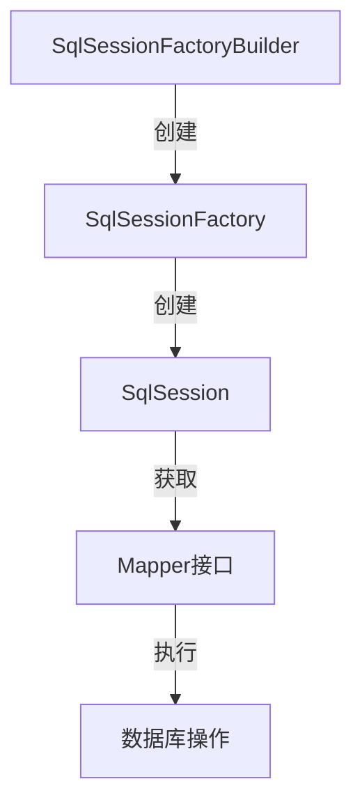

# MyBatis Java API 详解

MyBatis 提供了一套简洁易用的 Java API，用于与数据库交互。本文将详细介绍 MyBatis Java API 的核心组件及其使用方法。

## 目录

- [MyBatis 核心组件](#mybatis-核心组件)
- [SqlSessionFactory](#sqlsessionfactory)
- [SqlSession](#sqlsession)
- [Mapper 接口](#mapper-接口)
- [事务管理](#事务管理)
- [示例代码](#示例代码)
- [注意事项和最佳实践](#注意事项和最佳实践)

## MyBatis 核心组件

MyBatis 的 Java API 主要包含以下核心组件：



- **SqlSessionFactoryBuilder**：用于创建 SqlSessionFactory 实例
- **SqlSessionFactory**：用于创建 SqlSession 实例
- **SqlSession**：提供了执行 SQL 语句的方法，类似于 JDBC 中的 Connection 对象
- **Mapper 接口**：通过动态代理实现与数据库交互的接口

## SqlSessionFactory

SqlSessionFactory 是 MyBatis 的核心接口，它负责创建 SqlSession 实例。一个应用通常只需要一个 SqlSessionFactory 实例，它是线程安全的。

### 创建 SqlSessionFactory

#### 从 XML 配置文件创建

```java
// 创建 SqlSessionFactory
String resource = "mybatis-config.xml";
InputStream inputStream = Resources.getResourceAsStream(resource);
SqlSessionFactory sqlSessionFactory = new SqlSessionFactoryBuilder().build(inputStream);
```

#### 从 Java 代码创建

```java
// 创建 DataSource
DataSource dataSource = new PooledDataSource(
    "com.mysql.cj.jdbc.Driver",
    "jdbc:mysql://localhost:3306/mydb",
    "username",
    "password");

// 创建事务工厂
TransactionFactory transactionFactory = new JdbcTransactionFactory();

// 创建环境配置
Environment environment = new Environment("development", transactionFactory, dataSource);

// 创建 Configuration 对象
Configuration configuration = new Configuration(environment);
configuration.addMapper(UserMapper.class);  // 添加映射器

// 创建 SqlSessionFactory
SqlSessionFactory sqlSessionFactory = new SqlSessionFactoryBuilder().build(configuration);
```

### SqlSessionFactory 常用方法

| 方法                                                   | 描述                                  |
| ------------------------------------------------------ | ------------------------------------- |
| openSession()                                          | 创建默认的 SqlSession                 |
| openSession(boolean autoCommit)                        | 创建指定自动提交行为的 SqlSession     |
| openSession(Connection connection)                     | 创建使用已有连接的 SqlSession         |
| openSession(TransactionIsolationLevel level)           | 创建指定事务隔离级别的 SqlSession     |
| openSession(ExecutorType execType)                     | 创建指定执行器类型的 SqlSession       |
| openSession(ExecutorType execType, boolean autoCommit) | 创建指定执行器和自动提交的 SqlSession |
| getConfiguration()                                     | 获取配置对象                          |

**ExecutorType 类型**:

- **SIMPLE**: 为每个语句创建一个 PreparedStatement（默认）
- **REUSE**: 重用 PreparedStatement
- **BATCH**: 批处理模式，适合批量更新操作

```java
// 创建批处理模式的 SqlSession
SqlSession sqlSession = sqlSessionFactory.openSession(ExecutorType.BATCH);
```

## SqlSession

SqlSession 是 MyBatis 的主要接口，类似于 JDBC 中的 Connection，它提供了执行 SQL 语句、管理事务、获取映射器等方法。

**重要说明**：SqlSession 不是线程安全的，应该在方法作用域内使用，使用完毕后及时关闭。典型的使用模式是：

```java
try (SqlSession sqlSession = sqlSessionFactory.openSession()) {
    // 使用 SqlSession 执行数据库操作
    // ...

    // 提交事务
    sqlSession.commit();
} // 自动关闭 SqlSession
```

### SqlSession 常用方法

| 方法分类         | 常用方法                                                     | 描述                     |
| ---------------- | ------------------------------------------------------------ | ------------------------ |
| **语句执行方法** | selectOne(String statement, Object parameter)                | 查询单个对象             |
|                  | selectList(String statement, Object parameter)               | 查询列表                 |
|                  | selectMap(String statement, Object parameter, String mapKey) | 查询并返回 Map 结果集    |
|                  | select(String statement, ResultHandler handler)              | 使用自定义结果处理器查询 |
|                  | insert(String statement, Object parameter)                   | 插入数据                 |
|                  | update(String statement, Object parameter)                   | 更新数据                 |
|                  | delete(String statement, Object parameter)                   | 删除数据                 |
| **事务控制方法** | commit()                                                     | 提交事务                 |
|                  | commit(boolean force)                                        | 强制提交事务             |
|                  | rollback()                                                   | 回滚事务                 |
|                  | rollback(boolean force)                                      | 强制回滚事务             |
| **Mapper 方法**  | getMapper(Class<T> type)                                     | 获取映射器接口的实现     |
| **管理方法**     | clearCache()                                                 | 清除本地缓存             |
|                  | flushStatements()                                            | 刷新批量语句             |
|                  | close()                                                      | 关闭 SqlSession          |
| **其他方法**     | getConfiguration()                                           | 获取配置对象             |
|                  | getConnection()                                              | 获取 JDBC 连接           |

### 使用 SqlSession 直接操作数据库

```java
try (SqlSession sqlSession = sqlSessionFactory.openSession()) {
    // 查询单个对象
    User user = sqlSession.selectOne("com.example.mapper.UserMapper.getUserById", 1);

    // 查询列表
    List<User> users = sqlSession.selectList("com.example.mapper.UserMapper.getAllUsers");

    // 插入数据
    User newUser = new User("John", "john@example.com");
    sqlSession.insert("com.example.mapper.UserMapper.insertUser", newUser);

    // 更新数据
    User updateUser = new User(1, "John Doe", "johndoe@example.com");
    sqlSession.update("com.example.mapper.UserMapper.updateUser", updateUser);

    // 删除数据
    sqlSession.delete("com.example.mapper.UserMapper.deleteUser", 2);

    // 提交事务
    sqlSession.commit();
}
```

虽然可以直接使用 SqlSession 执行 SQL，但在实际开发中，更推荐使用 Mapper 接口方式操作数据库，因为它更加类型安全。

## Mapper 接口

Mapper 接口是 MyBatis 最推荐的使用方式，它是一个与映射文件相关联的 Java 接口，通过 MyBatis 的动态代理机制实现了该接口。

### 创建 Mapper 接口

```java
public interface UserMapper {
    User getUserById(Integer id);
    List<User> getAllUsers();
    void insertUser(User user);
    void updateUser(User user);
    void deleteUser(Integer id);
}
```

### 关联 XML 映射文件

XML 映射文件的 namespace 必须与 Mapper 接口的全限定名一致：

```xml
<?xml version="1.0" encoding="UTF-8" ?>
<!DOCTYPE mapper
  PUBLIC "-//mybatis.org//DTD Mapper 3.0//EN"
  "http://mybatis.org/dtd/mybatis-3-mapper.dtd">
<mapper namespace="com.example.mapper.UserMapper">
  <select id="getUserById" parameterType="int" resultType="User">
    SELECT * FROM users WHERE id = #{id}
  </select>

  <select id="getAllUsers" resultType="User">
    SELECT * FROM users
  </select>

  <insert id="insertUser" parameterType="User">
    INSERT INTO users (name, email) VALUES (#{name}, #{email})
  </insert>

  <update id="updateUser" parameterType="User">
    UPDATE users SET name = #{name}, email = #{email} WHERE id = #{id}
  </update>

  <delete id="deleteUser" parameterType="int">
    DELETE FROM users WHERE id = #{id}
  </delete>
</mapper>
```

### 注册 Mapper

#### 在 XML 配置文件中注册

```xml
<mappers>
  <mapper resource="com/example/mapper/UserMapper.xml"/>

  <!-- 或者使用类路径 -->
  <mapper class="com.example.mapper.UserMapper"/>

  <!-- 或者扫描包 -->
  <package name="com.example.mapper"/>
</mappers>
```

#### 在 Java 代码中注册

```java
Configuration configuration = new Configuration(environment);
configuration.addMapper(UserMapper.class);
```

### 使用 Mapper 接口

```java
try (SqlSession sqlSession = sqlSessionFactory.openSession()) {
    // 获取 Mapper 接口
    UserMapper userMapper = sqlSession.getMapper(UserMapper.class);

    // 查询单个对象
    User user = userMapper.getUserById(1);
    System.out.println("User: " + user.getName());

    // 查询列表
    List<User> users = userMapper.getAllUsers();
    for (User u : users) {
        System.out.println("User: " + u.getName());
    }

    // 插入数据
    User newUser = new User("John", "john@example.com");
    userMapper.insertUser(newUser);

    // 更新数据
    User updateUser = new User(1, "John Doe", "johndoe@example.com");
    userMapper.updateUser(updateUser);

    // 删除数据
    userMapper.deleteUser(2);

    // 提交事务
    sqlSession.commit();
}
```

## 事务管理

MyBatis 支持两种类型的事务管理器：

- **JDBC**：直接使用 JDBC 的事务管理功能，依赖于数据源获取的连接来管理事务
- **MANAGED**：将事务管理委托给容器（如 Spring 或 JEE 应用服务器）

### 手动事务管理

```java
SqlSession sqlSession = sqlSessionFactory.openSession(false); // autoCommit = false
try {
    UserMapper userMapper = sqlSession.getMapper(UserMapper.class);

    // 执行数据库操作
    User user = new User("John", "john@example.com");
    userMapper.insertUser(user);

    // 提交事务
    sqlSession.commit();
} catch (Exception e) {
    // 回滚事务
    sqlSession.rollback();
    throw e;
} finally {
    // 关闭 SqlSession
    sqlSession.close();
}
```

### 自动提交事务

```java
SqlSession sqlSession = sqlSessionFactory.openSession(true); // autoCommit = true
try {
    UserMapper userMapper = sqlSession.getMapper(UserMapper.class);

    // 执行数据库操作，自动提交
    User user = new User("John", "john@example.com");
    userMapper.insertUser(user);
} finally {
    // 关闭 SqlSession
    sqlSession.close();
}
```

### 批量操作

```java
SqlSession sqlSession = sqlSessionFactory.openSession(ExecutorType.BATCH, false);
try {
    UserMapper userMapper = sqlSession.getMapper(UserMapper.class);

    // 批量插入
    for (int i = 0; i < 100; i++) {
        User user = new User("User" + i, "user" + i + "@example.com");
        userMapper.insertUser(user);
    }

    // 提交事务和批处理
    sqlSession.commit();
} catch (Exception e) {
    sqlSession.rollback();
    throw e;
} finally {
    sqlSession.close();
}
```

## 示例代码

### 完整示例：基本 CRUD 操作

#### User.java

```java
public class User {
    private Integer id;
    private String name;
    private String email;

    // 构造函数、getter 和 setter
    public User() {
    }

    public User(String name, String email) {
        this.name = name;
        this.email = email;
    }

    public User(Integer id, String name, String email) {
        this.id = id;
        this.name = name;
        this.email = email;
    }

    // getter 和 setter 方法
    // ...

    @Override
    public String toString() {
        return "User{id=" + id + ", name='" + name + "', email='" + email + "'}";
    }
}
```

#### UserMapper.java

```java
public interface UserMapper {
    User getUserById(Integer id);
    List<User> getAllUsers();
    void insertUser(User user);
    int updateUser(User user);
    int deleteUser(Integer id);

    // 动态查询
    List<User> findUsersByCondition(User condition);

    // 批量操作
    void batchInsert(List<User> users);
}
```

#### UserMapper.xml

```xml
<?xml version="1.0" encoding="UTF-8" ?>
<!DOCTYPE mapper
  PUBLIC "-//mybatis.org//DTD Mapper 3.0//EN"
  "http://mybatis.org/dtd/mybatis-3-mapper.dtd">
<mapper namespace="com.example.mapper.UserMapper">
  <select id="getUserById" parameterType="int" resultType="User">
    SELECT id, name, email FROM users WHERE id = #{id}
  </select>

  <select id="getAllUsers" resultType="User">
    SELECT id, name, email FROM users
  </select>

  <insert id="insertUser" parameterType="User" useGeneratedKeys="true" keyProperty="id">
    INSERT INTO users (name, email) VALUES (#{name}, #{email})
  </insert>

  <update id="updateUser" parameterType="User">
    UPDATE users SET name = #{name}, email = #{email} WHERE id = #{id}
  </update>

  <delete id="deleteUser" parameterType="int">
    DELETE FROM users WHERE id = #{id}
  </delete>

  <select id="findUsersByCondition" parameterType="User" resultType="User">
    SELECT id, name, email FROM users
    <where>
      <if test="id != null">
        id = #{id}
      </if>
      <if test="name != null and name != ''">
        AND name LIKE CONCAT('%', #{name}, '%')
      </if>
      <if test="email != null and email != ''">
        AND email = #{email}
      </if>
    </where>
  </select>

  <insert id="batchInsert" parameterType="list">
    INSERT INTO users (name, email) VALUES
    <foreach collection="list" item="user" separator=",">
      (#{user.name}, #{user.email})
    </foreach>
  </insert>
</mapper>
```

#### mybatis-config.xml

```xml
<?xml version="1.0" encoding="UTF-8" ?>
<!DOCTYPE configuration
  PUBLIC "-//mybatis.org//DTD Config 3.0//EN"
  "http://mybatis.org/dtd/mybatis-3-config.dtd">
<configuration>
  <properties resource="database.properties"/>

  <settings>
    <setting name="cacheEnabled" value="true"/>
    <setting name="lazyLoadingEnabled" value="true"/>
    <setting name="aggressiveLazyLoading" value="false"/>
    <setting name="mapUnderscoreToCamelCase" value="true"/>
  </settings>

  <typeAliases>
    <typeAlias type="com.example.model.User" alias="User"/>
  </typeAliases>

  <environments default="development">
    <environment id="development">
      <transactionManager type="JDBC"/>
      <dataSource type="POOLED">
        <property name="driver" value="${jdbc.driver}"/>
        <property name="url" value="${jdbc.url}"/>
        <property name="username" value="${jdbc.username}"/>
        <property name="password" value="${jdbc.password}"/>
      </dataSource>
    </environment>
  </environments>

  <mappers>
    <mapper resource="com/example/mapper/UserMapper.xml"/>
  </mappers>
</configuration>
```

#### database.properties

```properties
jdbc.driver=com.mysql.cj.jdbc.Driver
jdbc.url=jdbc:mysql://localhost:3306/mydb?useSSL=false&serverTimezone=UTC
jdbc.username=root
jdbc.password=password
```

#### UserService.java

```java
public class UserService {
    private static SqlSessionFactory sqlSessionFactory;

    static {
        try {
            String resource = "mybatis-config.xml";
            InputStream inputStream = Resources.getResourceAsStream(resource);
            sqlSessionFactory = new SqlSessionFactoryBuilder().build(inputStream);
        } catch (IOException e) {
            e.printStackTrace();
            throw new RuntimeException("Error initializing SqlSessionFactory: " + e.getMessage());
        }
    }

    public User getUserById(Integer id) {
        try (SqlSession sqlSession = sqlSessionFactory.openSession()) {
            UserMapper userMapper = sqlSession.getMapper(UserMapper.class);
            return userMapper.getUserById(id);
        }
    }

    public List<User> getAllUsers() {
        try (SqlSession sqlSession = sqlSessionFactory.openSession()) {
            UserMapper userMapper = sqlSession.getMapper(UserMapper.class);
            return userMapper.getAllUsers();
        }
    }

    public void createUser(User user) {
        try (SqlSession sqlSession = sqlSessionFactory.openSession()) {
            UserMapper userMapper = sqlSession.getMapper(UserMapper.class);
            userMapper.insertUser(user);
            sqlSession.commit();
        }
    }

    public void updateUser(User user) {
        try (SqlSession sqlSession = sqlSessionFactory.openSession()) {
            UserMapper userMapper = sqlSession.getMapper(UserMapper.class);
            userMapper.updateUser(user);
            sqlSession.commit();
        }
    }

    public void deleteUser(Integer id) {
        try (SqlSession sqlSession = sqlSessionFactory.openSession()) {
            UserMapper userMapper = sqlSession.getMapper(UserMapper.class);
            userMapper.deleteUser(id);
            sqlSession.commit();
        }
    }

    public List<User> findUsersByCondition(User condition) {
        try (SqlSession sqlSession = sqlSessionFactory.openSession()) {
            UserMapper userMapper = sqlSession.getMapper(UserMapper.class);
            return userMapper.findUsersByCondition(condition);
        }
    }

    public void batchInsertUsers(List<User> users) {
        try (SqlSession sqlSession = sqlSessionFactory.openSession(ExecutorType.BATCH)) {
            UserMapper userMapper = sqlSession.getMapper(UserMapper.class);
            userMapper.batchInsert(users);
            sqlSession.commit();
        }
    }
}
```

#### Main.java

```java
public class Main {
    public static void main(String[] args) {
        UserService userService = new UserService();

        // 创建用户
        User user1 = new User("Alice", "alice@example.com");
        userService.createUser(user1);
        System.out.println("Created user: " + user1);

        // 查询用户
        User retrievedUser = userService.getUserById(user1.getId());
        System.out.println("Retrieved user: " + retrievedUser);

        // 更新用户
        retrievedUser.setEmail("alice.new@example.com");
        userService.updateUser(retrievedUser);
        System.out.println("Updated user: " + userService.getUserById(retrievedUser.getId()));

        // 条件查询
        User condition = new User();
        condition.setName("Alice");
        List<User> users = userService.findUsersByCondition(condition);
        System.out.println("Users found by condition: " + users);

        // 批量插入
        List<User> batchUsers = new ArrayList<>();
        batchUsers.add(new User("Bob", "bob@example.com"));
        batchUsers.add(new User("Charlie", "charlie@example.com"));
        userService.batchInsertUsers(batchUsers);

        // 查询所有用户
        List<User> allUsers = userService.getAllUsers();
        System.out.println("All users: ");
        for (User user : allUsers) {
            System.out.println(user);
        }

        // 删除用户
        userService.deleteUser(user1.getId());
        System.out.println("User deleted. All users: " + userService.getAllUsers());
    }
}
```

## 注意事项和最佳实践

1. **管理 SqlSessionFactory**:

   - SqlSessionFactory 应该是单例的，通常在应用启动时创建，在应用关闭时销毁
   - 可以使用单例模式或依赖注入框架（如 Spring）管理 SqlSessionFactory

2. **合理使用 SqlSession**:

   - SqlSession 不是线程安全的，不应在多个线程间共享
   - 应该在方法作用域内使用 SqlSession，而不是类作用域
   - 确保使用完毕后关闭 SqlSession（最好使用 try-with-resources 语句）

3. **选择合适的执行器类型**:

   - 默认的 SIMPLE 执行器适合大多数场景
   - 对于批量操作，使用 BATCH 执行器可以显著提高性能
   - 对于需要重用 PreparedStatement 的场景，可以使用 REUSE 执行器

4. **使用 Mapper 接口而非直接调用 SqlSession 方法**:

   - Mapper 接口提供了类型安全的操作方式
   - 使代码更加清晰，减少字符串硬编码
   - IDE 可以提供更好的代码补全和重构支持

5. **合理处理事务**:

   - 明确设置 autoCommit 参数（默认为 false）
   - 在必要的时候手动提交或回滚事务
   - 对于复杂的事务管理，考虑使用 Spring 等框架

6. **资源管理**:

   - 总是关闭 SqlSession（使用 try-with-resources 或在 finally 块中关闭）
   - 不要将 ResultSet、Connection 等 JDBC 资源暴露到 DAO 层之外
   - 对于大结果集，考虑使用流式查询或分页查询

7. **性能优化**:

   - 对于频繁执行的查询，确保启用了缓存
   - 对于批量操作，使用批处理模式
   - 确保只查询需要的字段，避免 `SELECT *`
   - 对于复杂应用，考虑使用性能监控工具

8. **与 Spring 集成**:
   - 使用 `MyBatis-Spring` 可以简化 MyBatis 和 Spring 的集成
   - Spring 可以管理事务、数据源和 SqlSessionFactory
   - 可以使用 `@Mapper` 注解和自动扫描功能简化配置

