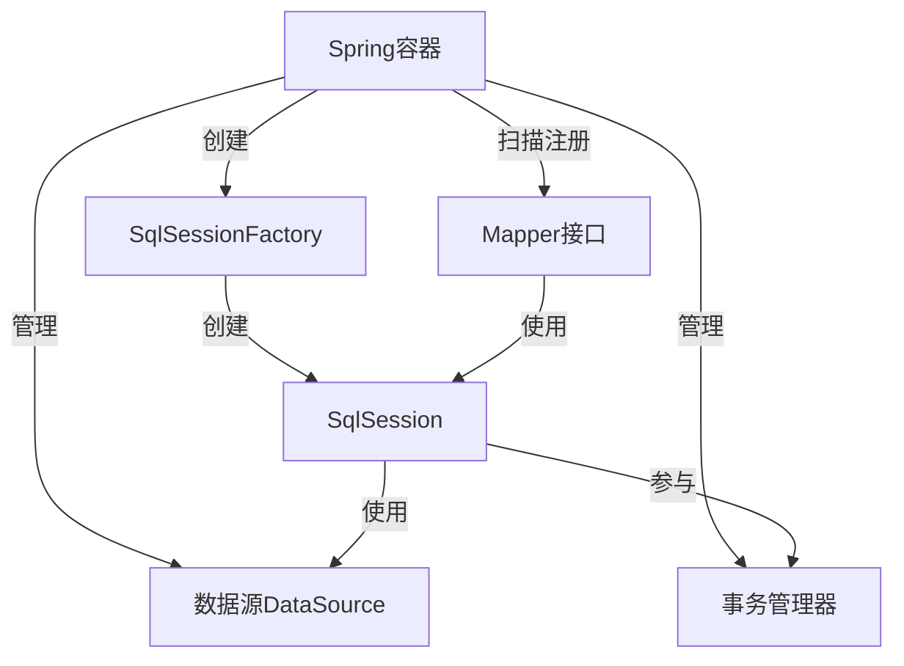

# MyBatis 与 Spring 集成

MyBatis 和 Spring 都是 Java 生态中非常流行的框架，MyBatis 提供了强大的 ORM 功能，而 Spring 则提供了依赖注入、事务管理等特性。将两者结合使用，可以发挥各自的优势，使开发更加高效。本文将详细介绍 MyBatis 与 Spring 的集成方式及其使用示例。

## 目录

- [集成概述](#集成概述)
- [添加依赖](#添加依赖)
- [基础配置](#基础配置)
- [事务管理](#事务管理)
- [Mapper 注入](#mapper-注入)
- [API 使用示例](#api-使用示例)
- [整合测试](#整合测试)
- [最佳实践](#最佳实践)

## 集成概述

MyBatis 与 Spring 集成主要通过 `mybatis-spring` 这个适配器库来实现，它提供了以下核心功能：

1. **SqlSessionFactoryBean**：用于在 Spring 容器中创建 SqlSessionFactory
2. **MapperFactoryBean**：用于在 Spring 容器中注册 Mapper 接口
3. **SqlSessionTemplate**：线程安全的 SqlSession 实现
4. **事务集成**：与 Spring 的事务管理无缝集成
5. **自动扫描**：自动扫描和注册 Mapper 接口



## 添加依赖

在 Maven 项目中添加以下依赖：

```xml
<!-- Spring 核心依赖 -->
<dependency>
    <groupId>org.springframework</groupId>
    <artifactId>spring-context</artifactId>
    <version>5.3.20</version>
</dependency>
<dependency>
    <groupId>org.springframework</groupId>
    <artifactId>spring-jdbc</artifactId>
    <version>5.3.20</version>
</dependency>

<!-- MyBatis 核心依赖 -->
<dependency>
    <groupId>org.mybatis</groupId>
    <artifactId>mybatis</artifactId>
    <version>3.5.10</version>
</dependency>

<!-- MyBatis-Spring 适配器 -->
<dependency>
    <groupId>org.mybatis</groupId>
    <artifactId>mybatis-spring</artifactId>
    <version>2.0.7</version>
</dependency>

<!-- 数据库驱动 -->
<dependency>
    <groupId>mysql</groupId>
    <artifactId>mysql-connector-java</artifactId>
    <version>8.0.29</version>
</dependency>

<!-- 数据源 -->
<dependency>
    <groupId>com.zaxxer</groupId>
    <artifactId>HikariCP</artifactId>
    <version>5.0.1</version>
</dependency>
```

## 基础配置

### XML 配置方式

#### 1. Spring 配置文件 (applicationContext.xml)

```xml
<?xml version="1.0" encoding="UTF-8"?>
<beans xmlns="http://www.springframework.org/schema/beans"
       xmlns:xsi="http://www.w3.org/2001/XMLSchema-instance"
       xmlns:context="http://www.springframework.org/schema/context"
       xmlns:tx="http://www.springframework.org/schema/tx"
       xsi:schemaLocation="http://www.springframework.org/schema/beans
        https://www.springframework.org/schema/beans/spring-beans.xsd
        http://www.springframework.org/schema/context
        https://www.springframework.org/schema/context/spring-context.xsd
        http://www.springframework.org/schema/tx
        https://www.springframework.org/schema/tx/spring-tx.xsd">

    <!-- 加载属性文件 -->
    <context:property-placeholder location="classpath:database.properties"/>

    <!-- 配置数据源 -->
    <bean id="dataSource" class="com.zaxxer.hikari.HikariDataSource" destroy-method="close">
        <property name="driverClassName" value="${jdbc.driver}"/>
        <property name="jdbcUrl" value="${jdbc.url}"/>
        <property name="username" value="${jdbc.username}"/>
        <property name="password" value="${jdbc.password}"/>
        <!-- 连接池配置 -->
        <property name="maximumPoolSize" value="10"/>
        <property name="minimumIdle" value="2"/>
        <property name="connectionTimeout" value="30000"/>
    </bean>

    <!-- 配置事务管理器 -->
    <bean id="transactionManager" class="org.springframework.jdbc.datasource.DataSourceTransactionManager">
        <property name="dataSource" ref="dataSource"/>
    </bean>

    <!-- 开启事务注解 -->
    <tx:annotation-driven transaction-manager="transactionManager"/>

    <!-- 配置 SqlSessionFactory -->
    <bean id="sqlSessionFactory" class="org.mybatis.spring.SqlSessionFactoryBean">
        <property name="dataSource" ref="dataSource"/>
        <!-- MyBatis 配置文件位置 -->
        <property name="configLocation" value="classpath:mybatis-config.xml"/>
        <!-- 映射文件位置 -->
        <property name="mapperLocations" value="classpath:mappers/**/*.xml"/>
        <!-- 类型别名包 -->
        <property name="typeAliasesPackage" value="com.example.entity"/>
    </bean>

    <!-- 配置 SqlSession -->
    <bean id="sqlSession" class="org.mybatis.spring.SqlSessionTemplate">
        <constructor-arg index="0" ref="sqlSessionFactory"/>
    </bean>

    <!-- 扫描 Mapper 接口并自动注入 -->
    <bean class="org.mybatis.spring.mapper.MapperScannerConfigurer">
        <property name="basePackage" value="com.example.mapper"/>
        <property name="sqlSessionFactoryBeanName" value="sqlSessionFactory"/>
    </bean>

    <!-- 扫描服务层 -->
    <context:component-scan base-package="com.example.service"/>
</beans>
```

#### 2. MyBatis 配置文件 (mybatis-config.xml)

```xml
<?xml version="1.0" encoding="UTF-8" ?>
<!DOCTYPE configuration
        PUBLIC "-//mybatis.org//DTD Config 3.0//EN"
        "http://mybatis.org/dtd/mybatis-3-config.dtd">
<configuration>
    <!-- 全局设置 -->
    <settings>
        <setting name="mapUnderscoreToCamelCase" value="true"/>
        <setting name="cacheEnabled" value="true"/>
        <setting name="lazyLoadingEnabled" value="true"/>
        <setting name="aggressiveLazyLoading" value="false"/>
    </settings>

    <!-- 类型处理器 -->
    <typeHandlers>
        <!-- 可添加自定义类型处理器 -->
    </typeHandlers>

    <!-- 插件配置 -->
    <plugins>
        <!-- 可添加插件如分页插件 -->
    </plugins>
</configuration>
```

#### 3. 数据库配置文件 (database.properties)

```properties
jdbc.driver=com.mysql.cj.jdbc.Driver
jdbc.url=jdbc:mysql://localhost:3306/test?serverTimezone=UTC&useSSL=false&characterEncoding=utf8
jdbc.username=root
jdbc.password=password
```

### Java 配置方式

#### 1. 数据源配置

```java
@Configuration
@PropertySource("classpath:database.properties")
public class DataSourceConfig {

    @Autowired
    private Environment env;

    @Bean
    public DataSource dataSource() {
        HikariDataSource dataSource = new HikariDataSource();
        dataSource.setDriverClassName(env.getProperty("jdbc.driver"));
        dataSource.setJdbcUrl(env.getProperty("jdbc.url"));
        dataSource.setUsername(env.getProperty("jdbc.username"));
        dataSource.setPassword(env.getProperty("jdbc.password"));
        dataSource.setMaximumPoolSize(10);
        dataSource.setMinimumIdle(2);
        dataSource.setConnectionTimeout(30000);
        return dataSource;
    }

    @Bean
    public PlatformTransactionManager transactionManager(DataSource dataSource) {
        return new DataSourceTransactionManager(dataSource);
    }
}
```

#### 2. MyBatis 配置

```java
@Configuration
@EnableTransactionManagement
@MapperScan("com.example.mapper")
public class MyBatisConfig {

    @Bean
    public SqlSessionFactory sqlSessionFactory(DataSource dataSource) throws Exception {
        SqlSessionFactoryBean factoryBean = new SqlSessionFactoryBean();
        factoryBean.setDataSource(dataSource);
        factoryBean.setTypeAliasesPackage("com.example.entity");
        factoryBean.setMapperLocations(
                new PathMatchingResourcePatternResolver().getResources("classpath:mappers/**/*.xml")
        );

        // 设置 MyBatis 配置
        org.apache.ibatis.session.Configuration configuration = new org.apache.ibatis.session.Configuration();
        configuration.setMapUnderscoreToCamelCase(true);
        configuration.setCacheEnabled(true);
        configuration.setLazyLoadingEnabled(true);
        configuration.setAggressiveLazyLoading(false);
        factoryBean.setConfiguration(configuration);

        return factoryBean.getObject();
    }

    @Bean
    public SqlSessionTemplate sqlSessionTemplate(SqlSessionFactory sqlSessionFactory) {
        return new SqlSessionTemplate(sqlSessionFactory);
    }
}
```

#### 3. 应用配置

```java
@Configuration
@ComponentScan("com.example.service")
@Import({DataSourceConfig.class, MyBatisConfig.class})
public class AppConfig {
    // 应用配置
}
```

## 事务管理

Spring 提供了强大的事务管理功能，可以与 MyBatis 无缝集成。

### 声明式事务

使用 `@Transactional` 注解配置事务：

```java
@Service
public class UserServiceImpl implements UserService {

    @Autowired
    private UserMapper userMapper;

    @Transactional
    @Override
    public void createUser(User user) {
        userMapper.insert(user);
        // 业务逻辑
    }

    @Transactional(readOnly = true)
    @Override
    public User getUserById(Long id) {
        return userMapper.selectById(id);
    }

    @Transactional(rollbackFor = Exception.class)
    @Override
    public void updateUser(User user) {
        userMapper.update(user);
        // 如果发生任何异常都会回滚
    }

    @Transactional(propagation = Propagation.REQUIRES_NEW)
    @Override
    public void deleteUser(Long id) {
        userMapper.delete(id);
    }
}
```

### 事务传播行为

Spring 提供了多种事务传播行为：

| 传播行为        | 描述                                                     |
| --------------- | -------------------------------------------------------- |
| REQUIRED (默认) | 如果当前存在事务，则加入该事务；否则创建一个新事务       |
| SUPPORTS        | 如果当前存在事务，则加入该事务；否则以非事务方式执行     |
| MANDATORY       | 如果当前存在事务，则加入该事务；否则抛出异常             |
| REQUIRES_NEW    | 创建一个新事务，如果当前存在事务，则挂起当前事务         |
| NOT_SUPPORTED   | 以非事务方式执行，如果当前存在事务，则挂起当前事务       |
| NEVER           | 以非事务方式执行，如果当前存在事务，则抛出异常           |
| NESTED          | 如果当前存在事务，则创建一个嵌套事务；否则创建一个新事务 |

### 事务隔离级别

可以设置事务的隔离级别：

```java
@Transactional(isolation = Isolation.READ_COMMITTED)
public void updateUserWithIsolation(User user) {
    userMapper.update(user);
}
```

Spring 支持的隔离级别：

| 隔离级别         | 描述                                     |
| ---------------- | ---------------------------------------- |
| DEFAULT          | 使用数据库默认的隔离级别                 |
| READ_UNCOMMITTED | 读未提交，可能出现脏读、不可重复读、幻读 |
| READ_COMMITTED   | 读已提交，可能出现不可重复读、幻读       |
| REPEATABLE_READ  | 可重复读，可能出现幻读                   |
| SERIALIZABLE     | 串行化，最高隔离级别，性能最低           |

## Mapper 注入

MyBatis-Spring 提供了多种方式将 Mapper 注入到 Spring 容器中。

### 方式一：XML 配置 MapperScannerConfigurer

```xml
<bean class="org.mybatis.spring.mapper.MapperScannerConfigurer">
    <property name="basePackage" value="com.example.mapper"/>
</bean>
```

### 方式二：使用 @MapperScan 注解

```java
@Configuration
@MapperScan("com.example.mapper")
public class MyBatisConfig {
    // 配置
}
```

### 方式三：单独配置 MapperFactoryBean

```xml
<bean id="userMapper" class="org.mybatis.spring.mapper.MapperFactoryBean">
    <property name="mapperInterface" value="com.example.mapper.UserMapper"/>
    <property name="sqlSessionFactory" ref="sqlSessionFactory"/>
</bean>
```

### 使用 @Mapper 注解

在 Mapper 接口上添加 `@Mapper` 注解：

```java
@Mapper
public interface UserMapper {
    // 方法定义
}
```

然后配置组件扫描：

```java
@Configuration
@ComponentScan("com.example")
public class AppConfig {
    // 配置
}
```

## API 使用示例

### 实体类

```java
@Data
public class User {
    private Long id;
    private String username;
    private String email;
    private Date createTime;
    private Date updateTime;
}
```

### Mapper 接口

```java
@Mapper
public interface UserMapper {
    @Insert("INSERT INTO users(username, email, create_time) VALUES(#{username}, #{email}, #{createTime})")
    @Options(useGeneratedKeys = true, keyProperty = "id")
    int insert(User user);

    @Select("SELECT * FROM users WHERE id = #{id}")
    User selectById(Long id);

    @Select("SELECT * FROM users WHERE username LIKE CONCAT('%', #{username}, '%')")
    List<User> selectByUsername(String username);

    @Update("UPDATE users SET username = #{username}, email = #{email}, update_time = #{updateTime} WHERE id = #{id}")
    int update(User user);

    @Delete("DELETE FROM users WHERE id = #{id}")
    int delete(Long id);
}
```

### Service 层

```java
public interface UserService {
    void createUser(User user);
    User getUserById(Long id);
    List<User> getUsersByUsername(String username);
    void updateUser(User user);
    void deleteUser(Long id);
}

@Service
public class UserServiceImpl implements UserService {

    @Autowired
    private UserMapper userMapper;

    @Transactional
    @Override
    public void createUser(User user) {
        user.setCreateTime(new Date());
        userMapper.insert(user);
    }

    @Override
    public User getUserById(Long id) {
        return userMapper.selectById(id);
    }

    @Override
    public List<User> getUsersByUsername(String username) {
        return userMapper.selectByUsername(username);
    }

    @Transactional
    @Override
    public void updateUser(User user) {
        user.setUpdateTime(new Date());
        userMapper.update(user);
    }

    @Transactional
    @Override
    public void deleteUser(Long id) {
        userMapper.delete(id);
    }
}
```

### Controller 示例

```java
@RestController
@RequestMapping("/users")
public class UserController {

    @Autowired
    private UserService userService;

    @PostMapping
    public ResponseEntity<User> createUser(@RequestBody User user) {
        userService.createUser(user);
        return ResponseEntity.ok(user);
    }

    @GetMapping("/{id}")
    public ResponseEntity<User> getUser(@PathVariable Long id) {
        User user = userService.getUserById(id);
        return ResponseEntity.ok(user);
    }

    @GetMapping
    public ResponseEntity<List<User>> getUsersByUsername(@RequestParam String username) {
        List<User> users = userService.getUsersByUsername(username);
        return ResponseEntity.ok(users);
    }

    @PutMapping("/{id}")
    public ResponseEntity<Void> updateUser(@PathVariable Long id, @RequestBody User user) {
        user.setId(id);
        userService.updateUser(user);
        return ResponseEntity.ok().build();
    }

    @DeleteMapping("/{id}")
    public ResponseEntity<Void> deleteUser(@PathVariable Long id) {
        userService.deleteUser(id);
        return ResponseEntity.ok().build();
    }
}
```

## 整合测试

### 测试配置

```java
@RunWith(SpringRunner.class)
@ContextConfiguration(classes = {AppConfig.class})
public class UserServiceTest {

    @Autowired
    private UserService userService;

    @Test
    public void testCreateAndGetUser() {
        // 创建用户
        User user = new User();
        user.setUsername("testuser");
        user.setEmail("test@example.com");
        userService.createUser(user);

        // 验证创建成功
        assertNotNull(user.getId());

        // 获取用户
        User foundUser = userService.getUserById(user.getId());
        assertNotNull(foundUser);
        assertEquals("testuser", foundUser.getUsername());
        assertEquals("test@example.com", foundUser.getEmail());
    }

    @Test
    public void testUpdateUser() {
        // 创建用户
        User user = new User();
        user.setUsername("userToUpdate");
        user.setEmail("update@example.com");
        userService.createUser(user);

        // 更新用户
        user.setUsername("updatedUser");
        user.setEmail("updated@example.com");
        userService.updateUser(user);

        // 验证更新成功
        User updatedUser = userService.getUserById(user.getId());
        assertEquals("updatedUser", updatedUser.getUsername());
        assertEquals("updated@example.com", updatedUser.getEmail());
    }

    @Test
    public void testDeleteUser() {
        // 创建用户
        User user = new User();
        user.setUsername("userToDelete");
        user.setEmail("delete@example.com");
        userService.createUser(user);

        // 删除用户
        userService.deleteUser(user.getId());

        // An exception should be thrown
        try {
            userService.getUserById(user.getId());
            fail("User should have been deleted");
        } catch (Exception e) {
            // Expected
        }
    }
}
```

## 最佳实践

### 1. 使用 Java 配置代替 XML 配置

Java 配置比 XML 配置更加类型安全，也更容易调试：

```java
@Configuration
@EnableTransactionManagement
@MapperScan("com.example.mapper")
public class MyBatisConfig {
    // 配置代码
}
```

### 2. 合理使用注解和 XML 映射

- 对于简单的 CRUD 操作，使用注解可以减少配置文件：

```java
@Select("SELECT * FROM users WHERE id = #{id}")
User selectById(Long id);
```

- 对于复杂的查询，使用 XML 映射更清晰：

```java
// 接口方法
List<User> selectActiveUsersWithOrders(Date fromDate);
```

```xml
<!-- XML 映射 -->
<select id="selectActiveUsersWithOrders" resultMap="userWithOrdersMap">
    SELECT u.*, o.*
    FROM users u
    LEFT JOIN orders o ON u.id = o.user_id
    WHERE u.status = 'ACTIVE'
    AND o.order_date >= #{fromDate}
</select>
```

### 3. 合理规划包结构

推荐的包结构：

```
com.example
├── config         # 配置类
├── controller     # 控制器
├── entity         # 实体类
├── mapper         # Mapper 接口
├── service        # 服务接口
│   └── impl       # 服务实现
└── util           # 工具类
```

### 4. 使用 SqlSessionTemplate 而不是直接使用 SqlSession

`SqlSessionTemplate` 是线程安全的，并且与 Spring 事务集成：

```java
@Autowired
private SqlSessionTemplate sqlSessionTemplate;

public User findById(Long id) {
    return sqlSessionTemplate.selectOne("com.example.mapper.UserMapper.selectById", id);
}
```

### 5. 利用事务特性处理复杂业务

```java
@Transactional
public void complexBusiness(OrderDTO orderDTO) {
    // 1. 创建订单
    Order order = convertToOrder(orderDTO);
    orderMapper.insert(order);

    // 2. 减少库存
    for (OrderItem item : order.getItems()) {
        int affected = stockMapper.decreaseStock(item.getProductId(), item.getQuantity());
        if (affected == 0) {
            throw new OutOfStockException("Product is out of stock");
        }
    }

    // 3. 赠送积分
    userMapper.increasePoints(order.getUserId(), calculatePoints(order));

    // 如果任何操作失败，Spring 会自动回滚事务
}
```

### 6. 使用分页插件处理大量数据

集成 PageHelper 分页插件：

```java
@Configuration
public class PageHelperConfig {

    @Bean
    public PageInterceptor pageInterceptor() {
        PageInterceptor pageInterceptor = new PageInterceptor();
        Properties properties = new Properties();
        properties.setProperty("reasonable", "true");
        properties.setProperty("supportMethodsArguments", "true");
        pageInterceptor.setProperties(properties);
        return pageInterceptor;
    }
}
```

使用分页：

```java
// 设置分页参数
PageHelper.startPage(pageNum, pageSize);

// 查询结果会自动分页
List<User> users = userMapper.selectByUsername(username);

// 获取分页信息
PageInfo<User> pageInfo = new PageInfo<>(users);
```

### 7. 使用 MyBatis 二级缓存与 Spring 集成

在 Mapper 接口上添加 `@CacheNamespace` 注解：

```java
@CacheNamespace(implementation = PerpetualCache.class)
public interface UserMapper {
    // 方法定义
}
```

或在 XML 中配置：

```xml
<mapper namespace="com.example.mapper.UserMapper">
    <cache/>
    <!-- 映射语句 -->
</mapper>
```

### 8. 使用懒加载提高性能

在 MyBatis 配置中启用懒加载：

```java
@Bean
public SqlSessionFactory sqlSessionFactory(DataSource dataSource) throws Exception {
    SqlSessionFactoryBean factoryBean = new SqlSessionFactoryBean();
    // ... 其他配置

    org.apache.ibatis.session.Configuration configuration = new org.apache.ibatis.session.Configuration();
    configuration.setLazyLoadingEnabled(true);
    configuration.setAggressiveLazyLoading(false);
    factoryBean.setConfiguration(configuration);

    return factoryBean.getObject();
}
```

## 小结

MyBatis 与 Spring 的集成通过 `mybatis-spring` 适配器库实现，它提供了无缝集成的能力，使开发者能够轻松地在 Spring 项目中使用 MyBatis 进行数据访问。

通过集成 Spring，可以获得以下好处：

1. **依赖注入**：方便地注入 Mapper 接口
2. **事务管理**：使用 Spring 的声明式事务管理
3. **集成测试**：使用 Spring 的测试框架进行整合测试
4. **SpringBoot 支持**：可以进一步简化配置

在实际开发中，根据项目规模和复杂度，可以选择适合的配置方式和开发策略，使两个框架能够更好地协同工作，发挥各自的优势。

