# MyBatis 插件系统详解

MyBatis 提供了强大的插件系统，允许开发者在不修改核心代码的情况下扩展和定制 MyBatis 的行为。本文将详细介绍 MyBatis 插件系统的原理、使用方法以及常见插件，帮助开发者更好地利用这一功能增强系统的功能。

## 目录

- [什么是插件系统](#什么是插件系统)
- [为什么需要插件系统](#为什么需要插件系统)
- [MyBatis 插件系统工作原理](#mybatis-插件系统工作原理)
- [可拦截的接口](#可拦截的接口)
- [常见的 MyBatis 插件](#常见的-mybatis-插件)
- [自定义 MyBatis 插件](#自定义-mybatis-插件)
- [插件开发最佳实践](#插件开发最佳实践)
- [小结](#小结)

## 什么是插件系统

插件系统（Plugin System）是一种软件架构模式，允许应用程序通过外部组件（插件）扩展其功能，而无需修改核心代码。它通过定义清晰的扩展点和插件接口，实现了系统的高度可扩展性和模块化。

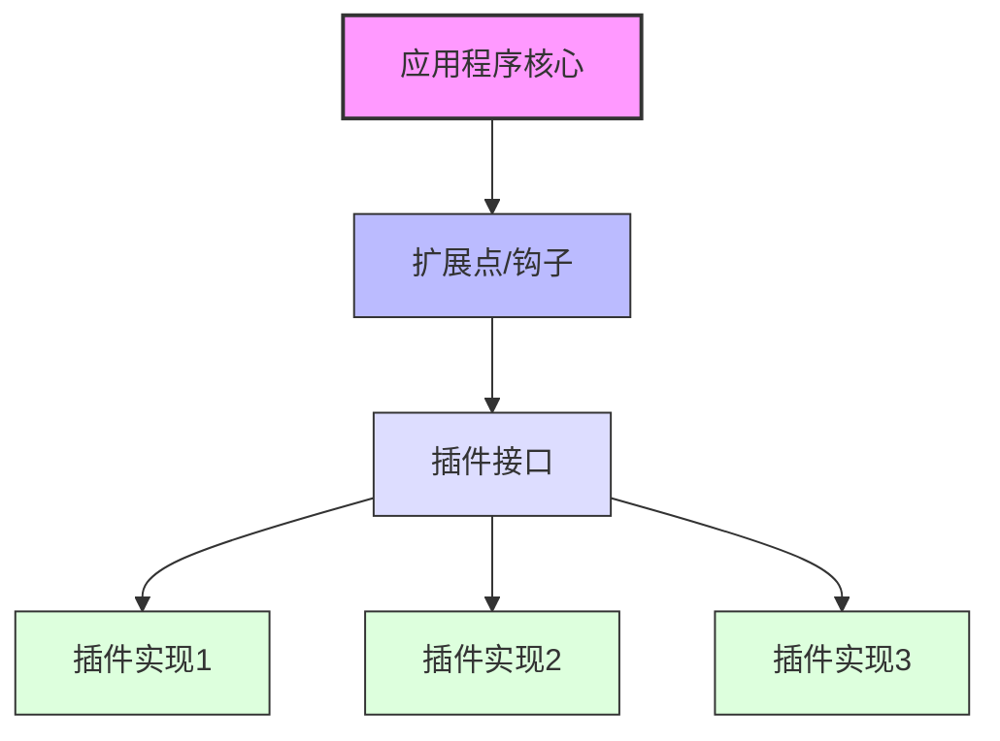

在 MyBatis 中，插件系统是基于拦截器（Interceptor）模式实现的，允许开发者拦截 MyBatis 执行过程中的某些关键方法，进行额外的处理或修改默认行为。

## 为什么需要插件系统

插件系统的存在有多方面的价值和意义：

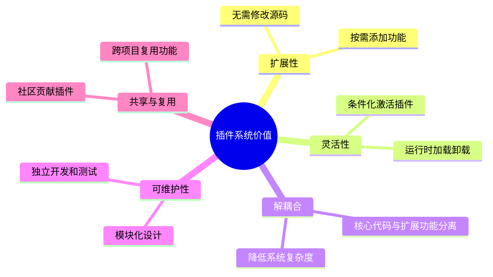

对于 MyBatis 来说，插件系统特别重要，因为：

1. **需求多样化**：不同项目对数据访问层有不同的需求，如分页、审计、性能监控等
2. **数据库差异化**：不同数据库产品有特定功能，需要定制适配
3. **横切关注点**：某些功能（如日志、性能统计）需要应用于多个操作，插件可以统一处理
4. **与第三方系统集成**：如安全框架、监控系统等

## MyBatis 插件系统工作原理

MyBatis 的插件系统基于动态代理和责任链模式实现，其工作原理如下：

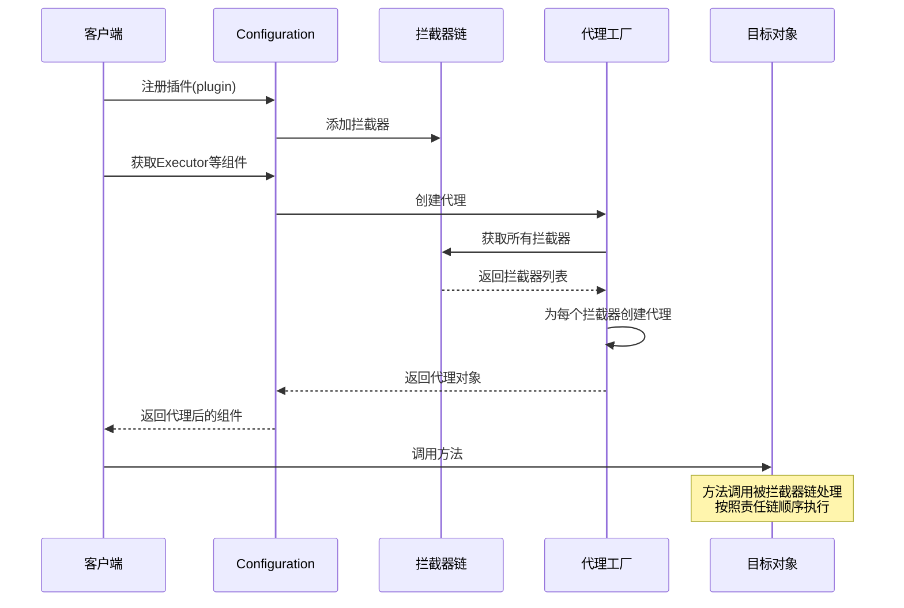

核心步骤：

1. 在 MyBatis 配置文件中注册插件
2. MyBatis 启动时，`Configuration` 对象将插件添加到拦截器链中
3. 当创建关键对象（如 `Executor`）时，MyBatis 会使用动态代理包装这些对象
4. 每个拦截器都可以决定是否拦截特定方法调用（基于注解声明）
5. 当方法被调用时，请求会先经过拦截器链，然后才到达实际的目标对象

### 责任链的实现

在 MyBatis 中，多个插件的执行采用责任链模式，其结构如下：

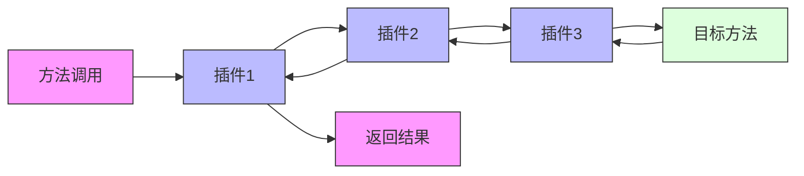

这种结构允许：

- 多个插件按顺序处理同一请求
- 每个插件可以在目标方法执行前后添加行为
- 插件可以修改输入参数和返回结果
- 插件可以决定是否继续调用链中的下一个处理器

## 可拦截的接口

MyBatis 允许拦截的接口和方法有限，主要包括以下四个接口：

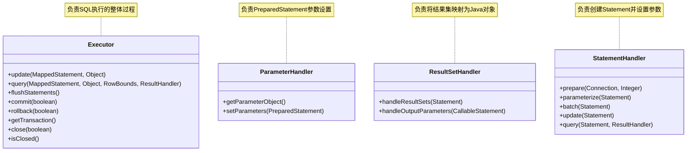

这四个接口在 MyBatis 执行流程中的位置：

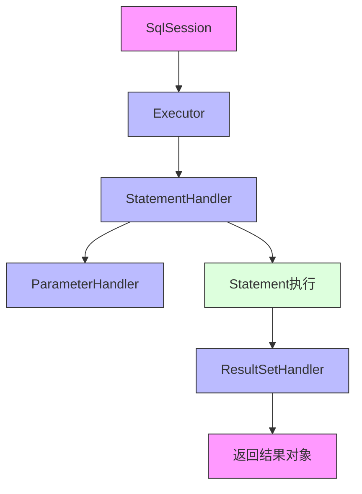

通过拦截这些接口的方法，可以实现各种功能：

1. **Executor**：可以拦截整体的 SQL 执行，适合实现全局缓存、事务管理等
2. **StatementHandler**：可以拦截 SQL 语句的处理，适合实现 SQL 重写、分页等
3. **ParameterHandler**：可以拦截参数处理，适合实现参数加密、类型转换等
4. **ResultSetHandler**：可以拦截结果集处理，适合实现结果过滤、敏感数据脱敏等

## 常见的 MyBatis 插件

MyBatis 生态中有许多优秀的插件，解决了各种常见需求：

### 1. 分页插件

最常用的 MyBatis 插件之一，如 PageHelper 和 MyBatis-Plus 的分页插件。

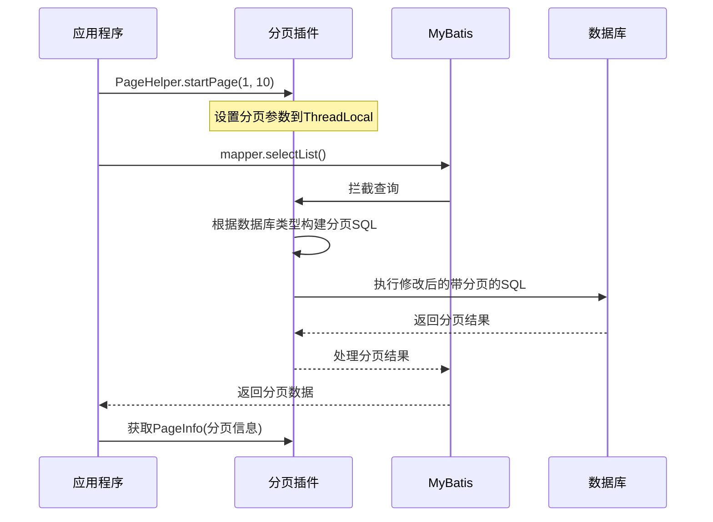

### 2. SQL 性能监控插件

如 p6spy、Druid 监控插件等，用于监控 SQL 执行情况和性能。

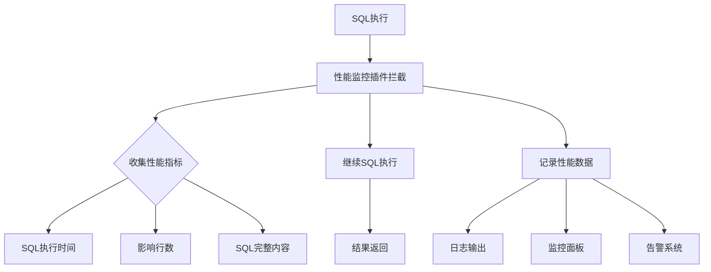

### 3. 动态数据源插件

实现多数据源切换、读写分离等功能的插件。

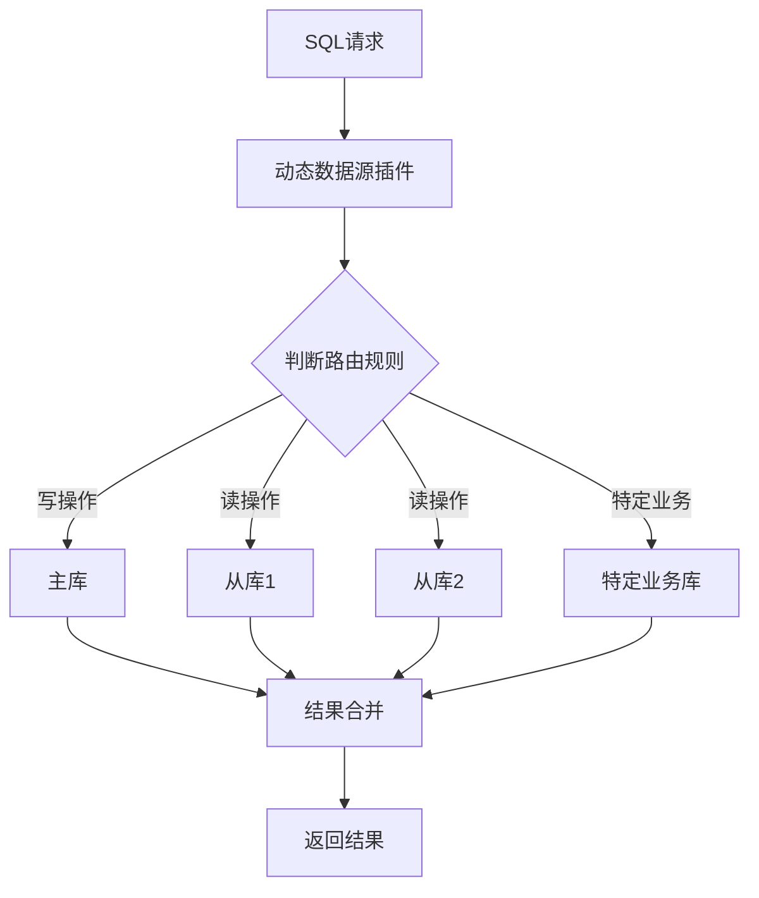

### 4. 数据加密插件

对敏感字段进行自动加解密的插件。

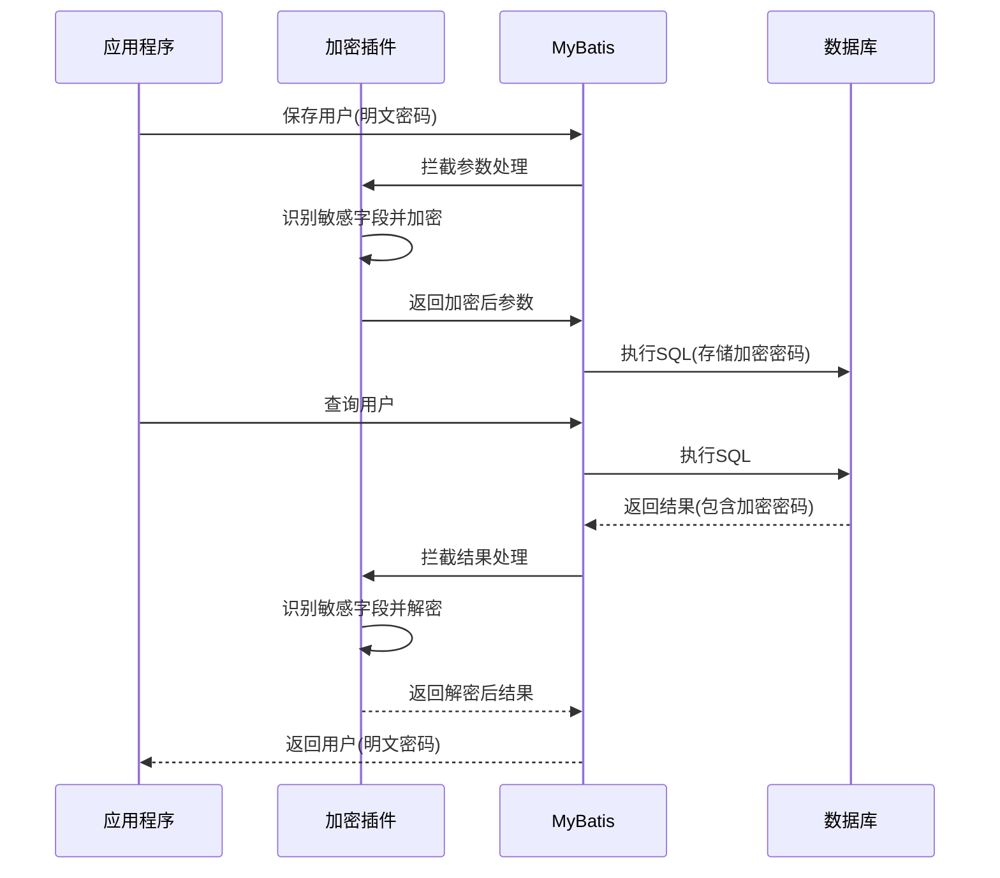

### 5. 乐观锁插件

自动为更新操作添加版本控制的插件，如 MyBatis-Plus 的乐观锁插件。

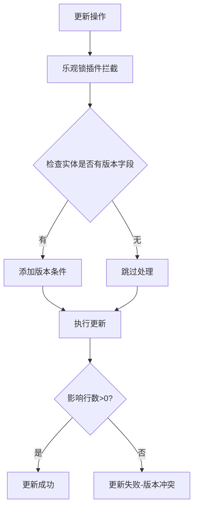

### 6. 多租户插件

自动为 SQL 添加租户条件的插件，用于实现多租户数据隔离。

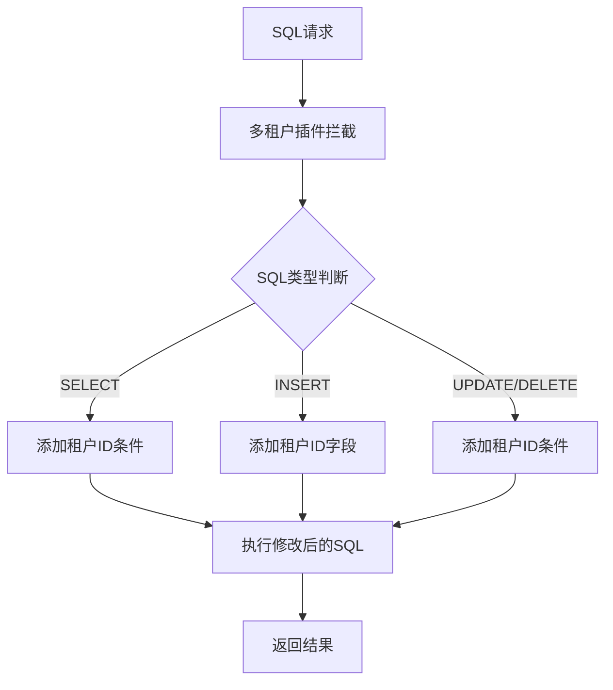

## 自定义 MyBatis 插件

### 基本步骤

创建 MyBatis 插件的基本步骤如下：

1. 实现 `org.apache.ibatis.plugin.Interceptor` 接口
2. 使用 `@Intercepts` 和 `@Signature` 注解标识要拦截的方法
3. 在 `intercept` 方法中实现拦截逻辑
4. 在 MyBatis 配置中注册插件

### 插件实现示例

以下是一个简单的 SQL 日志插件示例：

```java
/**
 * 自定义SQL执行日志插件
 * 拦截StatementHandler的query和update方法，记录SQL执行时间
 */
@Intercepts({
    @Signature(
        type = StatementHandler.class,
        method = "query",
        args = {Statement.class, ResultHandler.class}
    ),
    @Signature(
        type = StatementHandler.class,
        method = "update",
        args = {Statement.class}
    )
})
public class SqlLogInterceptor implements Interceptor {

    private static final Logger logger = LoggerFactory.getLogger(SqlLogInterceptor.class);

    @Override
    public Object intercept(Invocation invocation) throws Throwable {
        // 获取被拦截的目标对象
        StatementHandler statementHandler = (StatementHandler) invocation.getTarget();

        // 获取SQL信息
        BoundSql boundSql = statementHandler.getBoundSql();
        String sql = boundSql.getSql();
        Object parameterObject = boundSql.getParameterObject();

        // 记录开始时间
        long startTime = System.currentTimeMillis();

        // 执行原方法
        Object result = null;
        try {
            result = invocation.proceed();
            return result;
        } finally {
            // 计算执行时间
            long endTime = System.currentTimeMillis();
            long time = endTime - startTime;

            // 记录日志
            logger.info("SQL执行时间: {} ms, SQL: {}, 参数: {}, 结果: {}",
                        time, sql, parameterObject,
                        (result instanceof List) ? ((List)result).size() + "条记录" : result);
        }
    }

    @Override
    public Object plugin(Object target) {
        // 使用Plugin.wrap方法创建代理对象
        return Plugin.wrap(target, this);
    }

    @Override
    public void setProperties(Properties properties) {
        // 读取插件配置的属性
    }
}
```

### 插件注册

在 MyBatis 配置文件中注册插件：

```xml
<plugins>
  <plugin interceptor="com.example.mybatis.plugin.SqlLogInterceptor">
    <property name="someProperty" value="100"/>
  </plugin>
</plugins>
```

或在 Spring 配置中注册：

```java
@Configuration
public class MyBatisConfig {

    @Bean
    public SqlLogInterceptor sqlLogInterceptor() {
        SqlLogInterceptor interceptor = new SqlLogInterceptor();
        Properties properties = new Properties();
        properties.setProperty("someProperty", "100");
        interceptor.setProperties(properties);
        return interceptor;
    }
}
```

## 插件开发最佳实践

开发高质量的 MyBatis 插件，应遵循以下最佳实践：

### 1. 设计原则

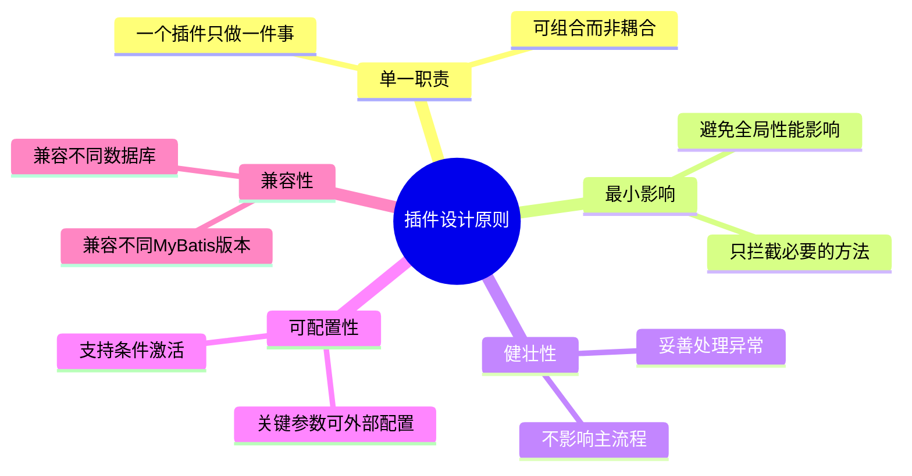

### 2. 性能考虑

- **精确拦截**：只拦截需要的方法，而不是所有方法
- **轻量处理**：插件逻辑应尽量轻量，避免耗时操作
- **缓存结果**：对频繁使用的数据进行缓存
- **条件执行**：根据条件判断是否执行插件逻辑
- **资源释放**：确保释放占用的资源，避免泄漏

### 3. 线程安全

- 插件可能在多线程环境中执行，必须确保线程安全
- 避免使用可变的实例变量，或使用 ThreadLocal
- 注意并发修改的情况，必要时使用同步机制

### 4. 调试与日志

- 添加适当的日志，方便调试和问题排查
- 考虑添加开关，可以在生产环境中控制日志级别
- 记录必要信息，但避免记录敏感数据

### 5. 异常处理

- 妥善处理异常，避免影响正常业务流程
- 区分可恢复异常和不可恢复异常
- 提供有意义的异常信息，便于问题定位

### 6. 测试策略

- 编写单元测试验证插件功能
- 进行集成测试验证与 MyBatis 的兼容性
- 进行性能测试，确保插件不会引入性能问题
- 测试各种边界条件和异常情况

## 真实世界插件示例

### 1. 自动填充字段插件

自动为实体对象填充创建时间、更新时间等字段：

```java
/**
 * 自动填充字段插件
 * 在插入和更新操作前自动填充创建时间、更新时间等字段
 */
@Intercepts({
    @Signature(
        type = Executor.class,
        method = "update",
        args = {MappedStatement.class, Object.class}
    )
})
public class AutoFillFieldInterceptor implements Interceptor {

    @Override
    public Object intercept(Invocation invocation) throws Throwable {
        Object parameter = invocation.getArgs()[1];
        MappedStatement ms = (MappedStatement) invocation.getArgs()[0];

        // 判断操作类型
        SqlCommandType sqlCommandType = ms.getSqlCommandType();

        // 如果是实体对象
        if (parameter instanceof BaseEntity) {
            BaseEntity entity = (BaseEntity) parameter;
            Date now = new Date();

            if (SqlCommandType.INSERT == sqlCommandType) {
                // 插入操作，设置创建时间和更新时间
                if (entity.getCreateTime() == null) {
                    entity.setCreateTime(now);
                }
                if (entity.getUpdateTime() == null) {
                    entity.setUpdateTime(now);
                }
            } else if (SqlCommandType.UPDATE == sqlCommandType) {
                // 更新操作，设置更新时间
                entity.setUpdateTime(now);
            }
        }

        return invocation.proceed();
    }

    @Override
    public Object plugin(Object target) {
        return Plugin.wrap(target, this);
    }

    @Override
    public void setProperties(Properties properties) {
    }
}
```

### 2. 自定义分页插件

一个简单的通用分页插件实现：

```java
/**
 * 自定义分页插件
 * 拦截Executor的query方法，实现物理分页
 */
@Intercepts({
    @Signature(
        type = Executor.class,
        method = "query",
        args = {MappedStatement.class, Object.class, RowBounds.class, ResultHandler.class}
    )
})
public class PaginationInterceptor implements Interceptor {

    private String databaseType;  // 数据库类型

    @Override
    public Object intercept(Invocation invocation) throws Throwable {
        Object[] args = invocation.getArgs();
        MappedStatement ms = (MappedStatement) args[0];
        Object parameter = args[1];
        RowBounds rowBounds = (RowBounds) args[2];

        // 如果是默认RowBounds，不进行分页处理
        if (rowBounds == null || rowBounds == RowBounds.DEFAULT) {
            return invocation.proceed();
        }

        // 获取原始SQL
        BoundSql boundSql = ms.getBoundSql(parameter);
        String originalSql = boundSql.getSql().trim();

        // 构建分页SQL
        String pageSql = buildPageSql(originalSql, rowBounds);

        // 创建新的BoundSql
        BoundSql newBoundSql = new BoundSql(
            ms.getConfiguration(),
            pageSql,
            boundSql.getParameterMappings(),
            parameter
        );

        // 复制动态参数
        for (ParameterMapping mapping : boundSql.getParameterMappings()) {
            String property = mapping.getProperty();
            if (boundSql.hasAdditionalParameter(property)) {
                newBoundSql.setAdditionalParameter(property, boundSql.getAdditionalParameter(property));
            }
        }

        // 创建新的MappedStatement
        MappedStatement newMs = createNewMappedStatement(ms, newBoundSql);

        // 执行分页查询，传入RowBounds.DEFAULT避免MyBatis自带的内存分页
        args[0] = newMs;
        args[2] = RowBounds.DEFAULT;

        return invocation.proceed();
    }

    /**
     * 根据数据库类型构建分页SQL
     */
    private String buildPageSql(String originalSql, RowBounds rowBounds) {
        StringBuilder pageSql = new StringBuilder();
        int offset = rowBounds.getOffset();
        int limit = rowBounds.getLimit();

        if ("mysql".equalsIgnoreCase(databaseType)) {
            pageSql.append(originalSql)
                  .append(" LIMIT ")
                  .append(offset)
                  .append(",")
                  .append(limit);
        } else if ("oracle".equalsIgnoreCase(databaseType)) {
            pageSql.append("SELECT * FROM (SELECT TMP.*, ROWNUM ROW_ID FROM (")
                  .append(originalSql)
                  .append(") TMP WHERE ROWNUM <= ")
                  .append(offset + limit)
                  .append(") WHERE ROW_ID > ")
                  .append(offset);
        } else if ("sqlserver".equalsIgnoreCase(databaseType)) {
            // SQL Server 2012+ 使用 OFFSET FETCH
            if (!originalSql.toLowerCase().contains("order by")) {
                pageSql.append(originalSql)
                      .append(" ORDER BY (SELECT NULL) ");
            } else {
                pageSql.append(originalSql);
            }
            pageSql.append(" OFFSET ")
                  .append(offset)
                  .append(" ROWS FETCH NEXT ")
                  .append(limit)
                  .append(" ROWS ONLY");
        }

        return pageSql.toString();
    }

    /**
     * 创建新的MappedStatement
     */
    private MappedStatement createNewMappedStatement(MappedStatement ms, BoundSql newBoundSql) {
        // 使用MappedStatement的Builder来创建新的MappedStatement
        MappedStatement.Builder builder = new MappedStatement.Builder(
            ms.getConfiguration(),
            ms.getId(),
            new StaticSqlSource(ms.getConfiguration(), newBoundSql.getSql(), newBoundSql.getParameterMappings()),
            ms.getSqlCommandType()
        );

        // 复制原MappedStatement的属性
        builder.resource(ms.getResource());
        builder.fetchSize(ms.getFetchSize());
        builder.statementType(ms.getStatementType());
        builder.keyGenerator(ms.getKeyGenerator());
        builder.timeout(ms.getTimeout());
        builder.parameterMap(ms.getParameterMap());
        builder.resultMaps(ms.getResultMaps());
        builder.cache(ms.getCache());
        builder.flushCacheRequired(ms.isFlushCacheRequired());
        builder.useCache(ms.isUseCache());

        return builder.build();
    }

    @Override
    public Object plugin(Object target) {
        return Plugin.wrap(target, this);
    }

    @Override
    public void setProperties(Properties properties) {
        this.databaseType = properties.getProperty("databaseType", "mysql");
    }
}
```

## 小结

MyBatis 的插件系统是一个强大的扩展机制，通过拦截器模式和责任链模式，实现了对核心流程的定制化。通过开发或使用插件，可以实现各种横切关注点的功能，如分页、性能监控、数据加密等，而无需修改核心代码。

插件系统的主要优势包括：

1. **扩展性**：可以在不修改 MyBatis 核心代码的情况下增强功能
2. **灵活性**：可以选择性地应用插件，按需扩展
3. **解耦合**：将核心逻辑与扩展功能分离，提高代码质量
4. **复用**：可以跨项目复用通用插件

开发高质量的 MyBatis 插件需要深入理解 MyBatis 的工作原理，遵循最佳实践，注重性能和兼容性，以及充分的测试。通过合理使用插件系统，可以显著提高开发效率和应用质量。

