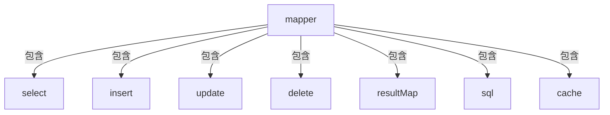

# MyBatis 映射文件详解

MyBatis 映射文件是 MyBatis 的核心，它包含了 SQL 语句和 ORM 映射关系，本文将详细介绍 MyBatis 映射文件的各个部分及其作用。

## 目录

- [映射文件基本结构](#映射文件基本结构)
- [select 查询语句](#select-查询语句)
- [insert 插入语句](#insert-插入语句)
- [update 更新语句](#update-更新语句)
- [delete 删除语句](#delete-删除语句)
- [resultMap 结果映射](#resultmap-结果映射)
- [sql 可重用语句块](#sql-可重用语句块)
- [动态 SQL](#动态-sql)
- [缓存配置](#缓存配置)

## 映射文件基本结构

MyBatis 映射文件的基本结构如下：

```xml
<?xml version="1.0" encoding="UTF-8" ?>
<!DOCTYPE mapper
  PUBLIC "-//mybatis.org//DTD Mapper 3.0//EN"
  "http://mybatis.org/dtd/mybatis-3-mapper.dtd">
<mapper namespace="com.example.mapper.UserMapper">
  <!-- SQL语句和映射配置 -->
  <select id="selectUser" resultType="User">
    SELECT * FROM users WHERE id = #{id}
  </select>

  <insert id="insertUser" parameterType="User">
    INSERT INTO users (name, email) VALUES (#{name}, #{email})
  </insert>

  <!-- 其他SQL语句和映射配置 -->
</mapper>
```

映射文件的根元素是 `<mapper>`，其中的 `namespace` 属性通常指向对应的 Mapper 接口全限定名，这是 MyBatis 中实现接口绑定的关键。



## select 查询语句

`<select>` 元素用于定义查询操作，是最常用的元素之一。

```xml
<select id="getUserById" parameterType="int" resultType="com.example.model.User">
  SELECT * FROM users WHERE id = #{id}
</select>

<select id="getUsersByName" parameterType="string" resultType="com.example.model.User">
  SELECT * FROM users WHERE name LIKE #{name}
</select>
```

### 常用属性：

| 属性          | 说明                                                         |
| ------------- | ------------------------------------------------------------ |
| id            | 在命名空间中唯一的标识符，通常与 Mapper 接口方法名一致       |
| parameterType | 传入参数的类型，可选                                         |
| resultType    | 返回结果的类型，单条记录的类型                               |
| resultMap     | 引用外部定义的 resultMap，与 resultType 互斥                 |
| flushCache    | 是否清空本地缓存和二级缓存，默认 false                       |
| useCache      | 是否使用二级缓存，默认 true                                  |
| timeout       | 设置超时时间，单位为秒                                       |
| fetchSize     | 设置 JDBC fetchSize 参数                                     |
| statementType | 语句类型，STATEMENT/PREPARED/CALLABLE                        |
| resultSetType | 结果集类型，FORWARD_ONLY/SCROLL_SENSITIVE/SCROLL_INSENSITIVE |

### 参数示例：

简单参数：

```xml
<select id="getUser" parameterType="int" resultType="User">
  SELECT * FROM users WHERE id = #{id}
</select>
```

多参数（使用@Param 注解）：

```xml
<!-- 接口方法：User findUser(@Param("id") int id, @Param("name") String name); -->
<select id="findUser" resultType="User">
  SELECT * FROM users WHERE id = #{id} AND name = #{name}
</select>
```

对象参数：

```xml
<select id="findUserByObject" parameterType="User" resultType="User">
  SELECT * FROM users WHERE id = #{id} AND name = #{name}
</select>
```

## insert 插入语句

`<insert>` 元素用于定义插入操作。

```xml
<insert id="insertUser" parameterType="com.example.model.User">
  INSERT INTO users (name, email, create_time)
  VALUES (#{name}, #{email}, #{createTime})
</insert>
```

### 特有属性：

| 属性             | 说明                                           |
| ---------------- | ---------------------------------------------- |
| useGeneratedKeys | 是否使用 JDBC 的 getGeneratedKeys 方法获取主键 |
| keyProperty      | 指定主键对应的实体属性                         |
| keyColumn        | 指定主键对应的数据库列名                       |

### 获取自增主键：

```xml
<insert id="insertUser" parameterType="User" useGeneratedKeys="true" keyProperty="id">
  INSERT INTO users (name, email)
  VALUES (#{name}, #{email})
</insert>
```

### 使用 selectKey 获取主键：

```xml
<insert id="insertUser" parameterType="User">
  <selectKey keyProperty="id" resultType="int" order="BEFORE">
    SELECT IFNULL(MAX(id), 0) + 1 FROM users
  </selectKey>
  INSERT INTO users (id, name, email)
  VALUES (#{id}, #{name}, #{email})
</insert>
```

## update 更新语句

`<update>` 元素用于定义更新操作。

```xml
<update id="updateUser" parameterType="com.example.model.User">
  UPDATE users
  SET name = #{name}, email = #{email}, update_time = #{updateTime}
  WHERE id = #{id}
</update>
```

### 动态更新：

```xml
<update id="updateUserSelective" parameterType="User">
  UPDATE users
  <set>
    <if test="name != null">name = #{name},</if>
    <if test="email != null">email = #{email},</if>
    <if test="updateTime != null">update_time = #{updateTime},</if>
  </set>
  WHERE id = #{id}
</update>
```

## delete 删除语句

`<delete>` 元素用于定义删除操作。

```xml
<delete id="deleteUser" parameterType="int">
  DELETE FROM users WHERE id = #{id}
</delete>
```

### 批量删除：

```xml
<delete id="batchDelete" parameterType="list">
  DELETE FROM users WHERE id IN
  <foreach collection="list" item="id" open="(" separator="," close=")">
    #{id}
  </foreach>
</delete>
```

## resultMap 结果映射

`<resultMap>` 元素是 MyBatis 中最强大的元素，用于自定义复杂映射关系。

```xml
<resultMap id="userResultMap" type="com.example.model.User">
  <id property="id" column="user_id" />
  <result property="name" column="user_name"/>
  <result property="email" column="user_email"/>
  <result property="createTime" column="create_time"/>
</resultMap>

<select id="getUserById" resultMap="userResultMap">
  SELECT
    user_id, user_name, user_email, create_time
  FROM users
  WHERE user_id = #{id}
</select>
```

### 复杂映射：

一对一关联：

```xml
<resultMap id="userWithProfileMap" type="User">
  <id property="id" column="user_id"/>
  <result property="name" column="user_name"/>
  <association property="profile" javaType="Profile">
    <id property="id" column="profile_id"/>
    <result property="bio" column="profile_bio"/>
    <result property="avatar" column="profile_avatar"/>
  </association>
</resultMap>

<select id="getUserWithProfile" resultMap="userWithProfileMap">
  SELECT
    u.id as user_id, u.name as user_name,
    p.id as profile_id, p.bio as profile_bio, p.avatar as profile_avatar
  FROM users u
  LEFT JOIN profiles p ON u.id = p.user_id
  WHERE u.id = #{id}
</select>
```

一对多关联：

```xml
<resultMap id="userWithOrdersMap" type="User">
  <id property="id" column="user_id"/>
  <result property="name" column="user_name"/>
  <collection property="orders" ofType="Order">
    <id property="id" column="order_id"/>
    <result property="orderNo" column="order_no"/>
    <result property="orderDate" column="order_date"/>
  </collection>
</resultMap>

<select id="getUserWithOrders" resultMap="userWithOrdersMap">
  SELECT
    u.id as user_id, u.name as user_name,
    o.id as order_id, o.order_no, o.order_date
  FROM users u
  LEFT JOIN orders o ON u.id = o.user_id
  WHERE u.id = #{id}
</select>
```

## sql 可重用语句块

`<sql>` 元素用于定义可重用的 SQL 片段，减少代码重复。

```xml
<sql id="userColumns">
  id, name, email, create_time, update_time
</sql>

<select id="getUserById" resultType="User">
  SELECT <include refid="userColumns"/>
  FROM users
  WHERE id = #{id}
</select>

<select id="getAllUsers" resultType="User">
  SELECT <include refid="userColumns"/>
  FROM users
</select>
```

### 带参数的 SQL 片段：

```xml
<sql id="whereClause">
  <where>
    <if test="id != null">
      AND id = #{id}
    </if>
    <if test="name != null">
      AND name LIKE #{name}
    </if>
  </where>
</sql>

<select id="findUsers" resultType="User">
  SELECT * FROM users
  <include refid="whereClause"/>
</select>
```

## 动态 SQL

MyBatis 提供了强大的动态 SQL 功能，可以根据条件构建不同的 SQL 语句。

### if

```xml
<select id="findUsers" resultType="User">
  SELECT * FROM users
  <where>
    <if test="id != null">
      AND id = #{id}
    </if>
    <if test="name != null">
      AND name LIKE CONCAT('%', #{name}, '%')
    </if>
  </where>
</select>
```

### choose, when, otherwise

```xml
<select id="findUsers" resultType="User">
  SELECT * FROM users
  <where>
    <choose>
      <when test="id != null">
        AND id = #{id}
      </when>
      <when test="name != null">
        AND name LIKE #{name}
      </when>
      <otherwise>
        AND status = 'active'
      </otherwise>
    </choose>
  </where>
</select>
```

### trim, where, set

`where` 元素会自动去除开头的 AND 或 OR：

```xml
<select id="findUsers" resultType="User">
  SELECT * FROM users
  <where>
    <if test="id != null">
      id = #{id}
    </if>
    <if test="name != null">
      AND name LIKE #{name}
    </if>
  </where>
</select>
```

`set` 元素会自动去除尾部的逗号：

```xml
<update id="updateUser" parameterType="User">
  UPDATE users
  <set>
    <if test="name != null">name = #{name},</if>
    <if test="email != null">email = #{email},</if>
  </set>
  WHERE id = #{id}
</update>
```

`trim` 元素可以自定义前缀和后缀：

```xml
<trim prefix="WHERE" prefixOverrides="AND|OR">
  <if test="id != null">
    id = #{id}
  </if>
  <if test="name != null">
    AND name LIKE #{name}
  </if>
</trim>
```

### foreach

```xml
<select id="selectUsersByIds" resultType="User">
  SELECT * FROM users
  WHERE id IN
  <foreach collection="list" item="id" open="(" separator="," close=")">
    #{id}
  </foreach>
</select>
```

## 缓存配置

MyBatis 提供了一级缓存和二级缓存机制。一级缓存是 SqlSession 级别的缓存，二级缓存是 namespace 级别的缓存。

### 一级缓存

一级缓存默认启用，无需配置。可以通过设置 `localCacheScope` 为 STATEMENT 来禁用。

### 二级缓存

启用二级缓存需要在映射文件中添加 `<cache>` 元素：

```xml
<cache
  eviction="LRU"
  flushInterval="60000"
  size="512"
  readOnly="true"/>
```

### 缓存属性说明：

| 属性          | 说明                                        |
| ------------- | ------------------------------------------- |
| eviction      | 回收策略：LRU, FIFO, SOFT, WEAK，默认为 LRU |
| flushInterval | 刷新间隔，单位为毫秒                        |
| size          | 引用数目，默认为 1024                       |
| readOnly      | 是否只读，默认 false                        |
| blocking      | 缓存获取时是否阻塞，默认 false              |
| type          | 自定义缓存类，需实现 Cache 接口             |

### 使用自定义缓存：

```xml
<cache type="com.example.cache.CustomCache">
  <property name="timeout" value="30"/>
</cache>
```

### 禁用特定语句的缓存：

```xml
<select id="getUserById" resultType="User" useCache="false">
  SELECT * FROM users WHERE id = #{id}
</select>
```

### 清空缓存：

```xml
<select id="getUserById" resultType="User" flushCache="true">
  SELECT * FROM users WHERE id = #{id}
</select>
```

## 总结

MyBatis 映射文件是 MyBatis 框架的核心，它通过 XML 的形式将 SQL 语句与 Java 对象建立映射关系。通过掌握映射文件的各个元素及其用法，可以充分利用 MyBatis 的强大功能，实现灵活的数据库操作。

映射文件的设计思想是将 SQL 与代码分离，使得开发者可以更专注于 SQL 的编写和优化，同时通过动态 SQL、结果映射等特性，提供了极大的灵活性和便利性。

