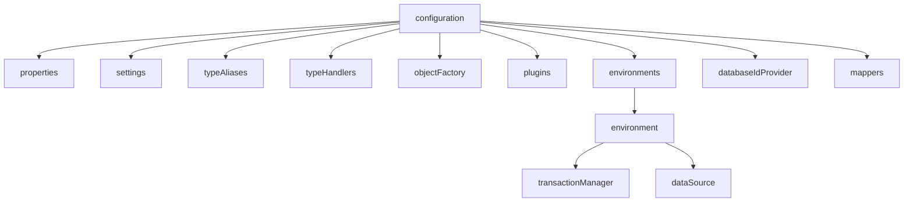

# MyBatis 配置详解

MyBatis 的配置文件包含了会深刻影响 MyBatis 行为的设置和属性信息。本文将详细介绍 MyBatis 配置文件的各个部分及其作用。

## 目录

- [配置文件结构](#配置文件结构)
- [properties 属性](#properties-属性)
- [settings 设置](#settings-设置)
- [typeAliases 类型别名](#typealiases-类型别名)
- [typeHandlers 类型处理器](#typehandlers-类型处理器)
- [objectFactory 对象工厂](#objectfactory-对象工厂)
- [plugins 插件](#plugins-插件)
- [environments 环境配置](#environments-环境配置)
- [databaseIdProvider 数据库厂商标识](#databaseidprovider-数据库厂商标识)
- [mappers 映射器](#mappers-映射器)

## 配置文件结构

MyBatis 配置文件的基本结构如下（顺序不能乱）：

```xml
<?xml version="1.0" encoding="UTF-8" ?>
<!DOCTYPE configuration
  PUBLIC "-//mybatis.org//DTD Config 3.0//EN"
  "http://mybatis.org/dtd/mybatis-3-config.dtd">
<configuration>
  <properties resource="org/mybatis/example/config.properties">
    <!-- 属性配置 -->
  </properties>

  <settings>
    <!-- 全局设置 -->
  </settings>

  <typeAliases>
    <!-- 类型别名 -->
  </typeAliases>

  <typeHandlers>
    <!-- 类型处理器 -->
  </typeHandlers>

  <objectFactory type="org.mybatis.example.ExampleObjectFactory">
    <!-- 对象工厂 -->
  </objectFactory>

  <plugins>
    <!-- 插件 -->
  </plugins>

  <environments default="development">
    <!-- 环境配置 -->
  </environments>

  <databaseIdProvider type="DB_VENDOR">
    <!-- 数据库厂商标识 -->
  </databaseIdProvider>

  <mappers>
    <!-- 映射器 -->
  </mappers>
</configuration>
```



## properties 属性

`properties` 元素用于配置可外部化、可动态替换的属性值。可以在配置文件中引用 properties 元素中定义的属性值。

```xml
<properties resource="org/mybatis/example/config.properties">
  <property name="username" value="dev_user"/>
  <property name="password" value="F2Fa3!33TYyg"/>
</properties>
```

这些属性可以在配置文件的其他地方使用，如：

```xml
<dataSource type="POOLED">
  <property name="driver" value="${jdbc.driver}"/>
  <property name="url" value="${jdbc.url}"/>
  <property name="username" value="${username}"/>
  <property name="password" value="${password}"/>
</dataSource>
```

属性可以从以下位置加载：

1. properties 元素的子元素
2. 从 resource 或 url 指定的外部配置文件
3. 通过方法参数传递的属性

优先级：**方法参数 > 外部文件 > properties 子元素**

## settings 设置

`settings` 是 MyBatis 中极为重要的调整设置，它们会改变 MyBatis 的运行时行为。

下表描述了一些常用的设置及其效果：

| 设置名                    | 描述                          | 有效值                | 默认值  |
| ------------------------- | ----------------------------- | --------------------- | ------- |
| cacheEnabled              | 全局性地开启或关闭缓存        | true/false            | true    |
| lazyLoadingEnabled        | 延迟加载的全局开关            | true/false            | false   |
| aggressiveLazyLoading     | 是否加载对象所有延迟属性      | true/false            | false   |
| multipleResultSetsEnabled | 是否允许单一 SQL 返回多结果集 | true/false            | true    |
| useColumnLabel            | 使用列标签代替列名            | true/false            | true    |
| useGeneratedKeys          | 允许 JDBC 生成主键            | true/false            | false   |
| autoMappingBehavior       | 指定自动映射行为              | NONE/PARTIAL/FULL     | PARTIAL |
| defaultExecutorType       | 默认执行器                    | SIMPLE/REUSE/BATCH    | SIMPLE  |
| defaultStatementTimeout   | 驱动等待数据库响应的超时时间  | 非负整数              | null    |
| mapUnderscoreToCamelCase  | 是否将下划线映射为驼峰命名    | true/false            | false   |
| logImpl                   | 指定日志实现                  | SLF4J/LOG4J/LOG4J2 等 | 未设置  |

示例：

```xml
<settings>
  <setting name="cacheEnabled" value="true"/>
  <setting name="lazyLoadingEnabled" value="true"/>
  <setting name="mapUnderscoreToCamelCase" value="true"/>
  <setting name="logImpl" value="LOG4J"/>
</settings>
```

## typeAliases 类型别名

类型别名是为 Java 类型设置的一个短的名字，它只和 XML 配置有关，存在的意义仅在于用来减少类完全限定名的冗余。

```xml
<typeAliases>
  <typeAlias alias="Author" type="com.example.model.Author"/>
  <typeAlias alias="Blog" type="com.example.model.Blog"/>
  <typeAlias alias="Comment" type="com.example.model.Comment"/>
</typeAliases>
```

当这样配置时，可以在映射文件中直接使用 `Author` 替代 `com.example.model.Author`。

也可以指定一个包名，MyBatis 会在包名下面搜索需要的 Java Bean：

```xml
<typeAliases>
  <package name="com.example.model"/>
</typeAliases>
```

每一个在包 `com.example.model` 中的 Java Bean，在没有注解的情况下，会使用 Bean 的首字母小写的非限定类名来作为它的别名。比如 `com.example.model.Author` 的别名为 `author`。

如果你在 Bean 上添加了注解，可以为其指定别名：

```java
@Alias("author")
public class Author {
    // ...
}
```

MyBatis 已经为许多常见的 Java 类型内建了类型别名，它们都是大小写不敏感的：

| 别名       | 映射的类型 |
| ---------- | ---------- |
| string     | String     |
| date       | Date       |
| decimal    | BigDecimal |
| bigdecimal | BigDecimal |
| map        | Map        |
| hashmap    | HashMap    |
| list       | List       |
| arraylist  | ArrayList  |
| collection | Collection |
| iterator   | Iterator   |
| int        | Integer    |
| integer    | Integer    |
| double     | Double     |
| boolean    | Boolean    |
| byte       | Byte       |
| long       | Long       |
| short      | Short      |
| object     | Object     |

## typeHandlers 类型处理器

类型处理器用于 JavaType 与 JdbcType 之间的转换，当预处理语句（PreparedStatement）设置参数或从结果集读取值时，将 Java 类型映射到对应的 JDBC 类型。

MyBatis 默认已经内置了大量的类型处理器来完成常见的类型转换。但是如果你有特殊的类型需要处理，可以自定义类型处理器。

自定义类型处理器需要实现 `org.apache.ibatis.type.TypeHandler` 接口或继承 `org.apache.ibatis.type.BaseTypeHandler` 类：

```java
@MappedJdbcTypes(JdbcType.VARCHAR)
public class ExampleTypeHandler extends BaseTypeHandler<String> {

  @Override
  public void setNonNullParameter(PreparedStatement ps, int i, String parameter, JdbcType jdbcType) throws SQLException {
    ps.setString(i, parameter);
  }

  @Override
  public String getNullableResult(ResultSet rs, String columnName) throws SQLException {
    return rs.getString(columnName);
  }

  @Override
  public String getNullableResult(ResultSet rs, int columnIndex) throws SQLException {
    return rs.getString(columnIndex);
  }

  @Override
  public String getNullableResult(CallableStatement cs, int columnIndex) throws SQLException {
    return cs.getString(columnIndex);
  }
}
```

然后在 MyBatis 配置中注册：

```xml
<typeHandlers>
  <typeHandler handler="org.mybatis.example.ExampleTypeHandler"/>
</typeHandlers>
```

或者，如果你想扫描整个包来查找类型处理器：

```xml
<typeHandlers>
  <package name="org.mybatis.example"/>
</typeHandlers>
```

## objectFactory 对象工厂

MyBatis 每次创建结果对象的新实例时，都会使用一个对象工厂（ObjectFactory）实例来完成实例化工作。默认的对象工厂只需要实例化目标类，要么通过默认构造方法，要么在参数映射存在的时候通过有参构造方法来实例化。

如果想自定义对象工厂，可以实现 `org.apache.ibatis.reflection.factory.ObjectFactory` 接口：

```java
public class ExampleObjectFactory implements ObjectFactory {
  public Object create(Class type) {
    return create(type, null, null);
  }

  public Object create(Class type, List<Class> constructorArgTypes, List<Object> constructorArgs) {
    // 自定义创建对象的逻辑
    return new MyClass();
  }

  public void setProperties(Properties properties) {
    // 设置属性
  }

  public <T> boolean isCollection(Class<T> type) {
    return Collection.class.isAssignableFrom(type);
  }
}
```

然后在 MyBatis 配置中使用：

```xml
<objectFactory type="org.mybatis.example.ExampleObjectFactory">
  <property name="someProperty" value="100"/>
</objectFactory>
```

## plugins 插件

MyBatis 允许你在映射语句执行过程中的某一点进行拦截调用，通过插件（plugins）可以修改 MyBatis 的核心行为。

MyBatis 允许使用插件来拦截的接口和方法包括：

- Executor (update, query, flushStatements, commit, rollback, getTransaction, close, isClosed)
- ParameterHandler (getParameterObject, setParameters)
- ResultSetHandler (handleResultSets, handleOutputParameters)
- StatementHandler (prepare, parameterize, batch, update, query)

如果想编写一个插件，需要实现 `org.apache.ibatis.plugin.Interceptor` 接口：

```java
@Intercepts({
  @Signature(
    type= Executor.class,
    method = "update",
    args = {MappedStatement.class, Object.class})
})
public class ExamplePlugin implements Interceptor {
  private Properties properties = new Properties();

  public Object intercept(Invocation invocation) throws Throwable {
    // 前置处理
    Object returnObject = invocation.proceed();
    // 后置处理
    return returnObject;
  }

  public void setProperties(Properties properties) {
    this.properties = properties;
  }
}
```

然后在 MyBatis 配置中注册：

```xml
<plugins>
  <plugin interceptor="org.mybatis.example.ExamplePlugin">
    <property name="someProperty" value="100"/>
  </plugin>
</plugins>
```

## environments 环境配置

MyBatis 可以配置多种环境，比如开发、测试和生产环境需要有不同的配置。

```xml
<environments default="development">
  <environment id="development">
    <transactionManager type="JDBC">
      <property name="..." value="..."/>
    </transactionManager>
    <dataSource type="POOLED">
      <property name="driver" value="${driver}"/>
      <property name="url" value="${url}"/>
      <property name="username" value="${username}"/>
      <property name="password" value="${password}"/>
    </dataSource>
  </environment>

  <environment id="production">
    <transactionManager type="MANAGED">
      <property name="..." value="..."/>
    </transactionManager>
    <dataSource type="JNDI">
      <property name="data_source" value="java:comp/env/jdbc/myDataSource"/>
    </dataSource>
  </environment>
</environments>
```

注意：

- 每个环境都必须包含一个 `transactionManager` 和一个 `dataSource`。
- 可以有多个环境，但每个 `SqlSessionFactory` 实例只能使用一个环境。
- 如果想连接两个数据库，就需要创建两个 `SqlSessionFactory` 实例。

### transactionManager

MyBatis 支持两种类型的事务管理器：

- **JDBC** – 直接使用 JDBC 的提交和回滚功能，依赖于从数据源得到的连接来管理事务范围。
- **MANAGED** – 让容器（如 Spring 或 JEE 应用服务器）来管理事务的整个生命周期。默认情况下它会关闭连接，也可以将 closeConnection 属性设置为 false 来阻止这个默认行为。

### dataSource

MyBatis 支持三种内建的数据源类型：

- **UNPOOLED** – 每次请求时打开和关闭连接。适用于对性能没有特殊要求的简单应用程序。
- **POOLED** – 利用"池"的概念将 JDBC 连接对象组织起来，避免了创建新的连接实例时所需的初始化和认证时间。适用于并发访问数据库的应用程序。
- **JNDI** – 为了能在如 EJB 或应用服务器这类容器中使用，可以在外部容器中配置数据源，然后通过 JNDI 引用获取。

## databaseIdProvider 数据库厂商标识

MyBatis 可以根据不同的数据库厂商执行不同的语句，这种多厂商的支持是基于 `databaseIdProvider` 的：

```xml
<databaseIdProvider type="DB_VENDOR">
  <property name="SQL Server" value="sqlserver"/>
  <property name="MySQL" value="mysql"/>
  <property name="Oracle" value="oracle"/>
  <property name="PostgreSQL" value="postgresql"/>
</databaseIdProvider>
```

然后在映射语句中，可以通过 `databaseId` 属性为不同的数据库提供不同的 SQL：

```xml
<select id="findUser" resultType="User" databaseId="mysql">
  SELECT * FROM users WHERE id = #{id}
</select>

<select id="findUser" resultType="User" databaseId="oracle">
  SELECT * FROM users WHERE id = #{id}
</select>
```

## mappers 映射器

告诉 MyBatis 到哪里去找映射文件。

```xml
<mappers>
  <!-- 使用相对于类路径的资源引用 -->
  <mapper resource="org/mybatis/example/BlogMapper.xml"/>

  <!-- 使用完全限定资源定位符（URL） -->
  <mapper url="file:///var/mappers/BlogMapper.xml"/>

  <!-- 使用映射器接口实现类的完全限定类名 -->
  <mapper class="org.mybatis.example.BlogMapper"/>

  <!-- 将包内的映射器接口全部注册为映射器 -->
  <package name="org.mybatis.example"/>
</mappers>
```

注意：

- 使用 `class` 或 `package` 方式注册时，映射器接口对应的 XML 必须与接口同名并放在同一包下（或在 classpath 资源目录下的同名文件夹中）。
- 也可以通过实现 `org.apache.ibatis.session.Configuration` 类完成映射器的注册。

## 总结

MyBatis 配置文件是 MyBatis 的核心，通过合理配置可以充分发挥 MyBatis 的优势。在实际应用中，可能不需要配置所有元素，但了解每个配置的作用有助于根据实际需求进行合理配置。

另外，当与 Spring 集成时，大部分 MyBatis 配置会被 Spring 的配置所替代，但了解这些配置仍然很有必要，因为它们是理解 MyBatis 工作原理的基础。

