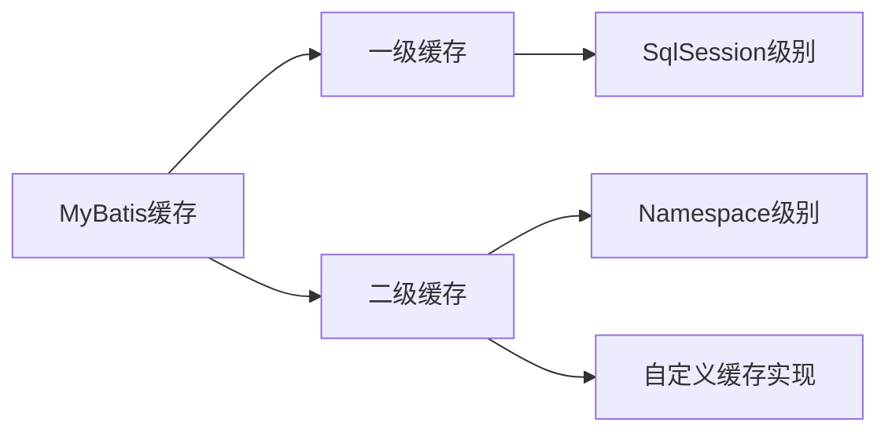

# MyBatis 高级特性

MyBatis 不仅提供了基本的 ORM 映射功能，还提供了许多高级特性，这些特性可以帮助开发者更好地控制和优化数据库访问。本文将详细介绍 MyBatis 的缓存机制、插件系统、类型处理器等高级特性。

## 目录

- [缓存机制](#缓存机制)
- [插件系统](#插件系统)
- [类型处理器](#类型处理器)
- [自定义对象工厂](#自定义对象工厂)
- [数据库厂商标识](#数据库厂商标识)
- [批量操作](#批量操作)
- [延迟加载](#延迟加载)
- [游标支持](#游标支持)
- [动态 SQL 注解](#动态-sql-注解)

## 缓存机制

MyBatis 提供了一级缓存和二级缓存，通过合理利用缓存可以提高查询性能，减少数据库访问。



### 一级缓存

一级缓存是 SqlSession 级别的缓存，默认启用。当我们使用同一个 SqlSession 多次执行相同的 SQL 语句时，只有第一次会从数据库中获取数据，之后都从缓存中获取。

```java
// 第一次查询，从数据库获取数据
User user1 = sqlSession.selectOne("selectUser", 1);
// 第二次查询，从一级缓存获取数据
User user2 = sqlSession.selectOne("selectUser", 1);
```

一级缓存的特点：

1. 默认启用，无需配置
2. 只在一个 SqlSession 内有效
3. 执行增删改操作会清空缓存
4. 显式调用 `clearCache()` 方法会清空缓存
5. 调用 `close()` 方法关闭 SqlSession 后缓存将被清空

一级缓存可以通过 setting 配置的 `localCacheScope` 参数控制作用范围：

```xml
<setting name="localCacheScope" value="SESSION"/>  <!-- 默认值，一个会话内共享 -->
<setting name="localCacheScope" value="STATEMENT"/> <!-- 禁用一级缓存 -->
```

### 二级缓存

二级缓存是 namespace 级别的缓存，多个 SqlSession 共享，需要手动配置开启。

开启二级缓存的步骤：

1. 在 MyBatis 配置文件中启用缓存

```xml
<settings>
    <setting name="cacheEnabled" value="true"/>  <!-- 默认就是true -->
</settings>
```

2. 在映射文件中配置缓存

```xml
<cache
  eviction="LRU"
  flushInterval="60000"
  size="512"
  readOnly="true"/>
```

3. 确保实体类实现了 Serializable 接口（如果 readOnly="false"）

```java
public class User implements Serializable {
    private static final long serialVersionUID = 1L;
    // ...
}
```

二级缓存的特点：

1. 需要手动配置开启
2. 作用范围是 namespace，多个 SqlSession 共享
3. 默认情况下，增删改操作会清空命名空间的缓存
4. 可以配置 flushCache="true/false" 控制是否清空缓存
5. 实体类需要实现 Serializable 接口（当 readOnly="false" 时）

### 缓存参数说明

| 参数          | 描述                                 | 默认值 |
| ------------- | ------------------------------------ | ------ |
| eviction      | 回收策略：LRU, FIFO, SOFT, WEAK      | LRU    |
| flushInterval | 刷新间隔，单位毫秒                   | 不设置 |
| size          | 最大缓存对象数                       | 1024   |
| readOnly      | 是否只读，只读时返回相同对象         | false  |
| blocking      | 是否阻塞，阻塞时查找数据将等待获取锁 | false  |
| type          | 自定义缓存类，需实现 Cache 接口      | 不设置 |

### 自定义缓存

MyBatis 允许开发者自定义缓存实现，只需实现 `org.apache.ibatis.cache.Cache` 接口即可。

```java
public class CustomCache implements Cache {
    private final String id;
    private final Map<Object, Object> cache = new ConcurrentHashMap<>();

    public CustomCache(String id) {
        this.id = id;
    }

    @Override
    public String getId() {
        return id;
    }

    @Override
    public void putObject(Object key, Object value) {
        cache.put(key, value);
    }

    @Override
    public Object getObject(Object key) {
        return cache.get(key);
    }

    @Override
    public Object removeObject(Object key) {
        return cache.remove(key);
    }

    @Override
    public void clear() {
        cache.clear();
    }

    @Override
    public int getSize() {
        return cache.size();
    }
}
```

然后在映射文件中引用：

```xml
<cache type="com.example.cache.CustomCache">
    <property name="timeout" value="30"/>
</cache>
```

### 与第三方缓存集成

MyBatis 可以方便地与主流缓存框架集成，如 EhCache、Redis 等。

以 EhCache 为例：

1. 添加依赖

```xml
<dependency>
    <groupId>org.mybatis.caches</groupId>
    <artifactId>mybatis-ehcache</artifactId>
    <version>1.2.1</version>
</dependency>
```

2. 创建 EhCache 配置文件 `ehcache.xml`

```xml
<ehcache>
    <diskStore path="java.io.tmpdir"/>
    <cache
        name="com.example.mapper.UserMapper"
        maxEntriesLocalHeap="1000"
        timeToIdleSeconds="120"
        timeToLiveSeconds="300"
        memoryStoreEvictionPolicy="LRU">
    </cache>
</ehcache>
```

3. 在映射文件中使用 EhCache

```xml
<cache type="org.mybatis.caches.ehcache.EhcacheCache"/>
```

## 插件系统

MyBatis 提供了一个强大的插件机制，允许在 SQL 执行的各个阶段添加自定义逻辑。

### 可拦截的方法

MyBatis 允许拦截以下类的方法：

1. `Executor`：执行 SQL 的主要接口

   - `update()`
   - `query()`
   - `flushStatements()`
   - `commit()`
   - `rollback()`
   - `getTransaction()`
   - `close()`
   - `isClosed()`

2. `ParameterHandler`：处理 SQL 参数的接口

   - `getParameterObject()`
   - `setParameters()`

3. `ResultSetHandler`：处理结果集的接口

   - `handleResultSets()`
   - `handleOutputParameters()`
   - `handleCursorResultSets()`

4. `StatementHandler`：处理 SQL 语句的接口
   - `prepare()`
   - `parameterize()`
   - `batch()`
   - `update()`
   - `query()`

### 插件开发步骤

1. 实现 `Interceptor` 接口

```java
@Intercepts({
    @Signature(
        type = Executor.class,
        method = "query",
        args = {MappedStatement.class, Object.class, RowBounds.class, ResultHandler.class}
    )
})
public class ExamplePlugin implements Interceptor {
    @Override
    public Object intercept(Invocation invocation) throws Throwable {
        // 在查询执行前处理
        System.out.println("Before query");

        // 执行原始方法
        Object result = invocation.proceed();

        // 在查询执行后处理
        System.out.println("After query");

        return result;
    }

    @Override
    public Object plugin(Object target) {
        return Plugin.wrap(target, this);
    }

    @Override
    public void setProperties(Properties properties) {
        // 设置属性
        String prop = properties.getProperty("someProperty");
    }
}
```

2. 在 MyBatis 配置文件中注册插件

```xml
<plugins>
    <plugin interceptor="com.example.plugin.ExamplePlugin">
        <property name="someProperty" value="100"/>
    </plugin>
</plugins>
```

### 常用插件场景

1. **性能分析**：记录 SQL 执行时间，找出慢查询

```java
@Intercepts({
    @Signature(
        type = Executor.class,
        method = "query",
        args = {MappedStatement.class, Object.class, RowBounds.class, ResultHandler.class}
    )
})
public class PerformanceInterceptor implements Interceptor {
    @Override
    public Object intercept(Invocation invocation) throws Throwable {
        long startTime = System.currentTimeMillis();
        Object result = invocation.proceed();
        long endTime = System.currentTimeMillis();

        MappedStatement ms = (MappedStatement) invocation.getArgs()[0];
        String sqlId = ms.getId();
        long cost = endTime - startTime;

        System.out.println("SQL执行耗时：" + cost + "ms，ID：" + sqlId);

        return result;
    }

    @Override
    public Object plugin(Object target) {
        return Plugin.wrap(target, this);
    }

    @Override
    public void setProperties(Properties properties) {
    }
}
```

2. **分页插件**：自动处理分页

```java
@Intercepts({
    @Signature(
        type = StatementHandler.class,
        method = "prepare",
        args = {Connection.class, Integer.class}
    )
})
public class PageInterceptor implements Interceptor {
    @Override
    public Object intercept(Invocation invocation) throws Throwable {
        StatementHandler handler = (StatementHandler) invocation.getTarget();
        BoundSql boundSql = handler.getBoundSql();

        // 获取原始SQL
        String sql = boundSql.getSql();

        // 获取分页参数
        Object paramObj = boundSql.getParameterObject();
        Page page = getPage(paramObj);

        if (page != null) {
            // 重写SQL，添加分页条件
            String pageSql = getPageSql(sql, page);

            // 替换原始SQL
            Field field = boundSql.getClass().getDeclaredField("sql");
            field.setAccessible(true);
            field.set(boundSql, pageSql);
        }

        return invocation.proceed();
    }

    // 辅助方法...
}
```

## 类型处理器

MyBatis 使用类型处理器（TypeHandler）来处理 Java 类型和 JDBC 类型之间的转换。内置的类型处理器能够满足大部分需求，但有时需要自定义类型处理器来处理特殊类型。

### 内置类型处理器

MyBatis 内置了多种类型处理器，用于处理常见类型：

- `BooleanTypeHandler`：处理 Boolean 和 boolean
- `ByteTypeHandler`：处理 Byte 和 byte
- `ShortTypeHandler`：处理 Short 和 short
- `IntegerTypeHandler`：处理 Integer 和 int
- `LongTypeHandler`：处理 Long 和 long
- `FloatTypeHandler`：处理 Float 和 float
- `DoubleTypeHandler`：处理 Double 和 double
- `StringTypeHandler`：处理 String
- `DateTypeHandler`：处理 Date
- `BigDecimalTypeHandler`：处理 BigDecimal

### 自定义类型处理器

当内置类型处理器无法满足需求时，可以自定义类型处理器。例如，处理 Java 枚举类型和数据库整数的映射：

```java
public enum UserStatus {
    ACTIVE(1),
    INACTIVE(0);

    private final int value;

    UserStatus(int value) {
        this.value = value;
    }

    public int getValue() {
        return value;
    }

    public static UserStatus valueOf(int value) {
        for (UserStatus status : values()) {
            if (status.getValue() == value) {
                return status;
            }
        }
        throw new IllegalArgumentException("Invalid user status value: " + value);
    }
}

public class UserStatusTypeHandler extends BaseTypeHandler<UserStatus> {
    @Override
    public void setNonNullParameter(PreparedStatement ps, int i, UserStatus parameter, JdbcType jdbcType) throws SQLException {
        ps.setInt(i, parameter.getValue());
    }

    @Override
    public UserStatus getNullableResult(ResultSet rs, String columnName) throws SQLException {
        int value = rs.getInt(columnName);
        return rs.wasNull() ? null : UserStatus.valueOf(value);
    }

    @Override
    public UserStatus getNullableResult(ResultSet rs, int columnIndex) throws SQLException {
        int value = rs.getInt(columnIndex);
        return rs.wasNull() ? null : UserStatus.valueOf(value);
    }

    @Override
    public UserStatus getNullableResult(CallableStatement cs, int columnIndex) throws SQLException {
        int value = cs.getInt(columnIndex);
        return cs.wasNull() ? null : UserStatus.valueOf(value);
    }
}
```

### 注册自定义类型处理器

有两种方式注册自定义类型处理器：

1. 在配置文件中注册

```xml
<typeHandlers>
    <typeHandler handler="com.example.handler.UserStatusTypeHandler" javaType="com.example.enums.UserStatus" jdbcType="INTEGER"/>
</typeHandlers>
```

2. 使用注解注册

```java
@MappedJdbcTypes(JdbcType.INTEGER)
@MappedTypes(UserStatus.class)
public class UserStatusTypeHandler extends BaseTypeHandler<UserStatus> {
    // 实现方法...
}
```

然后在配置文件中注册包：

```xml
<typeHandlers>
    <package name="com.example.handler"/>
</typeHandlers>
```

### 处理 JSON 数据

使用类型处理器可以轻松处理 JSON 数据：

```java
public class JsonTypeHandler<T> extends BaseTypeHandler<T> {
    private final Class<T> clazz;
    private final ObjectMapper objectMapper = new ObjectMapper();

    public JsonTypeHandler(Class<T> clazz) {
        this.clazz = clazz;
    }

    @Override
    public void setNonNullParameter(PreparedStatement ps, int i, T parameter, JdbcType jdbcType) throws SQLException {
        try {
            ps.setString(i, objectMapper.writeValueAsString(parameter));
        } catch (JsonProcessingException e) {
            throw new SQLException("Error converting object to JSON", e);
        }
    }

    @Override
    public T getNullableResult(ResultSet rs, String columnName) throws SQLException {
        return parse(rs.getString(columnName));
    }

    @Override
    public T getNullableResult(ResultSet rs, int columnIndex) throws SQLException {
        return parse(rs.getString(columnIndex));
    }

    @Override
    public T getNullableResult(CallableStatement cs, int columnIndex) throws SQLException {
        return parse(cs.getString(columnIndex));
    }

    private T parse(String json) {
        if (json == null) {
            return null;
        }
        try {
            return objectMapper.readValue(json, clazz);
        } catch (IOException e) {
            throw new RuntimeException("Error parsing JSON", e);
        }
    }
}
```

## 自定义对象工厂

MyBatis 使用对象工厂（ObjectFactory）来创建结果对象的实例。默认情况下，MyBatis 使用默认的对象工厂，它只是调用目标类的无参构造函数。但有时，我们可能需要自定义对象的创建过程。

### 默认对象工厂

默认情况下，MyBatis 使用 `DefaultObjectFactory` 创建对象：

```java
public class DefaultObjectFactory implements ObjectFactory {
    @Override
    public <T> T create(Class<T> type) {
        return create(type, null, null);
    }

    @Override
    public <T> T create(Class<T> type, List<Class<?>> constructorArgTypes, List<Object> constructorArgs) {
        // 创建对象的实现...
    }

    @Override
    public void setProperties(Properties properties) {
        // 设置属性
    }

    @Override
    public <T> boolean isCollection(Class<T> type) {
        return Collection.class.isAssignableFrom(type);
    }
}
```

### 自定义对象工厂

自定义对象工厂可以控制对象的创建，例如，添加默认值或执行其他初始化操作：

```java
public class CustomObjectFactory extends DefaultObjectFactory {
    @Override
    public <T> T create(Class<T> type) {
        T object = super.create(type);

        if (type == User.class) {
            ((User) object).setCreateTime(new Date());
        }

        return object;
    }

    @Override
    public void setProperties(Properties properties) {
        // 可以从配置文件获取属性
        super.setProperties(properties);
    }
}
```

### 注册自定义对象工厂

在 MyBatis 配置文件中注册自定义对象工厂：

```xml
<objectFactory type="com.example.factory.CustomObjectFactory">
    <property name="someProperty" value="100"/>
</objectFactory>
```

## 数据库厂商标识

MyBatis 可以根据不同的数据库厂商执行不同的 SQL 语句，这对于编写跨数据库的应用非常有用。

### 配置数据库厂商标识

在 MyBatis 配置文件中配置：

```xml
<databaseIdProvider type="DB_VENDOR">
    <property name="MySQL" value="mysql"/>
    <property name="Oracle" value="oracle"/>
    <property name="SQL Server" value="sqlserver"/>
    <property name="PostgreSQL" value="postgresql"/>
</databaseIdProvider>
```

### 在映射文件中使用

可以在 SQL 语句上指定 `databaseId` 属性：

```xml
<select id="selectUser" resultType="User" databaseId="mysql">
    SELECT * FROM users WHERE id = #{id}
</select>

<select id="selectUser" resultType="User" databaseId="oracle">
    SELECT * FROM users WHERE id = #{id}
</select>
```

也可以在 SQL 片段中使用：

```xml
<sql id="pagingMySql" databaseId="mysql">
    LIMIT #{offset}, #{limit}
</sql>

<sql id="pagingOracle" databaseId="oracle">
    <![CDATA[
        WHERE ROWNUM <= (#{offset} + #{limit})
    ]]>
</sql>

<select id="selectUserWithPaging" resultType="User">
    SELECT * FROM users
    <include refid="paging${databaseId}"/>
</select>
```

## 批量操作

MyBatis 提供了批量操作的支持，可以大大提高批量插入、更新和删除的性能。

### 使用 SqlSession 的批量方法

```java
try (SqlSession sqlSession = sqlSessionFactory.openSession(ExecutorType.BATCH)) {
    UserMapper mapper = sqlSession.getMapper(UserMapper.class);

    for (User user : userList) {
        mapper.insertUser(user);
    }

    // 批量提交
    sqlSession.flushStatements();
    sqlSession.commit();
}
```

### 使用批量映射语句

```xml
<insert id="batchInsertUsers" parameterType="list">
    INSERT INTO users (name, email)
    VALUES
    <foreach collection="list" item="user" separator=",">
        (#{user.name}, #{user.email})
    </foreach>
</insert>
```

```java
// 一次性插入多条记录
List<User> users = Arrays.asList(user1, user2, user3);
mapper.batchInsertUsers(users);
```

### 批量操作的注意事项

1. 批量提交的记录不宜过多，建议每批 1000 条左右
2. 批量操作最好在事务中进行，以便出错时回滚
3. 注意数据库对 SQL 长度的限制，特别是 MySQL 的 `max_allowed_packet` 参数
4. 对于大批量数据，考虑使用多线程并行处理

## 延迟加载

MyBatis 支持延迟加载（懒加载）功能，可以在需要时才加载关联对象，减少不必要的数据库查询。

### 全局配置

在 MyBatis 配置文件中配置：

```xml
<settings>
    <!-- 开启延迟加载 -->
    <setting name="lazyLoadingEnabled" value="true"/>
    <!-- 将积极加载改为消极加载 -->
    <setting name="aggressiveLazyLoading" value="false"/>
</settings>
```

### 在映射文件中使用

在 `resultMap` 中配置 `association` 和 `collection` 的延迟加载：

```xml
<resultMap id="userMap" type="User">
    <id property="id" column="id"/>
    <result property="name" column="name"/>
    <!-- 延迟加载用户的订单 -->
    <collection property="orders"
                select="selectOrdersByUserId"
                column="id"
                fetchType="lazy"/>
</resultMap>

<select id="selectUser" resultMap="userMap">
    SELECT id, name FROM users WHERE id = #{id}
</select>

<select id="selectOrdersByUserId" resultType="Order">
    SELECT * FROM orders WHERE user_id = #{userId}
</select>
```

### 使用 fetchType 覆盖全局配置

可以使用 `fetchType` 属性覆盖全局延迟加载配置：

```xml
<!-- 不管全局配置如何，这个关联将立即加载 -->
<association property="profile"
             select="selectProfileByUserId"
             column="id"
             fetchType="eager"/>
```

## 游标支持

MyBatis 支持游标（Cursor）特性，允许逐条处理查询结果，适用于处理大量数据的场景。

### 定义游标接口

```java
public interface UserMapper {
    @Select("SELECT * FROM users")
    Cursor<User> findAllUsers();
}
```

### 使用游标

```java
try (SqlSession sqlSession = sqlSessionFactory.openSession();
     Cursor<User> cursor = sqlSession.getMapper(UserMapper.class).findAllUsers()) {

    // 逐个处理结果，避免一次性加载所有数据到内存
    for (User user : cursor) {
        processUser(user);
    }
}
```

### 游标的注意事项

1. 游标需要在 SqlSession 关闭前关闭
2. 游标使用迭代器模式，结果是流式处理的
3. 游标不支持二级缓存
4. 游标适用于处理大量数据，避免内存溢出

## 动态 SQL 注解

除了 XML 映射文件，MyBatis 也支持使用注解构建动态 SQL。

### 基本注解

- `@Select`
- `@Insert`
- `@Update`
- `@Delete`
- `@Results`
- `@Result`
- `@One`
- `@Many`

### 使用 Provider 构建动态 SQL

```java
public class UserSqlProvider {
    public String findByCondition(final User user) {
        return new SQL() {{
            SELECT("*");
            FROM("users");
            if (user.getId() != null) {
                WHERE("id = #{id}");
            }
            if (user.getName() != null) {
                WHERE("name LIKE CONCAT('%', #{name}, '%')");
            }
            if (user.getEmail() != null) {
                WHERE("email = #{email}");
            }
            ORDER_BY("id DESC");
        }}.toString();
    }
}
```

在 Mapper 中使用：

```java
@SelectProvider(type = UserSqlProvider.class, method = "findByCondition")
List<User> findByCondition(User user);
```

### 使用 SQL Builder 构建动态 SQL

```java
public class UserSqlProvider {
    public String insertUser(final User user) {
        return new SQL()
            .INSERT_INTO("users")
            .VALUES("name", "#{name}")
            .VALUES("email", "#{email}")
            .VALUES("create_time", "#{createTime}")
            .toString();
    }

    public String updateUser(final User user) {
        return new SQL()
            .UPDATE("users")
            .SET("name = #{name}")
            .SET("email = #{email}")
            .SET("update_time = #{updateTime}")
            .WHERE("id = #{id}")
            .toString();
    }
}
```

## 总结

MyBatis 的高级特性大大增强了框架的功能和灵活性，让开发者能够更好地控制数据库访问。这些高级特性包括：

1. **缓存机制**：一级缓存和二级缓存，以及与第三方缓存框架的集成
2. **插件系统**：可以拦截 MyBatis 执行过程中的关键方法，添加自定义逻辑
3. **类型处理器**：处理 Java 类型和数据库类型之间的转换
4. **对象工厂**：控制结果对象的创建过程
5. **数据库厂商标识**：根据不同数据库执行不同的 SQL
6. **批量操作**：提高大量数据操作的性能
7. **延迟加载**：按需加载关联对象，减少不必要的查询
8. **游标支持**：逐条处理大量数据，避免内存溢出
9. **动态 SQL 注解**：使用注解构建动态 SQL

通过合理使用这些高级特性，可以编写出更高效、更灵活的 MyBatis 应用。

