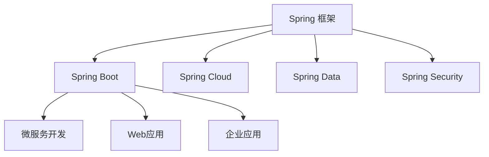
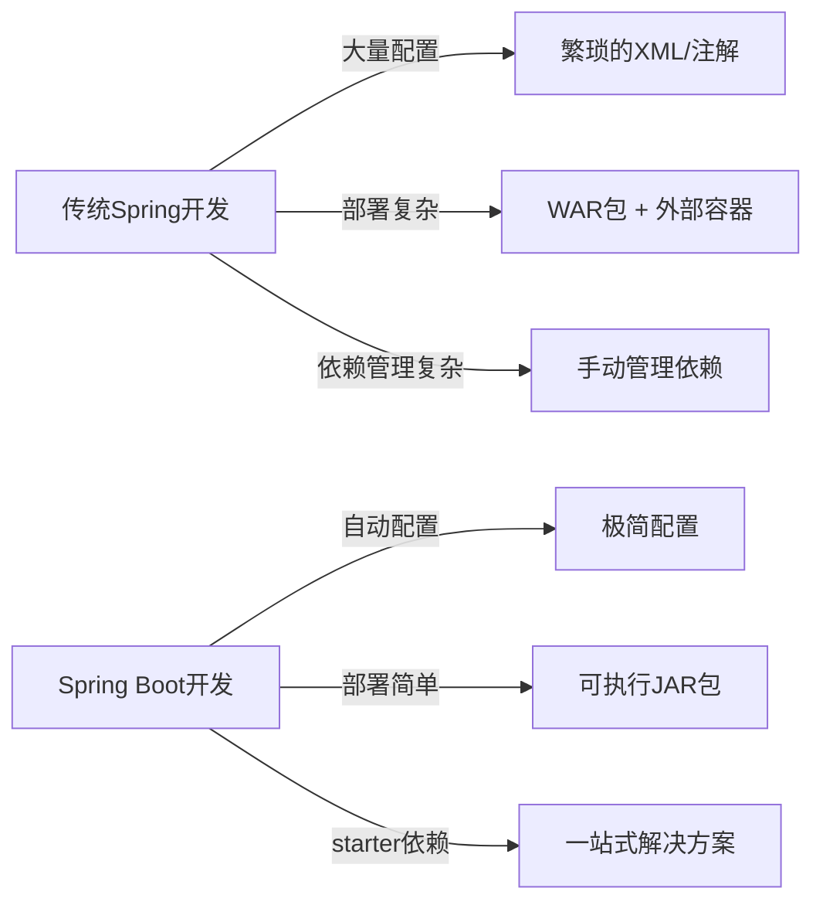
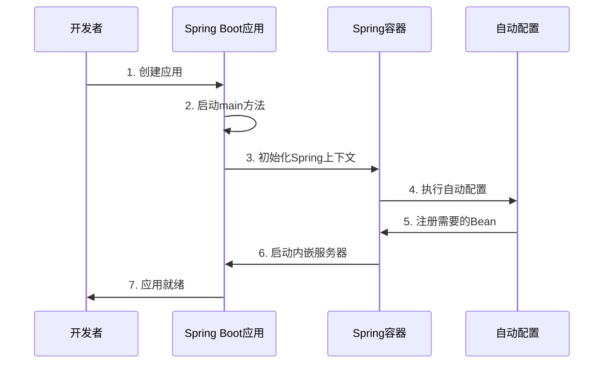

# 1 Spring Boot 介绍

## 1.1 什么是 Spring Boot

Spring Boot 是一个基于 Spring 框架的快速开发平台，旨在简化 Spring 应用的初始搭建和开发过程。它基于"约定优于配置"的理念，提供了自动配置、内嵌服务器、简化依赖管理等特性，使开发者能够快速构建可投入生产的 Spring 应用。

Spring Boot 是 Spring 生态系统的一部分，它构建在 Spring 框架之上，通过简化配置和提供默认值大大减少了开发时间和工作量。

## 1.2 Spring Boot 与 Spring 框架的关系

- **Spring 框架**：提供了核心功能，如依赖注入(DI)、面向切面编程(AOP)、事务管理等
- **Spring Boot**：在 Spring 框架基础上提供了自动配置、内嵌服务器等特性，简化了 Spring 应用的开发过程

## 1.3 为什么使用 Spring Boot

Spring Boot 的主要优势包括：

1. **简化配置**：自动配置大量组件，减少样板代码
2. **独立运行**：内嵌服务器，可直接打包为可执行 jar 文件，无需外部容器
3. **快速开发**：提供各种 starter 依赖，简化项目依赖管理
4. **生产就绪**：内置健康检查、指标收集等生产级功能
5. **无代码生成**：不生成代码，无需 XML 配置

## 1.4 Spring Boot 版本历史

| 版本 | 发布日期 | 特性                      | Spring 框架版本 | Java 最低版本 |
| ---- | -------- | ------------------------- | --------------- | ------------- |
| 1.0  | 2014 年  | 首次发布                  | 4.0             | Java 6        |
| 1.5  | 2017 年  | 改进的自动配置            | 4.3             | Java 7        |
| 2.0  | 2018 年  | WebFlux 支持，响应式编程  | 5.0             | Java 8        |
| 2.3  | 2020 年  | Docker 支持改进，Jar 分层 | 5.2             | Java 8        |
| 2.7  | 2022 年  | 延长支持                  | 5.3             | Java 8        |
| 3.0  | 2022 年  | 原生支持 Jakarta EE 9     | 6.0             | Java 17       |
| 3.2  | 2023 年  | 功能增强，性能优化        | 6.1             | Java 17       |

## 1.5 Spring Boot 的工作原理

## 1.6 实际应用场景

Spring Boot 适用于多种应用场景：

1. **微服务架构**：轻量级、独立部署的理想选择
2. **Web 应用**：REST API、前后端分离应用
3. **企业应用**：集成各种企业级功能
4. **批处理应用**：结合 Spring Batch 处理大量数据
5. **云原生应用**：适配云平台，支持容器化部署

## 1.7 小结

Spring Boot 简化了 Spring 应用开发，专注于"约定优于配置"的理念，通过提供各种默认配置来减少开发者的决策负担。它并不是替代 Spring，而是让 Spring 应用的开发变得更加简单和快速。

作为一个新手，学习 Spring Boot 是进入 Spring 生态系统的理想起点，它能让你快速上手并构建出生产级别的应用。

