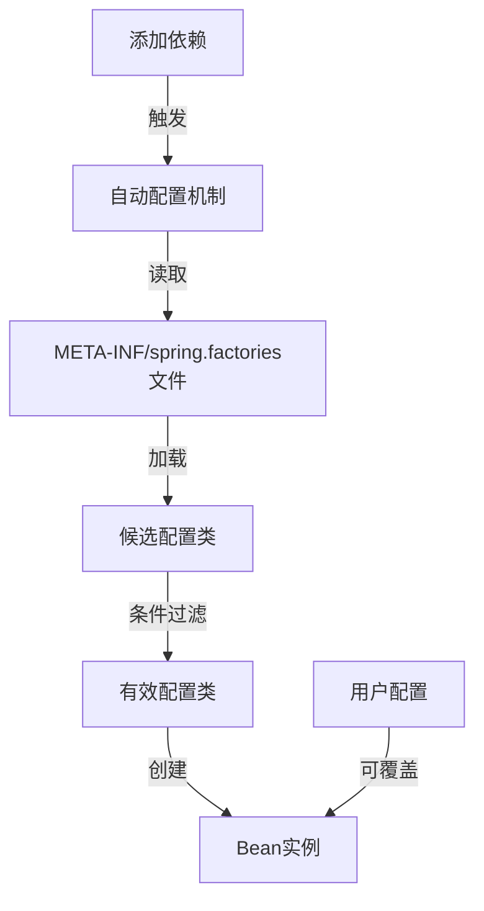
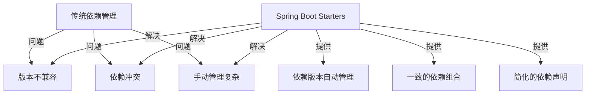
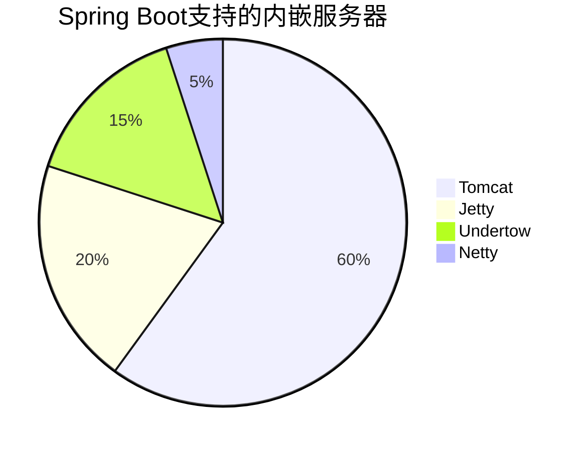

# 1 Spring Boot 核心特性

Spring Boot 提供了丰富的核心特性，帮助开发者快速构建应用。这些特性极大地简化了开发过程，提高了开发效率。

## 1.1 自动配置 (Auto-Configuration)

自动配置是 Spring Boot 最核心的特性之一。它能够根据项目中引入的依赖自动配置 Spring 应用，无需开发者手动配置。

### 1.1.1 工作原理



例如，当你引入 `spring-boot-starter-data-jpa` 依赖时，Spring Boot 会自动配置：

- 数据源 (DataSource)
- 实体管理器工厂 (EntityManagerFactory)
- 事务管理器 (TransactionManager)

### 1.1.2 查看自动配置报告

可以通过在启动时添加 `--debug` 参数查看自动配置报告：

```bash
java -jar myapp.jar --debug
```

报告会显示：

- 已应用的自动配置
- 未应用的自动配置及原因

### 1.1.3 自定义和覆盖自动配置

可以通过以下方式自定义或覆盖自动配置：

- 配置文件中设置相关属性
- 创建自己的 `@Configuration` 类
- 排除特定的自动配置

```java
@SpringBootApplication(exclude = {DataSourceAutoConfiguration.class})
public class MyApplication {
    // ...
}
```

## 1.2 起步依赖 (Starters)

起步依赖是一组预配置的依赖描述符，简化了依赖管理。每个 starter 都是针对特定应用场景的依赖集合。

### 1.2.1 常用 Starters

| Starter                      | 描述        | 主要依赖                        |
| ---------------------------- | --------- | --------------------------- |
| spring-boot-starter-web      | Web 应用开发  | Spring MVC, Tomcat, Jackson |
| spring-boot-starter-data-jpa | JPA 数据访问  | Hibernate, Spring Data JPA  |
| spring-boot-starter-security | 安全框架      | Spring Security             |
| spring-boot-starter-test     | 测试支持      | JUnit, Mockito, Spring Test |
| spring-boot-starter-actuator | 监控和管理     | Actuator                    |
| spring-boot-starter-jdbc     | JDBC 数据访问 | HikariCP, Spring JDBC       |

### 1.2.2 Starters 的优势



使用示例：

```xml
<!-- Maven POM文件 -->
<dependencies>
    <dependency>
        <groupId>org.springframework.boot</groupId>
        <artifactId>spring-boot-starter-web</artifactId>
    </dependency>
</dependencies>
```

## 1.3 内嵌服务器

Spring Boot 内置了多种服务器，可以直接将应用打包为可执行 jar 文件，无需外部服务器。

### 1.3.1 支持的服务器



默认使用 Tomcat 作为内嵌服务器，也可以切换到其他服务器：

```xml
<dependency>
    <groupId>org.springframework.boot</groupId>
    <artifactId>spring-boot-starter-web</artifactId>
    <exclusions>
        <exclusion>
            <groupId>org.springframework.boot</groupId>
            <artifactId>spring-boot-starter-tomcat</artifactId>
        </exclusion>
    </exclusions>
</dependency>
<dependency>
    <groupId>org.springframework.boot</groupId>
    <artifactId>spring-boot-starter-jetty</artifactId>
</dependency>
```

### 1.3.2 服务器配置

可以在 `application.properties` 或 `application.yml` 中配置内嵌服务器：

```yaml
server:
  port: 8080
  servlet:
    context-path: /api
  tomcat:
    max-threads: 200
    max-connections: 10000
    accept-count: 100
    connection-timeout: 5000
```

## 1.4 Actuator (监控与管理)

Spring Boot Actuator 提供了用于监控和管理应用的功能，包括健康检查、指标收集、环境信息等。

### 1.4.1 添加 Actuator 依赖

```xml
<dependency>
    <groupId>org.springframework.boot</groupId>
    <artifactId>spring-boot-starter-actuator</artifactId>
</dependency>
```

### 1.4.2 常用端点

| 端点   | 路径                   | 描述        |
| ---- | -------------------- | --------- |
| 健康检查 | /actuator/health     | 应用健康状态    |
| 应用信息 | /actuator/info       | 应用信息      |
| 指标   | /actuator/metrics    | 应用度量指标    |
| 环境   | /actuator/env        | 环境变量      |
| Bean | /actuator/beans      | 应用中的 Bean |
| 映射   | /actuator/mappings   | 请求映射      |
| 线程   | /actuator/threaddump | 线程 dump   |
| 日志级别 | /actuator/loggers    | 查看和修改日志级别 |

### 1.4.3 配置 Actuator

```yaml
management:
  endpoints:
    web:
      exposure:
        include: health,info,metrics,env
  endpoint:
    health:
      show-details: always
  info:
    app:
      name: My Application
      description: Spring Boot Application
      version: 1.0.0
```

### 1.4.4 自定义健康检查

```java
@Component
public class CustomHealthIndicator implements HealthIndicator {

    @Override
    public Health health() {
        // 执行健康检查逻辑
        boolean healthCheckResult = performHealthCheck();

        if (healthCheckResult) {
            return Health.up()
                .withDetail("service", "running")
                .build();
        } else {
            return Health.down()
                .withDetail("service", "not available")
                .withException(new ServiceException("Service unavailable"))
                .build();
        }
    }

    private boolean performHealthCheck() {
        // 实现健康检查逻辑
        return true;
    }
}
```

## 1.5 外部化配置

Spring Boot 提供了多种方式管理外部配置，按照优先级从高到低：

1. 命令行参数
2. Java 系统属性
3. 操作系统环境变量
4. 配置文件 (`application.properties` 或 `application.yml`)

### 1.5.1 属性绑定

可以通过 `@ConfigurationProperties` 将配置文件中的属性绑定到 Java 对象：

```java
@Component
@ConfigurationProperties(prefix = "app")
public class AppProperties {

    private String name;
    private String description;
    private Map<String, String> settings = new HashMap<>();

    // getters and setters
}
```

```yaml
app:
  name: My Application
  description: Spring Boot Application
  settings:
    timeout: 30s
    max-items: 100
```

## 1.6 条件注解

Spring Boot 提供了多种条件注解，用于根据条件决定是否创建 Bean 或应用配置：

| 注解                           | 描述            |
| ---------------------------- | ------------- |
| @ConditionalOnClass          | 当指定类存在于类路径时   |
| @ConditionalOnMissingClass   | 当指定类不存在于类路径时  |
| @ConditionalOnBean           | 当指定 Bean 存在时  |
| @ConditionalOnMissingBean    | 当指定 Bean 不存在时 |
| @ConditionalOnProperty       | 当指定属性有特定值时    |
| @ConditionalOnWebApplication | 当应用是 Web 应用时  |
| @ConditionalOnResource       | 当指定资源存在时      |

使用示例：

```java
@Configuration
public class MyConfiguration {

    @Bean
    @ConditionalOnProperty(name = "feature.enabled", havingValue = "true")
    public FeatureService featureService() {
        return new FeatureServiceImpl();
    }

    @Bean
    @ConditionalOnMissingBean
    public DefaultService defaultService() {
        return new DefaultServiceImpl();
    }
}
```

## 1.7 小结

Spring Boot 的核心特性使 Spring 应用开发变得更简单、更高效。通过自动配置减少了手动配置的需要，通过起步依赖简化了依赖管理，通过内嵌服务器简化了部署过程，通过 Actuator 提供了生产级别的监控和管理能力。

这些特性共同构成了 Spring Boot 的基础，让开发者能够专注于业务逻辑，而不是框架细节。

