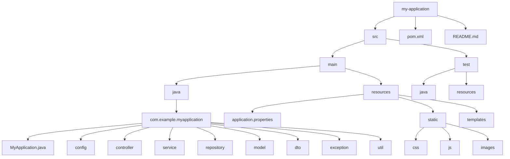

# 1 Spring Boot 项目结构

一个良好的项目结构是快速开发和维护 Spring Boot 应用的关键。Spring Boot 推荐遵循特定的项目结构约定，这样可以充分利用自动配置和约定优于配置的特性。

## 1.1 标准项目结构

一个典型的 Spring Boot 项目结构如下：

```
my-application/
├── src/
│   ├── main/
│   │   ├── java/
│   │   │   └── com/example/myapplication/
│   │   │       ├── MyApplication.java            # 主应用类
│   │   │       ├── config/                       # 配置类
│   │   │       ├── controller/                   # 控制器
│   │   │       ├── service/                      # 服务层
│   │   │       ├── repository/                   # 数据访问层
│   │   │       ├── model/                        # 模型/实体类
│   │   │       ├── dto/                          # 数据传输对象
│   │   │       ├── exception/                    # 自定义异常
│   │   │       └── util/                         # 工具类
│   │   └── resources/
│   │       ├── application.properties            # 主配置文件
│   │       ├── application-dev.properties        # 开发环境配置
│   │       ├── application-prod.properties       # 生产环境配置
│   │       ├── static/                           # 静态资源
│   │       │   ├── css/
│   │       │   ├── js/
│   │       │   └── images/
│   │       ├── templates/                        # 模板文件
│   │       ├── schema.sql                        # 数据库Schema
│   │       └── data.sql                          # 初始化数据
│   └── test/
│       ├── java/
│       │   └── com/example/myapplication/
│       │       ├── controller/                   # 控制器测试
│       │       ├── service/                      # 服务层测试
│       │       └── repository/                   # 数据访问层测试
│       └── resources/
│           └── application-test.properties       # 测试环境配置
├── pom.xml                                      # Maven配置
├── mvnw                                         # Maven包装器脚本
├── mvnw.cmd                                     # Windows Maven包装器脚本
├── .gitignore                                   # Git忽略文件
└── README.md                                    # 项目说明
```

## 1.2 项目结构可视化



## 1.3 各层结构说明

### 1.3.1 控制器层 (Controller)

控制器负责处理 HTTP 请求，并将请求委托给服务层处理。

```java
@RestController
@RequestMapping("/api/users")
public class UserController {

    @Autowired
    private UserService userService;

    @GetMapping
    public List<UserDTO> getAllUsers() {
        return userService.findAll();
    }

    @GetMapping("/{id}")
    public UserDTO getUserById(@PathVariable Long id) {
        return userService.findById(id);
    }

    @PostMapping
    @ResponseStatus(HttpStatus.CREATED)
    public UserDTO createUser(@RequestBody @Valid UserDTO userDTO) {
        return userService.create(userDTO);
    }

    // 其他方法...
}
```

### 1.3.2 服务层 (Service)

服务层包含业务逻辑，协调多个 Repository 的操作。

```java
@Service
public class UserServiceImpl implements UserService {

    @Autowired
    private UserRepository userRepository;

    @Autowired
    private UserMapper userMapper;

    @Override
    public List<UserDTO> findAll() {
        return userRepository.findAll().stream()
                .map(userMapper::toDTO)
                .collect(Collectors.toList());
    }

    @Override
    public UserDTO findById(Long id) {
        User user = userRepository.findById(id)
                .orElseThrow(() -> new ResourceNotFoundException("User not found with id: " + id));
        return userMapper.toDTO(user);
    }

    @Override
    @Transactional
    public UserDTO create(UserDTO userDTO) {
        // 业务逻辑...
        User user = userMapper.toEntity(userDTO);
        user = userRepository.save(user);
        return userMapper.toDTO(user);
    }

    // 其他方法...
}
```

### 1.3.3 数据访问层 (Repository)

Repository 层负责与数据库交互，通常使用 Spring Data JPA 或其他 ORM 框架。

```java
@Repository
public interface UserRepository extends JpaRepository<User, Long> {

    Optional<User> findByEmail(String email);

    List<User> findByLastName(String lastName);

    @Query("SELECT u FROM User u WHERE u.firstName LIKE %:name% OR u.lastName LIKE %:name%")
    List<User> findByName(@Param("name") String name);
}
```

### 1.3.4 模型层 (Model)

模型或实体类代表数据库表或文档。

```java
@Entity
@Table(name = "users")
public class User {

    @Id
    @GeneratedValue(strategy = GenerationType.IDENTITY)
    private Long id;

    @Column(nullable = false)
    private String firstName;

    @Column(nullable = false)
    private String lastName;

    @Column(nullable = false, unique = true)
    private String email;

    @Column(nullable = false)
    private String password;

    // 构造函数、getter和setter、equals和hashCode方法...
}
```

### 1.3.5 数据传输对象 (DTO)

DTO 用于在不同层之间传输数据，通常与实体类分离。

```java
public class UserDTO {

    private Long id;
    private String firstName;
    private String lastName;
    private String email;
    // 不包含敏感信息，如密码

    // 构造函数、getter和setter...
}
```

### 1.3.6 映射器 (Mapper)

将实体对象转换为 DTO，反之亦然。可以使用 MapStruct 等工具自动生成。

```java
@Mapper(componentModel = "spring")
public interface UserMapper {

    UserDTO toDTO(User user);

    User toEntity(UserDTO userDTO);

    // 自定义映射方法...
}
```

## 1.4 配置类

配置类用于自定义 Spring Boot 的自动配置或添加新的配置。

```java
@Configuration
public class WebConfig implements WebMvcConfigurer {

    @Override
    public void addCorsMappings(CorsRegistry registry) {
        registry.addMapping("/api/**")
                .allowedOrigins("http://localhost:3000")
                .allowedMethods("GET", "POST", "PUT", "DELETE")
                .allowCredentials(true);
    }

    @Bean
    public FilterRegistrationBean<RequestLoggingFilter> loggingFilter() {
        FilterRegistrationBean<RequestLoggingFilter> registrationBean = new FilterRegistrationBean<>();
        RequestLoggingFilter loggingFilter = new RequestLoggingFilter();
        loggingFilter.setIncludeQueryString(true);
        loggingFilter.setIncludePayload(true);
        loggingFilter.setMaxPayloadLength(10000);
        registrationBean.setFilter(loggingFilter);
        registrationBean.addUrlPatterns("/api/*");
        return registrationBean;
    }
}
```

## 1.5 启动类

启动类是应用的入口点，包含 main 方法和 Spring Boot 的主要配置。

```java
@SpringBootApplication
public class MyApplication {

    public static void main(String[] args) {
        SpringApplication.run(MyApplication.class, args);
    }
}
```

`@SpringBootApplication` 注解是一个组合注解，等同于：

```java
@Configuration
@EnableAutoConfiguration
@ComponentScan
public class MyApplication {
    // ...
}
```

- **@Configuration**: 标识该类为配置类
- **@EnableAutoConfiguration**: 启用 Spring Boot 的自动配置
- **@ComponentScan**: 扫描同包或子包中的组件

## 1.6 自定义启动类

可以自定义应用的启动配置：

```java
@SpringBootApplication
public class MyApplication {

    public static void main(String[] args) {
        SpringApplication application = new SpringApplication(MyApplication.class);

        // 自定义Banner
        application.setBannerMode(Banner.Mode.OFF);

        // 添加自定义属性
        Map<String, Object> properties = new HashMap<>();
        properties.put("spring.application.name", "MyCustomApp");
        application.setDefaultProperties(properties);

        // 添加监听器
        application.addListeners(new ApplicationStartingListener());

        // 启动应用
        application.run(args);
    }

    // 定义Bean
    @Bean
    public CommandLineRunner commandLineRunner() {
        return args -> {
            // 应用启动后执行的逻辑
            System.out.println("Application started!");
        };
    }
}
```

## 1.7 资源文件结构

### 1.7.1 application.properties/yml

主配置文件，包含应用的通用配置。

```yaml
# application.yml
spring:
  application:
    name: my-application

  datasource:
    url: jdbc:mysql://localhost:3306/mydb
    username: root
    password: password
    driver-class-name: com.mysql.cj.jdbc.Driver

  jpa:
    hibernate:
      ddl-auto: update
    show-sql: true

server:
  port: 8080
  servlet:
    context-path: /api
```

### 1.7.2 多环境配置

可以使用不同的配置文件处理不同的环境。

```yaml
# application-dev.yml
spring:
  datasource:
    url: jdbc:h2:mem:testdb

logging:
  level:
    root: DEBUG
    org.springframework.web: DEBUG
```

```yaml
# application-prod.yml
spring:
  datasource:
    url: jdbc:mysql://production-db:3306/mydb

logging:
  level:
    root: WARN
    com.example.myapplication: INFO
```

## 1.8 常见项目结构模式

### 1.8.1 分层架构

最常见的结构，按功能层次组织代码。

```
com.example.myapplication/
├── controller/
├── service/
├── repository/
└── model/
```

### 1.8.2 按功能划分

按业务功能或领域模型组织代码。

```
com.example.myapplication/
├── user/         # 用户相关功能
│   ├── UserController.java
│   ├── UserService.java
│   ├── UserRepository.java
│   └── User.java
├── product/      # 产品相关功能
│   ├── ProductController.java
│   ├── ProductService.java
│   ├── ProductRepository.java
│   └── Product.java
└── common/       # 通用组件
    ├── config/
    ├── exception/
    └── util/
```

### 1.8.3 六边形架构（端口和适配器）

将业务逻辑与外部系统隔离，通过端口和适配器进行交互。

```
com.example.myapplication/
├── domain/           # 核心业务逻辑
│   ├── model/
│   └── service/
├── port/             # 端口（接口）
│   ├── incoming/     # 入站端口
│   └── outgoing/     # 出站端口
└── adapter/          # 适配器
    ├── incoming/     # 入站适配器（如API控制器）
    └── outgoing/     # 出站适配器（如数据库Repository）
```

## 1.9 小结

一个良好组织的 Spring Boot 项目结构能够提高开发效率、代码可维护性和可扩展性。Spring Boot 本身并不强制特定的项目结构，但遵循约定的结构可以更好地利用其自动配置特性。

根据项目规模和复杂性，可以选择合适的项目结构模式。对于小型项目，传统的分层架构就足够了；对于大型项目，可能需要考虑按功能划分或采用六边形架构等更高级的组织方式。

