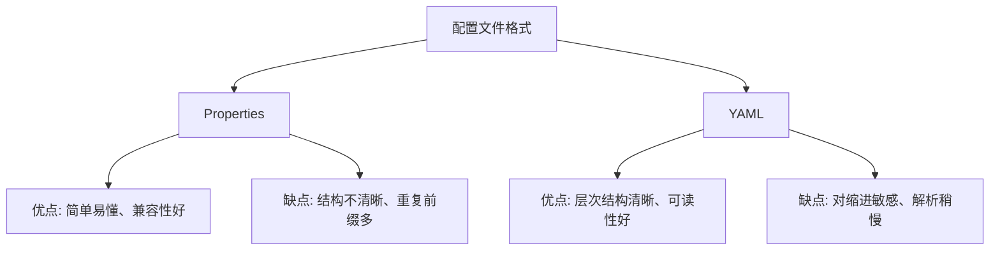
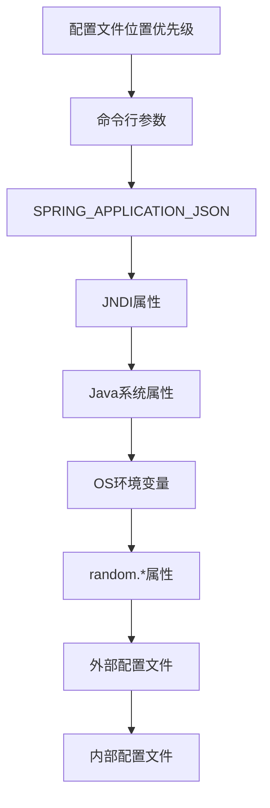
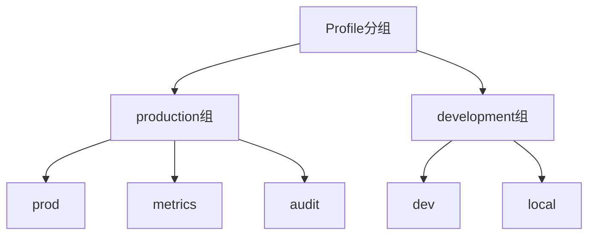

# 1 Spring Boot 配置体系

Spring Boot 提供了一个灵活而强大的配置体系，使应用程序的配置变得简单和集中。本文将详细介绍 Spring Boot 的配置机制、配置文件类型、优先级规则以及常用配置方式。

## 1.1 配置文件类型

Spring Boot 支持多种配置文件格式，主要有以下几种：

### 1.1.1 properties 格式

传统的键值对格式，使用 `.properties` 文件扩展名：

```properties
# application.properties
server.port=8080
spring.application.name=my-app
spring.datasource.url=jdbc:mysql://localhost:3306/mydb
spring.datasource.username=root
spring.datasource.password=password
```

### 1.1.2 YAML 格式

YAML 格式更加结构化，使用 `.yml` 或 `.yaml` 文件扩展名：

```yaml
# application.yml
server:
  port: 8080

spring:
  application:
    name: my-app
  datasource:
    url: jdbc:mysql://localhost:3306/mydb
    username: root
    password: password
```

YAML 格式的优势：

- 层次结构清晰
- 支持复杂数据结构
- 可读性更好
- 更少的重复前缀



## 1.2 配置文件位置

Spring Boot 会按照以下位置（按优先级从高到低）查找配置文件：

1. 命令行参数
2. `SPRING_APPLICATION_JSON` 环境变量中的 JSON
3. `java:comp/env` 中的 JNDI 属性
4. Java 系统属性 (`System.getProperties()`)
5. 操作系统环境变量
6. `random.*` 属性
7. 应用外部的 `application-{profile}.properties` 或 YAML 文件
   - 在 `./config/` 子目录下
   - 在当前目录下
   - 在 classpath 下的 `/config` 包内
   - 在 classpath 根目录
8. 应用内部的 `application-{profile}.properties` 或 YAML 文件
9. 应用内部的 `application.properties` 或 YAML 文件



## 1.3 配置加载优先级

当存在多个配置源时，Spring Boot 会根据以下规则合并它们：

1. 如果同一属性在多个配置源中出现，高优先级的值会覆盖低优先级的值
2. 列表属性会被替换而不是合并
3. Profile 特定的配置会覆盖默认配置

### 1.3.1 实际示例

假设有以下配置：

命令行：

```
java -jar myapp.jar --server.port=9000
```

`application.yml`：

```yaml
server:
  port: 8080
  servlet:
    context-path: /api

spring:
  datasource:
    url: jdbc:mysql://localhost:3306/mydb
```

`application-dev.yml`：

```yaml
server:
  port: 8081

spring:
  datasource:
    username: dev-user
    password: dev-pass
```

最终运行时的配置（假设 profile 为 `dev`）：

- `server.port`: 9000（来自命令行，最高优先级）
- `server.servlet.context-path`: /api（来自 application.yml）
- `spring.datasource.url`: jdbc:mysql://localhost:3306/mydb（来自 application.yml）
- `spring.datasource.username`: dev-user（来自 application-dev.yml）
- `spring.datasource.password`: dev-pass（来自 application-dev.yml）

## 1.4 Profile 配置

Spring Boot 的 Profile 是一种条件化配置机制，允许根据不同的环境或场景激活不同的配置。

### 1.4.1 Profile 配置文件

可以通过以下命名约定创建特定 Profile 的配置文件：

- `application-{profile}.properties`
- `application-{profile}.yml`

例如：

- `application-dev.yml` - 开发环境配置
- `application-test.yml` - 测试环境配置
- `application-prod.yml` - 生产环境配置

### 1.4.2 激活 Profile

有多种方式可以激活 Profile：

1. 命令行参数：

```
java -jar myapp.jar --spring.profiles.active=dev,local
```

2. 系统属性：

```
-Dspring.profiles.active=dev,local
```

3. 环境变量：

```
export SPRING_PROFILES_ACTIVE=dev,local
```

4. 在 `application.properties` 或 `application.yml` 中设置：

```properties
spring.profiles.active=dev,local
```

5. 通过 `SpringApplication` API：

```java
SpringApplication app = new SpringApplication(MyApp.class);
app.setAdditionalProfiles("dev", "local");
app.run(args);
```

### 1.4.3 Profile 分组

Spring Boot 2.4+ 引入了 Profile 分组功能，允许定义 Profile 组：

```yaml
spring:
  profiles:
    group:
      production:
        - prod
        - metrics
        - audit
      development:
        - dev
        - local
```

激活 `production` 组会同时激活 `prod`、`metrics` 和 `audit` profiles。



## 1.5 属性绑定

Spring Boot 提供了将配置属性绑定到 Java 对象的机制，使应用程序可以类型安全地访问配置。

### 1.5.1 @ConfigurationProperties

使用 `@ConfigurationProperties` 注解可以将配置属性绑定到 Java 类：

```java
@Component
@ConfigurationProperties(prefix = "app")
public class AppProperties {

    private String name;
    private String description;
    private Map<String, String> features = new HashMap<>();
    private Security security = new Security();

    // getters and setters

    public static class Security {
        private boolean enabled;
        private String tokenSecret;
        private long tokenExpirationMs;

        // getters and setters
    }
}
```

对应的 YAML 配置：

```yaml
app:
  name: My Application
  description: A sample Spring Boot application
  features:
    feature1: enabled
    feature2: disabled
  security:
    enabled: true
    token-secret: secret123
    token-expiration-ms: 3600000
```

### 1.5.2 @Value 注解

对于简单的配置注入，可以使用 `@Value` 注解：

```java
@Component
public class MyComponent {

    @Value("${server.port}")
    private int serverPort;

    @Value("${app.name:Default App}")
    private String appName;  // 冒号后面是默认值

    @Value("${app.features.feature1}")
    private String feature1;
}
```

`@ConfigurationProperties` 和 `@Value` 的对比：

| 特性         | @ConfigurationProperties | @Value   |
| ------------ | ------------------------ | -------- |
| 宽松绑定     | 支持                     | 不支持   |
| 元数据支持   | 支持                     | 不支持   |
| SpEL 表达式  | 不支持                   | 支持     |
| 复杂类型绑定 | 支持                     | 有限支持 |
| 批量绑定     | 支持                     | 不支持   |

## 1.6 配置属性验证

可以使用 JSR-303 (Bean Validation) 来验证配置属性：

```java
@Component
@ConfigurationProperties(prefix = "app")
@Validated
public class AppProperties {

    @NotNull
    @Size(min = 1, max = 100)
    private String name;

    @Min(0)
    @Max(65535)
    private int maxConnections = 100;

    @Pattern(regexp = "^[a-z0-9]+$")
    private String code;

    // getters and setters
}
```

如果验证失败，应用启动时会抛出异常。

## 1.7 配置加密

对于敏感信息（如密码、密钥等），Spring Boot 支持通过 [Jasypt](http://www.jasypt.org/) 等库进行属性加密：

1. 添加依赖：

```xml
<dependency>
    <groupId>com.github.ulisesbocchio</groupId>
    <artifactId>jasypt-spring-boot-starter</artifactId>
    <version>3.0.4</version>
</dependency>
```

2. 配置加密密钥：

```yaml
jasypt:
  encryptor:
    password: your-secret-key
```

3. 使用加密的属性：

```yaml
spring:
  datasource:
    password: ENC(encrypted-password-here)
```

## 1.8 外部化配置

### 1.8.1 命令行参数

可以通过命令行参数覆盖配置：

```
java -jar myapp.jar --server.port=9000 --spring.profiles.active=prod
```

### 1.8.2 环境变量

Spring Boot 会自动将环境变量转换为配置属性：

- 环境变量通常使用大写和下划线
- Spring Boot 会自动将其转换为小写和点号分隔

例如：

| 环境变量                 | 配置属性                 |
| ------------------------ | ------------------------ |
| `SERVER_PORT`            | `server.port`            |
| `SPRING_DATASOURCE_URL`  | `spring.datasource.url`  |
| `MY_APP_FEATURE_ENABLED` | `my.app.feature.enabled` |

### 1.8.3 配置文件外部化

可以通过以下方式指定外部配置文件位置：

1. 使用 `spring.config.location`：

```
java -jar myapp.jar --spring.config.location=file:///path/to/config/
```

2. 使用 `spring.config.additional-location`：

```
java -jar myapp.jar --spring.config.additional-location=file:///path/to/config/
```

3. 使用系统属性：

```
-Dspring.config.location=file:///path/to/config/
```

### 1.8.4 配置随机值

Spring Boot 提供了生成随机值的功能：

```yaml
my:
  secret: ${random.value}
  number: ${random.int}
  big-number: ${random.long}
  uuid: ${random.uuid}
  range: ${random.int(10,100)}
```

## 1.9 小结

Spring Boot 的配置体系功能强大且灵活，重点包括：

1. 支持 Properties 和 YAML 格式的配置文件
2. 明确的配置优先级规则
3. Profile 机制实现环境特定配置
4. 类型安全的配置属性绑定
5. 配置属性验证
6. 外部化配置和环境变量支持
7. 配置加密

掌握这些配置特性，可以使 Spring Boot 应用程序更加灵活、安全和易于维护。选择合适的配置方式，可以显著提高开发效率和应用程序的可配置性。

