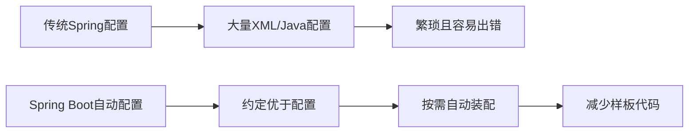
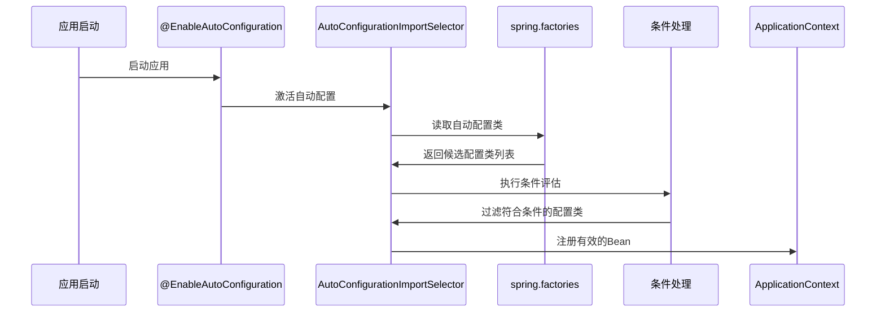

# 1 Spring Boot 自动配置原理

自动配置是 Spring Boot 最核心的特性之一，它能够根据类路径、Bean 和环境变量等条件自动配置 Spring 应用，大大简化了配置流程。本文将深入剖析 Spring Boot 自动配置的实现原理。

## 1.1 自动配置概述

传统的 Spring 应用需要大量的 XML 配置或 Java 配置来装配各种 Bean，而 Spring Boot 的自动配置能够根据引入的依赖自动配置所需的 Bean，极大地减少了手动配置的工作量。



## 1.2 自动配置的工作流程

Spring Boot 自动配置的核心工作流程可以概括为以下几个步骤：



### 1.2.1 @SpringBootApplication 注解

Spring Boot 应用的启动类通常标注 `@SpringBootApplication` 注解，该注解是一个复合注解，包含以下三个核心注解：

```java
@SpringBootConfiguration
@EnableAutoConfiguration
@ComponentScan
public @interface SpringBootApplication {
    // ...
}
```

其中 `@EnableAutoConfiguration` 注解是自动配置的触发点，它通过 `@Import` 导入了 `AutoConfigurationImportSelector`：

```java
@Import(AutoConfigurationImportSelector.class)
public @interface EnableAutoConfiguration {
    // ...
}
```

### 1.2.2 AutoConfigurationImportSelector

`AutoConfigurationImportSelector` 是实现自动配置的关键类，它实现了 `DeferredImportSelector` 接口，在 Spring 容器启动过程中会被调用，执行以下主要任务：

1. 从 `META-INF/spring.factories` 文件中加载自动配置类
2. 根据条件注解过滤出符合条件的配置类
3. 处理配置类的优先级和排除关系
4. 将过滤后的配置类列表返回给 Spring 容器进行注册

以下是简化的关键代码流程：

```java
public class AutoConfigurationImportSelector implements DeferredImportSelector {

    @Override
    public String[] selectImports(AnnotationMetadata annotationMetadata) {
        // 1. 加载自动配置元数据
        AutoConfigurationMetadata autoConfigurationMetadata = getAutoConfigurationMetadata();

        // 2. 获取所有自动配置类
        List<String> configurations = getCandidateConfigurations(annotationMetadata, attributes);

        // 3. 移除重复项
        configurations = removeDuplicates(configurations);

        // 4. 根据@AutoConfigureOrder排序
        configurations = sort(configurations, autoConfigurationMetadata);

        // 5. 根据条件过滤
        configurations = filter(configurations, autoConfigurationMetadata);

        // 6. 触发自动配置导入事件
        fireAutoConfigurationImportEvents(configurations, exclusions);

        return configurations.toArray(new String[0]);
    }

    protected List<String> getCandidateConfigurations(AnnotationMetadata metadata, AnnotationAttributes attributes) {
        // 从META-INF/spring.factories加载自动配置类
        List<String> configurations = SpringFactoriesLoader.loadFactoryNames(
            EnableAutoConfiguration.class, getBeanClassLoader());
        return configurations;
    }
}
```

### 1.2.3 META-INF/spring.factories

Spring Boot 使用 Spring 的 `SpringFactoriesLoader` 机制加载自动配置类。各种 Spring Boot starter 依赖中都包含 `META-INF/spring.factories` 文件，其中定义了自动配置类：

```properties
# META-INF/spring.factories
org.springframework.boot.autoconfigure.EnableAutoConfiguration=\
com.example.autoconfigure.MyAutoConfiguration,\
com.example.autoconfigure.AnotherAutoConfiguration
```

`SpringFactoriesLoader` 会扫描类路径下所有的 `META-INF/spring.factories` 文件，并加载其中 `EnableAutoConfiguration` 对应的配置类。

### 1.2.4 条件评估和过滤

自动配置类通常使用 Spring 的条件注解来决定是否应该被激活。Spring Boot 提供了一系列 `@ConditionalOnXXX` 注解用于不同的条件判断：

```java
@Configuration
@ConditionalOnClass(DataSource.class)
@ConditionalOnMissingBean(DataSource.class)
public class DataSourceAutoConfiguration {

    @Bean
    @ConditionalOnProperty(name = "spring.datasource.url")
    public DataSource dataSource() {
        // 创建DataSource
    }
}
```

这个自动配置类只有在满足以下条件时才会被激活：

- 类路径中存在 `DataSource` 类
- 容器中不存在 `DataSource` 类型的 Bean
- 配置了 `spring.datasource.url` 属性

## 1.3 常用条件注解

Spring Boot 提供了丰富的条件注解，用于精确控制自动配置的行为：

| 注解                              | 条件                                   | 示例                                                             |
| --------------------------------- | -------------------------------------- | ---------------------------------------------------------------- |
| `@ConditionalOnClass`             | 当指定类存在于类路径时                 | `@ConditionalOnClass(DataSource.class)`                          |
| `@ConditionalOnMissingClass`      | 当指定类不存在于类路径时               | `@ConditionalOnMissingClass("oracle.jdbc.Driver")`               |
| `@ConditionalOnBean`              | 当容器中存在指定 Bean 时               | `@ConditionalOnBean(DataSource.class)`                           |
| `@ConditionalOnMissingBean`       | 当容器中不存在指定 Bean 时             | `@ConditionalOnMissingBean(DataSource.class)`                    |
| `@ConditionalOnProperty`          | 当配置属性满足条件时                   | `@ConditionalOnProperty(prefix="spring.datasource", name="url")` |
| `@ConditionalOnResource`          | 当存在指定资源时                       | `@ConditionalOnResource(resources="/config/db.properties")`      |
| `@ConditionalOnWebApplication`    | 当应用是 Web 应用时                    | `@ConditionalOnWebApplication`                                   |
| `@ConditionalOnNotWebApplication` | 当应用不是 Web 应用时                  | `@ConditionalOnNotWebApplication`                                |
| `@ConditionalOnExpression`        | 当 SpEL 表达式为 true 时               | `@ConditionalOnExpression("${my.feature.enabled:false}")`        |
| `@ConditionalOnJava`              | 当运行在指定 Java 版本时               | `@ConditionalOnJava(JavaVersion.EIGHT)`                          |
| `@ConditionalOnSingleCandidate`   | 当且仅当容器中有一个指定类型的 Bean 时 | `@ConditionalOnSingleCandidate(DataSource.class)`                |

这些条件注解可以组合使用，形成复杂的条件逻辑，实现灵活的自动配置。

## 1.4 自动配置类的加载顺序

自动配置类的加载顺序可以通过以下方式控制：

1. **@AutoConfigureBefore 和 @AutoConfigureAfter**：指定配置类的相对顺序

```java
@Configuration
@AutoConfigureAfter(DataSourceAutoConfiguration.class)
public class JpaAutoConfiguration {
    // ...
}
```

2. **@AutoConfigureOrder**：指定配置类的绝对顺序（数值越小优先级越高）

```java
@Configuration
@AutoConfigureOrder(Ordered.HIGHEST_PRECEDENCE)
public class SecurityAutoConfiguration {
    // ...
}
```

## 1.5 自定义自动配置

开发者可以创建自己的自动配置，步骤如下：

### 1.5.1 创建配置类

```java
@Configuration
@ConditionalOnClass(MyService.class)
@ConditionalOnMissingBean(MyService.class)
@EnableConfigurationProperties(MyProperties.class)
public class MyAutoConfiguration {

    @Autowired
    private MyProperties properties;

    @Bean
    public MyService myService() {
        return new MyServiceImpl(properties.getConfig());
    }
}
```

### 1.5.2 创建配置属性类

```java
@ConfigurationProperties(prefix = "my.service")
public class MyProperties {

    private String config;

    // getter and setter

    public String getConfig() {
        return config;
    }

    public void setConfig(String config) {
        this.config = config;
    }
}
```

### 1.5.3 注册自动配置类

在 `META-INF/spring.factories` 文件中注册自动配置：

```properties
org.springframework.boot.autoconfigure.EnableAutoConfiguration=\
com.example.MyAutoConfiguration
```

### 1.5.4 添加依赖

确保自动配置模块的依赖关系正确：

```xml
<dependency>
    <groupId>org.springframework.boot</groupId>
    <artifactId>spring-boot-autoconfigure</artifactId>
</dependency>
<dependency>
    <groupId>org.springframework.boot</groupId>
    <artifactId>spring-boot-configuration-processor</artifactId>
    <optional>true</optional>
</dependency>
```

### 1.5.5 实践示例：自定义 Redis 自动配置

```java
@Configuration
@ConditionalOnClass(RedisClient.class)
@EnableConfigurationProperties(RedisProperties.class)
public class RedisAutoConfiguration {

    @Autowired
    private RedisProperties properties;

    @Bean
    @ConditionalOnMissingBean
    public RedisClient redisClient() {
        RedisClient client = new RedisClient();
        client.setHost(properties.getHost());
        client.setPort(properties.getPort());
        client.setPassword(properties.getPassword());
        return client;
    }

    @Bean
    @ConditionalOnMissingBean
    @ConditionalOnBean(RedisClient.class)
    public RedisTemplate redisTemplate(RedisClient redisClient) {
        RedisTemplate template = new RedisTemplate();
        template.setClient(redisClient);
        return template;
    }
}
```

```java
@ConfigurationProperties(prefix = "redis")
public class RedisProperties {

    private String host = "localhost";
    private int port = 6379;
    private String password;

    // getters and setters
}
```

## 1.6 自动配置原理深入分析

### 1.6.1 条件注解的实现原理

Spring Boot 的条件注解都基于 Spring 4 引入的 `@Conditional` 注解，该注解接受 `Condition` 接口的实现类：

```java
@Target({ElementType.TYPE, ElementType.METHOD})
@Retention(RetentionPolicy.RUNTIME)
@Documented
public @interface Conditional {
    Class<? extends Condition>[] value();
}
```

每个条件注解都有对应的 `Condition` 实现，例如 `@ConditionalOnClass` 对应 `OnClassCondition`：

```java
@Target({ElementType.TYPE, ElementType.METHOD})
@Retention(RetentionPolicy.RUNTIME)
@Documented
@Conditional(OnClassCondition.class)
public @interface ConditionalOnClass {
    Class<?>[] value() default {};
    String[] name() default {};
}
```

`Condition` 接口定义了一个 `matches` 方法，用于判断条件是否满足：

```java
public interface Condition {
    boolean matches(ConditionContext context, AnnotatedTypeMetadata metadata);
}
```

### 1.6.2 自动配置排除机制

Spring Boot 提供了多种方式排除自动配置：

1. 使用 `@EnableAutoConfiguration` 的 `exclude` 属性：

```java
@EnableAutoConfiguration(exclude = {DataSourceAutoConfiguration.class})
```

2. 使用 `@SpringBootApplication` 的 `exclude` 属性：

```java
@SpringBootApplication(exclude = {DataSourceAutoConfiguration.class})
```

3. 使用配置属性：

```properties
spring.autoconfigure.exclude=org.springframework.boot.autoconfigure.jdbc.DataSourceAutoConfiguration
```

### 1.6.3 自动配置报告

Spring Boot 提供了查看自动配置的调试报告功能，可以通过以下方式启用：

1. 命令行参数：`--debug`
2. 配置属性：`debug=true`

输出报告包含：

- Positive matches（已匹配的自动配置）
- Negative matches（未匹配的自动配置及原因）
- Exclusions（被排除的自动配置）
- Unconditional classes（无条件的自动配置）

## 1.7 常见自动配置示例

### 1.7.1 Web 自动配置 (WebMvcAutoConfiguration)

```java
@Configuration
@ConditionalOnWebApplication(type = Type.SERVLET)
@ConditionalOnClass({ Servlet.class, DispatcherServlet.class, WebMvcConfigurer.class })
@ConditionalOnMissingBean(WebMvcConfigurationSupport.class)
@AutoConfigureOrder(Ordered.HIGHEST_PRECEDENCE + 10)
@AutoConfigureAfter({ DispatcherServletAutoConfiguration.class, TaskExecutionAutoConfiguration.class,
        ValidationAutoConfiguration.class })
public class WebMvcAutoConfiguration {
    // ...
}
```

### 1.7.2 数据源自动配置 (DataSourceAutoConfiguration)

```java
@Configuration
@ConditionalOnClass({ DataSource.class, EmbeddedDatabaseType.class })
@EnableConfigurationProperties(DataSourceProperties.class)
@Import({ DataSourcePoolMetadataProvidersConfiguration.class, DataSourceInitializationConfiguration.class })
public class DataSourceAutoConfiguration {
    // ...
}
```

### 1.7.3 JPA 自动配置 (JpaAutoConfiguration)

```java
@Configuration
@ConditionalOnClass({ LocalContainerEntityManagerFactoryBean.class, EntityManager.class, jakarta.persistence.EntityManagerFactory.class })
@ConditionalOnMissingBean(AbstractEntityManagerFactoryBean.class)
@EnableConfigurationProperties(JpaProperties.class)
@AutoConfigureAfter({ DataSourceAutoConfiguration.class })
public class JpaAutoConfiguration {
    // ...
}
```

## 1.8 调试自动配置

在开发或调试过程中，了解自动配置的行为对于排查问题非常有帮助：

1. **查看自动配置报告**：

```
java -jar myapp.jar --debug
```

2. **查看当前环境中加载的 Bean**：

使用 Actuator 的 `/beans` 端点（需要添加 `spring-boot-starter-actuator` 依赖）：

```yaml
management:
  endpoints:
    web:
      exposure:
        include: beans
```

3. **查看条件评估详情**：

使用 Actuator 的 `/conditions` 端点：

```yaml
management:
  endpoints:
    web:
      exposure:
        include: conditions
```

## 1.9 小结

Spring Boot 自动配置是一种强大的机制，它通过以下关键点简化了 Spring 应用的配置：

1. **约定优于配置**：提供合理的默认配置，减少开发者的决策负担
2. **条件化配置**：基于类路径、Bean 和环境等条件智能加载配置
3. **模块化设计**：每个功能模块提供独立的自动配置，可按需引入
4. **可覆盖性**：自动配置总是可以被显式配置覆盖，保持灵活性

深入理解自动配置原理，可以更好地利用 Spring Boot 提升开发效率，并在需要时进行自定义扩展。

