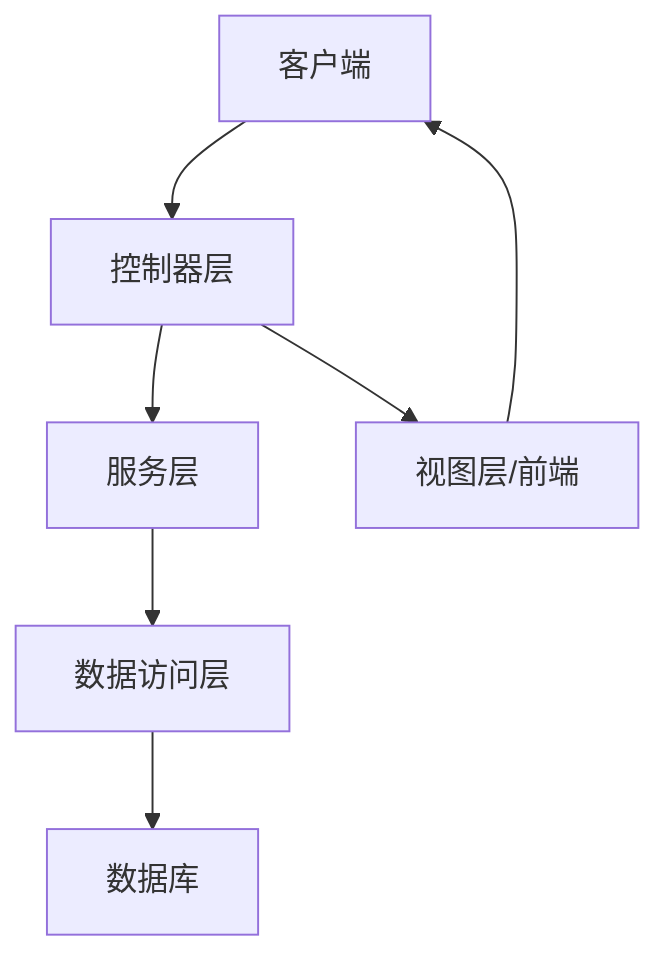

# 1 Spring Boot Web 开发

Spring Boot 为 Web 应用开发提供了全面的支持，从 RESTful API 到传统的 MVC 应用，从静态资源到模板引擎，都能轻松实现。本文将详细介绍 Spring Boot Web 开发的核心内容。

## 1.1 入门：创建 Web 应用

要创建一个 Spring Boot Web 应用，首先需要添加 `spring-boot-starter-web` 依赖：

```xml
<dependency>
    <groupId>org.springframework.boot</groupId>
    <artifactId>spring-boot-starter-web</artifactId>
</dependency>
```

这个 starter 包含以下核心组件：

- Spring MVC（Web 框架）
- Tomcat（内嵌服务器）
- Jackson（JSON 序列化/反序列化）
- Spring 验证（数据验证）

一个最小的 Spring Boot Web 应用如下：

```java
@SpringBootApplication
public class MyWebApplication {
    public static void main(String[] args) {
        SpringApplication.run(MyWebApplication.class, args);
    }
}

@RestController
class HelloController {
    @GetMapping("/hello")
    public String hello() {
        return "Hello, Spring Boot!";
    }
}
```

启动应用后，访问 http://localhost:8080/hello 就能看到"Hello, Spring Boot!"的输出。

## 1.2 Web 应用架构

一个典型的 Spring Boot Web 应用架构包含以下层次：



各层职责：

- **控制器层**：处理 HTTP 请求，调用服务层，返回响应
- **服务层**：实现业务逻辑
- **数据访问层**：与数据库交互
- **视图层**：生成用户界面（传统 MVC）或前端应用（前后端分离）

## 1.3 REST API 开发

RESTful API 是当今主流的 Web 服务开发方式，Spring Boot 使其变得简单明了。

### 1.3.1 控制器基础

使用 `@RestController` 注解标记 REST 控制器：

```java
@RestController
@RequestMapping("/api/users")
public class UserController {

    @Autowired
    private UserService userService;

    @GetMapping
    public List<User> getAllUsers() {
        return userService.findAll();
    }

    @GetMapping("/{id}")
    public User getUser(@PathVariable Long id) {
        return userService.findById(id)
            .orElseThrow(() -> new ResourceNotFoundException("User not found"));
    }

    @PostMapping
    @ResponseStatus(HttpStatus.CREATED)
    public User createUser(@RequestBody @Valid UserDTO userDTO) {
        return userService.create(userDTO);
    }

    @PutMapping("/{id}")
    public User updateUser(@PathVariable Long id, @RequestBody @Valid UserDTO userDTO) {
        return userService.update(id, userDTO);
    }

    @DeleteMapping("/{id}")
    @ResponseStatus(HttpStatus.NO_CONTENT)
    public void deleteUser(@PathVariable Long id) {
        userService.delete(id);
    }
}
```

### 1.3.2 常用注解

Spring MVC 提供了丰富的注解，便于开发 RESTful API：

| 注解              | 用途             | 示例                                  |
| ----------------- | ---------------- | ------------------------------------- |
| `@RequestMapping` | 映射请求路径     | `@RequestMapping("/api/users")`       |
| `@GetMapping`     | 映射 GET 请求    | `@GetMapping("/{id}")`                |
| `@PostMapping`    | 映射 POST 请求   | `@PostMapping`                        |
| `@PutMapping`     | 映射 PUT 请求    | `@PutMapping("/{id}")`                |
| `@DeleteMapping`  | 映射 DELETE 请求 | `@DeleteMapping("/{id}")`             |
| `@PatchMapping`   | 映射 PATCH 请求  | `@PatchMapping("/{id}")`              |
| `@PathVariable`   | 获取路径变量     | `@PathVariable Long id`               |
| `@RequestParam`   | 获取查询参数     | `@RequestParam String name`           |
| `@RequestBody`    | 获取请求体       | `@RequestBody UserDTO userDTO`        |
| `@RequestHeader`  | 获取请求头       | `@RequestHeader String authorization` |
| `@ResponseStatus` | 设置响应状态码   | `@ResponseStatus(HttpStatus.CREATED)` |
| `@Valid`          | 触发数据验证     | `@Valid UserDTO userDTO`              |

### 1.3.3 请求参数解析

Spring Boot 支持多种方式获取请求参数：

1. **路径变量**：

```java
@GetMapping("/users/{id}")
public User getUser(@PathVariable Long id) {
    // ...
}
```

2. **查询参数**：

```java
@GetMapping("/users")
public List<User> searchUsers(
        @RequestParam(required = false) String name,
        @RequestParam(defaultValue = "0") int page,
        @RequestParam(defaultValue = "10") int size) {
    // ...
}
```

3. **请求体**：

```java
@PostMapping("/users")
public User createUser(@RequestBody UserDTO userDTO) {
    // ...
}
```

4. **表单数据**：

```java
@PostMapping("/users/form")
public User createUserFromForm(UserForm form) {
    // 自动绑定表单字段到 UserForm 对象
    // ...
}
```

### 1.3.4 响应处理

Spring Boot 默认使用 Jackson 将对象转换为 JSON：

```java
@GetMapping("/users")
public List<User> getAllUsers() {
    return userService.findAll(); // 自动转换为 JSON
}
```

如果需要自定义 JSON 转换：

```java
@JsonInclude(JsonInclude.Include.NON_NULL)
@JsonIgnoreProperties(ignoreUnknown = true)
public class User {
    private Long id;

    private String name;

    @JsonProperty("user_email")
    private String email;

    @JsonIgnore
    private String password;

    @JsonFormat(pattern = "yyyy-MM-dd HH:mm:ss")
    private Date createdAt;

    // getters and setters
}
```

### 1.3.5 数据验证

使用 JSR-303 Bean Validation 进行数据验证：

```java
public class UserDTO {

    @NotBlank(message = "Name is required")
    @Size(min = 2, max = 50, message = "Name must be between 2 and 50 characters")
    private String name;

    @NotBlank(message = "Email is required")
    @Email(message = "Email should be valid")
    private String email;

    @NotBlank(message = "Password is required")
    @Size(min = 6, message = "Password must be at least 6 characters")
    private String password;

    // getters and setters
}
```

在控制器中使用 `@Valid` 注解触发验证：

```java
@PostMapping("/users")
public User createUser(@RequestBody @Valid UserDTO userDTO) {
    return userService.create(userDTO);
}
```

## 1.4 异常处理

Spring Boot 提供了多种异常处理机制，帮助开发者构建健壮的 Web 应用。

### 1.4.1 @ExceptionHandler

在控制器内处理异常：

```java
@RestController
public class UserController {

    // ... 其他方法

    @ExceptionHandler(ResourceNotFoundException.class)
    @ResponseStatus(HttpStatus.NOT_FOUND)
    public Map<String, String> handleResourceNotFoundException(ResourceNotFoundException ex) {
        Map<String, String> response = new HashMap<>();
        response.put("message", ex.getMessage());
        return response;
    }
}
```

### 1.4.2 @ControllerAdvice 全局异常处理

处理所有控制器的异常：

```java
@RestControllerAdvice
public class GlobalExceptionHandler {

    @ExceptionHandler(ResourceNotFoundException.class)
    @ResponseStatus(HttpStatus.NOT_FOUND)
    public ApiError handleResourceNotFoundException(ResourceNotFoundException ex) {
        return new ApiError("NOT_FOUND", ex.getMessage());
    }

    @ExceptionHandler(MethodArgumentNotValidException.class)
    @ResponseStatus(HttpStatus.BAD_REQUEST)
    public ApiError handleValidationExceptions(MethodArgumentNotValidException ex) {
        List<String> errors = ex.getBindingResult()
                .getFieldErrors()
                .stream()
                .map(error -> error.getField() + ": " + error.getDefaultMessage())
                .collect(Collectors.toList());

        return new ApiError("VALIDATION_FAILED", "Validation failed", errors);
    }

    @ExceptionHandler(Exception.class)
    @ResponseStatus(HttpStatus.INTERNAL_SERVER_ERROR)
    public ApiError handleAllExceptions(Exception ex) {
        return new ApiError("SERVER_ERROR", "An unexpected error occurred");
    }
}

// API 错误响应模型
public class ApiError {
    private String code;
    private String message;
    private List<String> details;

    // 构造函数、getter 和 setter
}
```

### 1.4.3 自定义错误页面

对于浏览器请求，可以自定义错误页面：

1. 在 `src/main/resources/templates/error/` 目录下创建错误页面：

   - `404.html` - 处理 404 错误
   - `500.html` - 处理 500 错误
   - `error.html` - 处理所有其他错误

2. 或者创建自定义错误控制器：

```java
@Controller
public class CustomErrorController implements ErrorController {

    @RequestMapping("/error")
    public String handleError(HttpServletRequest request) {
        Object status = request.getAttribute(RequestDispatcher.ERROR_STATUS_CODE);

        if (status != null) {
            int statusCode = Integer.parseInt(status.toString());

            if (statusCode == HttpStatus.NOT_FOUND.value()) {
                return "error/404";
            } else if (statusCode == HttpStatus.INTERNAL_SERVER_ERROR.value()) {
                return "error/500";
            }
        }
        return "error/error";
    }
}
```

## 1.5 静态资源处理

Spring Boot 自动配置了静态资源处理，默认从以下位置加载：

- `/static`
- `/public`
- `/resources`
- `/META-INF/resources`

例如，`src/main/resources/static/css/style.css` 可以通过 `http://localhost:8080/css/style.css` 访问。

### 1.5.1 自定义静态资源配置

可以在 `application.properties` 或 `application.yml` 中自定义静态资源配置：

```yaml
spring:
  web:
    resources:
      # 自定义静态资源路径
      static-locations: classpath:/custom-static/

      # 静态资源缓存控制
      cache:
        period: 3600 # 秒为单位

      # 添加版本号到资源URL
      chain:
        strategy:
          content:
            enabled: true
            paths: "/**"
```

### 1.5.2 WebJars 支持

Spring Boot 支持通过 WebJars 使用客户端库：

```xml
<dependency>
    <groupId>org.webjars</groupId>
    <artifactId>bootstrap</artifactId>
    <version>5.1.3</version>
</dependency>
```

然后可以通过 `/webjars/bootstrap/5.1.3/css/bootstrap.min.css` 访问资源。

## 1.6 模板引擎

Spring Boot 支持多种模板引擎，最常用的是 Thymeleaf。

### 1.6.1 Thymeleaf 集成

添加依赖：

```xml
<dependency>
    <groupId>org.springframework.boot</groupId>
    <artifactId>spring-boot-starter-thymeleaf</artifactId>
</dependency>
```

创建控制器：

```java
@Controller
public class WebController {

    @GetMapping("/")
    public String home(Model model) {
        model.addAttribute("message", "Welcome to Spring Boot!");
        return "home"; // 对应 src/main/resources/templates/home.html
    }

    @GetMapping("/users")
    public String listUsers(Model model) {
        List<User> users = userService.findAll();
        model.addAttribute("users", users);
        return "users/list";
    }
}
```

创建 Thymeleaf 模板（`src/main/resources/templates/home.html`）：

```html
<!DOCTYPE html>
<html xmlns:th="http://www.thymeleaf.org">
  <head>
    <title>Home</title>
    <link rel="stylesheet" th:href="@{/css/style.css}" />
  </head>
  <body>
    <h1 th:text="${message}">Default Message</h1>

    <p>
      Current time:
      <span
        th:text="${#temporals.format(#temporals.createNow(), 'yyyy-MM-dd HH:mm')}"
        >2023-01-01</span
      >
    </p>

    <a th:href="@{/users}">View Users</a>
  </body>
</html>
```

用户列表模板（`src/main/resources/templates/users/list.html`）：

```html
<!DOCTYPE html>
<html xmlns:th="http://www.thymeleaf.org">
  <head>
    <title>Users</title>
    <link rel="stylesheet" th:href="@{/css/style.css}" />
  </head>
  <body>
    <h1>User List</h1>

    <table>
      <thead>
        <tr>
          <th>ID</th>
          <th>Name</th>
          <th>Email</th>
          <th>Actions</th>
        </tr>
      </thead>
      <tbody>
        <tr th:each="user : ${users}">
          <td th:text="${user.id}">1</td>
          <td th:text="${user.name}">John Doe</td>
          <td th:text="${user.email}">john@example.com</td>
          <td>
            <a th:href="@{/users/{id}(id=${user.id})}">View</a>
            <a th:href="@{/users/{id}/edit(id=${user.id})}">Edit</a>
          </td>
        </tr>
      </tbody>
    </table>

    <a th:href="@{/users/new}">Add User</a>
    <a th:href="@{/}">Back to Home</a>
  </body>
</html>
```

### 1.6.2 Thymeleaf 常用语法

Thymeleaf 提供了丰富的模板语法：

1. **变量表达式**：`${...}`

   ```html
   <p th:text="${user.name}">Default Name</p>
   ```

2. **选择变量表达式**：`*{...}`（配合 `th:object` 使用）

   ```html
   <div th:object="${user}">
     <p th:text="*{name}">Default Name</p>
     <p th:text="*{email}">default@example.com</p>
   </div>
   ```

3. **链接表达式**：`@{...}`

   ```html
   <a th:href="@{/users/{id}(id=${user.id})}">View</a>
   ```

4. **条件判断**：

   ```html
   <div th:if="${not #lists.isEmpty(users)}">
     <!-- 有用户时显示 -->
   </div>
   <div th:unless="${not #lists.isEmpty(users)}">
     <!-- 无用户时显示 -->
   </div>
   ```

5. **遍历集合**：

   ```html
   <tr th:each="user, stat : ${users}">
     <td th:text="${stat.count}">1</td>
     <td th:text="${user.name}">John</td>
   </tr>
   ```

6. **片段包含**：
   ```html
   <div th:replace="fragments/header :: header">Header</div>
   <div th:insert="fragments/footer :: footer">Footer</div>
   ```

### 1.6.3 其他模板引擎

Spring Boot 也支持其他模板引擎：

1. **FreeMarker**：

   ```xml
   <dependency>
       <groupId>org.springframework.boot</groupId>
       <artifactId>spring-boot-starter-freemarker</artifactId>
   </dependency>
   ```

2. **Mustache**：

   ```xml
   <dependency>
       <groupId>org.springframework.boot</groupId>
       <artifactId>spring-boot-starter-mustache</artifactId>
   </dependency>
   ```

3. **Groovy Templates**：
   ```xml
   <dependency>
       <groupId>org.springframework.boot</groupId>
       <artifactId>spring-boot-starter-groovy-templates</artifactId>
   </dependency>
   ```

## 1.7 Web 应用安全

虽然详细的安全配置会在专门的章节中介绍，但这里简要介绍 Web 安全的基础设置：

```xml
<dependency>
    <groupId>org.springframework.boot</groupId>
    <artifactId>spring-boot-starter-security</artifactId>
</dependency>
```

基本配置：

```java
@Configuration
@EnableWebSecurity
public class SecurityConfig extends WebSecurityConfigurerAdapter {

    @Override
    protected void configure(HttpSecurity http) throws Exception {
        http
            .authorizeRequests()
                .antMatchers("/", "/public/**").permitAll()
                .antMatchers("/admin/**").hasRole("ADMIN")
                .anyRequest().authenticated()
                .and()
            .formLogin()
                .loginPage("/login")
                .permitAll()
                .and()
            .logout()
                .permitAll();
    }

    @Autowired
    public void configureGlobal(AuthenticationManagerBuilder auth) throws Exception {
        auth
            .inMemoryAuthentication()
            .withUser("user").password(passwordEncoder().encode("password")).roles("USER")
            .and()
            .withUser("admin").password(passwordEncoder().encode("admin")).roles("ADMIN");
    }

    @Bean
    public PasswordEncoder passwordEncoder() {
        return new BCryptPasswordEncoder();
    }
}
```

## 1.8 文件上传和下载

Spring Boot 简化了文件上传和下载功能的实现：

### 1.8.1 文件上传

配置文件大小限制：

```yaml
spring:
  servlet:
    multipart:
      max-file-size: 10MB
      max-request-size: 10MB
```

控制器实现：

```java
@RestController
@RequestMapping("/api/files")
public class FileController {

    @Value("${file.upload-dir}")
    private String uploadDir;

    @PostMapping("/upload")
    public ResponseEntity<String> uploadFile(@RequestParam("file") MultipartFile file) {
        try {
            // 创建上传目录
            Path uploadPath = Paths.get(uploadDir).toAbsolutePath().normalize();
            Files.createDirectories(uploadPath);

            // 生成文件名
            String fileName = StringUtils.cleanPath(file.getOriginalFilename());

            // 检查文件名是否有效
            if (fileName.contains("..")) {
                return ResponseEntity.badRequest().body("Filename contains invalid path sequence");
            }

            // 保存文件
            Path targetLocation = uploadPath.resolve(fileName);
            Files.copy(file.getInputStream(), targetLocation, StandardCopyOption.REPLACE_EXISTING);

            return ResponseEntity.ok("File uploaded successfully: " + fileName);
        } catch (IOException ex) {
            return ResponseEntity.status(HttpStatus.INTERNAL_SERVER_ERROR)
                   .body("Could not upload file: " + ex.getMessage());
        }
    }
}
```

HTML 表单：

```html
<form method="POST" action="/api/files/upload" enctype="multipart/form-data">
  <input type="file" name="file" />
  <button type="submit">Upload</button>
</form>
```

### 1.8.2 文件下载

```java
@GetMapping("/download/{fileName:.+}")
public ResponseEntity<Resource> downloadFile(@PathVariable String fileName, HttpServletRequest request) {
    try {
        Path filePath = Paths.get(uploadDir).resolve(fileName).normalize();
        Resource resource = new UrlResource(filePath.toUri());

        if (resource.exists()) {
            // 确定文件的内容类型
            String contentType = request.getServletContext().getMimeType(resource.getFile().getAbsolutePath());

            if (contentType == null) {
                contentType = "application/octet-stream";
            }

            return ResponseEntity.ok()
                    .contentType(MediaType.parseMediaType(contentType))
                    .header(HttpHeaders.CONTENT_DISPOSITION, "attachment; filename=\"" + resource.getFilename() + "\"")
                    .body(resource);
        } else {
            return ResponseEntity.notFound().build();
        }
    } catch (IOException ex) {
        return ResponseEntity.status(HttpStatus.INTERNAL_SERVER_ERROR).build();
    }
}
```

## 1.9 国际化支持

Spring Boot 提供了对国际化 (i18n) 的支持：

1. 创建资源包：

   - `messages.properties` (默认语言)
   - `messages_zh_CN.properties` (中文)
   - `messages_fr.properties` (法语)

2. 配置国际化：

```yaml
spring:
  messages:
    basename: messages
    encoding: UTF-8
```

3. 在 Thymeleaf 模板中使用：

```html
<h1 th:text="#{welcome.message}">Welcome</h1>
<p th:text="#{app.description}">Description</p>
```

4. 在控制器中使用：

```java
@Autowired
private MessageSource messageSource;

@GetMapping("/hello")
public String hello(Locale locale) {
    return messageSource.getMessage("welcome.message", null, locale);
}
```

5. 切换语言：

```java
@Controller
public class LanguageController {

    @GetMapping("/language")
    public String changeLanguage(@RequestParam String lang, HttpServletRequest request, HttpServletResponse response) {
        Locale locale = new Locale(lang);
        LocaleResolver localeResolver = RequestContextUtils.getLocaleResolver(request);
        localeResolver.setLocale(request, response, locale);

        // 重定向回上一页
        String referer = request.getHeader("Referer");
        return "redirect:" + (referer != null ? referer : "/");
    }
}
```

## 1.10 CORS 配置

对于跨域请求，可以配置 CORS (Cross-Origin Resource Sharing)：

```java
@Configuration
public class WebConfig implements WebMvcConfigurer {

    @Override
    public void addCorsMappings(CorsRegistry registry) {
        registry.addMapping("/api/**")
                .allowedOrigins("http://localhost:3000")
                .allowedMethods("GET", "POST", "PUT", "DELETE", "OPTIONS")
                .allowedHeaders("*")
                .allowCredentials(true)
                .maxAge(3600);
    }
}
```

或者在控制器上使用注解：

```java
@RestController
@RequestMapping("/api/users")
@CrossOrigin(origins = "http://localhost:3000")
public class UserController {
    // ...
}
```

## 1.11 WebFlux：响应式 Web 开发

对于高并发场景，Spring Boot 也支持响应式 Web 开发：

```xml
<dependency>
    <groupId>org.springframework.boot</groupId>
    <artifactId>spring-boot-starter-webflux</artifactId>
</dependency>
```

响应式控制器示例：

```java
@RestController
@RequestMapping("/api/users")
public class ReactiveUserController {

    @Autowired
    private ReactiveUserRepository userRepository;

    @GetMapping
    public Flux<User> getAllUsers() {
        return userRepository.findAll();
    }

    @GetMapping("/{id}")
    public Mono<User> getUserById(@PathVariable String id) {
        return userRepository.findById(id)
                .switchIfEmpty(Mono.error(new ResourceNotFoundException("User not found")));
    }

    @PostMapping
    @ResponseStatus(HttpStatus.CREATED)
    public Mono<User> createUser(@RequestBody User user) {
        return userRepository.save(user);
    }

    @DeleteMapping("/{id}")
    @ResponseStatus(HttpStatus.NO_CONTENT)
    public Mono<Void> deleteUser(@PathVariable String id) {
        return userRepository.findById(id)
                .switchIfEmpty(Mono.error(new ResourceNotFoundException("User not found")))
                .flatMap(user -> userRepository.delete(user));
    }
}
```

## 1.12 小结

Spring Boot 为 Web 开发提供了全面的支持，从 RESTful API 到传统的 MVC 应用，从静态资源到模板引擎，都能轻松实现。通过本文的介绍，你已经了解了：

1. 如何创建和配置 Spring Boot Web 应用
2. REST API 开发的核心内容
3. 全局异常处理机制
4. 静态资源处理
5. 模板引擎集成
6. 文件上传和下载
7. 国际化支持
8. CORS 配置
9. 响应式 Web 开发

掌握这些内容，你就能开发出功能完善、结构清晰的 Web 应用。

