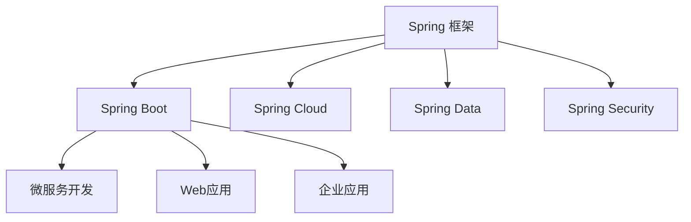
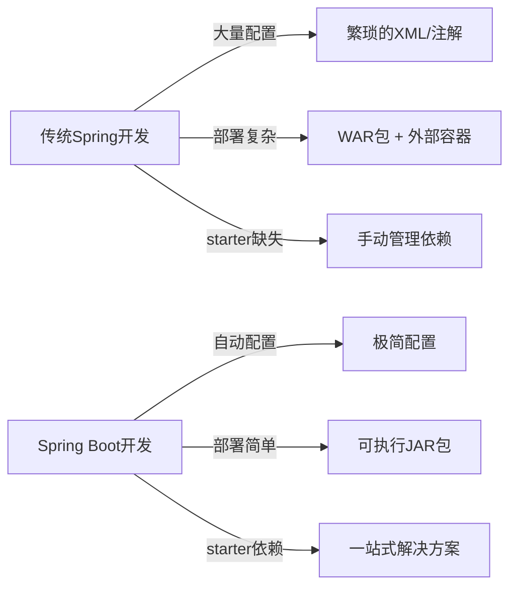
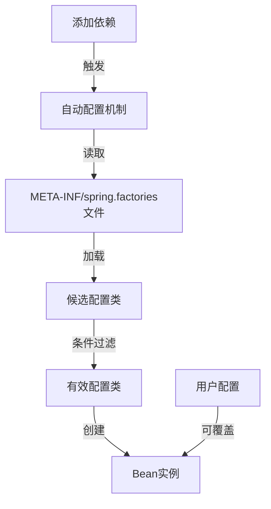
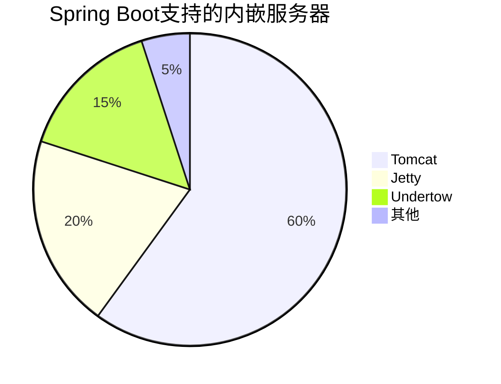
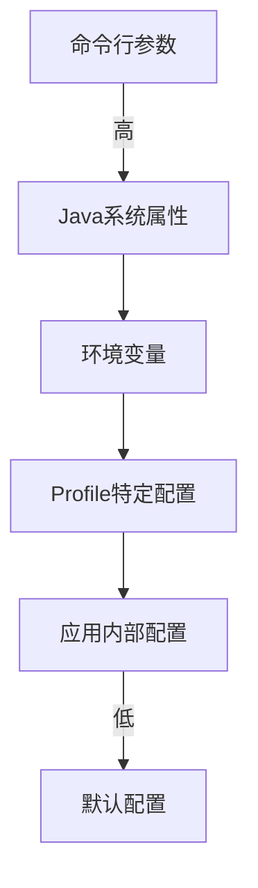
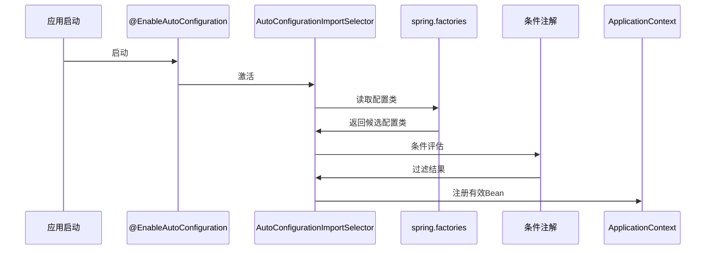
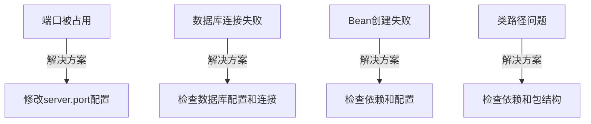
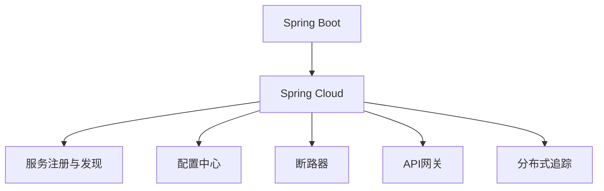
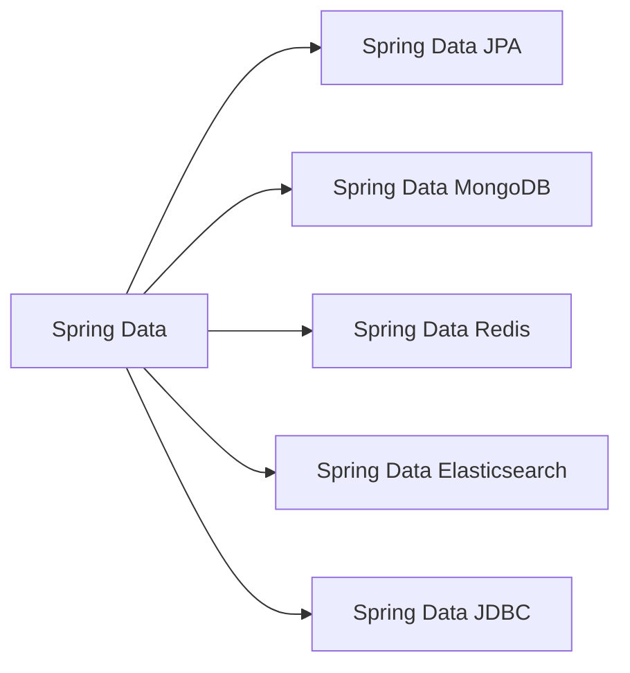
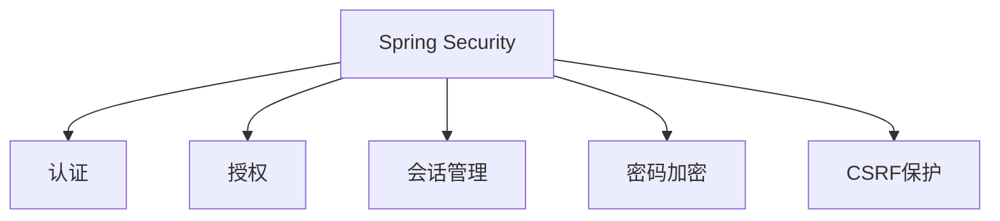

# 1 Spring Boot 新手全面指南

## 1.1 目录

- [1. Spring Boot 介绍](#1-spring-boot-介绍)
- [2. Spring Boot 核心特性](#2-spring-boot-核心特性)
- [3. Spring Boot 项目结构](#3-spring-boot-项目结构)
- [4. Spring Boot 配置体系](#4-spring-boot-配置体系)
- [5. Spring Boot 自动配置原理](#5-spring-boot-自动配置原理)
- [6. Spring Boot Web 开发](#6-spring-boot-web开发)
- [7. Spring Boot 数据访问](#7-spring-boot-数据访问)
- [8. Spring Boot 安全](#8-spring-boot-安全)
- [9. Spring Boot 测试](#9-spring-boot-测试)
- [10. Spring Boot 部署](#10-spring-boot-部署)
- [11. Spring Boot 常见问题](#11-spring-boot-常见问题)
- [12. Spring Boot 生态体系](#12-spring-boot-生态体系)

## 1.2 Spring Boot 介绍

### 1.2.1 什么是 Spring Boot

Spring Boot 是一个基于 Spring 框架的快速开发平台，旨在简化 Spring 应用的初始搭建和开发过程。它采用了"约定优于配置"的理念，提供了自动配置、内嵌服务器、简化依赖管理等特性，使开发者能够快速构建可生产级别的 Spring 应用。

Spring Boot 是 Spring 生态系统的一部分，它构建在 Spring 框架之上，但通过简化配置和提供默认值大大减少了开发时间。

### 1.2.2 Spring Boot 与 Spring 框架的关系



- **Spring 框架**：提供了依赖注入(DI)、面向切面编程(AOP)、事务管理等核心功能
- **Spring Boot**：在 Spring 框架基础上提供了自动配置、内嵌服务器等特性，简化了 Spring 应用的开发

### 1.2.3 为什么使用 Spring Boot

Spring Boot 的主要优势包括：

1. **简化配置**：自动配置大量组件，减少样板代码
2. **独立运行**：内嵌服务器，可直接打包为可执行 jar 文件
3. **快速开发**：提供各种 starter 依赖，简化项目依赖管理
4. **生产就绪**：内置健康检查、指标收集等生产级功能
5. **无代码生成**：不生成代码，无需 XML 配置



## 1.3 Spring Boot 核心特性

### 1.3.1 自动配置(Auto-Configuration)

Spring Boot 的核心特性之一是自动配置。它能够根据项目中引入的依赖自动配置 Spring 应用。例如，当你引入`spring-boot-starter-data-jpa`依赖时，Spring Boot 会自动配置数据源、实体管理器工厂、事务管理器等组件。



### 1.3.2 起步依赖(Starters)

Spring Boot 提供了各种"起步依赖"（Starters），每个 starter 都是一组依赖的集合，专注于特定的应用场景。例如：

- `spring-boot-starter-web`：Web 应用开发
- `spring-boot-starter-data-jpa`：JPA 数据访问
- `spring-boot-starter-security`：安全框架
- `spring-boot-starter-test`：测试支持

使用这些 starter 可以大大简化依赖管理，避免版本冲突。

### 1.3.3 内嵌服务器

Spring Boot 内置了多种服务器，默认使用 Tomcat。你也可以切换到 Jetty、Undertow 等其他服务器。这使得应用可以独立运行，无需部署到外部服务器。



### 1.3.4 Actuator(监控与管理)

Spring Boot Actuator 提供了生产级别的监控和管理功能，包括健康检查、指标收集、环境信息等。这些功能通过 HTTP 或 JMX 端点暴露。

常用的 Actuator 端点：

| 端点     | 描述          |
| -------- | ------------- |
| /health  | 应用健康状态  |
| /info    | 应用信息      |
| /metrics | 应用指标      |
| /env     | 环境变量      |
| /beans   | 容器中的 Bean |

## 1.4 Spring Boot 项目结构

### 1.4.1 标准项目结构

```
my-application/
├── src/
│   ├── main/
│   │   ├── java/
│   │   │   └── com/example/myapplication/
│   │   │       ├── MyApplication.java
│   │   │       ├── controller/
│   │   │       ├── service/
│   │   │       ├── repository/
│   │   │       └── model/
│   │   └── resources/
│   │       ├── application.properties
│   │       ├── static/
│   │       └── templates/
│   └── test/
│       └── java/
│           └── com/example/myapplication/
├── pom.xml (或 build.gradle)
└── README.md
```

### 1.4.2 主要组件说明

- `MyApplication.java`：应用程序入口类，包含`main`方法
- `controller/`：控制器层，处理 HTTP 请求
- `service/`：业务逻辑层
- `repository/`：数据访问层
- `model/`：实体类
- `resources/`：配置文件、静态资源和模板
- `pom.xml`：Maven 项目配置文件

### 1.4.3 启动类

```java
@SpringBootApplication
public class MyApplication {
    public static void main(String[] args) {
        SpringApplication.run(MyApplication.class, args);
    }
}
```

`@SpringBootApplication`注解是一个组合注解，相当于：

- `@Configuration`：标识该类为配置类
- `@EnableAutoConfiguration`：启用自动配置
- `@ComponentScan`：启用组件扫描

## 1.5 Spring Boot 配置体系

### 1.5.1 配置文件类型

Spring Boot 支持多种配置文件格式：

- `application.properties`：键值对格式
- `application.yml`/`application.yaml`：YAML 格式

YAML 格式更易读，支持层次结构：

```yaml
server:
  port: 8080
  servlet:
    context-path: /api

spring:
  datasource:
    url: jdbc:mysql://localhost:3306/mydb
    username: root
    password: password
```

等效的 properties 格式：

```properties
server.port=8080
server.servlet.context-path=/api
spring.datasource.url=jdbc:mysql://localhost:3306/mydb
spring.datasource.username=root
spring.datasource.password=password
```

### 1.5.2 配置优先级

Spring Boot 配置的优先级从高到低：

1. 命令行参数
2. Java 系统属性
3. 操作系统环境变量
4. Profile 特定配置
5. 应用内部配置文件
6. 默认配置



### 1.5.3 Profile 配置

Profile 允许为不同环境（开发、测试、生产）提供不同的配置：

```
application.yml          (通用配置)
application-dev.yml      (开发环境配置)
application-test.yml     (测试环境配置)
application-prod.yml     (生产环境配置)
```

激活特定 profile：

- 命令行：`--spring.profiles.active=dev`
- 配置文件：`spring.profiles.active=dev`
- 环境变量：`SPRING_PROFILES_ACTIVE=dev`

## 1.6 Spring Boot 自动配置原理

### 1.6.1 自动配置工作流程



### 1.6.2 条件注解

Spring Boot 使用条件注解来决定是否应用特定配置：

| 注解                         | 描述                     |
| ---------------------------- | ------------------------ |
| @ConditionalOnClass          | 当指定类存在于类路径时   |
| @ConditionalOnMissingClass   | 当指定类不存在于类路径时 |
| @ConditionalOnBean           | 当指定 Bean 存在时       |
| @ConditionalOnMissingBean    | 当指定 Bean 不存在时     |
| @ConditionalOnProperty       | 当指定属性有特定值时     |
| @ConditionalOnWebApplication | 当应用是 Web 应用时      |

### 1.6.3 自定义自动配置

创建自己的自动配置类：

```java
@Configuration
@ConditionalOnClass(MyService.class)
public class MyAutoConfiguration {

    @Bean
    @ConditionalOnMissingBean
    public MyService myService() {
        return new MyServiceImpl();
    }
}
```

然后在`META-INF/spring.factories`文件中注册：

```
org.springframework.boot.autoconfigure.EnableAutoConfiguration=\
com.example.MyAutoConfiguration
```

## 1.7 Spring Boot Web 开发

### 1.7.1 REST API 开发

Spring Boot 简化了 REST API 的开发：

```java
@RestController
@RequestMapping("/api/users")
public class UserController {

    @Autowired
    private UserService userService;

    @GetMapping
    public List<User> getAllUsers() {
        return userService.findAll();
    }

    @GetMapping("/{id}")
    public User getUser(@PathVariable Long id) {
        return userService.findById(id)
            .orElseThrow(() -> new ResourceNotFoundException("User not found"));
    }

    @PostMapping
    @ResponseStatus(HttpStatus.CREATED)
    public User createUser(@RequestBody User user) {
        return userService.save(user);
    }

    @PutMapping("/{id}")
    public User updateUser(@PathVariable Long id, @RequestBody User user) {
        // 更新逻辑
        return userService.update(id, user);
    }

    @DeleteMapping("/{id}")
    @ResponseStatus(HttpStatus.NO_CONTENT)
    public void deleteUser(@PathVariable Long id) {
        userService.deleteById(id);
    }
}
```

### 1.7.2 异常处理

全局异常处理：

```java
@RestControllerAdvice
public class GlobalExceptionHandler {

    @ExceptionHandler(ResourceNotFoundException.class)
    @ResponseStatus(HttpStatus.NOT_FOUND)
    public ApiError handleResourceNotFound(ResourceNotFoundException ex) {
        return new ApiError("NOT_FOUND", ex.getMessage());
    }

    @ExceptionHandler(Exception.class)
    @ResponseStatus(HttpStatus.INTERNAL_SERVER_ERROR)
    public ApiError handleGenericException(Exception ex) {
        return new ApiError("INTERNAL_ERROR", "An unexpected error occurred");
    }
}
```

### 1.7.3 静态资源处理

Spring Boot 自动配置静态资源位置：

- `/static`
- `/public`
- `/resources`
- `/META-INF/resources`

这些目录下的文件可以通过 URL 直接访问，例如`/static/css/style.css`可以通过`/css/style.css`访问。

### 1.7.4 模板引擎

Spring Boot 支持多种模板引擎：

- Thymeleaf (推荐)
- FreeMarker
- Velocity
- Mustache

以 Thymeleaf 为例：

```html
<!DOCTYPE html>
<html xmlns:th="http://www.thymeleaf.org">
  <head>
    <title>User List</title>
  </head>
  <body>
    <h1>Users</h1>
    <table>
      <tr>
        <th>ID</th>
        <th>Name</th>
        <th>Email</th>
      </tr>
      <tr th:each="user : ${users}">
        <td th:text="${user.id}"></td>
        <td th:text="${user.name}"></td>
        <td th:text="${user.email}"></td>
      </tr>
    </table>
  </body>
</html>
```

## 1.8 Spring Boot 数据访问

### 1.8.1 JPA 数据访问

使用 Spring Data JPA 简化数据访问：

```java
// 实体类
@Entity
@Table(name = "users")
public class User {

    @Id
    @GeneratedValue(strategy = GenerationType.IDENTITY)
    private Long id;

    private String name;

    private String email;

    // Getters and setters
}

// Repository接口
@Repository
public interface UserRepository extends JpaRepository<User, Long> {

    List<User> findByNameContaining(String name);

    Optional<User> findByEmail(String email);
}

// Service类
@Service
public class UserService {

    @Autowired
    private UserRepository userRepository;

    public List<User> findAll() {
        return userRepository.findAll();
    }

    public Optional<User> findById(Long id) {
        return userRepository.findById(id);
    }

    public User save(User user) {
        return userRepository.save(user);
    }

    // 其他业务方法
}
```

### 1.8.2 JDBC 数据访问

使用 JdbcTemplate：

```java
@Repository
public class UserJdbcRepository {

    @Autowired
    private JdbcTemplate jdbcTemplate;

    public List<User> findAll() {
        return jdbcTemplate.query(
            "SELECT id, name, email FROM users",
            (rs, rowNum) -> new User(
                rs.getLong("id"),
                rs.getString("name"),
                rs.getString("email")
            )
        );
    }

    public Optional<User> findById(Long id) {
        try {
            User user = jdbcTemplate.queryForObject(
                "SELECT id, name, email FROM users WHERE id = ?",
                new Object[]{id},
                (rs, rowNum) -> new User(
                    rs.getLong("id"),
                    rs.getString("name"),
                    rs.getString("email")
                )
            );
            return Optional.ofNullable(user);
        } catch (EmptyResultDataAccessException e) {
            return Optional.empty();
        }
    }

    // 其他数据访问方法
}
```

### 1.8.3 事务管理

Spring Boot 自动配置事务管理器，可以通过`@Transactional`注解声明事务：

```java
@Service
public class UserService {

    @Autowired
    private UserRepository userRepository;

    @Transactional
    public User createUserWithProfile(User user, Profile profile) {
        // 如果任何操作失败，整个事务将回滚
        User savedUser = userRepository.save(user);
        profile.setUserId(savedUser.getId());
        profileRepository.save(profile);
        return savedUser;
    }
}
```

## 1.9 Spring Boot 安全

### 1.9.1 基本安全配置

添加 Spring Security 依赖：

```xml
<dependency>
    <groupId>org.springframework.boot</groupId>
    <artifactId>spring-boot-starter-security</artifactId>
</dependency>
```

基本配置类：

```java
@Configuration
@EnableWebSecurity
public class SecurityConfig extends WebSecurityConfigurerAdapter {

    @Override
    protected void configure(HttpSecurity http) throws Exception {
        http
            .authorizeRequests()
                .antMatchers("/", "/home", "/public/**").permitAll()
                .antMatchers("/admin/**").hasRole("ADMIN")
                .anyRequest().authenticated()
                .and()
            .formLogin()
                .loginPage("/login")
                .permitAll()
                .and()
            .logout()
                .permitAll();
    }

    @Autowired
    public void configureGlobal(AuthenticationManagerBuilder auth) throws Exception {
        auth
            .inMemoryAuthentication()
                .withUser("user").password("{bcrypt}$2a$10$dXJ3SW6G7P50lGmMkkmwe.20cQQubK3.HZWzG3YB1tlRy.fqvM/BG").roles("USER")
                .and()
                .withUser("admin").password("{bcrypt}$2a$10$dXJ3SW6G7P50lGmMkkmwe.20cQQubK3.HZWzG3YB1tlRy.fqvM/BG").roles("ADMIN");
    }
}
```

### 1.9.2 JWT 认证

实现 JWT（JSON Web Token）认证：

```java
@Configuration
@EnableWebSecurity
public class JwtSecurityConfig extends WebSecurityConfigurerAdapter {

    @Autowired
    private JwtTokenProvider jwtTokenProvider;

    @Override
    protected void configure(HttpSecurity http) throws Exception {
        http
            .csrf().disable()
            .sessionManagement().sessionCreationPolicy(SessionCreationPolicy.STATELESS)
            .and()
            .authorizeRequests()
                .antMatchers("/auth/**").permitAll()
                .anyRequest().authenticated()
            .and()
            .apply(new JwtConfigurer(jwtTokenProvider));
    }
}
```

## 1.10 Spring Boot 测试

### 1.10.1 单元测试

使用 JUnit 和 Mockito 进行单元测试：

```java
@ExtendWith(MockitoExtension.class)
public class UserServiceTest {

    @Mock
    private UserRepository userRepository;

    @InjectMocks
    private UserService userService;

    @Test
    public void testFindById() {
        // 准备测试数据
        Long userId = 1L;
        User expectedUser = new User(userId, "Test User", "test@example.com");

        // 模拟仓库行为
        when(userRepository.findById(userId)).thenReturn(Optional.of(expectedUser));

        // 执行被测试方法
        Optional<User> result = userService.findById(userId);

        // 验证结果
        assertTrue(result.isPresent());
        assertEquals(expectedUser.getId(), result.get().getId());
        assertEquals(expectedUser.getName(), result.get().getName());

        // 验证交互
        verify(userRepository).findById(userId);
    }
}
```

### 1.10.2 集成测试

使用`@SpringBootTest`进行集成测试：

```java
@SpringBootTest
@AutoConfigureMockMvc
public class UserControllerIntegrationTest {

    @Autowired
    private MockMvc mockMvc;

    @Autowired
    private ObjectMapper objectMapper;

    @MockBean
    private UserService userService;

    @Test
    public void testGetUserById() throws Exception {
        // 准备测试数据
        Long userId = 1L;
        User user = new User(userId, "Test User", "test@example.com");

        // 模拟服务行为
        when(userService.findById(userId)).thenReturn(Optional.of(user));

        // 执行请求并验证
        mockMvc.perform(get("/api/users/{id}", userId))
            .andExpect(status().isOk())
            .andExpect(jsonPath("$.id").value(userId))
            .andExpect(jsonPath("$.name").value("Test User"))
            .andExpect(jsonPath("$.email").value("test@example.com"));
    }
}
```

## 1.11 Spring Boot 部署

### 1.11.1 打包为可执行 JAR

Spring Boot 应用可以打包为可执行 JAR 文件：

```bash
# Maven
mvn clean package

# Gradle
gradle build
```

生成的 JAR 文件可以直接运行：

```bash
java -jar myapplication.jar
```

### 1.11.2 部署到容器

虽然 Spring Boot 内嵌了服务器，但也可以打包为 WAR 文件部署到外部容器：

```java
@SpringBootApplication
public class MyApplication extends SpringBootServletInitializer {

    @Override
    protected SpringApplicationBuilder configure(SpringApplicationBuilder application) {
        return application.sources(MyApplication.class);
    }

    public static void main(String[] args) {
        SpringApplication.run(MyApplication.class, args);
    }
}
```

### 1.11.3 Docker 部署

Dockerfile 示例：

```dockerfile
FROM openjdk:11-jre-slim
VOLUME /tmp
COPY target/*.jar app.jar
ENTRYPOINT ["java","-jar","/app.jar"]
```

构建和运行 Docker 容器：

```bash
docker build -t myapp .
docker run -p 8080:8080 myapp
```

## 1.12 Spring Boot 常见问题

### 1.12.1 启动时常见错误



### 1.12.2 性能优化

1. **使用生产模式**：设置`spring.profiles.active=prod`
2. **启用缓存**：使用`@EnableCaching`和`@Cacheable`注解
3. **JVM 优化**：调整堆大小、垃圾回收器等
4. **连接池优化**：调整数据库连接池大小
5. **异步处理**：使用`@Async`注解和线程池

### 1.12.3 调试技巧

1. **启用调试日志**：`logging.level.root=DEBUG`
2. **查看自动配置报告**：添加`--debug`启动参数
3. **使用 Actuator 端点**：`/actuator/beans`、`/actuator/conditions`等
4. **远程调试**：`java -agentlib:jdwp=transport=dt_socket,server=y,suspend=n,address=5005 -jar app.jar`

## 1.13 Spring Boot 生态体系

### 1.13.1 Spring Cloud

Spring Cloud 提供了一套用于构建分布式系统的工具：



主要组件：

- Spring Cloud Netflix (Eureka, Hystrix)
- Spring Cloud Config
- Spring Cloud Gateway
- Spring Cloud Sleuth

### 1.13.2 Spring Data

Spring Data 简化了数据访问：



### 1.13.3 Spring Security

Spring Security 提供了全面的安全解决方案：



## 1.14 总结

Spring Boot 是一个强大而灵活的框架，它简化了 Spring 应用的开发、部署和维护。通过本指南，我们介绍了 Spring Boot 的核心特性、工作原理以及实际应用。作为新手，建议你从简单的示例开始，逐步探索 Spring Boot 的各个方面。随着你对框架的理解加深，你将能够构建更复杂、更高效的应用。

## 1.15 参考资源

- [Spring Boot 官方文档](https://docs.spring.io/spring-boot/docs/current/reference/html/)
- [Spring Initializr](https://start.spring.io/)
- [Spring Guides](https://spring.io/guides)
- [Baeldung Spring Boot 教程](https://www.baeldung.com/spring-boot)

