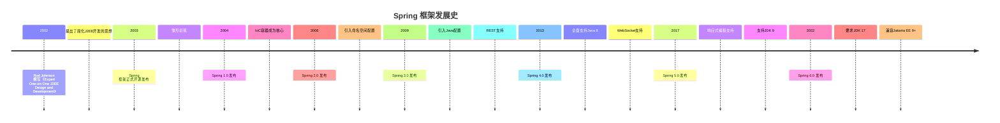
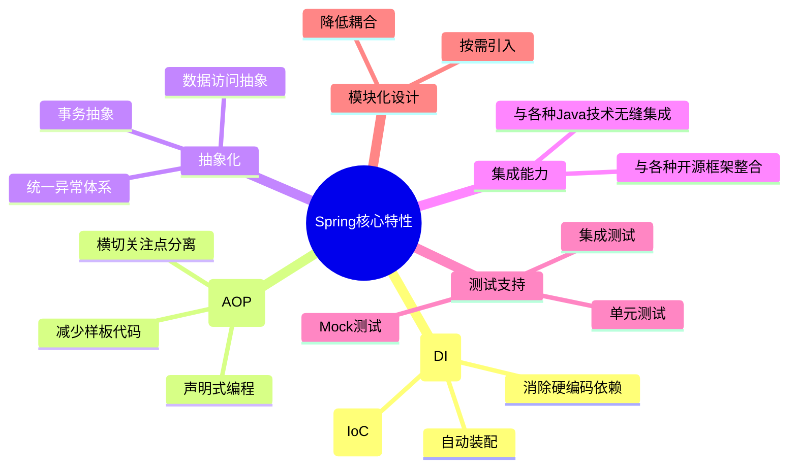
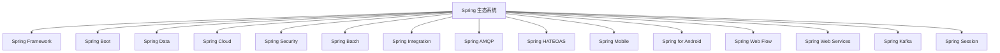
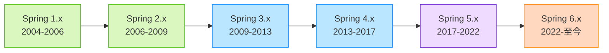

# 1 Spring 框架概述

Spring 框架是 Java 平台上一个开源的全栈应用程序框架和控制反转容器实现，以简化企业级 Java 应用程序开发为目标。本文将从 Spring 的历史、核心特性、整体架构等方面进行概述。

## 1.1 Spring 发展历史

Spring 框架由 Rod Johnson 创建，最初是作为对当时复杂的 J2EE 规范的一种替代方案。Spring 的核心理念是简化 Java 开发，降低组件耦合度，提高可测试性和可维护性。从最初的 IoC 容器发展到现在的全栈应用框架，Spring 已经成为 Java 开发领域最重要的框架之一。

## 1.2 Spring 核心特性

Spring 框架的核心特性可以概括为以下几点：

### 1.2.1 依赖注入和控制反转

Spring 的核心是**IoC (Inversion of Control)** 容器，通过依赖注入实现控制反转，管理应用对象的生命周期和对象间的依赖关系。这种方式减少了组件间的耦合，使系统更加模块化和可测试。

### 1.2.2 面向切面编程 (AOP)

Spring 通过面向切面编程实现在不修改业务代码的情况下实现公共功能（如日志、安全、事务等）的集中式处理，使得应用代码更简洁、更专注于业务逻辑。

### 1.2.3 数据访问抽象

Spring 提供了统一的数据访问异常层次结构和抽象 API，简化了 JDBC、Hibernate 等数据访问技术的使用，降低了数据访问层的复杂度。

### 1.2.4 声明式事务管理

Spring 的事务管理支持编程式和声明式两种方式，使得开发者能以最小的代价实现复杂的事务管理需求。

### 1.2.5 MVC 框架

Spring MVC 是一个功能强大、易于扩展的 Web 框架，支持多种视图技术，并与 Spring 框架无缝集成。

### 1.2.6 测试支持

Spring 提供了全面的测试支持，包括集成测试、单元测试工具等，简化了应用程序的测试过程。

## 1.3 Spring 架构概览

Spring 框架采用模块化设计，分为多个核心模块，每个模块负责不同的功能：

```mermaid
graph TD
    A[Spring Framework] --> B[Core Container]
    A --> C[AOP & Aspects]
    A --> D[Testing]
    A --> E[Data Access]
    A --> F[Web]
    A --> G[Integration]
    A --> H[Messaging]

    B --> B1[Beans]
    B --> B2[Core]
    B --> B3[Context]
    B --> B4[SpEL]

    C --> C1[AOP]
    C --> C2[Aspects]

    D --> D1[Mock Objects]
    D --> D2[Spring MVC Test]
    D --> D3[TestContext Framework]

    E --> E1[JDBC]
    E --> E2[ORM]
    E --> E3[JMS]
    E --> E4[Transactions]

    F --> F1[Web]
    F --> F2[Servlet]
    F --> F3[WebSocket]
    F --> F4[Web MVC]
    F --> F5[Web Reactive]

    G --> G1[JMX]
    G --> G2[JCA]
    G --> G3[Email]
    G --> G4[Tasks]
    G --> G5[Scheduling]
    G --> G6[Cache]

    H --> H1[JMS]
    H --> H2[AMQP]
    H --> H3[WebSocket]
```

## 1.4 Spring 各模块详解

### 1.4.1 核心容器 (Core Container)

核心容器是 Spring 框架的基础，主要包含 IoC 容器的实现：

- **Core/Beans**：提供 IoC 容器的基本功能，负责创建和管理 Bean 对象
- **Context**：构建于 Core 和 Beans 之上，提供更多企业级功能（如国际化、事件通知、资源加载等）
- **SpEL (Spring Expression Language)**：提供在运行时查询和操作对象图的表达式语言

### 1.4.2 AOP 和 Aspects

- **AOP**：提供面向切面编程的实现
- **Aspects**：提供与 AspectJ 的集成

### 1.4.3 数据访问与集成 (Data Access/Integration)

- **JDBC**：提供 JDBC 抽象层，简化 JDBC 编码
- **ORM**：提供 ORM 框架的集成支持
- **OXM**：对象/XML 映射集成
- **JMS**：Java 消息服务
- **Transactions**：事务管理，支持声明式和编程式事务

### 1.4.4 Web 模块

- **Web**：提供基本的 web 功能
- **Web MVC**：实现了模型-视图-控制器模式的 web 框架
- **Web Reactive**：支持响应式 web 应用开发
- **WebSocket**：提供 WebSocket 支持

### 1.4.5 测试 (Test)

- **Mock Objects**：提供模拟对象创建
- **TestContext Framework**：提供测试上下文管理
- **Spring MVC Test**：提供 Spring MVC 组件的测试支持

## 1.5 Spring 生态系统

Spring 已经从单一框架发展成为了一个完整的生态系统：

### 1.5.1 Spring Boot

简化 Spring 应用的配置和部署，提供"开箱即用"的解决方案，通过自动配置和起步依赖大幅减少开发时间。

### 1.5.2 Spring Data

简化数据访问的 API 和实现，支持关系型数据库、NoSQL 以及大数据技术。

### 1.5.3 Spring Cloud

提供一套完整的微服务解决方案，包括服务发现、配置管理、断路器、智能路由等。

### 1.5.4 Spring Security

提供全面的安全性解决方案，包括认证、授权以及防范常见攻击[[网络安全]]。

### 1.5.5 其他项目

Spring 生态还包括针对特定场景的多个项目，如批处理(Spring Batch)、集成(Spring Integration)、消息队列(Spring AMQP/Kafka)等。

## 1.6 Spring 版本演进

Spring 框架的版本演进体现了其与时俱进的特点：

### 1.6.1 Spring 6.x (2022-至今)

- 基于 Java 17
- 对 Jakarta EE 9+的支持
- AOT(Ahead Of Time)编译支持
- 全面支持 GraalVM 原生镜像

### 1.6.2 Spring 5.x (2017-2022)

- 响应式编程模型(Reactive Programming)
- 函数式 Web 框架 WebFlux
- Java 8+ 和 Java 9 特性支持
- Kotlin 语言支持

### 1.6.3 Spring 4.x (2013-2017)

- 全面支持 Java 8
- Java EE 7 API 支持
- WebSocket 支持
- 增强的测试支持

### 1.6.4 Spring 3.x (2009-2013)

- Java 5+ 特性增强
- Java 配置支持
- REST 支持增强
- SpEL 表达式语言

## 1.7 小结

Spring 框架已经发展成为 Java 领域最重要的开源框架之一，其模块化的设计、可扩展的架构以及丰富的生态系统，为 Java 企业级应用的开发提供了强大的支持。通过使用 Spring 框架，开发者可以专注于业务需求的实现，而将许多通用的技术难题交给框架处理，从而提高开发效率和应用质量。

从最初的简单 IoC 容器，到现在覆盖了从 Web 开发、数据访问、安全、云原生到响应式编程的完整技术栈，Spring 的演进历程也反映了 Java 企业级应用领域的技术发展趋势。随着云原生、响应式编程等新技术的兴起，Spring 框架也在不断更新迭代，保持其技术的先进性和实用性。

