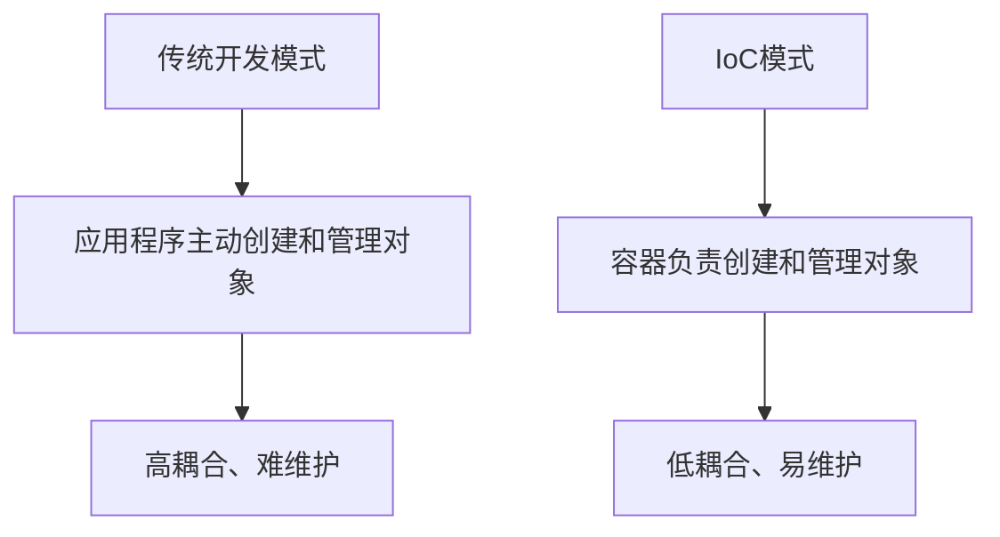
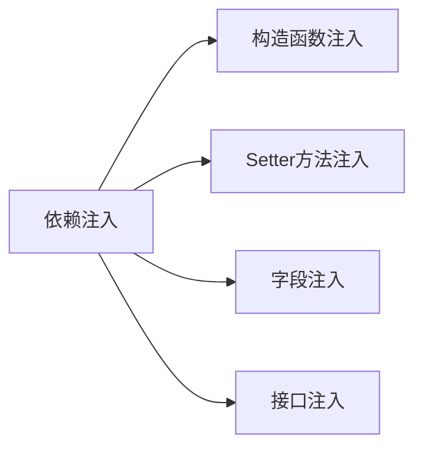
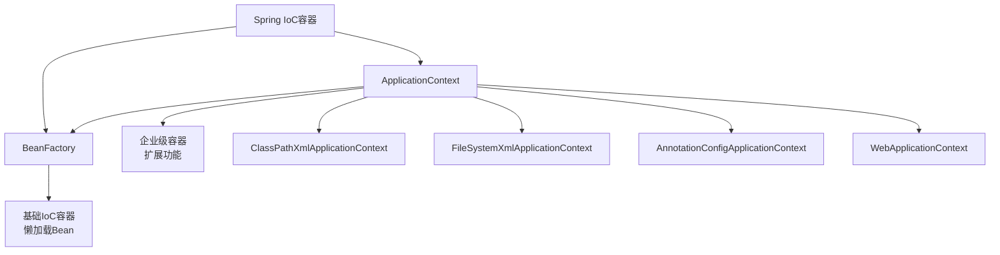
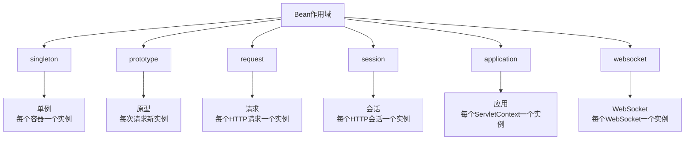
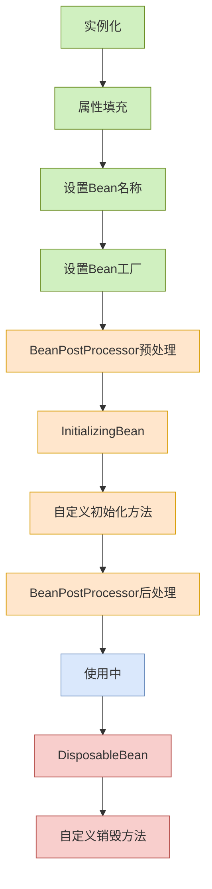
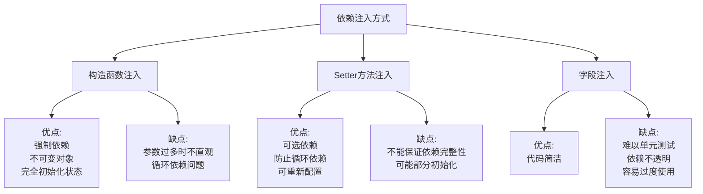
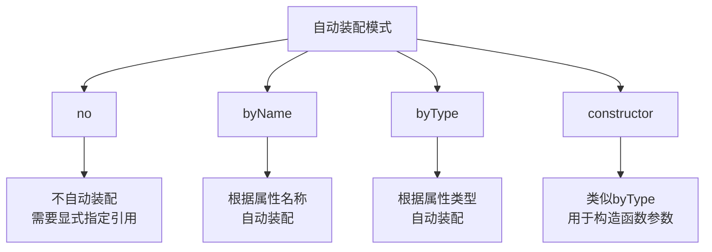
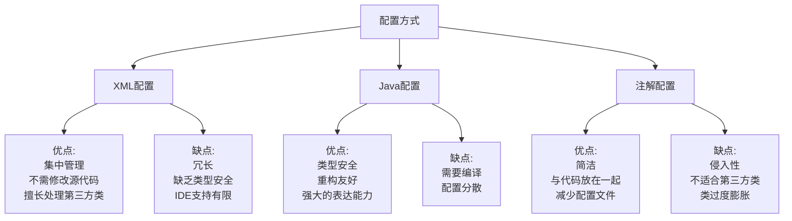

# 1 Spring IoC 容器详解

IoC (Inversion of Control，控制反转) 和 DI (Dependency Injection，依赖注入) 是 Spring 框架的核心概念和基础。本文将深入探讨 Spring IoC 容器的原理、分类以及工作机制。

## 1.1 IoC 与 DI 概念

### 1.1.1 控制反转 (IoC)

控制反转是一种设计原则，它颠覆了传统的程序设计模式，将对象的创建、依赖关系的管理等控制权从开发者手中转移到外部容器或框架。



### 1.1.2 依赖注入 (DI)

依赖注入是实现 IoC 的一种主要方式，即由**容器负责将依赖的对象注入到需要它们的对象中**：



通过依赖注入，组件无需自己查找或创建依赖的组件，只需声明自己需要什么，容器会负责提供这些依赖。

**IoC 与 DI 的关系**：

- IoC 是一种设计原则，专注于"谁来控制对象的创建"
- DI 是 IoC 的具体实现方式，专注于"如何将依赖传递给对象"

## 1.2 Spring IoC 容器的分类

Spring 提供了两种类型的 IoC 容器实现：



### 1.2.1 BeanFactory

BeanFactory 是 Spring IoC 容器的基础实现，它提供了 IoC 的基本功能：

- 懒加载 Bean（Bean 只有在被请求时才会实例化）
- 管理 Bean 生命周期[[6 Bean#^4579b8]]
- 基本的依赖注入

代码示例：

```java
Resource resource = new ClassPathResource("beans.xml");
BeanFactory factory = new XmlBeanFactory(resource);
MyBean myBean = (MyBean) factory.getBean("myBean");
```

### 1.2.2 ApplicationContext

ApplicationContext 是 BeanFactory 的扩展，添加了更多企业级功能：

- 继承了 BeanFactory 的所有功能
- 提供国际化支持 (i18n)
- 支持资源加载
- 支持应用事件
- 提供更多针对特定应用场景的实现

常见的 ApplicationContext 实现：

- **ClassPathXmlApplicationContext**：从 classpath 加载配置文件
- **FileSystemXmlApplicationContext**：从文件系统加载配置文件
- **AnnotationConfigApplicationContext**：基于 Java 注解配置
- **WebApplicationContext**：用于 web 应用的上下文

代码示例：

```java
ApplicationContext context = new ClassPathXmlApplicationContext("applicationContext.xml");
MyBean myBean = context.getBean("myBean", MyBean.class);
```

## 1.3 Spring Bean 概述

在 Spring 中，被 IoC 容器管理的对象称为 Bean。Bean 是由 Spring IoC 容器实例化、组装和管理的对象。

### 1.3.1 Bean 命名约定

- Bean 的标识符应该以小写字母开头，后续采用驼峰命名法
- 通常与类名一致，只是首字母小写
- 可以为同一个 Bean 指定多个名称或别名

### 1.3.2 Bean 基本属性

- **类**：Bean 的实际类型
- **名称**：Bean 在容器中的唯一标识符
- **作用域**：Bean 的生命周期和可见范围
- **构造参数**：用于创建 Bean 实例的参数
- **属性**：Bean 的各个依赖和设置
- **自动装配模式**：如何自动解析 Bean 的依赖
- **延迟初始化模式**：是否延迟初始化 Bean
- **初始化方法**：Bean 初始化完成后调用的方法
- **销毁方法**：Bean 销毁前调用的方法

## 1.4 Bean 的定义与注册

Spring 提供了多种方式来定义和注册 Bean：

### 1.4.1 XML 配置

```xml
<beans>
    <bean id="userService" class="com.example.service.UserServiceImpl">
        <property name="userRepository" ref="userRepository"/>
    </bean>

    <bean id="userRepository" class="com.example.repository.JdbcUserRepository">
        <constructor-arg ref="dataSource"/>
    </bean>
</beans>
```

### 1.4.2 Java 注解

```java
@Component
public class UserServiceImpl implements UserService {
    @Autowired
    private UserRepository userRepository;

    // ...
}

@Repository
public class JdbcUserRepository implements UserRepository {
    private DataSource dataSource;

    @Autowired
    public JdbcUserRepository(DataSource dataSource) {
        this.dataSource = dataSource;
    }

    // ...
}
```

### 1.4.3 Java 配置类

```java
@Configuration
public class AppConfig {

    @Bean
    public UserService userService() {
        UserServiceImpl service = new UserServiceImpl();
        service.setUserRepository(userRepository());
        return service;
    }

    @Bean
    public UserRepository userRepository() {
        return new JdbcUserRepository(dataSource());
    }

    @Bean
    public DataSource dataSource() {
        // 配置和创建数据源
        return new DriverManagerDataSource(...);
    }
}
```

## 1.5 Bean 的作用域

Spring 支持多种 Bean 作用域：



| 作用域      | 描述                                           | 适用场景                             |
| ----------- | ---------------------------------------------- | ------------------------------------ |
| singleton   | 默认作用域，每个 Spring IoC 容器只创建一个实例 | 无状态的服务类                       |
| prototype   | 每次请求都会创建新的实例                       | 有状态的对象                         |
| request     | 每个 HTTP 请求创建一个实例                     | Web 应用中的请求处理对象             |
| session     | 每个 HTTP 会话创建一个实例                     | Web 应用中需要在会话范围内共享的对象 |
| application | 每个 ServletContext 创建一个实例               | Web 应用中需要在应用范围内共享的对象 |
| websocket   | 每个 WebSocket 创建一个实例                    | WebSocket 应用                       |

配置 Bean 的作用域：

XML 配置：

```xml
<bean id="userService" class="com.example.service.UserServiceImpl" scope="singleton"/>
```

注解配置：

```java
@Component
@Scope("prototype")
public class UserServiceImpl implements UserService {
    // ...
}
```

Java 配置：

```java
@Bean
@Scope("prototype")
public UserService userService() {
    return new UserServiceImpl();
}
```

## 1.6 Bean 的生命周期

Spring Bean 的生命周期包含多个阶段，从创建到销毁：



### 1.6.1 详细生命周期流程

1. **实例化**：Spring 容器创建 Bean 的实例
2. **属性填充**：Spring 将值和引用注入到 Bean 的属性中
3. **设置 Bean 名称**：如果 Bean 实现了 BeanNameAware 接口
4. **设置 Bean 工厂**：如果 Bean 实现了 BeanFactoryAware 接口
5. **预处理**：应用 BeanPostProcessor 的 postProcessBeforeInitialization 方法
6. **InitializingBean**：如果 Bean 实现了 InitializingBean 接口，调用 afterPropertiesSet 方法
7. **自定义初始化**：调用 Bean 定义中指定的初始化方法
8. **后处理**：应用 BeanPostProcessor 的 postProcessAfterInitialization 方法
9. **使用中**：Bean 可以被应用程序使用
10. **DisposableBean**：如果 Bean 实现了 DisposableBean 接口，调用 destroy 方法
11. **自定义销毁**：调用 Bean 定义中指定的销毁方法

### 1.6.2 配置初始化和销毁方法

XML 配置：

```xml
<bean id="exampleBean" class="com.example.ExampleBean"
       init-method="init" destroy-method="cleanup"/>
```

注解配置：

```java
@Component
public class ExampleBean {

    @PostConstruct
    public void init() {
        // 初始化逻辑
    }

    @PreDestroy
    public void cleanup() {
        // 清理逻辑
    }
}
```

Java 配置：

```java
@Bean(initMethod = "init", destroyMethod = "cleanup")
public ExampleBean exampleBean() {
    return new ExampleBean();
}
```

### 1.6.3 实现生命周期接口

```java
public class LifecycleBean implements InitializingBean, DisposableBean,
        BeanNameAware, BeanFactoryAware, ApplicationContextAware {

    private String beanName;
    private BeanFactory beanFactory;
    private ApplicationContext applicationContext;

    // BeanNameAware接口方法
    @Override
    public void setBeanName(String name) {
        this.beanName = name;
        System.out.println("Bean名称设置: " + name);
    }

    // BeanFactoryAware接口方法
    @Override
    public void setBeanFactory(BeanFactory beanFactory) throws BeansException {
        this.beanFactory = beanFactory;
        System.out.println("Bean工厂设置");
    }

    // ApplicationContextAware接口方法
    @Override
    public void setApplicationContext(ApplicationContext applicationContext) throws BeansException {
        this.applicationContext = applicationContext;
        System.out.println("应用上下文设置");
    }

    // InitializingBean接口方法
    @Override
    public void afterPropertiesSet() throws Exception {
        System.out.println("属性设置后初始化");
    }

    // 自定义初始化方法
    public void customInit() {
        System.out.println("自定义初始化方法");
    }

    // DisposableBean接口方法
    @Override
    public void destroy() throws Exception {
        System.out.println("Bean销毁");
    }

    // 自定义销毁方法
    public void customDestroy() {
        System.out.println("自定义销毁方法");
    }
}
```

## 1.7 依赖注入的方式

Spring 支持多种依赖注入方式：

### 1.7.1 构造函数注入

通过构造函数提供依赖，适合必须的依赖：

XML 配置：

```xml
<bean id="userService" class="com.example.service.UserServiceImpl">
    <constructor-arg ref="userRepository"/>
</bean>
```

Java 注解：

```java
@Component
public class UserServiceImpl implements UserService {

    private final UserRepository userRepository;

    @Autowired
    public UserServiceImpl(UserRepository userRepository) {
        this.userRepository = userRepository;
    }
}
```

Java 配置：

```java
@Bean
public UserService userService(UserRepository userRepository) {
    return new UserServiceImpl(userRepository);
}
```

### 1.7.2 Setter 方法注入

通过 setter 方法提供依赖，适合可选的依赖：

XML 配置：

```xml
<bean id="userService" class="com.example.service.UserServiceImpl">
    <property name="userRepository" ref="userRepository"/>
</bean>
```

Java 注解：

```java
@Component
public class UserServiceImpl implements UserService {

    private UserRepository userRepository;

    @Autowired
    public void setUserRepository(UserRepository userRepository) {
        this.userRepository = userRepository;
    }
}
```

Java 配置：

```java
@Bean
public UserService userService() {
    UserServiceImpl service = new UserServiceImpl();
    service.setUserRepository(userRepository());
    return service;
}
```

### 1.7.3 字段注入

直接在字段上注入依赖（不推荐，因为使单元测试变得困难）：

```java
@Component
public class UserServiceImpl implements UserService {

    @Autowired
    private UserRepository userRepository;
}
```

### 1.7.4 各种注入方式的比较



## 1.8 自动装配

Spring 提供了多种自动装配模式，可以减少显式配置的需要：



### 1.8.1 XML 配置中的自动装配

```xml
<bean id="userService" class="com.example.service.UserServiceImpl" autowire="byName"/>
```

### 1.8.2 注解驱动的自动装配

Spring 提供了多个注解来支持自动装配：

- **@Autowired**：Spring 提供的注解，基于类型自动装配，可以用于字段、方法和构造函数
- **@Qualifier**：与 @Autowired 配合使用，指定要注入的确切 bean
- **@Resource**：JSR-250 提供的注解，默认按名称装配
- **@Inject**：JSR-330 提供的注解，类似于 @Autowired

```java
@Component
public class MovieRecommender {

    @Autowired
    private MovieCatalog movieCatalog;

    @Autowired
    @Qualifier("mainDataSource")
    private DataSource dataSource;

    @Resource(name="customerRepository")
    private CustomerRepository customerRepository;

    @Inject
    private PaymentService paymentService;
}
```

## 1.9 基于注解的容器配置

Spring 提供了多个注解用于定义 Bean：

- **@Component**：通用的组件注解，表示一个由 Spring 管理的组件
- **@Service**：用于标记服务层组件
- **@Repository**：用于标记数据访问层组件
- **@Controller**：用于标记控制器组件
- **@Configuration**：用于标记配置类
- **@Bean**：用于在配置类中定义 Bean

启用组件扫描：

XML 配置：

```xml
<context:component-scan base-package="com.example"/>
```

Java 配置：

```java
@Configuration
@ComponentScan(basePackages = "com.example")
public class AppConfig {
    // ...
}
```

## 1.10 Java 配置与 XML 配置

Spring 支持 Java 配置和 XML 配置两种主要方式，也支持混合使用：

### 1.10.1 Java 配置

```java
@Configuration
public class AppConfig {

    @Bean
    public DataSource dataSource() {
        DriverManagerDataSource dataSource = new DriverManagerDataSource();
        dataSource.setDriverClassName("org.h2.Driver");
        dataSource.setUrl("jdbc:h2:mem:testdb");
        dataSource.setUsername("sa");
        dataSource.setPassword("");
        return dataSource;
    }

    @Bean
    public UserRepository userRepository() {
        return new JdbcUserRepository(dataSource());
    }

    @Bean
    public UserService userService() {
        return new UserServiceImpl(userRepository());
    }
}
```

### 1.10.2 XML 配置

```xml
<beans xmlns="http://www.springframework.org/schema/beans"
       xmlns:xsi="http://www.w3.org/2001/XMLSchema-instance"
       xsi:schemaLocation="http://www.springframework.org/schema/beans
                           http://www.springframework.org/schema/beans/spring-beans.xsd">

    <bean id="dataSource" class="org.springframework.jdbc.datasource.DriverManagerDataSource">
        <property name="driverClassName" value="org.h2.Driver"/>
        <property name="url" value="jdbc:h2:mem:testdb"/>
        <property name="username" value="sa"/>
        <property name="password" value=""/>
    </bean>

    <bean id="userRepository" class="com.example.repository.JdbcUserRepository">
        <constructor-arg ref="dataSource"/>
    </bean>

    <bean id="userService" class="com.example.service.UserServiceImpl">
        <constructor-arg ref="userRepository"/>
    </bean>
</beans>
```

### 1.10.3 混合配置

```java
@Configuration
@ImportResource("classpath:applicationContext.xml")
public class AppConfig {

    @Bean
    public UserService additionalService() {
        // ...
    }
}
```

### 1.10.4 配置方式的比较



## 1.11 小结

Spring IoC 容器是 Spring 框架的核心组件，它负责创建、配置和管理 Bean 对象以及它们之间的依赖关系。通过控制反转和依赖注入，Spring 实现了松耦合、可测试的应用架构。

Spring 提供了多种配置方式（XML、注解、Java 配置）和依赖注入方式（构造函数注入、Setter 方法注入、字段注入），开发者可以根据项目需求选择最合适的方式。

理解 Bean 的生命周期和作用域对于有效使用 Spring IoC 容器至关重要，它们影响着应用程序的性能和行为。通过自动装配，Spring 进一步简化了依赖管理，减少了显式配置的需要。

总之，Spring IoC 容器通过提供灵活、强大的依赖管理机制，成功地解决了传统 Java 应用中的组件耦合问题，使应用程序更加模块化、可维护和可测试。

