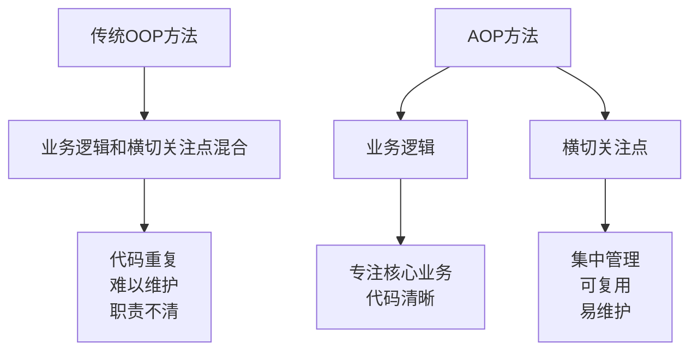
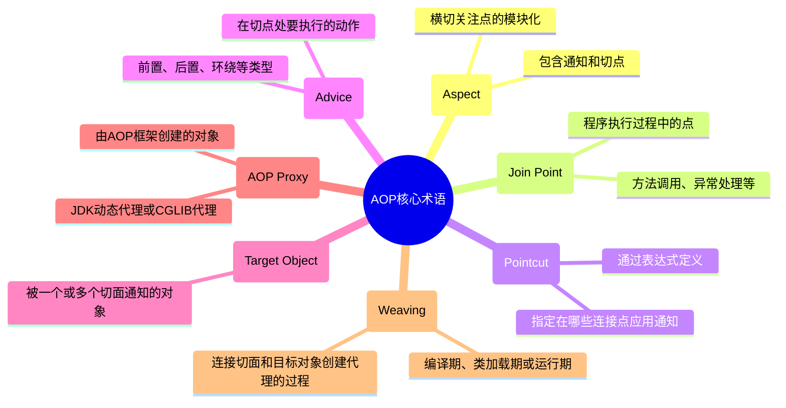
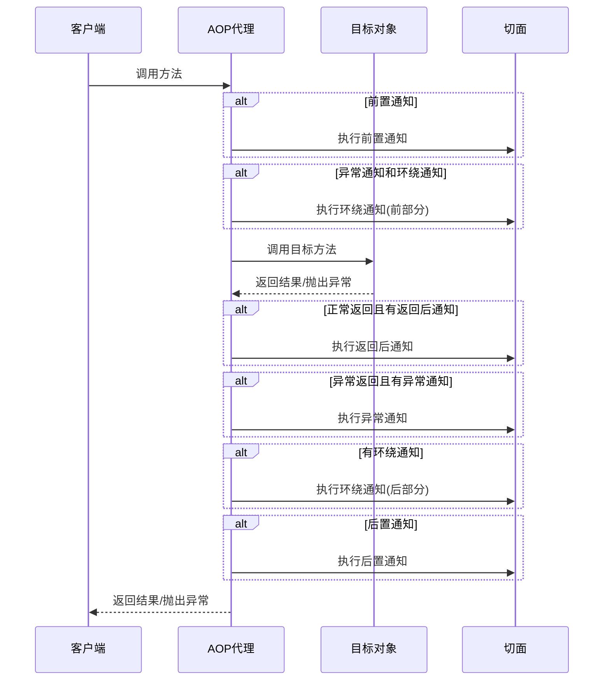
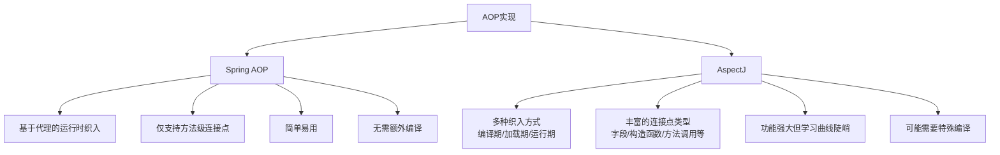
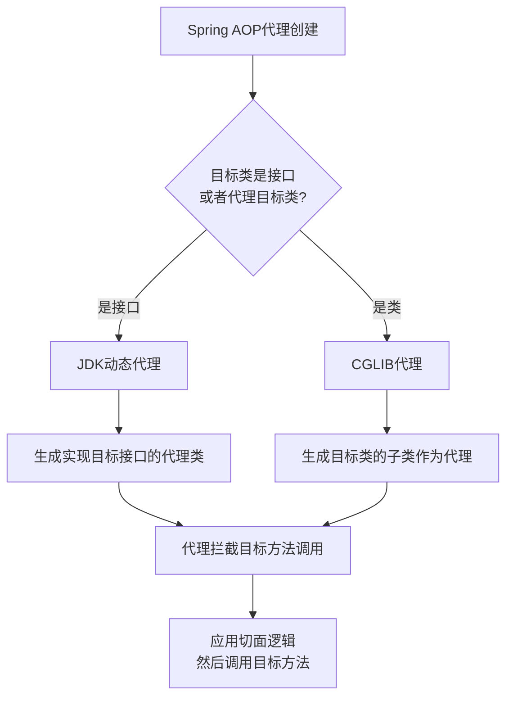
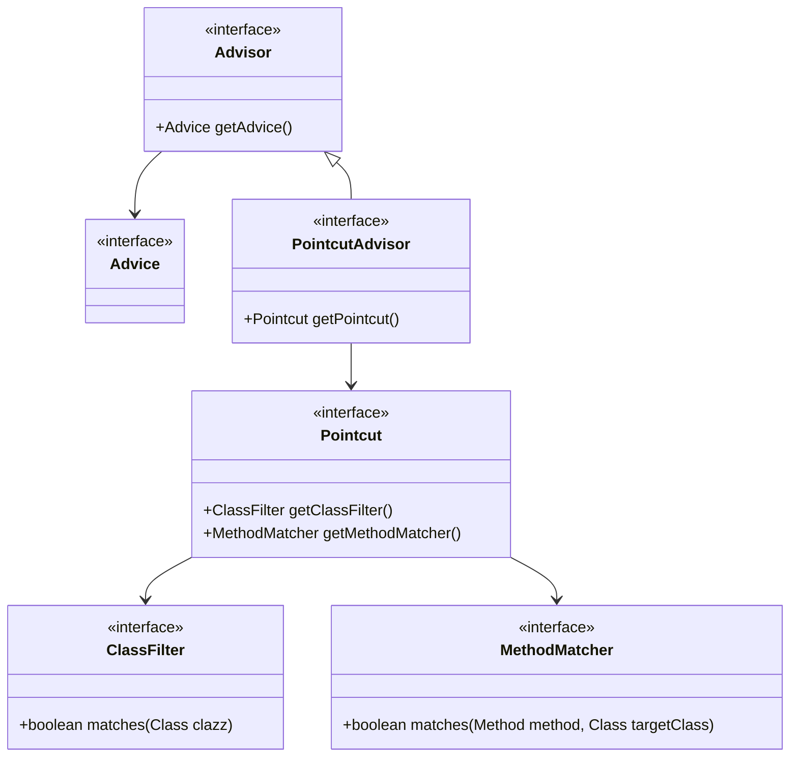
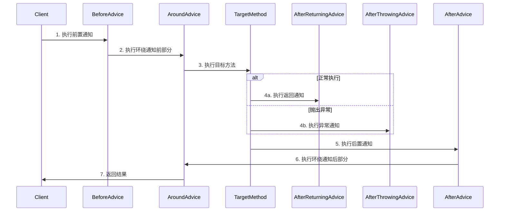
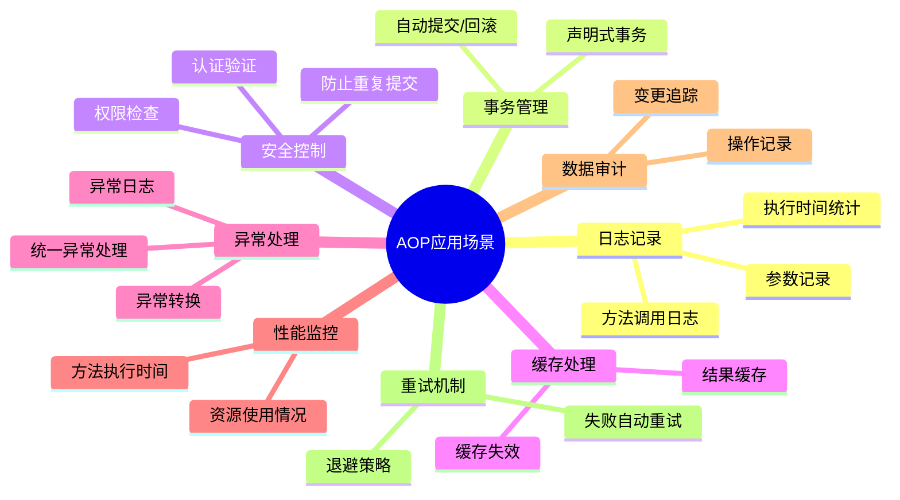

# 1 Spring AOP 详解

面向切面编程 (Aspect-Oriented Programming, AOP) 是 Spring 框架的一个核心功能，它允许开发者将横切关注点 (cross-cutting concerns) 从业务逻辑中分离出来。本文将详细介绍 Spring AOP 的概念、实现原理及使用方法。

## 1.1 AOP 基础概念

### 1.1.1 什么是 AOP

AOP (Aspect-Oriented Programming) 面向切面编程，是一种编程范式，它允许开发者将那些分散在各处但本质上属于同一类型的代码（例如日志记录、事务管理、安全检查等）集中起来，形成可重用的组件。



### 1.1.2 AOP 核心术语

理解 AOP 首先要掌握它的基本概念和术语：



- **切面(Aspect)**：横切关注点的模块化，比如事务管理、日志、安全等。
- **连接点(Join Point)**：程序执行过程中的特定点，如方法执行、异常处理等。
- **切点(Pointcut)**：匹配连接点的表达式，决定 AOP 在哪些类的哪些方法上织入。
- **通知(Advice)**：在特定连接点执行的动作，包括前置通知、后置通知、环绕通知等。
- **目标对象(Target Object)**：被一个或多个切面所通知的对象。
- **AOP 代理(AOP Proxy)**：由 AOP 框架创建的对象，用于实现切面契约（包括通知方法执行等功能）。
- **织入(Weaving)**：将切面应用到目标对象并创建新代理对象的过程。

### 1.1.3 AOP 执行流程

当使用 AOP 时，方法调用的整体流程如下：



## 1.2 Spring AOP 与 AspectJ

Spring AOP 与 AspectJ 都提供了 AOP 的实现，但它们在功能和实现方式上有很大差异：



### 1.2.1 Spring AOP 特点

- 基于运行时代理实现（JDK 动态代理或 CGLIB）
- 只支持方法级别的连接点
- 只能应用于 Spring 容器管理的 Bean
- 相比 AspectJ 更简单，更易于使用
- 性能略低于 AspectJ，但对大多数应用已足够

### 1.2.2 AspectJ 特点

- 完整的 AOP 解决方案，支持所有切入点类型
- 支持编译时、加载时和运行时织入
- 性能较好，特别是编译时织入
- 可以应用于所有 POJO，不限于 Spring 容器
- 需要额外的编译器或类加载时织入器

### 1.2.3 Spring 集成 AspectJ

Spring 提供了与 AspectJ 的集成，允许使用 AspectJ 的切点表达式语言，但底层仍使用 Spring 的代理机制：

```java
<dependency>
    <groupId>org.springframework</groupId>
    <artifactId>spring-aspects</artifactId>
    <version>${spring.version}</version>
</dependency>
```

## 1.3 Spring AOP 实现原理[[代理模式]]

Spring AOP 通过代理模式实现，它在运行时为目标对象创建代理对象：



### 1.3.1 JDK 动态代理[[代理模式#^ede41c]]

当目标对象实现了接口时，Spring AOP 默认使用 JDK 动态代理：

```java
// JDK动态代理示例
public class JdkProxyDemo {
    interface UserService {
        void addUser(String username);
    }

    static class UserServiceImpl implements UserService {
        @Override
        public void addUser(String username) {
            System.out.println("Adding user: " + username);
        }
    }

    public static void main(String[] args) {
        UserService target = new UserServiceImpl();

        UserService proxy = (UserService) Proxy.newProxyInstance(
            target.getClass().getClassLoader(),
            target.getClass().getInterfaces(),
            new InvocationHandler() {
                @Override
                public Object invoke(Object proxy, Method method, Object[] args) throws Throwable {
                    System.out.println("Before method: " + method.getName());
                    Object result = method.invoke(target, args);
                    System.out.println("After method: " + method.getName());
                    return result;
                }
            }
        );

        proxy.addUser("Alice");
    }
}
```

### 1.3.2 CGLIB 代理[[代理模式#^cc8af9]]

当目标对象没有实现接口时，Spring AOP 使用 CGLIB 代理：

```java
// CGLIB代理示例
public class CglibProxyDemo {
    static class UserService {
        public void addUser(String username) {
            System.out.println("Adding user: " + username);
        }
    }

    public static void main(String[] args) {
        Enhancer enhancer = new Enhancer();
        enhancer.setSuperclass(UserService.class);
        enhancer.setCallback(new MethodInterceptor() {
            @Override
            public Object intercept(Object obj, Method method, Object[] args,
                                   MethodProxy proxy) throws Throwable {
                System.out.println("Before method: " + method.getName());
                Object result = proxy.invokeSuper(obj, args);
                System.out.println("After method: " + method.getName());
                return result;
            }
        });

        UserService proxy = (UserService) enhancer.create();
        proxy.addUser("Bob");
    }
}
```

### 1.3.3 动态代理实现限制

由于 Spring AOP 基于代理，因此存在一些限制：

- 只能拦截对公共方法的外部调用
- 不能拦截对象内部的方法调用（this.method()）
- 无法拦截静态方法、私有方法和 final 方法
- 只能拦截 Spring 容器管理的 Bean

## 1.4 AOP 的核心 API

Spring AOP 的实现依赖于多个核心接口：



- **Advice**：定义了在切入点做什么，例如前置通知、后置通知等
- **Pointcut**：定义了在哪里应用通知的条件
- **Advisor**：Advice 和 Pointcut 的组合，定义了在何处应用何种通知
- **ClassFilter**：定义哪些类应该被拦截
- **MethodMatcher**：定义哪些方法应该被拦截

## 1.5 切点表达式

Spring AOP 使用 AspectJ 切入点表达式语言来定义切点：

### 1.5.1 常用的切点指示符

```mermaid
graph TD
    A[切点指示符] --> B[execution]
    A --> C[within]
    A --> D[this]
    A --> E[target]
    A --> F[args]
    A --> G[@annotation]
    A --> H[@within]
    A --> I[@target]
    A --> J[@args]
    A --> K[bean]

    B --> B1[匹配方法执行]
    C --> C1[匹配类型内的所有方法]
    D --> D1[匹配代理对象为指定类型的方法]
    E --> E1[匹配目标对象为指定类型的方法]
    F --> F1[匹配参数为指定类型的方法]
    G --> G1[匹配带有指定注解的方法]
    H --> H1[匹配带有指定注解的类]
    I --> I1[匹配目标对象带有指定注解的方法]
    J --> J1[匹配带有指定注解的参数的方法]
    K --> K1[匹配指定Bean名称的方法]
```

### 1.5.2 常用的切点表达式示例

| 表达式                                                                  | 说明                                     |
| ----------------------------------------------------------------------- | ---------------------------------------- |
| `execution(* com.example.service.*.*(..))`                              | com.example.service 包中任何类的任何方法 |
| `execution(* com.example.service.UserService.*(..))`                    | UserService 类的任何方法                 |
| `execution(public * *(..))`                                             | 任何公共方法                             |
| `execution(* save*(..))`                                                | 任何以 'save' 开头的方法                 |
| `execution(* com.example..*.*(..))`                                     | com.example 及其子包下所有类的所有方法   |
| `execution(* *(com.example.domain.User, ..))`                           | 第一个参数为 User 类型的任何方法         |
| `within(com.example.service.*)`                                         | com.example.service 包下所有类的所有方法 |
| `@within(org.springframework.stereotype.Service)`                       | 带有 @Service 注解的类的所有方法         |
| `@annotation(org.springframework.transaction.annotation.Transactional)` | 带有 @Transactional 注解的方法           |
| `args(java.lang.String, ..)`                                            | 第一个参数是 String 类型的方法           |
| `bean(userService)`                                                     | 名为 'userService' 的 bean 的所有方法    |

### 1.5.3 组合切点表达式

切点表达式可以通过 `&&`、`||`、`!` 组合使用：

```java
// 所有 service 包下的所有方法，但不包括 UserService
execution(* com.example.service.*.*(..)) && !execution(* com.example.service.UserService.*(..))

// 所有带有 @Service 注解并且方法名以 get 开头的方法
@within(org.springframework.stereotype.Service) && execution(* get*(..))
```

## 1.6 Spring AOP 的五种通知类型

Spring AOP 提供了五种类型的通知，它们在目标方法执行的不同阶段被调用：



### 1.6.1 前置通知 (Before Advice)

在方法执行前执行的通知：

```java
@Before("execution(* com.example.service.*.*(..))")
public void beforeAdvice(JoinPoint jp) {
    System.out.println("Before method: " + jp.getSignature().getName());
}
```

### 1.6.2 后置通知 (After Advice)

在方法执行后执行的通知，无论方法是正常返回还是抛出异常：

```java
@After("execution(* com.example.service.*.*(..))")
public void afterAdvice(JoinPoint jp) {
    System.out.println("After method: " + jp.getSignature().getName());
}
```

### 1.6.3 返回通知 (After Returning Advice)

在方法正常返回后执行的通知：

```java
@AfterReturning(
    pointcut = "execution(* com.example.service.*.*(..))",
    returning = "result"
)
public void afterReturningAdvice(JoinPoint jp, Object result) {
    System.out.println("Method: " + jp.getSignature().getName() + " returned: " + result);
}
```

### 1.6.4 异常通知 (After Throwing Advice)

在方法抛出异常后执行的通知：

```java
@AfterThrowing(
    pointcut = "execution(* com.example.service.*.*(..))",
    throwing = "ex"
)
public void afterThrowingAdvice(JoinPoint jp, Exception ex) {
    System.out.println("Method: " + jp.getSignature().getName() +
                       " threw exception: " + ex.getMessage());
}
```

### 1.6.5 环绕通知 (Around Advice)

包围方法执行的通知，可以在方法执行前后添加行为，也可以选择是否执行方法：

```java
@Around("execution(* com.example.service.*.*(..))")
public Object aroundAdvice(ProceedingJoinPoint pjp) throws Throwable {
    System.out.println("Before method execution: " + pjp.getSignature().getName());

    try {
        // 执行目标方法
        Object result = pjp.proceed();

        System.out.println("After method execution: " + pjp.getSignature().getName());
        return result;
    } catch (Exception e) {
        System.out.println("Exception in method: " + pjp.getSignature().getName());
        throw e;
    }
}
```

## 1.7 基于 XML 的 AOP 配置

Spring 支持通过 XML 配置文件来定义切面：

```xml
<beans xmlns="http://www.springframework.org/schema/beans"
       xmlns:xsi="http://www.w3.org/2001/XMLSchema-instance"
       xmlns:aop="http://www.springframework.org/schema/aop"
       xsi:schemaLocation="http://www.springframework.org/schema/beans
                          http://www.springframework.org/schema/beans/spring-beans.xsd
                          http://www.springframework.org/schema/aop
                          http://www.springframework.org/schema/aop/spring-aop.xsd">

    <!-- 目标对象 -->
    <bean id="userService" class="com.example.service.UserServiceImpl" />

    <!-- 切面Bean -->
    <bean id="loggingAspect" class="com.example.aspect.LoggingAspect" />

    <!-- AOP配置 -->
    <aop:config>
        <!-- 定义切面 -->
        <aop:aspect id="loggingAspect" ref="loggingAspect">
            <!-- 定义切点 -->
            <aop:pointcut id="serviceMethod"
                          expression="execution(* com.example.service.*.*(..))" />

            <!-- 定义通知 -->
            <aop:before pointcut-ref="serviceMethod" method="beforeAdvice" />
            <aop:after pointcut-ref="serviceMethod" method="afterAdvice" />
            <aop:after-returning pointcut-ref="serviceMethod" returning="result"
                                method="afterReturningAdvice" />
            <aop:after-throwing pointcut-ref="serviceMethod" throwing="ex"
                               method="afterThrowingAdvice" />
            <aop:around pointcut-ref="serviceMethod" method="aroundAdvice" />
        </aop:aspect>
    </aop:config>
</beans>
```

## 1.8 基于注解的 AOP 配置

Spring 支持通过注解来定义切面，这是更现代、更简洁的方式：

### 1.8.1 启用 AspectJ 注解支持

XML 配置：

```xml
<aop:aspectj-autoproxy/>
```

Java 配置：

```java
@Configuration
@EnableAspectJAutoProxy
public class AppConfig {
    // ...
}
```

### 1.8.2 创建切面类

```java
@Aspect
@Component
public class LoggingAspect {

    // 定义公共切点
    @Pointcut("execution(* com.example.service.*.*(..))")
    public void serviceMethods() {}

    // 前置通知
    @Before("serviceMethods()")
    public void beforeAdvice(JoinPoint jp) {
        System.out.println("Before method: " + jp.getSignature().getName());
    }

    // 后置通知
    @After("serviceMethods()")
    public void afterAdvice(JoinPoint jp) {
        System.out.println("After method: " + jp.getSignature().getName());
    }

    // 返回通知
    @AfterReturning(pointcut = "serviceMethods()", returning = "result")
    public void afterReturningAdvice(JoinPoint jp, Object result) {
        System.out.println("Method: " + jp.getSignature().getName() +
                           " returned: " + result);
    }

    // 异常通知
    @AfterThrowing(pointcut = "serviceMethods()", throwing = "ex")
    public void afterThrowingAdvice(JoinPoint jp, Exception ex) {
        System.out.println("Method: " + jp.getSignature().getName() +
                           " threw exception: " + ex.getMessage());
    }

    // 环绕通知
    @Around("serviceMethods()")
    public Object aroundAdvice(ProceedingJoinPoint pjp) throws Throwable {
        System.out.println("Before method execution: " + pjp.getSignature().getName());

        try {
            // 执行目标方法
            Object result = pjp.proceed();

            System.out.println("After method execution: " + pjp.getSignature().getName());
            return result;
        } catch (Exception e) {
            System.out.println("Exception in method: " + pjp.getSignature().getName());
            throw e;
        }
    }
}
```

## 1.9 AOP 高级特性

### 1.9.1 切面优先级

当多个切面应用于同一个连接点时，可以使用 `@Order` 注解控制切面的执行顺序：

```java
@Aspect
@Component
@Order(1) // 值越小优先级越高
public class SecurityAspect {
    // ...
}

@Aspect
@Component
@Order(2)
public class LoggingAspect {
    // ...
}
```

### 1.9.2 引入新接口 (Introduction)

通过 AOP 可以在不修改目标类的情况下，为目标类引入新的接口实现：

```java
@Aspect
@Component
public class UsageTrackingAspect {

    @DeclareParents(value = "com.example.service.*+",
                   defaultImpl = DefaultUsageTracked.class)
    public static UsageTracked mixin;

    @Before("execution(* com.example.service.*.*(..)) && this(usageTracked)")
    public void recordUsage(UsageTracked usageTracked) {
        usageTracked.incrementUseCount();
    }
}
```

### 1.9.3 访问连接点信息

在通知方法中可以访问当前连接点的丰富信息：

```java
@Before("execution(* com.example.service.*.*(..))")
public void accessJoinPoint(JoinPoint jp) {
    // 获取方法签名
    String methodName = jp.getSignature().getName();
    String className = jp.getTarget().getClass().getName();

    // 获取方法参数
    Object[] args = jp.getArgs();
    for (Object arg : args) {
        System.out.println("Argument: " + arg);
    }

    // 获取注解（需要ProceedingJoinPoint）
    if (jp instanceof ProceedingJoinPoint) {
        ProceedingJoinPoint pjp = (ProceedingJoinPoint) jp;
        MethodSignature signature = (MethodSignature) pjp.getSignature();
        Method method = signature.getMethod();

        if (method.isAnnotationPresent(SomeAnnotation.class)) {
            SomeAnnotation annotation = method.getAnnotation(SomeAnnotation.class);
            // 使用注解信息
        }
    }
}
```

### 1.9.4 AOP 代理的自我调用问题

由于 Spring AOP 使用代理实现，从目标对象内部调用自己的方法不会被拦截。有几种解决方法：

```java
@Service
public class UserServiceImpl implements UserService {

    @Autowired
    private ApplicationContext context;

    // 方法1：使用自我注入
    @Autowired
    private UserService self;

    public void createUser(String username) {
        // 业务逻辑
        System.out.println("Creating user: " + username);

        // 调用自己的方法，但不会被AOP拦截
        this.updateUser(username);

        // 解决方案：通过自我注入的代理对象调用
        self.updateUser(username);
    }

    // 方法2：通过AopContext获取当前代理
    public void updateUser(String username) {
        System.out.println("Updating user: " + username);

        // 从AopContext获取当前代理（需要开启exposeProxy=true）
        UserService proxy = (UserService) AopContext.currentProxy();
        proxy.deleteUser(username);
    }

    // 方法3：通过ApplicationContext获取代理
    public void deleteUser(String username) {
        System.out.println("Deleting user: " + username);

        // 从ApplicationContext获取代理Bean
        UserService proxy = context.getBean(UserService.class);
        proxy.someOtherMethod();
    }

    public void someOtherMethod() {
        System.out.println("Some other method");
    }
}
```

## 1.10 常见应用场景

Spring AOP 在实际开发中有许多常见的应用场景：



### 1.10.1 示例 1：日志记录切面

```java
@Aspect
@Component
public class LoggingAspect {

    private static final Logger logger = LoggerFactory.getLogger(LoggingAspect.class);

    @Around("execution(* com.example.service.*.*(..))")
    public Object logMethodExecution(ProceedingJoinPoint pjp) throws Throwable {
        String methodName = pjp.getSignature().getName();
        String className = pjp.getTarget().getClass().getName();

        logger.info("Entering method [{}] in class [{}] with arguments {}",
                  methodName, className, Arrays.toString(pjp.getArgs()));

        long startTime = System.currentTimeMillis();
        try {
            Object result = pjp.proceed();
            long endTime = System.currentTimeMillis();

            logger.info("Method [{}] in class [{}] completed in {}ms with result: {}",
                      methodName, className, (endTime - startTime), result);

            return result;
        } catch (Exception e) {
            logger.error("Method [{}] in class [{}] failed with exception: {}",
                       methodName, className, e.getMessage(), e);
            throw e;
        }
    }
}
```

### 1.10.2 示例 2：方法执行时间监控

```java
@Aspect
@Component
public class PerformanceMonitorAspect {

    private static final Logger logger = LoggerFactory.getLogger(PerformanceMonitorAspect.class);

    @Around("@annotation(com.example.annotation.MonitorPerformance)")
    public Object monitorPerformance(ProceedingJoinPoint pjp) throws Throwable {
        String methodName = pjp.getSignature().getName();
        long startTime = System.currentTimeMillis();

        try {
            return pjp.proceed();
        } finally {
            long endTime = System.currentTimeMillis();
            long duration = endTime - startTime;

            if (duration > 1000) { // 执行时间超过1秒记录警告
                logger.warn("Method [{}] took {}ms to execute - Performance issue detected!",
                          methodName, duration);
            } else {
                logger.debug("Method [{}] took {}ms to execute", methodName, duration);
            }
        }
    }
}

// 自定义注解
@Retention(RetentionPolicy.RUNTIME)
@Target(ElementType.METHOD)
public @interface MonitorPerformance {
}
```

### 1.10.3 示例 3：安全检查切面

```java
@Aspect
@Component
public class SecurityAspect {

    @Autowired
    private SecurityService securityService;

    @Before("@annotation(com.example.annotation.RequiresPermission) && @annotation(permission)")
    public void checkPermission(JoinPoint jp, RequiresPermission permission) {
        String requiredPermission = permission.value();

        if (!securityService.hasPermission(requiredPermission)) {
            throw new AccessDeniedException("No permission to perform this operation: " +
                                           requiredPermission);
        }
    }
}

// 自定义权限注解
@Retention(RetentionPolicy.RUNTIME)
@Target(ElementType.METHOD)
public @interface RequiresPermission {
    String value();
}
```

## 1.11 最佳实践

### 1.11.1 合理使用切面

- 将通用功能抽象为切面，避免代码重复
- 不要过度使用切面，复杂的业务逻辑应保留在服务层
- 保持切面的单一职责，一个切面只负责一种横切关注点

### 1.11.2 切点表达式最佳实践

- 为常用的切点表达式创建 @Pointcut，提高复用性
- 合理设计切点表达式粒度，既不要太宽泛也不要太具体
- 避免在切点表达式中使用 || 操作符，而是定义多个切点
- 将公共切点定义在基类或单独的类中

```java
// 集中管理切点
@Aspect
public class SystemArchitecture {

    // Service 层切点
    @Pointcut("execution(* com.example.service.*.*(..))")
    public void serviceLayer() {}

    // Repository 层切点
    @Pointcut("execution(* com.example.repository.*.*(..))")
    public void dataAccessLayer() {}

    // 带有 @Transactional 注解的方法
    @Pointcut("@annotation(org.springframework.transaction.annotation.Transactional)")
    public void transactionalMethod() {}

    // 服务层公共事务切点
    @Pointcut("serviceLayer() && transactionalMethod()")
    public void transactionalServiceMethod() {}
}
```

### 1.11.3 通知类型选择

- 前置通知 (@Before)：用于安全检查、日志记录等
- 后置通知 (@After)：用于释放资源、清理上下文等
- 返回通知 (@AfterReturning)：用于结果验证、缓存写入等
- 异常通知 (@AfterThrowing)：用于异常处理、日志记录等
- 环绕通知 (@Around)：用于统计执行时间、事务控制等综合性场景

### 1.11.4 性能考虑

- 避免使用过于宽泛的切点表达式，如 `execution(* *(..))`
- 对于频繁调用的方法，慎用环绕通知
- 切面逻辑尽量保持轻量级，避免复杂计算
- 考虑使用缓存减少重复计算

### 1.11.5 切面测试

- 编写专门的单元测试验证切面是否正确生效
- 测试各种通知类型的预期行为
- 验证切点表达式是否匹配正确的方法
- 测试多个切面的优先级和组合效果

```java
@RunWith(SpringRunner.class)
@ContextConfiguration(classes = {AppConfig.class, LoggingAspect.class, TestService.class})
public class LoggingAspectTest {

    @Autowired
    private TestService testService;

    @Test
    public void testLoggingAspect() {
        // 设置 logger 截获
        Logger logger = (Logger) LoggerFactory.getLogger(LoggingAspect.class);
        ListAppender<ILoggingEvent> listAppender = new ListAppender<>();
        listAppender.start();
        logger.addAppender(listAppender);

        // 执行被切面拦截的方法
        testService.doSomething("test");

        // 验证日志输出
        List<ILoggingEvent> logsList = listAppender.list;
        assertThat(logsList.size(), is(2));
        assertThat(logsList.get(0).getMessage(), containsString("Entering method"));
        assertThat(logsList.get(1).getMessage(), containsString("completed in"));
    }
}
```

## 1.12 小结

Spring AOP 是 Spring 框架的核心功能之一，通过将横切关注点从业务逻辑中分离出来，它极大地提高了代码的模块化程度和可维护性。Spring 的 AOP 实现基于代理模式，支持 AspectJ 切点表达式语言，使开发者能够以简洁的方式定义切面和切点。

常见的 AOP 应用场景包括日志记录、事务管理、安全控制、性能监控等。通过合理使用 AOP，可以减少代码重复、提高代码质量，同时使开发人员更专注于业务逻辑的实现。

Spring AOP 与传统的面向对象编程相辅相成，共同构建了更加强大、灵活的应用架构。在实际开发中，建议根据需求选择合适的通知类型和切点表达式，遵循最佳实践，以确保 AOP 的正确和高效使用。

