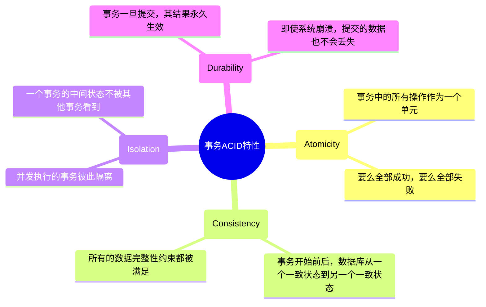
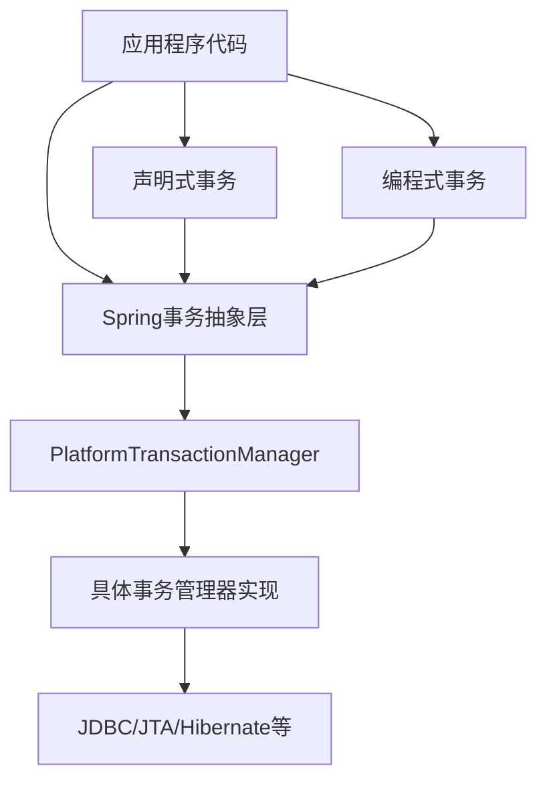
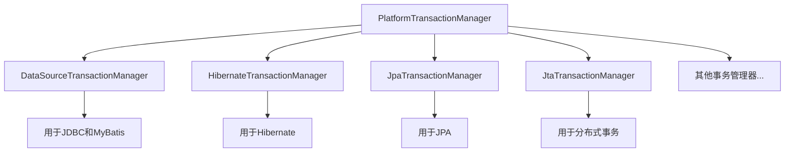
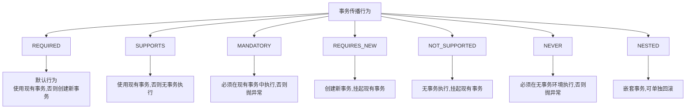
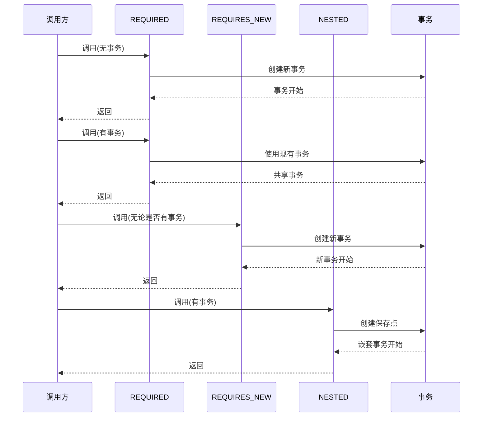
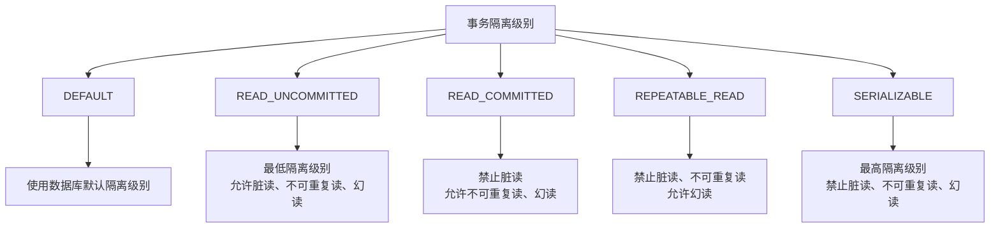
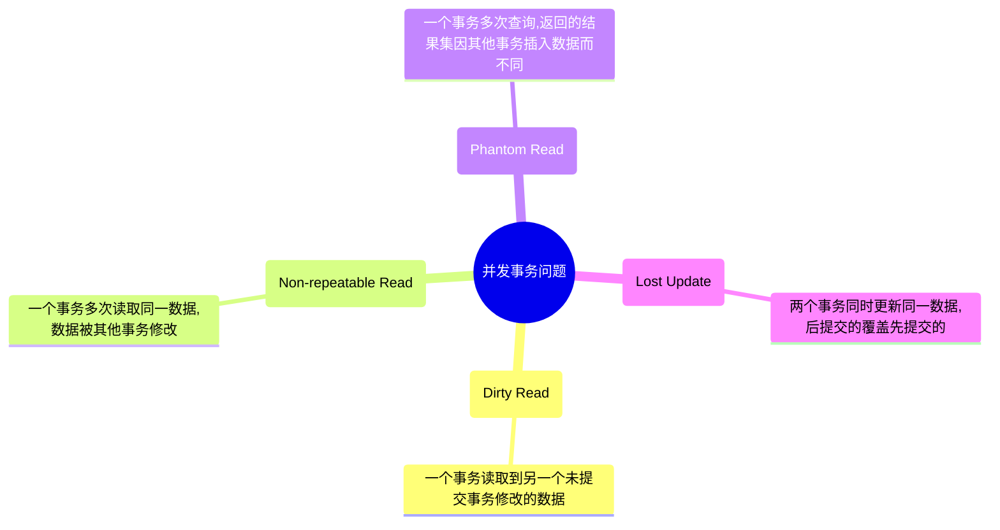
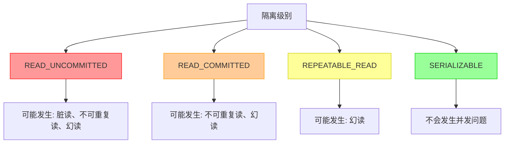
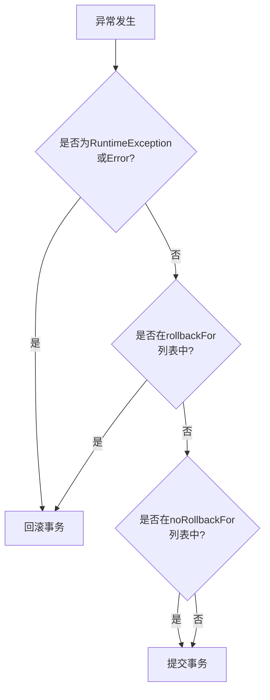
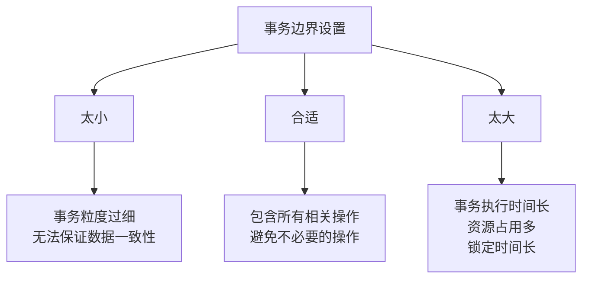

# Spring 事务管理

事务管理是企业级应用程序开发中的核心部分，它确保数据操作的原子性、一致性、隔离性和持久性（ACID 特性）。Spring 框架提供了一套完整的事务管理解决方案，简化了事务管理的复杂性。本文将详细介绍 Spring 事务管理的核心概念和使用方法。

## 目录

- [事务的基本概念](#事务的基本概念)
- [Spring 事务管理架构](#spring-事务管理架构)
- [事务管理器类型](#事务管理器类型)
- [声明式事务管理](#声明式事务管理)
- [编程式事务管理](#编程式事务管理)
- [事务传播行为](#事务传播行为)
- [事务隔离级别](#事务隔离级别)
- [事务超时和只读设置](#事务超时和只读设置)
- [事务回滚规则](#事务回滚规则)
- [事务管理最佳实践](#事务管理最佳实践)
- [常见问题与解决方案](#常见问题与解决方案)
- [小结](#小结)

## 事务的基本概念

### 什么是事务

事务是一组操作的集合，这些操作要么全部成功，要么全部失败。事务的主要目的是保证数据的完整性和一致性。

### 事务的 ACID 特性



- **原子性（Atomicity）**：事务是一个原子操作单元，对数据的修改要么全都执行，要么全都不执行。
- **一致性（Consistency）**：事务执行前后，数据库从一个一致性状态变换到另一个一致性状态。
- **隔离性（Isolation）**：多个事务并发执行时，一个事务的执行不应影响其他事务的执行。
- **持久性（Durability）**：事务一旦提交，对数据库的修改应该永久有效，即使系统出现故障。

## Spring 事务管理架构

Spring 事务管理架构是基于 AOP（面向切面编程）实现的，它提供了一套抽象层来简化不同事务 API 的使用。



### 核心接口和类

Spring 事务管理的核心接口和类包括：

1. **PlatformTransactionManager**：事务管理器接口，定义了事务的基本操作。
2. **TransactionDefinition**：定义事务的属性，如传播行为、隔离级别、超时时间等。
3. **TransactionStatus**：表示事务的状态，提供了检查和控制事务执行的方法。

```java
public interface PlatformTransactionManager {
    TransactionStatus getTransaction(TransactionDefinition definition) throws TransactionException;
    void commit(TransactionStatus status) throws TransactionException;
    void rollback(TransactionStatus status) throws TransactionException;
}

public interface TransactionDefinition {
    int getPropagationBehavior();
    int getIsolationLevel();
    int getTimeout();
    boolean isReadOnly();
    String getName();
}

public interface TransactionStatus {
    boolean isNewTransaction();
    boolean hasSavepoint();
    void setRollbackOnly();
    boolean isRollbackOnly();
    boolean isCompleted();
}
```

## 事务管理器类型

Spring 提供了多种事务管理器实现，以支持不同的数据访问技术：



### 1. DataSourceTransactionManager

用于 JDBC 和 MyBatis 等基于 JDBC 的数据访问技术：

```java
@Bean
public DataSourceTransactionManager transactionManager(DataSource dataSource) {
    return new DataSourceTransactionManager(dataSource);
}
```

### 2. HibernateTransactionManager

用于 Hibernate 框架：

```java
@Bean
public HibernateTransactionManager transactionManager(SessionFactory sessionFactory) {
    return new HibernateTransactionManager(sessionFactory);
}
```

### 3. JpaTransactionManager

用于 JPA（Java Persistence API）：

```java
@Bean
public JpaTransactionManager transactionManager(EntityManagerFactory entityManagerFactory) {
    return new JpaTransactionManager(entityManagerFactory);
}
```

### 4. JtaTransactionManager

用于分布式事务管理（Java Transaction API）：

```java
@Bean
public JtaTransactionManager transactionManager() {
    return new JtaTransactionManager();
}
```

## 声明式事务管理

Spring 的声明式事务管理是通过 AOP 实现的，它允许开发者使用注解或 XML 配置来定义事务的边界和规则，而无需编写事务管理代码。

### 启用声明式事务

#### XML 配置方式

```xml
<beans xmlns="http://www.springframework.org/schema/beans"
       xmlns:xsi="http://www.w3.org/2001/XMLSchema-instance"
       xmlns:tx="http://www.springframework.org/schema/tx"
       xsi:schemaLocation="http://www.springframework.org/schema/beans
                          http://www.springframework.org/schema/beans/spring-beans.xsd
                          http://www.springframework.org/schema/tx
                          http://www.springframework.org/schema/tx/spring-tx.xsd">

    <!-- 定义事务管理器 -->
    <bean id="transactionManager" class="org.springframework.jdbc.datasource.DataSourceTransactionManager">
        <property name="dataSource" ref="dataSource" />
    </bean>

    <!-- 启用注解驱动的事务管理 -->
    <tx:annotation-driven transaction-manager="transactionManager" />
</beans>
```

#### Java 配置方式

```java
@Configuration
@EnableTransactionManagement
public class AppConfig {

    @Bean
    public DataSource dataSource() {
        // 配置数据源
    }

    @Bean
    public PlatformTransactionManager transactionManager(DataSource dataSource) {
        return new DataSourceTransactionManager(dataSource);
    }
}
```

### @Transactional 注解

`@Transactional` 是 Spring 声明式事务管理的核心注解，它可以应用于类或方法，用于定义事务的属性。

```java
@Service
public class UserServiceImpl implements UserService {

    @Autowired
    private UserRepository userRepository;

    @Transactional
    public void createUser(User user) {
        userRepository.save(user);
        // 其他操作...
    }

    @Transactional(
        propagation = Propagation.REQUIRED,
        isolation = Isolation.READ_COMMITTED,
        timeout = 30,
        readOnly = false,
        rollbackFor = Exception.class,
        noRollbackFor = NotFoundException.class
    )
    public void updateUser(User user) {
        userRepository.update(user);
        // 其他操作...
    }
}
```

`@Transactional` 注解的属性：

- **propagation**：事务传播行为
- **isolation**：事务隔离级别
- **timeout**：事务超时时间（秒）
- **readOnly**：是否为只读事务
- **rollbackFor**：导致事务回滚的异常类数组
- **noRollbackFor**：不导致事务回滚的异常类数组

### XML 配置事务

除了注解方式，Spring 也支持使用 XML 配置声明式事务：

```xml
<tx:advice id="txAdvice" transaction-manager="transactionManager">
    <tx:attributes>
        <tx:method name="get*" read-only="true" />
        <tx:method name="find*" read-only="true" />
        <tx:method name="*" propagation="REQUIRED" rollback-for="Exception" />
    </tx:attributes>
</tx:advice>

<aop:config>
    <aop:pointcut id="serviceOperation" expression="execution(* com.example.service.*.*(..))" />
    <aop:advisor advice-ref="txAdvice" pointcut-ref="serviceOperation" />
</aop:config>
```

## 编程式事务管理

虽然声明式事务管理适用于大多数场景，但在某些特殊情况下，可能需要更细粒度的事务控制，这时可以使用编程式事务管理。

### TransactionTemplate

`TransactionTemplate` 是 Spring 提供的最简单的编程式事务管理方式：

```java
@Service
public class UserServiceImpl implements UserService {

    @Autowired
    private TransactionTemplate transactionTemplate;

    @Autowired
    private UserRepository userRepository;

    public void createUser(final User user) {
        transactionTemplate.execute(new TransactionCallbackWithoutResult() {
            @Override
            protected void doInTransactionWithoutResult(TransactionStatus status) {
                try {
                    userRepository.save(user);
                    // 其他操作...
                } catch (Exception e) {
                    status.setRollbackOnly();
                    throw e;
                }
            }
        });
    }

    public User getUserById(final Long id) {
        return transactionTemplate.execute(new TransactionCallback<User>() {
            @Override
            public User doInTransaction(TransactionStatus status) {
                // 设置为只读事务
                status.setReadOnly(true);
                return userRepository.findById(id);
            }
        });
    }
}
```

### TransactionManager 直接使用

也可以直接使用 `PlatformTransactionManager` 进行事务管理：

```java
@Service
public class UserServiceImpl implements UserService {

    @Autowired
    private PlatformTransactionManager transactionManager;

    @Autowired
    private UserRepository userRepository;

    public void createUser(User user) {
        DefaultTransactionDefinition def = new DefaultTransactionDefinition();
        def.setPropagationBehavior(TransactionDefinition.PROPAGATION_REQUIRED);

        TransactionStatus status = transactionManager.getTransaction(def);
        try {
            userRepository.save(user);
            // 其他操作...
            transactionManager.commit(status);
        } catch (Exception e) {
            transactionManager.rollback(status);
            throw e;
        }
    }
}
```

## 事务传播行为

事务传播行为定义了事务方法被另一个事务方法调用时如何执行。Spring 支持 7 种传播行为：



### 传播行为示例

以下示例展示了不同传播行为的使用场景：

```java
@Service
public class OrderServiceImpl implements OrderService {

    @Autowired
    private PaymentService paymentService;

    @Autowired
    private InventoryService inventoryService;

    // 使用默认的REQUIRED传播行为
    @Transactional
    public void createOrder(Order order) {
        // 保存订单
        saveOrder(order);

        // 处理支付,共享当前事务
        paymentService.processPayment(order);

        // 更新库存,在新事务中执行
        inventoryService.updateInventory(order);
    }

    private void saveOrder(Order order) {
        // 保存订单逻辑
    }
}

@Service
public class PaymentServiceImpl implements PaymentService {

    // 使用REQUIRED传播行为,表示要使用现有事务
    @Transactional(propagation = Propagation.REQUIRED)
    public void processPayment(Order order) {
        // 处理支付逻辑
    }
}

@Service
public class InventoryServiceImpl implements InventoryService {

    // 使用REQUIRES_NEW传播行为,表示要创建新事务
    @Transactional(propagation = Propagation.REQUIRES_NEW)
    public void updateInventory(Order order) {
        // 更新库存逻辑
    }
}
```

### 传播行为详解



#### 1. REQUIRED（默认）

如果当前存在事务，则加入该事务；如果不存在事务，则创建一个新事务。这是最常用的传播行为。

#### 2. SUPPORTS

如果当前存在事务，则加入该事务；如果不存在事务，则以非事务方式执行。适用于不需要事务保证的操作。

#### 3. MANDATORY

必须在一个已有的事务中执行，否则抛出异常。适用于必须在事务环境中执行的业务逻辑。

#### 4. REQUIRES_NEW

创建一个新事务，如果当前存在事务，则挂起当前事务。适用于不受外部事务影响的操作。

#### 5. NOT_SUPPORTED

以非事务方式执行，如果当前存在事务，则挂起当前事务。适用于不应该在事务中执行的操作（如查询）。

#### 6. NEVER

以非事务方式执行，如果当前存在事务，则抛出异常。适用于确保在非事务环境中执行的操作。

#### 7. NESTED

如果当前存在事务，则在嵌套事务中执行；如果不存在事务，则创建一个新事务。嵌套事务可以独立回滚而不影响外部事务。

## 事务隔离级别

事务隔离级别定义了一个事务可能受其他并发事务影响的程度。Spring 支持 5 种隔离级别：



### 并发事务问题



#### 1. 脏读（Dirty Read）

一个事务读取到另一个未提交事务修改过的数据。如果这个未提交的事务回滚，那么读取到的数据就是不正确的。

#### 2. 不可重复读（Non-repeatable Read）

在一个事务内多次读取同一数据，由于其他事务在这期间更新了该数据，导致两次读取的结果不同。

#### 3. 幻读（Phantom Read）

在一个事务内多次查询某个范围的记录，由于其他事务在这期间插入或删除了符合这个查询条件的记录，导致两次查询返回的结果集不同。

### 隔离级别与并发问题的关系



注意：实际的隔离级别实现取决于数据库。例如，MySQL 的 InnoDB 引擎在 REPEATABLE READ 隔离级别下通过 MVCC 机制也能避免大多数幻读问题。

### 在 Spring 中设置隔离级别

```java
@Transactional(isolation = Isolation.READ_COMMITTED)
public void updateUserInformation(User user) {
    // 业务逻辑
}
```

## 事务超时和只读设置

### 事务超时

事务超时定义了事务可以运行的最长时间，超过这个时间事务会自动回滚：

```java
@Transactional(timeout = 30) // 30秒超时
public void longRunningOperation() {
    // 长时间运行的操作
}
```

超时设置有助于防止长时间运行的事务占用系统资源或锁定数据库记录。

### 只读事务

只读事务表明该事务不会修改任何数据：

```java
@Transactional(readOnly = true)
public List<User> getAllUsers() {
    return userRepository.findAll();
}
```

将事务标记为只读有以下好处：

1. 数据库可以优化只读事务的执行
2. 避免不必要的数据库写锁
3. 一些 ORM 框架（如 Hibernate）可以优化缓存

## 事务回滚规则

默认情况下，Spring 事务在遇到运行时异常（RuntimeException）或 Error 时会回滚，而在遇到检查型异常（checked exception）时不会回滚。



### 自定义回滚规则

可以通过 `@Transactional` 注解的 `rollbackFor` 和 `noRollbackFor` 属性自定义回滚规则：

```java
@Transactional(
    rollbackFor = {SQLException.class, IOException.class},
    noRollbackFor = {NotFoundException.class}
)
public void updateUserWithCustomRollbackRules(User user) throws Exception {
    // 业务逻辑
}
```

在上面的例子中：

- 当发生 SQLException 或 IOException 时，事务会回滚
- 当发生 NotFoundException 时，事务不会回滚
- 其他运行时异常和错误会导致事务回滚
- 其他检查型异常不会导致事务回滚

## 事务管理最佳实践

### 1. 合理设置事务边界



- 将有关联的数据库操作放在一个事务中
- 避免在事务中执行非数据库操作（如发送邮件、HTTP 请求等）
- 避免在事务中执行耗时的操作

### 2. 正确使用事务传播行为

- 默认使用 `REQUIRED` 传播行为
- 对于独立于外部事务的操作，使用 `REQUIRES_NEW`
- 对于只读查询操作，考虑使用 `SUPPORTS` 或 `NOT_SUPPORTED`
- 谨慎使用 `NESTED` 传播行为，因为其依赖于数据库保存点的支持

### 3. 合理设置隔离级别

- 默认使用数据库默认的隔离级别
- 对于重要的事务操作，根据并发需求适当提高隔离级别
- 对于只读的查询操作，可以考虑降低隔离级别以提高并发性能
- 了解所使用数据库的默认隔离级别和实现细节

### 4. 避免事务失效的情况

以下情况可能导致 Spring 事务管理失效：

- 方法不是 public 的
- 方法是 final 的
- 同一类内部方法调用（self-invocation）
- 未被 Spring 管理的类
- 异常被捕获且未重新抛出
- 使用错误的事务管理器

```java
@Service
public class UserServiceImpl implements UserService {

    @Autowired
    private UserRepository userRepository;

    // 事务正常工作
    @Transactional
    public void updateUser(User user) {
        userRepository.update(user);
    }

    // 事务失效 - 内部方法调用
    public void updateUserInfo(User user) {
        this.updateUser(user); // self-invocation, 事务不会生效
    }

    // 事务失效 - 异常被捕获
    @Transactional
    public void deleteUser(Long id) {
        try {
            userRepository.delete(id);
        } catch (Exception e) {
            // 异常被捕获但未重新抛出，事务不会回滚
            log.error("Failed to delete user", e);
        }
    }
}
```

### 5. 使用正确的异常处理

- 不要捕获所有异常而不重新抛出，这会阻止事务回滚
- 对于不应该导致事务回滚的异常，明确在 `noRollbackFor` 中指定
- 确保业务异常被正确捕获和处理

```java
@Transactional
public void businessOperation() {
    try {
        // 业务逻辑
    } catch (BusinessException e) {
        // 处理业务异常，但确保事务回滚
        throw new RuntimeException("Business operation failed", e);
    }
}
```

## 常见问题与解决方案

### 1. 事务不回滚

**可能原因**：

- 捕获异常但未重新抛出
- 抛出的是检查型异常（非 RuntimeException 或 Error）
- 事务传播行为设置不正确
- 事务管理器配置错误

**解决方案**：

- 确保异常正确传播或转换为 RuntimeException
- 使用 `rollbackFor` 指定应该导致回滚的检查型异常
- 检查事务传播行为的设置
- 验证事务管理器配置

### 2. 事务失效

**可能原因**：

- 同一类内部方法调用
- 目标方法不是 public 的
- 目标类未被 Spring 管理
- AOP 代理配置不正确

**解决方案**：

- 从其他类调用事务方法
- 使用 `applicationContext.getBean(Class)` 获取代理对象
- 确保事务方法是 public 的
- 确保类已被 Spring 容器管理（使用 `@Component`、`@Service` 等注解）
- 检查 AOP 代理配置

### 3. 事务嵌套问题

**可能原因**：

- 嵌套事务的传播行为设置不当
- 数据库不支持保存点（用于 `NESTED` 传播行为）

**解决方案**：

- 根据业务需求正确设置传播行为
- 了解数据库是否支持保存点
- 考虑使用 `REQUIRES_NEW` 代替 `NESTED`（如果需要独立回滚）

### 4. 长事务导致的性能问题

**可能原因**：

- 事务中包含耗时操作
- 事务边界太大
- 隔离级别过高

**解决方案**：

- 减小事务边界，只包含必要的数据库操作
- 将耗时操作移出事务
- 设置合适的事务超时时间
- 降低隔离级别（在保证数据一致性的前提下）

## 小结

Spring 事务管理提供了一种简单而强大的方式来管理数据库事务，支持声明式和编程式两种风格。通过合理配置事务的传播行为、隔离级别、超时和回滚规则，可以满足不同场景下的事务需求。

良好的事务管理实践包括:

- 合理设置事务边界，避免长事务
- 正确使用事务传播行为来处理服务间的调用关系
- 根据业务需求选择合适的隔离级别
- 避免事务失效的常见陷阱
- 正确处理异常，确保事务正确回滚或提交

通过深入理解 Spring 事务管理机制，开发者可以构建出健壮、一致且高性能的企业级应用，同时保持代码的简洁和可维护性。

