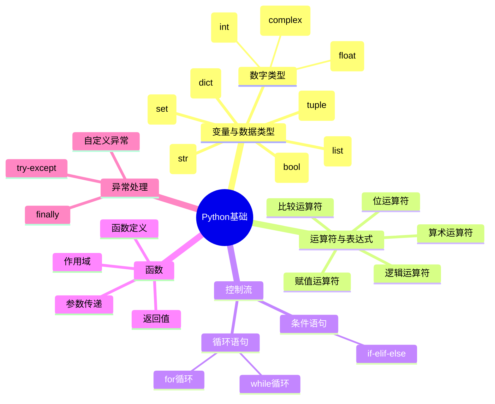
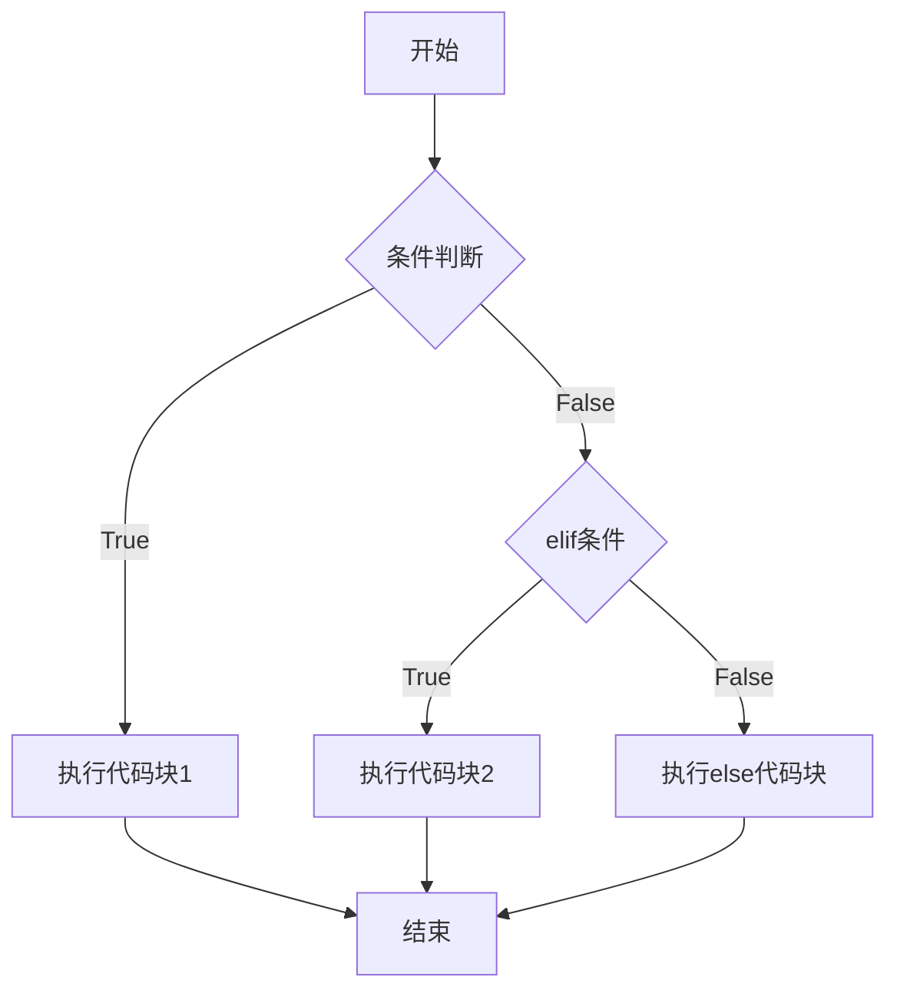
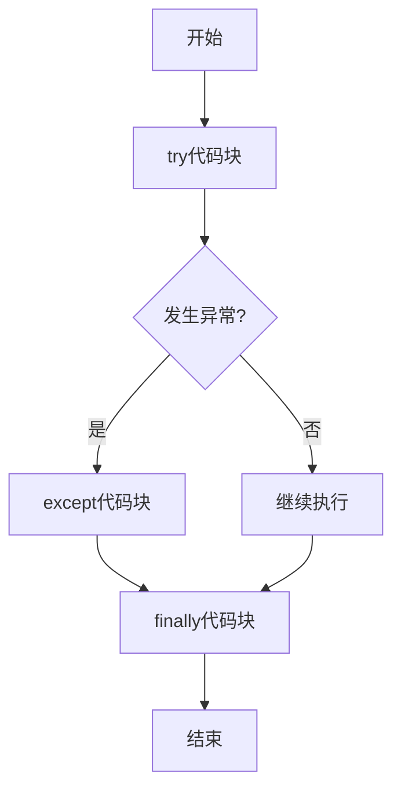

# 1 Python基础知识

## 1.1 知识体系概览



## 1.2 变量与数据类型

### 1.2.1 变量基础

Python中的变量是动态类型的，不需要预先声明类型。变量名必须以字母或下划线开头。

```python
# 变量命名示例
name = "Python"  # 字符串
age = 25         # 整数
pi = 3.14       # 浮点数
is_valid = True  # 布尔值
```

### 1.2.2 数据类型

#### 1.2.2.1 数字类型

1. 整数（int）
   - 可以表示任意大小的整数
   - 支持十进制、二进制、八进制和十六进制表示
   ```python
   # 十进制
   x = 10
   big_num = 1234567890
   
   # 二进制（以0b开头）
   binary = 0b1010  # 等于10
   
   # 八进制（以0o开头）
   octal = 0o10  # 等于8
   
   # 十六进制（以0x开头）
   hex_num = 0xFF  # 等于255
   ```

2. 浮点数（float）
   - 用于表示小数
   - 支持科学计数法
   - 注意浮点数精度问题
   ```python
   # 基本表示
   pi = 3.14159
   
   # 科学计数法
   speed_of_light = 3e8  # 3 x 10^8
   tiny_number = 1e-10   # 1 x 10^-10
   
   # 浮点数精度示例
   print(0.1 + 0.2)  # 输出0.30000000000000004
   # 处理精度问题
   from decimal import Decimal
   print(Decimal('0.1') + Decimal('0.2'))  # 输出0.3
   ```

3. 复数（complex）
   - 由实部和虚部组成
   - 用j或J表示虚数单位
   ```python
   # 基本表示
   z1 = 2 + 3j
   z2 = complex(2, 3)  # 等同于2 + 3j
   
   # 复数运算
   print(z1.real)    # 获取实部：2.0
   print(z1.imag)    # 获取虚部：3.0
   print(abs(z1))    # 获取模：3.605551275463989
   
   # 复数运算示例
   z3 = z1 + z2
   z4 = z1 * z2
   ```

4. 数值运算
   ```python
   # 基本运算
   a = 10
   b = 3
   
   print(a + b)   # 加法：13
   print(a - b)   # 减法：7
   print(a * b)   # 乘法：30
   print(a / b)   # 除法：3.3333333333333335
   print(a // b)  # 整除：3
   print(a % b)   # 取余：1
   print(a ** b)  # 幂运算：1000
   
   # 数学函数（需要导入math模块）
   import math
   
   print(math.sqrt(16))     # 平方根：4.0
   print(math.ceil(3.1))    # 向上取整：4
   print(math.floor(3.9))   # 向下取整：3
   print(math.pi)           # π值：3.141592653589793
   ```

#### 1.2.2.2 字符串

```python
# 字符串定义
name = "Python"
text = 'Hello, World!'
long_text = """这是一个
多行字符串"""

# 字符串操作
print(name[0])      # 输出: P
print(name[1:4])    # 输出: yth
print(name + " Programming")  # 字符串拼接
```

#### 1.2.2.3 列表

1. 列表的创建和基本操作
   ```python
   # 创建列表
   fruits = ["apple", "banana", "orange"]
   numbers = list(range(1, 6))  # [1, 2, 3, 4, 5]
   mixed = [1, "hello", 3.14, True]  # 不同类型的元素
   
   # 访问和切片
   print(fruits[0])       # 第一个元素：apple
   print(fruits[-1])      # 最后一个元素：orange
   print(fruits[1:3])     # 切片：['banana', 'orange']
   print(fruits[::-1])    # 反转列表
   ```

2. 列表操作方法
   ```python
   fruits = ["apple", "banana", "orange"]
   
   # 添加元素
   fruits.append("grape")      # 在末尾添加元素
   fruits.insert(1, "pear")   # 在指定位置插入元素
   fruits.extend(["mango", "kiwi"])  # 扩展列表
   
   # 删除元素
   fruits.remove("banana")    # 删除指定元素
   last = fruits.pop()        # 删除并返回最后一个元素
   del fruits[0]              # 删除指定位置的元素
   
   # 查找和计数
   print(fruits.index("apple"))  # 查找元素位置
   print(fruits.count("apple"))  # 统计元素出现次数
   
   # 排序和反转
   fruits.sort()              # 升序排序
   fruits.sort(reverse=True)  # 降序排序
   fruits.reverse()           # 反转列表
   ```

3. 列表推导式
   ```python
   # 基本列表推导式
   squares = [x**2 for x in range(10)]  # 生成平方数列表
   
   # 带条件的列表推导式
   even_squares = [x**2 for x in range(10) if x % 2 == 0]
   
   # 嵌套列表推导式
   matrix = [[i+j for j in range(3)] for i in range(3)]
   ```

4. 列表的常见应用
   ```python
   # 列表作为栈使用
   stack = []
   stack.append(1)    # 压栈
   stack.append(2)
   stack.pop()        # 出栈
   
   # 列表作为队列使用
   from collections import deque
   queue = deque(["a", "b", "c"])
   queue.append("d")   # 入队
   queue.popleft()     # 出队
   ```

#### 1.2.2.4 元组

1. 元组的基本特性
   - 不可变序列
   - 使用小括号定义
   - 支持索引和切片
   ```python
   # 创建元组
   coordinates = (10, 20)
   empty_tuple = ()
   single_item_tuple = (1,)  # 注意逗号
   
   # 访问元素
   print(coordinates[0])     # 输出：10
   print(coordinates[-1])    # 输出：20
   
   # 元组解包
   x, y = coordinates       # x = 10, y = 20
   ```

2. 元组操作
   ```python
   # 元组连接
   tuple1 = (1, 2)
   tuple2 = (3, 4)
   combined = tuple1 + tuple2  # (1, 2, 3, 4)
   
   # 元组重复
   repeated = tuple1 * 2    # (1, 2, 1, 2)
   
   # 元组方法
   numbers = (1, 2, 2, 3, 2)
   print(numbers.count(2))   # 计数：3
   print(numbers.index(3))   # 查找位置：3
   ```

3. 元组的应用场景
   ```python
   # 作为函数返回值
   def get_coordinates():
       return (10, 20)
   
   # 命名元组
   from collections import namedtuple
   Point = namedtuple('Point', ['x', 'y'])
   p = Point(10, 20)
   print(p.x, p.y)  # 使用名称访问
   ```

#### 1.2.2.5 字典

1. 字典的基本操作
   ```python
   # 创建字典
   person = {
       "name": "John",
       "age": 30,
       "city": "New York"
   }
   
   # 访问和修改
   print(person["name"])      # 访问值
   person["age"] = 31        # 修改值
   person["email"] = "john@example.com"  # 添加新键值对
   
   # 安全访问
   print(person.get("phone", "Not found"))  # 使用默认值
   ```

2. 字典方法
   ```python
   # 常用方法
   keys = person.keys()       # 获取所有键
   values = person.values()   # 获取所有值
   items = person.items()     # 获取所有键值对
   
   # 更新和合并
   person.update({"age": 32, "phone": "123-456-7890"})
   
   # 删除操作
   del person["age"]         # 删除指定键值对
   phone = person.pop("phone", None)  # 删除并返回值
   person.clear()            # 清空字典
   ```

3. 字典推导式
   ```python
   # 基本字典推导式
   squares = {x: x**2 for x in range(5)}
   
   # 条件字典推导式
   even_squares = {x: x**2 for x in range(10) if x % 2 == 0}
   
   # 键值转换
   dict1 = {'a': 1, 'b': 2}
   dict2 = {v: k for k, v in dict1.items()}
   ```

4. 字典的应用
   ```python
   # 计数器
   from collections import Counter
   words = ['apple', 'banana', 'apple', 'orange']
   counter = Counter(words)
   print(counter)  # Counter({'apple': 2, 'banana': 1, 'orange': 1})
   
   # 默认字典
   from collections import defaultdict
   d = defaultdict(list)
   d['fruits'].append('apple')  # 自动创建列表
   ```

## 1.3 控制流

### 1.3.1 条件语句



1. if-elif-else 结构
   ```python
   # 基本条件判断
   age = 18
   if age < 18:
       print("未成年")
   elif age == 18:
       print("刚好成年")
   else:
       print("成年人")
   
   # 条件表达式（三元运算符）
   status = "成年" if age >= 18 else "未成年"
   
   # 复杂条件判断
   score = 85
   if score >= 90:
       grade = 'A'
   elif score >= 80:
       grade = 'B'
   elif score >= 70:
       grade = 'C'
   else:
       grade = 'D'
   ```

2. 逻辑运算符
   ```python
   # and, or, not 的使用
   age = 25
   income = 30000
   
   if age >= 18 and income >= 25000:
       print("符合贷款条件")
   
   # 短路逻辑
   x = None
   if x is not None and len(x) > 0:
       print("x不为空且长度大于0")
   ```

### 1.3.2 循环语句

#### 1.3.2.1 for循环

1. 基本用法
   ```python
   # 遍历列表
   fruits = ["apple", "banana", "orange"]
   for fruit in fruits:
       print(fruit)
   
   # 使用range
   for i in range(5):
       print(i)  # 输出0到4
   
   # range的其他用法
   for i in range(2, 8, 2):  # 起始值，结束值，步长
       print(i)  # 输出2, 4, 6
   ```

2. 高级用法
   ```python
   # enumerate用法
   for index, value in enumerate(fruits):
       print(f"索引 {index}: {value}")
   
   # zip用法
   names = ["John", "Anna", "Peter"]
   ages = [25, 30, 35]
   for name, age in zip(names, ages):
       print(f"{name} is {age} years old")
   
   # 字典遍历
   person = {"name": "John", "age": 30}
   for key, value in person.items():
       print(f"{key}: {value}")
   ```

#### 1.3.2.2 while循环

1. 基本用法
   ```python
   # 计数循环
   count = 0
   while count < 5:
       print(count)
       count += 1
   
   # 条件循环
   number = 23
   guess = 0
   while guess != number:
       guess = int(input("猜一个数字："))
       if guess > number:
           print("太大了")
       elif guess < number:
           print("太小了")
   ```

2. 循环控制
   ```python
   # break 语句
   while True:
       value = input("输入'quit'退出：")
       if value == 'quit':
           break
   
   # continue 语句
   for i in range(10):
       if i % 2 == 0:
           continue
       print(i)  # 只打印奇数
   
   # else 子句
   for i in range(5):
       if i == 10:
           break
   else:
       print("循环正常完成")  # 当循环正常结束时执行
   ```

## 1.4 函数

### 1.4.1 函数定义与调用

1. 基本函数定义
   ```python
   # 简单函数
   def greet(name):
       return f"Hello, {name}!"
   
   # 带文档字符串的函数
   def calculate_area(length, width):
       """计算矩形面积
       
       Args:
           length (float): 矩形的长
           width (float): 矩形的宽
       
       Returns:
           float: 矩形的面积
       """
       return length * width
   ```

2. 参数类型
   ```python
   # 位置参数
   def add(a, b):
       return a + b
   
   # 默认参数
   def power(x, n=2):
       return x ** n
   
   # 可变参数
   def sum_all(*args):
       return sum(args)
   
   # 关键字参数
   def person_info(**kwargs):
       for key, value in kwargs.items():
           print(f"{key}: {value}")
   
   # 混合使用
   def complex_function(a, b=5, *args, **kwargs):
       print(f"a={a}, b={b}")
       print(f"args={args}")
       print(f"kwargs={kwargs}")
   ```

3. 返回值
   ```python
   # 单一返回值
   def square(x):
       return x ** 2
   
   # 多个返回值
   def divide_and_remainder(x, y):
       return x // y, x % y
   
   # 返回None
   def greet_print(name):
       print(f"Hello, {name}!")
       # 隐式返回None
   ```

### 1.4.2 函数作用域

1. 变量作用域
   ```python
   # 全局和局部变量
   global_var = 10
   
   def test_scope():
       local_var = 20
       print(global_var)  # 访问全局变量
       print(local_var)   # 访问局部变量
   
   # 修改全局变量
   def modify_global():
       global global_var
       global_var = 30
   ```

2. 闭包
   ```python
   def outer_function(x):
       def inner_function(y):
           return x + y
       return inner_function
   
   # 使用闭包
   add_five = outer_function(5)
   result = add_five(3)  # 返回8
   ```

3. lambda函数
   ```python
   # 简单lambda函数
   square = lambda x: x**2
   
   # 在排序中使用lambda
   pairs = [(1, 'one'), (2, 'two'), (3, 'three')]
   pairs.sort(key=lambda pair: pair[1])  # 按字符串排序
   
   # 在map和filter中使用lambda
   numbers = [1, 2, 3, 4, 5]
   squares = list(map(lambda x: x**2, numbers))
   evens = list(filter(lambda x: x % 2 == 0, numbers))
   ```

## 1.5 异常处理



```python
# 异常处理示例
try:
    number = int(input("请输入一个数字："))
    result = 10 / number
    print(result)
except ValueError:
    print("请输入有效的数字！")
except ZeroDivisionError:
    print("不能除以零！")
finally:
    print("程序执行完毕")
```

## 1.6 实践建议

1. **代码风格**
   - 遵循PEP 8规范
   - 使用4个空格缩进
   - 适当添加注释

2. **调试技巧**
   - 使用print()调试
   - 使用Python调试器pdb
   - 善用异常处理

3. **学习路径**
   - 掌握基础语法
   - 多做练习题
   - 阅读他人代码
   - 实现小项目

## 1.7 下一步学习建议

1. 面向对象编程
2. 模块和包的使用
3. 文件操作
4. 标准库探索
5. 第三方库应用

继续学习更多Python知识，请参考其他相关文档：
- [[Python面向对象编程]]
- [[Python模块和包]]
- [[Python文件操作]]
- [[Python标准库]]
