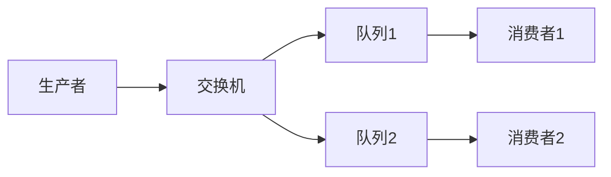
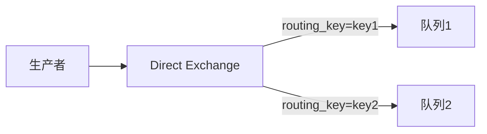
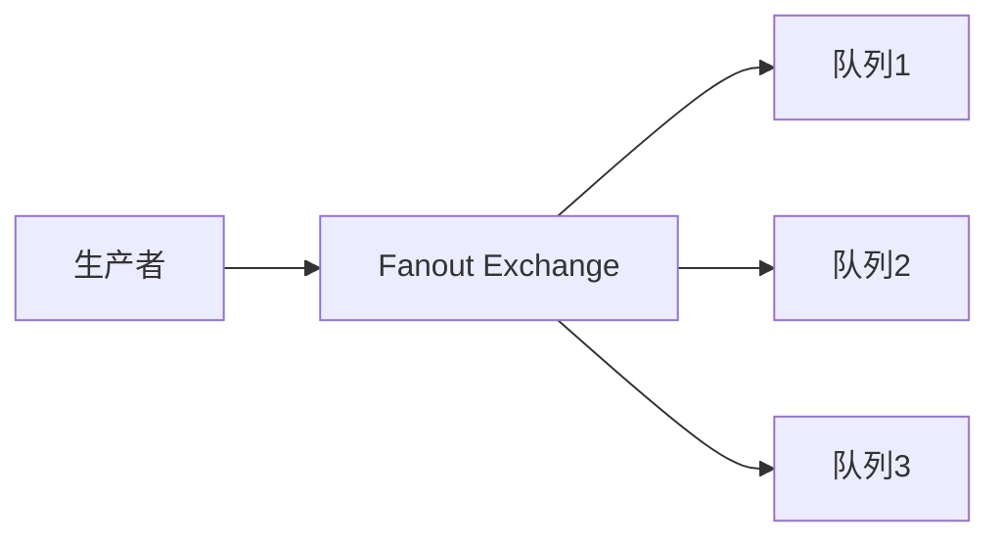
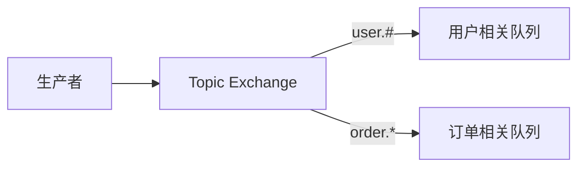
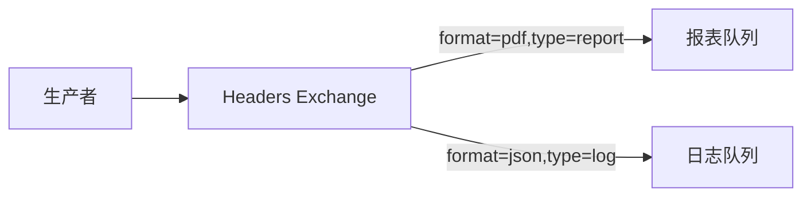
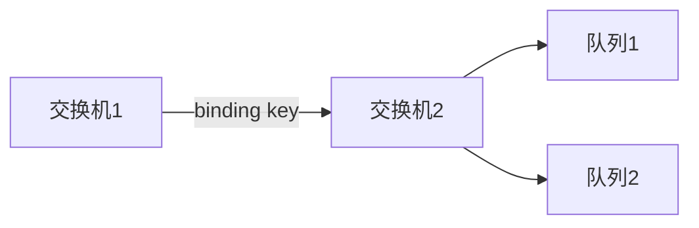
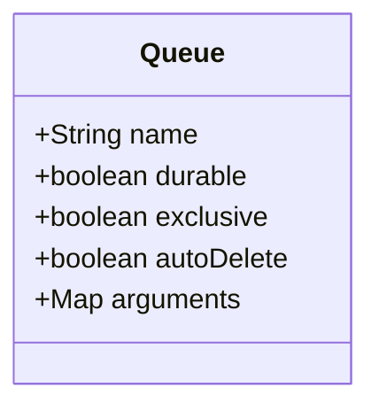

# 1 RabbitMQ 交换机和队列详解

## 1.1 基本概念

### 1.1.1 消息流转过程



消息在RabbitMQ中的流转遵循以下过程：
1. **生产者发送消息到交换机**
2. **交换机根据路由规则将消息投递到一个或多个队列**
3. **消费者从队列中获取消息并处理**

## 1.2 交换机详解

### 1.2.1 交换机类型

#### 1.2.1.1 Direct Exchange（直连交换机）



- 工作原理：根据消息的routing key将消息投递到对应的队列
- 使用场景：一对一的精确投递
- 代码示例：

```java
// 声明交换机
channel.exchangeDeclare("direct_exchange", BuiltinExchangeType.DIRECT);

// 声明队列并绑定
channel.queueDeclare("queue1", true, false, false, null);
channel.queueBind("queue1", "direct_exchange", "key1");

// 发送消息
channel.basicPublish("direct_exchange", "key1", null, message.getBytes());
```

#### 1.2.1.2 Fanout Exchange（扇出交换机）



- 工作原理：将消息广播到所有绑定的队列，忽略routing key
- 使用场景：广播消息，如日志收集
- 代码示例：

```java
// 声明交换机
channel.exchangeDeclare("fanout_exchange", BuiltinExchangeType.FANOUT);

// 声明队列并绑定
channel.queueDeclare("queue1", true, false, false, null);
channel.queueBind("queue1", "fanout_exchange", "");

// 发送消息
channel.basicPublish("fanout_exchange", "", null, message.getBytes());
```

#### 1.2.1.3 Topic Exchange（主题交换机）



- 工作原理：根据通配符匹配routing key来路由消息
- 通配符规则：
  - `*` 匹配一个单词
  - `#` 匹配零个或多个单词
- 使用场景：根据消息类型进行模糊匹配路由
- 代码示例：

```java
// 声明交换机
channel.exchangeDeclare("topic_exchange", BuiltinExchangeType.TOPIC);

// 声明队列并绑定
channel.queueDeclare("user_queue", true, false, false, null);
channel.queueBind("user_queue", "topic_exchange", "user.#");

// 发送消息
channel.basicPublish("topic_exchange", "user.create", null, message.getBytes());
```

#### 1.2.1.4 Headers Exchange（头交换机）



- 工作原理：根据消息的headers属性进行匹配路由
- 匹配规则：
  - `x-match = all`：所有header属性都匹配才路由
  - `x-match = any`：任意一个header属性匹配即可路由
- 使用场景：需要根据多个条件进行路由
- 代码示例：

```java
// 声明交换机
channel.exchangeDeclare("headers_exchange", BuiltinExchangeType.HEADERS);

// 声明队列
channel.queueDeclare("pdf_queue", true, false, false, null);

// 绑定队列到交换机，设置匹配规则
Map<String, Object> bindingArgs = new HashMap<>();
bindingArgs.put("x-match", "all");  // 必须所有属性都匹配
bindingArgs.put("format", "pdf");
bindingArgs.put("type", "report");
channel.queueBind("pdf_queue", "headers_exchange", "", bindingArgs);

// 发送消息
Map<String, Object> headers = new HashMap<>();
headers.put("format", "pdf");
headers.put("type", "report");
AMQP.BasicProperties properties = new AMQP.BasicProperties.Builder()
    .headers(headers)
    .build();
channel.basicPublish("headers_exchange", "", properties, message.getBytes());
```

### 1.2.2 绑定详解

#### 1.2.2.1 绑定类型

1. **队列绑定（Queue Binding）**
   - 将队列绑定到交换机
   - 可以指定routing key和绑定参数

2. **交换机绑定（Exchange to Exchange Binding）**
   - 将一个交换机绑定到另一个交换机
   - 实现交换机之间的消息转发



#### 1.2.2.2 绑定属性

1. **Binding Key**
   - Direct和Topic交换机使用
   - 定义消息路由规则

2. **Arguments**
   - Headers交换机使用
   - 定义头属性匹配规则

```java
// 交换机绑定示例
channel.exchangeBind("destination_exchange",    // 目标交换机
                    "source_exchange",        // 源交换机
                    "binding_key",           // 绑定键
                    null);                   // 绑定参数

// 带参数的队列绑定
Map<String, Object> bindArgs = new HashMap<>();
bindArgs.put("x-match", "any");
bindArgs.put("format", "pdf");
channel.queueBind("queue_name",
                 "exchange_name",
                 "",              // Headers Exchange不使用routing key
                 bindArgs);
```

## 1.3 队列详解

### 1.3.1 队列属性



#### 1.3.1.1 基本属性

1. **持久化（durable）**
   - `true`：队列将在服务器重启后保留
   - `false`：服务器重启后队列会被删除

2. **排他性（exclusive）**
   - `true`：队列仅对首次声明它的连接可见
   - `false`：队列对所有连接可见

3. **自动删除（autoDelete）**
   - `true`：当最后一个消费者断开连接后，队列会被自动删除
   - `false`：队列不会自动删除

#### 1.3.1.2 高级属性（arguments）

```java
Map<String, Object> args = new HashMap<>();

// 消息过期时间（毫秒）
args.put("x-message-ttl", 60000);

// 队列最大长度
args.put("x-max-length", 1000);

// 队列模式
args.put("x-queue-mode", "lazy");

// 死信交换机
args.put("x-dead-letter-exchange", "dlx_exchange");
args.put("x-dead-letter-routing-key", "dlx_key");

channel.queueDeclare("my_queue", true, false, false, args);
```

### 1.3.2 队列操作

#### 1.3.2.1 队列声明

```java
// 声明一个持久化、非排他、非自动删除的队列
String queueName = "my_queue";
boolean durable = true;      // 持久化
boolean exclusive = false;   // 非排他
boolean autoDelete = false;  // 非自动删除

channel.queueDeclare(queueName, durable, exclusive, autoDelete, null);
```

#### 1.3.2.2 队列绑定

```java
// 将队列绑定到交换机
String queueName = "my_queue";
String exchangeName = "my_exchange";
String routingKey = "my_key";

channel.queueBind(queueName, exchangeName, routingKey);
```

## 1.4 最佳实践

### 1.4.1 交换机选择建议

1. **Direct Exchange**
   - 适用于一对一的消息投递
   - 需要根据特定条件进行精确路由

2. **Fanout Exchange**
   - 适用于广播消息
   - 所有绑定队列都需要收到消息

3. **Topic Exchange**
   - 适用于消息分类路由
   - 需要根据消息特征进行模糊匹配

### 1.4.2 队列使用建议

1. **命名规范**
   - 使用有意义的名称
   - 建议使用点号分隔不同级别：`system.service.function`

2. **持久化设置**
   - 重要业务消息队列建议设置持久化
   - 临时队列可以不设置持久化提高性能

3. **死信队列**
   - 建议为重要业务配置死信队列
   - 可以捕获处理失败的消息


### 1.4.3 性能优化建议

1. **合理使用持久化**
   - 只对重要消息进行持久化
   - 非重要消息可以牺牲可靠性换取性能

2. **控制队列数量**
   - 避免创建过多队列
   - 合理使用Topic Exchange减少队列数量

3. **合理设置预取数量**
   - 根据消费者处理能力设置预取数量
   - 避免单个消费者负载过重

```java
// 设置预取数量
channel.basicQos(100); // 一次最多预取100条消息
