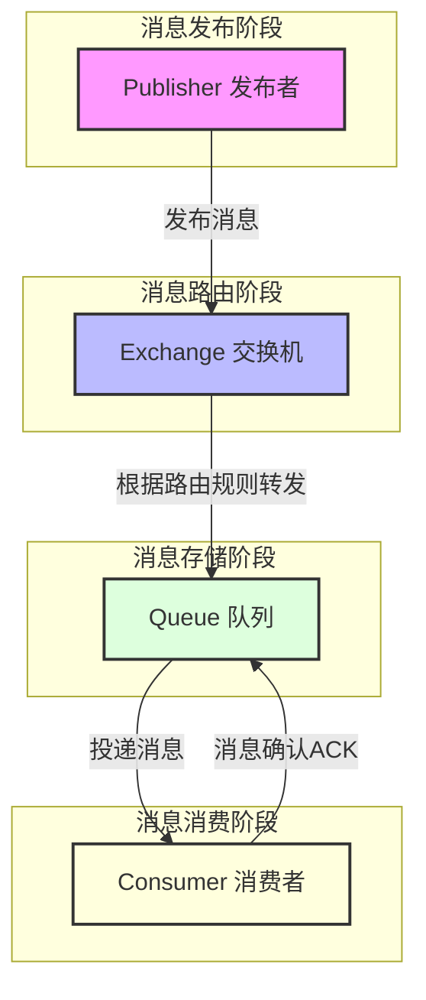

# 1 消息队列基础知识

## 1.1 什么是消息队列

消息队列（Message Queue，简称 MQ）是一种应用程序对应用程序的通信方法。应用程序通过读写出入队列的消息来通信，而无需专用的连接来链接它们。

### 1.1.1 定义与作用

- **定义**：消息队列是一种异步的服务间通信方式，是分布式系统中重要的组件。
- **工作原理**：
  - Producer（生产者）发送消息到队列
  - Queue（队列）存储消息
  - Consumer（消费者）从队列中获取消息并处理

### 1.1.2 消息队列的应用场景

1. **异步处理**

   - 用户注册后发送欢迎邮件
   - 订单创建后发送通知
   - 图片上传后进行压缩处理

2. **应用解耦**

   - 订单系统与库存系统解耦
   - 商品系统与搜索系统解耦
   - 业务系统与日志系统解耦

3. **流量削峰**

   - 秒杀系统
   - 订单处理系统
   - 日志处理系统

### 1.1.3 消息队列的优缺点

#### 1.1.3.1 优点

1. **解耦**

   - 系统间解耦，降低系统复杂度
   - 减少系统间依赖，提高系统可维护性

2. **异步**

   - 提升系统吞吐量
   - 改善用户体验
   - 基于事件驱动设计

3. **削峰**
   - 控制并发量
   - 保护系统稳定性
   - 削平流量波峰

#### 1.1.3.2 缺点

1. **系统可用性降低**

   - MQ 宕机影响业务系统
   - 需要考虑高可用方案

2. **系统复杂度提高**

   - 需要保证消息不丢失
   - 需要处理重复消费
   - 需要保证消息顺序性

3. **一致性问题**
   - 分布式事务问题
   - 数据一致性的保证

## 1.2 AMQP 协议

^5196aa

### 1.2.1 什么是 AMQP

AMQP（Advanced Message Queuing Protocol）是一个**提供统一消息服务的应用层标准高级消息队列协议**。

### 1.2.2 AMQP 的主要组件

1. **Publisher（发布者）**

   - 消息的生产者
   - 负责发送消息到交换机

2. **Exchange（交换机）**

   - 接收发布者的消息
   - 根据路由规则转发消息到队列

3. **Queue（队列）**

   - 存储消息的载体
   - 消息最终被投递到队列

4. **Consumer（消费者）**

   - 从队列中获取消息
   - 处理具体的业务逻辑

### 1.2.3 AMQP 工作流程

> 说明：
> 1. **消息发布**：Publisher将消息发送到Exchange，并指定routingKey
> 2. **消息路由**：Exchange根据消息的routingKey和binding规则将消息路由到相应的Queue
> 3. **消息存储**：Queue接收到消息后进行存储
> 4. **消息投递**：Queue将消息推送给Consumer或Consumer主动拉取消息
> 5. **消息处理**：Consumer接收到消息后进行业务处理
> 6. **确认机制**：Consumer处理完消息后发送ACK确认，Queue收到确认后删除消息

## 1.3 消息队列产品对比

### 1.3.1 主流消息队列对比

| 特性        | RabbitMQ          | Kafka             | RocketMQ  | ActiveMQ                 | ZeroMQ |
| --------- | ----------------- | ----------------- | --------- | ------------------------ | ------ |
| **基本信息**  |                   |                   |           |                          |        |
| 开发语言      | Erlang            | Scala/Java        | Java      | Java                     | C++    |
| 开发者       | Pivotal           | Apache/LinkedIn   | 阿里/Apache | Apache                   | iMatix |
| 协议支持      | AMQP, MQTT, STOMP | 自定义协议             | 自定义协议     | OpenWire,STOMP,REST,MQTT | AMQP   |
| **性能指标**  |                   |                   |           |                          |        |
| 单机吞吐量     | 万级                | 百万级               | 十万级       | 万级                       | 十万级    |
| 延迟        | 微秒级               | 毫秒级               | 毫秒级       | 毫秒级                      | 微秒级    |
| 可用性       | 高                 | 非常高               | 非常高       | 高                        | 高      |
| **功能特性**  |                   |                   |           |                          |        |
| 消息持久化     | 支持                | 支持                | 支持        | 支持                       | 不支持    |
| 消息事务      | 支持                | 支持(0.11+)         | 支持        | 支持                       | 不支持    |
| 消息投递确认    | 支持                | 支持(At least once) | 支持        | 支持                       | 不支持    |
| 消息重试      | 支持                | 不支持               | 支持        | 支持                       | 不支持    |
| 死信队列      | 支持                | 不支持               | 支持        | 支持                       | 不支持    |
| 延迟队列      | 插件支持              | 不支持               | 支持        | 支持                       | 不支持    |
| 优先级队列     | 支持                | 不支持               | 支持        | 支持                       | 不支持    |
| **集群特性**  |                   |                   |           |                          |        |
| 集群方式      | 主从                | 分布式               | 主从/分布式    | 主从                       | 不支持    |
| 消息堆积      | GB 级              | TB 级              | TB 级      | GB 级                     | -      |
| 集群节点上限    | 10 个左右            | 数千个               | 数百个       | 10 个左右                   | -      |
| **应用场景**  |                   |                   |           |                          |        |
| 适用场景      | 复杂业务场景            | 日志处理/流式计算         | 金融/电商/物流  | 企业系统集成                   | 高性能通信  |
| 消息量级      | 万级                | 十万级以上             | 万级到十万级    | 万级                       | 万级     |
| **运维管理**  |                   |                   |           |                          |        |
| 管理界面      | 完善                | 一般                | 完善        | 完善                       | 无      |
| 监控工具      | 完善                | 一般                | 完善        | 完善                       | 简单     |
| 部署难度      | 中等                | 较高                | 中等        | 简单                       | 较高     |
| **社区活跃度** |                   |                   |           |                          |        |
| 社区活跃度     | 非常活跃              | 非常活跃              | 活跃        | 一般                       | 活跃     |
| 文档完善度     | 高                 | 高                 | 中         | 高                        | 中      |
| 更新频率      | 频繁                | 频繁                | 频繁        | 较少                       | 一般     |

### 1.3.2 各产品最佳实践场景

1. **RabbitMQ**

   - 优势场景：
     - 需要可靠消息投递
     - 需要支持复杂的路由规则
     - 需要管理界面和监控工具
     - 中小规模消息量
   - 典型应用：
     - 订单处理系统
     - 消息通知
     - 任务队列

2. **Kafka**

   - 优势场景：
     - 日志收集分析
     - 大数据流式处理
     - 需要超高吞吐量
     - 消息持久化要求高
   - 典型应用：
     - 日志处理平台
     - 流式处理系统
     - 实时数据分析

3. **RocketMQ**

   - 优势场景：
     - 金融级消息可靠性
     - 需要事务消息
     - 需要消息轨迹
     - 需要大规模堆积能力
   - 典型应用：
     - 电商交易系统
     - 金融支付系统
     - 物流系统

4. **ActiveMQ**

   - 优势场景：
     - 传统企业系统集成
     - 需要丰富的协议支持
     - 小规模部署
   - 典型应用：
     - 企业应用集成
     - 系统解耦
     - 传统 JMS 应用

5. **ZeroMQ**
   - 优势场景：
     - 需要极致性能
     - 嵌入式系统
     - 不需要持久化
   - 典型应用：
     - 实时通信系统
     - 高性能计算
     - 游戏服务器

