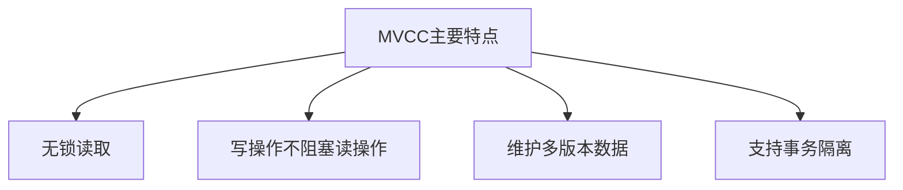
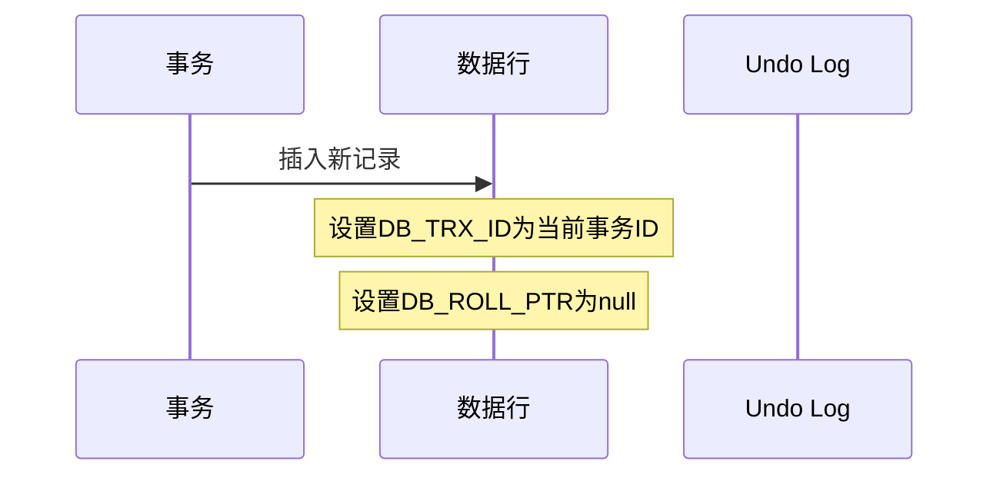

# 1 MySQL MVCC（多版本并发控制）详解

## 1.1 MVCC基础概念

### 1.1.1 什么是MVCC？

MVCC（Multi-Version Concurrency Control，多版本并发控制）是MySQL中一种并发控制的实现方式，主要用于提高数据库的并发性能。通过维护数据的多个版本，使得读写操作不会互相阻塞，从而提高并发性能。

### 1.1.2 为什么需要MVCC？

在不使用MVCC的情况下，数据库面临以下问题：

1. **读写冲突**：当一个事务正在修改某条记录时，其他事务必须等待才能读取该记录
2. **并发性能差**：频繁的加锁和等待会导致数据库性能下降
3. **一致性问题**：难以实现不同事务隔离级别下的一致性要求

### 1.1.3 MVCC的主要特点



## 1.2 MVCC的实现原理

### 1.2.1 核心要素

#### 1.2.1.1 隐藏字段

InnoDB中的每一行记录都包含以下隐藏字段：

- **DB_TRX_ID**：创建或最后一次修改该记录的事务ID
- **DB_ROLL_PTR**：回滚指针，指向上一个版本的记录
- **DB_ROW_ID**：行ID（如果没有主键，InnoDB会自动创建）

```
+----------------+----------------+---------------+------------------+
|   DB_TRX_ID    |   DB_ROLL_PTR  |   DB_ROW_ID   |    实际数据列     |
+----------------+----------------+---------------+------------------+
|    事务ID      |   回滚指针     |    行ID      |   用户数据内容    |
+----------------+----------------+---------------+------------------+
```

#### 1.2.1.2 Undo Log（回滚日志）

Undo Log用于记录数据被修改前的值，主要有两个作用：

1. **事务回滚**：当事务失败或回滚时，用于恢复数据
2. **MVCC实现**：用于存储历史版本的数据

### 1.2.2 版本链

当数据被多次修改时，会形成一个版本链：


### 1.2.3 ReadView（读视图）

ReadView是事务进行快照读操作时产生的读视图，包含以下重要信息：

- **m_ids**：生成ReadView时系统中活跃的事务ID列表
- **min_trx_id**：活跃事务中最小的事务ID
- **max_trx_id**：系统应该分配给下一个事务的ID
- **creator_trx_id**：生成该ReadView的事务ID

## 1.3 MVCC的工作流程

### 1.3.1 插入数据



### 1.3.2 更新数据

1. 将原记录复制到Undo Log中
2. 更新当前记录的值
3. 更新DB_TRX_ID为当前事务ID
4. 更新DB_ROLL_PTR指向Undo Log中的历史版本

### 1.3.3 查询数据

当一个事务要读取数据时，会遵循以下规则：

1. 如果记录的DB_TRX_ID < min_trx_id，说明该记录的创建者已经提交，可以被当前事务读取
2. 如果记录的DB_TRX_ID > max_trx_id，说明该记录是在当前事务启动后才创建的，不可见
3. 如果记录的DB_TRX_ID在min_trx_id和max_trx_id之间，需要判断DB_TRX_ID是否在m_ids列表中

## 1.4 MVCC与事务隔离级别

### 1.4.1 读已提交（Read Committed）

- 每次读取数据前都生成一个新的ReadView
- 只能读取到已经提交的数据版本

### 1.4.2 可重复读（Repeatable Read）

- 在事务开始时生成一个ReadView，整个事务期间都使用这个ReadView
- 可以保证在同一事务中多次读取数据时，数据的一致性

## 1.5 MVCC的优缺点

### 1.5.1 优点

1. **提高并发性能**：读写操作不互相阻塞
2. **实现一致性非锁定读**：不需要等待被其他事务持有的锁
3. **支持事务回滚**：通过Undo Log实现
4. **解决读写冲突**：读操作不需要等待写操作完成

### 1.5.2 缺点

1. **存储空间开销**：需要存储数据的历史版本
2. **维护成本**：需要定期清理历史版本
3. **复杂性**：实现逻辑相对复杂

## 1.6 实践应用

### 1.6.1 如何利用MVCC提升应用性能

1. **合理设置事务隔离级别**：大多数情况下，使用默认的可重复读级别即可
2. **控制事务大小**：避免长事务占用太多系统资源
3. **适时提交事务**：及时提交事务，避免长时间占用历史版本

### 1.6.2 常见问题及解决方案

1. **历史版本过多**
   - 定期进行清理（purge操作）
   - 控制事务大小和执行时间

2. **内存占用过大**
   - 合理配置innodb_buffer_pool_size
   - 适时提交事务，释放不需要的历史版本

## 1.7 总结

MVCC是MySQL InnoDB存储引擎中实现高并发的关键机制，通过维护数据的多个版本，实现了非锁定读，提高了数据库的并发性能。理解MVCC的工作原理对于优化数据库性能和解决并发问题都有重要帮助。在实际应用中，需要结合具体场景，合理使用MVCC特性，以达到最佳的性能表现。
