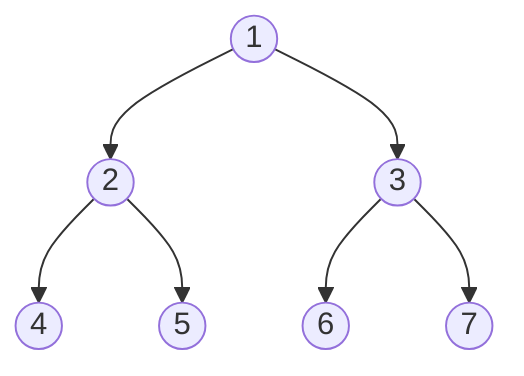
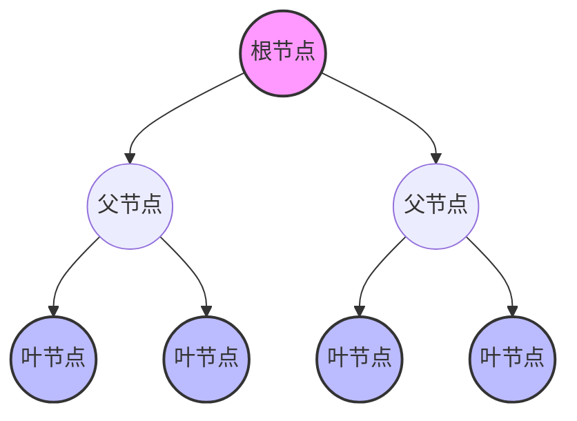
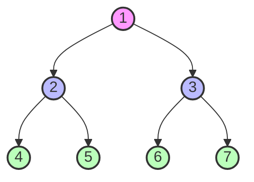
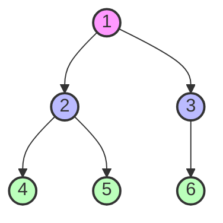
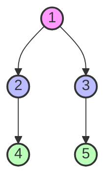

# 1 二叉树 (Binary Tree)

## 1.1 基本概念

### 1.1.1 定义



- 二叉树是每个节点最多有两个子树的树结构
- 子树有左右之分，次序不能颠倒
- 二叉树可以是空集合

### 1.1.2 基本术语



- 根节点 (Root)：树的最顶层节点
- 叶节点 (Leaf)：没有子节点的节点
- 父节点 (Parent)：有子节点的节点
- 子节点 (Child)：有父节点的节点
- 兄弟节点 (Sibling)：具有相同父节点的节点

### 1.1.3 特殊二叉树

1. **满二叉树**



   - 所有分支节点都有左右子树
   - 所有叶子都在同一层

2. **完全二叉树**



   - 除最后一层外，其他层的节点数都达到最大值
   - 最后一层的节点都靠左排列

3. **平衡二叉树**



   - 左右子树高度差不超过 1
   - 左右子树也都是平衡二叉树

## 1.2 实现方式

### 1.2.1 链式存储

```java
public class TreeNode {
    int val;               // 节点值
    TreeNode left;         // 左子节点
    TreeNode right;        // 右子节点

    public TreeNode(int val) {
        this.val = val;
        this.left = null;
        this.right = null;
    }
}
```

### 1.2.2 数组存储

- 适用于完全二叉树
- 节点关系：
  - 父节点 index = i
  - 左子节点 index = 2i + 1
  - 右子节点 index = 2i + 2

## 1.3 基本操作

### 1.3.1 遍历方式

1. **前序遍历 (Preorder)**

   - 访问顺序：根节点 → 左子树 → 右子树

   ```java
   void preorder(TreeNode root) {
       if (root != null) {
           System.out.print(root.val);  // 访问根节点
           preorder(root.left);         // 遍历左子树
           preorder(root.right);        // 遍历右子树
       }
   }
   ```

2. **中序遍历 (Inorder)**

   - 访问顺序：左子树 → 根节点 → 右子树

   ```java
   void inorder(TreeNode root) {
       if (root != null) {
           inorder(root.left);          // 遍历左子树
           System.out.print(root.val);  // 访问根节点
           inorder(root.right);         // 遍历右子树
       }
   }
   ```

3. **后序遍历 (Postorder)**

   - 访问顺序：左子树 → 右子树 → 根节点

   ```java
   void postorder(TreeNode root) {
       if (root != null) {
           postorder(root.left);        // 遍历左子树
           postorder(root.right);       // 遍历右子树
           System.out.print(root.val);  // 访问根节点
       }
   }
   ```

4. **层序遍历 (Level Order)**

   - 按层从左到右访问节点

   ```java
   void levelOrder(TreeNode root) {
       if (root == null) return;
       Queue<TreeNode> queue = new LinkedList<>();
       queue.offer(root);

       while (!queue.isEmpty()) {
           TreeNode node = queue.poll();
           System.out.print(node.val);
           if (node.left != null) queue.offer(node.left);
           if (node.right != null) queue.offer(node.right);
       }
   }
   ```

### 1.3.2 基本操作

1. **插入节点**
2. **删除节点**
3. **查找节点**
4. **获取树的高度**
5. **判断是否为空**

## 1.4 常见应用

### 1.4.1 二叉搜索树 (BST)

- 左子树所有节点值小于根节点
- 右子树所有节点值大于根节点
- 左右子树也都是二叉搜索树

### 1.4.2 表达式树

- 叶节点是操作数
- 非叶节点是运算符
- 通过后缀表达式构建

### 1.4.3 哈夫曼树

- 用于数据压缩
- 基于字符出现频率构建
- 路径长度最短

## 1.5 常见题型

### 1.5.1 基础操作

1. 树的构建
2. 树的遍历
3. 树的深度计算

### 1.5.2 进阶操作

1. 判断平衡性
2. 路径和问题
3. 最近公共祖先

### 1.5.3 特殊操作

1. 树的序列化与反序列化
2. 树的镜像转换
3. 树的对称性判断

## 1.6 性能分析

### 1.6.1 时间复杂度

- 查找：O(h)，h 为树的高度
- 插入：O(h)
- 删除：O(h)
- 遍历：O(n)，n 为节点总数

### 1.6.2 空间复杂度

- 链式存储：O(n)
- 数组存储：O(n)
- 递归遍历：O(h) 额外空间

## 1.7 实践建议

### 1.7.1 使用场景

1. 需要高效查找时
2. 需要保持数据有序时
3. 需要频繁插入删除时

### 1.7.2 注意事项

1. 注意边界条件
2. 考虑平衡性维护
3. 递归深度控制

