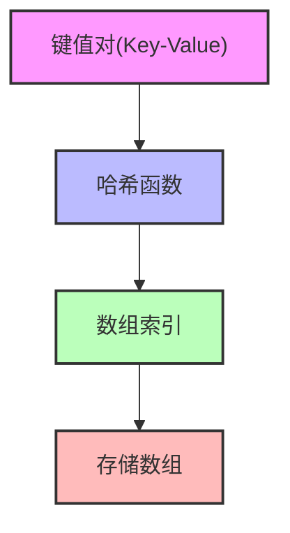
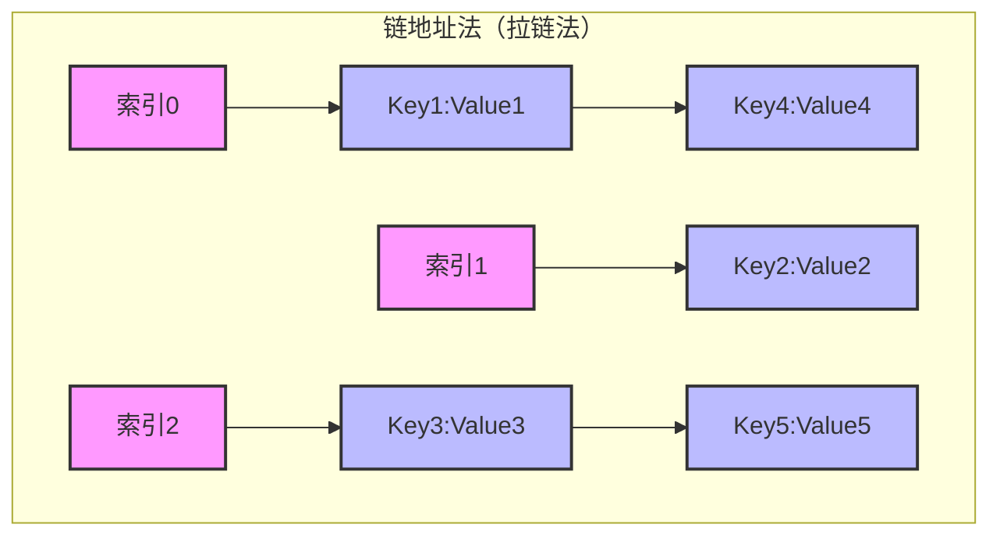

# 哈希表 (Hash Table)

## 1. 基本概念

### 1.1 定义

- **定义：** 哈希表是一种通过哈希函数将键映射到值的数据结构，也称为散列表或 Hash Map
- **特点：**
  - 提供近似 O(1) 的查找效率
  - 是一种用空间换时间的典型数据结构
  - 需要处理哈希冲突
  - 支持动态扩容

### 1.2 核心组件

1. **哈希函数**
   - 将键转换为数组索引
   - 应该具有均匀分布性
   - 计算速度要快
   - 应该具有雪崩效应

2. **存储数组**
   - 存储实际的键值对
   - 需要合理设置初始大小
   - 需要动态扩容机制

3. **冲突解决**
   - 链地址法（拉链法）
   - 开放地址法
   - 再哈希法



### 1.3 冲突解决方案



## 2. 实现方式

### 2.1 基本结构

```java
public class HashMap<K, V> {
    private static class Node<K, V> {
        final K key;
        V value;
        Node<K, V> next;

        Node(K key, V value) {
            this.key = key;
            this.value = value;
        }
    }

    private Node<K, V>[] table;
    private int size;
    private float loadFactor;
    
    public HashMap() {
        this.loadFactor = 0.75f;
    }
    
    public V put(K key, V value) {
        // 实现哈希表的插入操作
        return null; // 返回旧值
    }
    
    public V get(K key) {
        // 实现哈希表的查找操作
        return null;
    }
    
    private void resize() {
        // 实现哈希表的扩容操作
    }
}
```

### 2.2 性能分析

| 操作 | 平均时间复杂度 | 最坏时间复杂度 | 空间复杂度 |
| ---- | -------------- | -------------- | ---------- |
| 插入 | O(1)           | O(n)           | O(n)       |
| 查找 | O(1)           | O(n)           | O(1)       |
| 删除 | O(1)           | O(n)           | O(1)       |

_注：最坏情况发生在所有键都映射到同一个桶中时。_

## 3. 应用场景

### 3.1 实际应用

1. **缓存系统**
   - 内存缓存（如 Redis）
   - 浏览器缓存
   - DNS 解析缓存

2. **数据库索引**
   - 索引优化
   - 快速查找

3. **去重操作**
   - 数据去重
   - 判断元素是否存在

4. **计数统计**
   - 词频统计
   - 访问频率统计

### 3.2 编程语言实现

1. **Java**
   - HashMap
   - HashSet
   - ConcurrentHashMap

2. **Python**
   - dict
   - set

3. **JavaScript**
   - Object
   - Map
   - Set

## 4. 优化建议

1. **选择合适的初始容量**
   - 避免频繁扩容
   - 减少内存浪费

2. **设计良好的哈希函数**
   - 保证均匀分布
   - 减少哈希冲突

3. **合理的负载因子**
   - 权衡时间和空间
   - 一般取 0.75

4. **并发环境考虑**
   - 使用线程安全的实现
   - 注意并发修改问题

