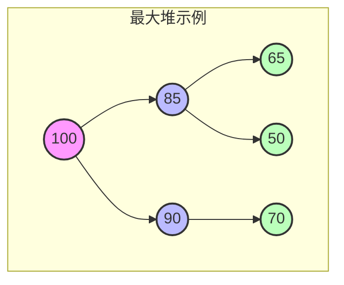
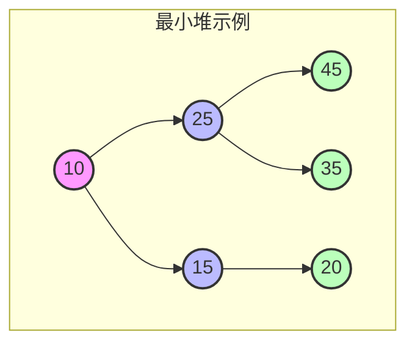
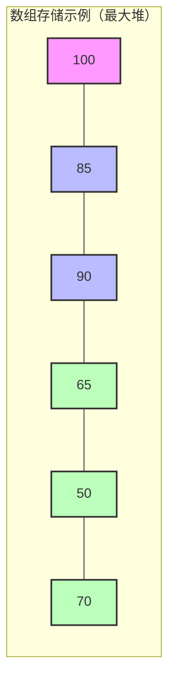

# 1 堆 (Heap)

## 1.1 基本概念

### 1.1.1 定义

- 堆是一种完全二叉树结构
- 分为最大堆和最小堆
- 父节点与子节点之间满足堆特性

### 1.1.2 堆的性质

1. **完全二叉树性质**

   - 除最后一层外，其他层都是满的
   - 最后一层的节点从左到右填充
   - 便于数组存储和索引计算

2. **堆序性质**
   - 最大堆：父节点值 ≥ 子节点值
   - 最小堆：父节点值 ≤ 子节点值
   - 兄弟节点之间没有大小关系

### 1.1.3 堆的存储

父子关系：
- 父节点 i 的左子节点：2i + 1
- 父节点 i 的右子节点：2i + 2
- 子节点 i 的父节点：(i-1)/2

