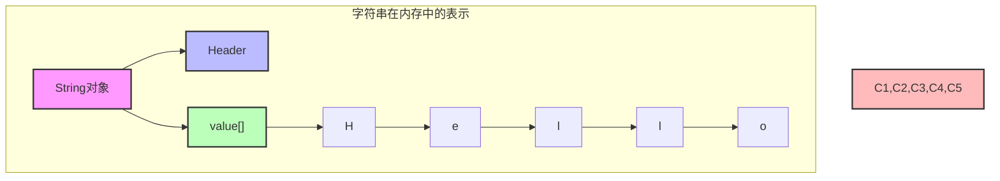
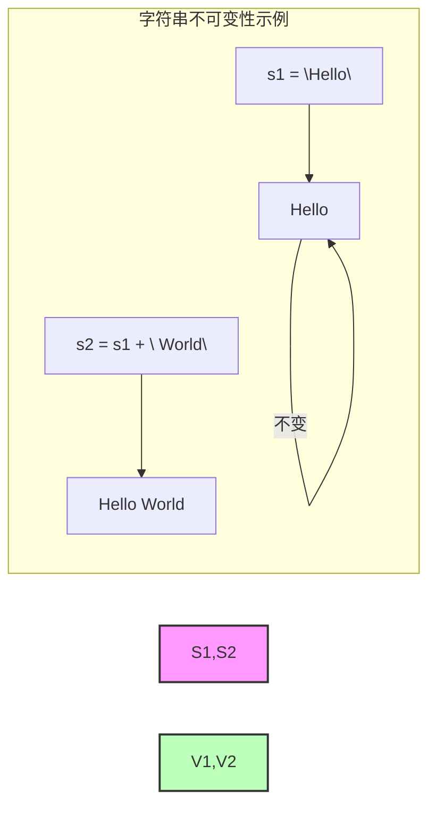

# 1 字符串 (String)

## 1.1 基本概念

### 1.1.1 定义

- 字符串是由零个或多个字符组成的有限序列
- 在 Java 中是不可变对象
- 支持多种字符编码（ASCII、Unicode 等）



### 1.1.2 特性

1. **不可变性**

   - Java 中 String 对象不可变
   - 修改会创建新对象
   - 线程安全



2. **编码方式**
   - ASCII（1 字节）
   - Unicode（2 或 4 字节）
   - UTF-8（变长编码）

## 1.2 基本操作

### 1.2.1 创建和修改

```java
public class StringOperations {
    // 创建字符串
    String str1 = "Hello";
    String str2 = new String("World");

    // 字符串拼接
    public String concatenate(String s1, String s2) {
        // 1. 使用 + 运算符
        String result1 = s1 + s2;

        // 2. 使用 StringBuilder
        StringBuilder sb = new StringBuilder();
        sb.append(s1).append(s2);
        String result2 = sb.toString();

        // 3. 使用 String.concat()
        String result3 = s1.concat(s2);

        return result2;  // 推荐使用StringBuilder
    }
}
```

