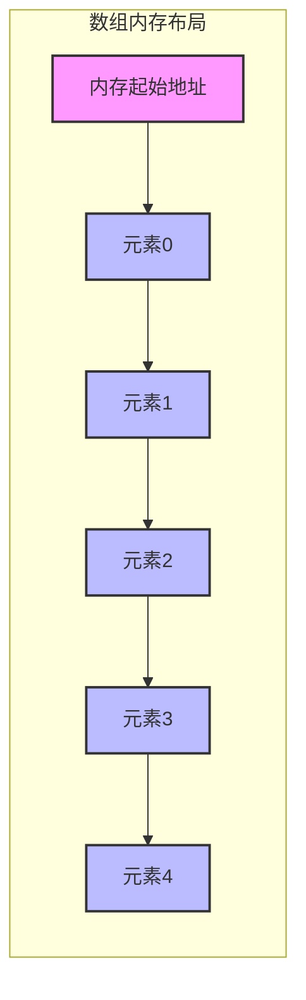
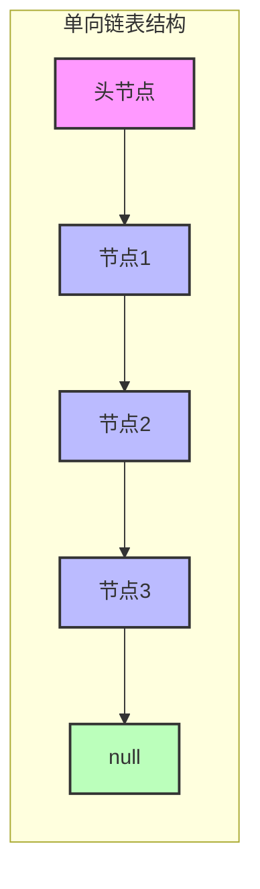

# 1 数组和链表

## 1.1 数组 (Array)

### 1.1.1 基本概念

- **定义：** 数组是一种存储多个固定类型数据的线性数据结构，它在内存中占用一片连续的空间。
- **主要特点：**
  - **连续内存空间 (Contiguous Memory)：** 数组中各元素在内存中紧密排列，有助于提高缓存命中率 (Cache Locality)。
  - **固定大小 (Fixed Size)：** 数组在创建时须确定大小，之后扩容通常比较麻烦（需要分配新数组并复制数据）。
  - **随机访问 (Random Access)：** 支持通过索引以 O(1) 时间复杂度访问任一元素。
  - **索引从 0 开始 (0-based Indexing)：** 常见编程语言中，数组的第一个元素索引为 0。



### 1.1.2 基本操作

- **访问元素：** 通过索引直接访问
- **插入元素：** 在指定位置插入新元素
- **删除元素：** 删除指定位置的元素
- **修改元素：** 修改指定位置的元素值

### 1.1.3 性能分析

| 操作 | 时间复杂度 | 空间复杂度 |
| ---- | ---------- | ---------- |
| 访问 | O(1)       | O(1)       |
| 插入 | O(n)       | O(1)       |
| 删除 | O(n)       | O(1)       |
| 查找 | O(n)       | O(1)       |

### 1.1.4 应用场景

1. **需要频繁随机访问**
   - 图像处理
   - 矩阵运算

2. **数据规模已知且变动不大**
   - 缓存系统
   - 游戏开发

3. **对内存使用要求较高**
   - 嵌入式系统
   - 实时系统

## 1.2 链表 (Linked List)

### 1.2.1 基本概念

- **定义：** 链表是一种线性数据结构，由一系列节点 (Node) 构成，每个节点包含存储的数据和指向下一个（或上一个）节点的引用 (Pointer)。
- **主要特点：**
  - **非连续内存 (Non-contiguous Memory)：** 每个节点可以分散存储在内存的任意位置，通过指针相互链接。
  - **动态大小 (Dynamic Size)：** 链表可以根据实际需要动态增加或删除节点，而不需要预先分配固定空间。
  - **不支持随机访问 (No Random Access)：** 需要从头节点开始顺序访问直到目标节点。
  - **灵活的插入删除操作 (Flexible Insertion/Deletion)：** 链表在特定位置的插入或删除操作可以通过调整指针以 O(1) 复杂度完成。



### 1.2.2 基本操作

```java
public class LinkedList<T> {
    private class Node {
        T data;
        Node next;
        
        Node(T data) {
            this.data = data;
            this.next = null;
        }
    }
    
    private Node head;
    
    public void insert(T data) {
        Node newNode = new Node(data);
        if (head == null) {
            head = newNode;
            return;
        }
        Node current = head;
        while (current.next != null) {
            current = current.next;
        }
        current.next = newNode;
    }
    
    public void delete(T data) {
        if (head == null) return;
        
        if (head.data.equals(data)) {
            head = head.next;
            return;
        }
        
        Node current = head;
        while (current.next != null && !current.next.data.equals(data)) {
            current = current.next;
        }
        
        if (current.next != null) {
            current.next = current.next.next;
        }
    }
}
```

### 1.2.3 性能分析

| 操作 | 时间复杂度 | 空间复杂度 |
| ---- | ---------- | ---------- |
| 访问 | O(n)       | O(1)       |
| 插入 | O(1)*      | O(1)       |
| 删除 | O(1)*      | O(1)       |
| 查找 | O(n)       | O(1)       |

*注：插入和删除的 O(1) 复杂度是在已知操作位置的情况下；如果需要先查找位置，则总体复杂度为 O(n)。

### 1.2.4 应用场景

1. **频繁插入删除操作**
   - 文本编辑器
   - 多项式计算

2. **内存空间不连续**
   - 操作系统内存管理
   - 文件系统实现

3. **需要动态扩展**
   - 实现栈和队列
   - LRU缓存

### 1.2.5 特殊链表

1. **双向链表**
   - 每个节点有前驱和后继指针
   - 支持双向遍历

2. **循环链表**
   - 尾节点指向头节点
   - 适用于循环数据结构

3. **跳跃链表**
   - 多层索引结构
   - 提供快速查找能力

