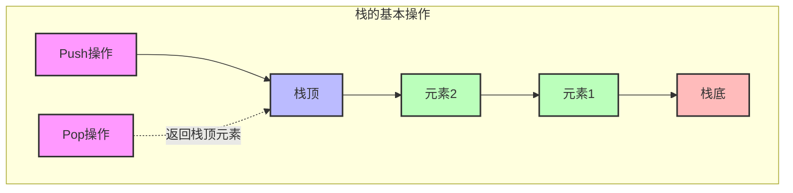
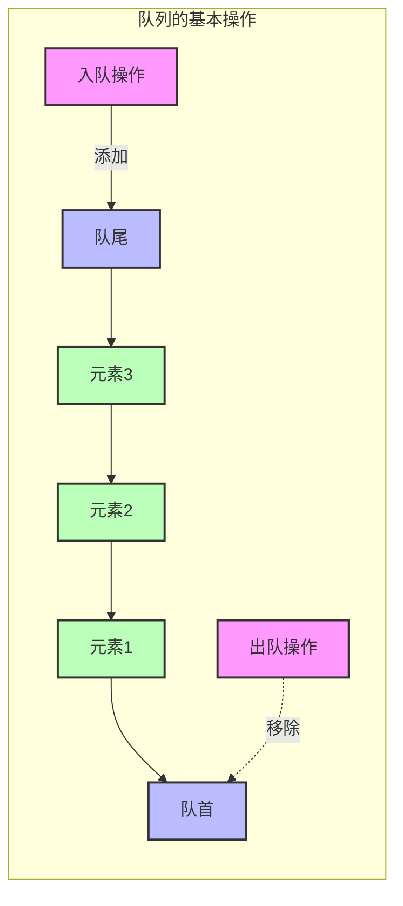

# 栈和队列

## 1. 栈 (Stack)

### 1.1 基本概念

- **定义：** 栈是一种线性数据结构，遵循后进先出（LIFO, Last In First Out）原则
- **特点：**
  - 只能在一端（栈顶）进行操作
  - 可以用数组或链表实现
  - 具有良好的操作局部性

### 1.2 基本操作

- **压栈(push)：** 在栈顶添加元素
- **出栈(pop)：** 移除并返回栈顶元素
- **查看栈顶(peek)：** 返回栈顶元素但不移除
- **判空(isEmpty)：** 检查栈是否为空



### 1.3 实现方式

1. **数组实现**

```java
public class ArrayStack {
    private int[] array;
    private int top;
    private int capacity;

    public ArrayStack(int capacity) {
        this.capacity = capacity;
        array = new int[capacity];
        top = -1;
    }

    public void push(int value) {
        if (top == capacity - 1) {
            throw new RuntimeException("Stack is full");
        }
        array[++top] = value;
    }

    public int pop() {
        if (isEmpty()) {
            throw new RuntimeException("Stack is empty");
        }
        return array[top--];
    }

    public boolean isEmpty() {
        return top == -1;
    }
}
```

### 1.4 性能分析

| 操作 | 时间复杂度 | 空间复杂度 |
| ---- | ---------- | ---------- |
| 压栈 | O(1)       | O(1)       |
| 出栈 | O(1)       | O(1)       |
| 查看栈顶 | O(1)    | O(1)       |
| 判空 | O(1)       | O(1)       |

### 1.5 应用场景

1. **函数调用栈**
   - 保存函数的返回地址和局部变量
   - 支持函数的递归调用

2. **表达式求值**
   - 处理中缀表达式转后缀表达式
   - 计算器的实现

3. **括号匹配**
   - 检查括号是否合法配对
   - 代码编辑器的语法检查

4. **浏览器历史**
   - 实现前进/后退功能
   - 撤销/重做操作

## 2. 队列 (Queue)

### 2.1 基本概念

- **定义：** 队列是一种线性数据结构，遵循先进先出（FIFO, First In First Out）原则
- **特点：**
  - 在一端（队尾）入队，另一端（队首）出队
  - 可以用数组或链表实现
  - 支持公平的资源分配

### 2.2 基本操作

- **入队(enqueue)：** 在队尾添加元素
- **出队(dequeue)：** 移除并返回队首元素
- **查看队首(peek)：** 返回队首元素但不移除
- **判空(isEmpty)：** 检查队列是否为空



### 2.3 实现方式

1. **循环队列（数组实现）**

```java
public class CircularQueue {
    private int[] array;
    private int front;
    private int rear;
    private int capacity;

    public CircularQueue(int capacity) {
        this.capacity = capacity;
        array = new int[capacity];
        front = rear = 0;
    }

    public void enqueue(int value) {
        if (isFull()) {
            throw new RuntimeException("Queue is full");
        }
        array[rear] = value;
        rear = (rear + 1) % capacity;
    }

    public int dequeue() {
        if (isEmpty()) {
            throw new RuntimeException("Queue is empty");
        }
        int value = array[front];
        front = (front + 1) % capacity;
        return value;
    }

    public boolean isEmpty() {
        return front == rear;
    }

    public boolean isFull() {
        return (rear + 1) % capacity == front;
    }
}
```

### 2.4 性能分析

| 操作 | 时间复杂度 | 空间复杂度 |
| ---- | ---------- | ---------- |
| 入队 | O(1)       | O(1)       |
| 出队 | O(1)       | O(1)       |
| 查看队首 | O(1)    | O(1)       |
| 判空/判满 | O(1)   | O(1)       |

### 2.5 应用场景

1. **任务调度**
   - 操作系统的进程调度
   - 打印机任务队列

2. **消息队列**
   - 异步处理
   - 解耦系统组件

3. **缓冲区管理**
   - 数据流处理
   - 网络数据包处理

4. **广度优先搜索**
   - 图的层次遍历
   - 最短路径查找

### 2.6 特殊队列

1. **双端队列 (Deque)**
   - 两端都可以进行入队和出队操作
   - 可用于实现栈和队列

2. **优先队列 (Priority Queue)**
   - 元素按优先级排序
   - 常用堆来实现

3. **阻塞队列 (Blocking Queue)**
   - 支持线程同步
   - 生产者-消费者模式的实现

