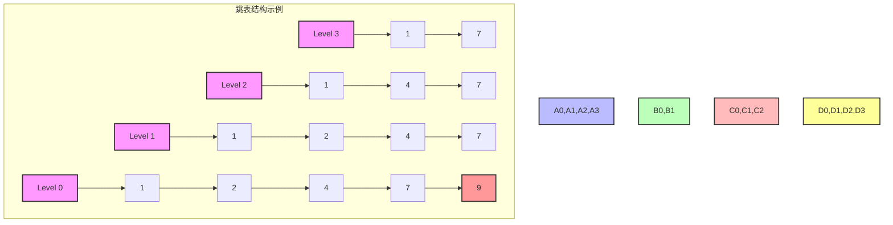
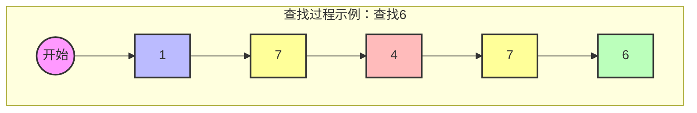

# 1 跳表 (Skip List)

## 1.1 基本概念

### 1.1.1 定义

- 跳表是一种可以用来快速查找的数据结构
- 基于有序链表构建，通过维护多层索引来加快查找
- 是一种用空间换时间的数据结构

### 1.1.2 复杂度分析

1. **时间复杂度**
   - 查找：平均 O(log n)，最坏 O(n)
   - 插入：平均 O(log n)，最坏 O(n)
   - 删除：平均 O(log n)，最坏 O(n)

2. **空间复杂度**
   - 平均：O(n)
   - 最坏：O(n log n)

### 1.1.3 优缺点

**优点：**
- 实现简单，易于理解
- 支持快速的查找、插入和删除
- 空间利用率高于平衡树
- 支持范围查询

**缺点：**
- 空间开销相对较大
- 维护成本较高
- 并发场景下需要额外的同步机制



### 1.1.4 特点

1. **多层结构**

   - 最底层包含所有元素
   - 上层是下层的索引
   - 层数随机决定

2. **概率平衡**
   - 不严格平衡
   - 通过随机化实现
   - 期望复杂度 O(log n)



## 1.2 实现方式

### 1.2.1 节点结构

```java
public class SkipListNode<T> {
    T value;                      // 节点值
    SkipListNode<T>[] forward;    // 前向指针数组

    @SuppressWarnings("unchecked")
    public SkipListNode(T value, int level) {
        this.value = value;
        this.forward = new SkipListNode[level + 1];
    }
}
```

### 1.2.2 跳表实现

```java
public class SkipList<T extends Comparable<T>> {
    private static final double P = 0.5;          // 层数增加的概率
    private static final int MAX_LEVEL = 32;      // 最大层数

    private SkipListNode<T> header;              // 头节点
    private int currentLevel;                     // 当前层数
    private Random random;                        // 随机数生成器
}
```

## 1.3 实际应用

### 1.3.1 Redis中的应用

1. **Sorted Set的实现**
   - Redis的有序集合（Sorted Set）使用跳表作为底层实现
   - 每个元素都关联一个分数（score）用于排序
   - 支持高效的范围查询操作

2. **为什么选择跳表**
   - 相比红黑树，跳表实现更简单
   - 支持区间操作（如ZRANGE）的性能优秀
   - 可以方便地实现按分数或位置的查找
   - 内存占用相对平衡

3. **典型使用场景**
   - 排行榜系统（如游戏积分排名）
   - 带权重的任务队列
   - 延迟队列的实现
   - 实时数据排序（如热搜榜）
```

