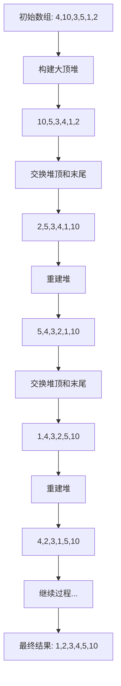

# 1 堆排序（Heap Sort）

## 1.1 算法思想
堆排序是利用堆这种数据结构而设计的一种排序算法，其基本思想是：
1. **建堆**：将待排序数组构造成一个大顶堆
2. **排序**：将堆顶元素与末尾元素交换，然后重新调整堆
3. **重复**：重复执行第2步，直到整个序列有序

## 1.2 图解过程



## 1.3 代码实现

```java
public class HeapSort {
    public void sort(int[] arr) {
        int n = arr.length;

        // 构建大顶堆
        for (int i = n / 2 - 1; i >= 0; i--) {
            heapify(arr, n, i);
        }

        // 一个个从堆顶取出元素
        for (int i = n - 1; i > 0; i--) {
            // 将堆顶元素（最大值）与末尾元素交换
            int temp = arr[0];
            arr[0] = arr[i];
            arr[i] = temp;

            // 重新对堆进行调整
            heapify(arr, i, 0);
        }
    }

    // 调整堆
    private void heapify(int[] arr, int n, int i) {
        int largest = i; // 初始化最大值为根节点
        int left = 2 * i + 1; // 左子节点
        int right = 2 * i + 2; // 右子节点

        // 如果左子节点大于根节点
        if (left < n && arr[left] > arr[largest]) {
            largest = left;
        }

        // 如果右子节点大于最大值
        if (right < n && arr[right] > arr[largest]) {
            largest = right;
        }

        // 如果最大值不是根节点
        if (largest != i) {
            int swap = arr[i];
            arr[i] = arr[largest];
            arr[largest] = swap;

            // 递归调整受影响的子树
            heapify(arr, n, largest);
        }
    }

    // 测试代码
    public static void main(String[] args) {
        int[] arr = {4, 10, 3, 5, 1, 2};
        HeapSort heapSort = new HeapSort();

        System.out.println("排序前：");
        printArray(arr);

        heapSort.sort(arr);

        System.out.println("\n排序后：");
        printArray(arr);
    }

    private static void printArray(int[] arr) {
        for (int num : arr) {
            System.out.print(num + " ");
        }
    }
}
```

## 1.4 算法分析

### 1.4.1 时间复杂度
- **建堆时间**：O(n)
- **调整堆时间**：O(nlogn)
- **总体时间复杂度**：O(nlogn)

### 1.4.2 空间复杂度
- O(1)：只需要常数级的额外空间

### 1.4.3 稳定性
- 不稳定排序：相同元素的相对位置可能会改变

## 1.5 优缺点

### 1.5.1 优点
1. 时间复杂度稳定，总是O(nlogn)
2. 空间复杂度低，是原地排序算法
3. 适合处理大数据量

### 1.5.2 缺点
1. 不稳定排序
2. 对于完全有序或接近有序的数据，性能不如快速排序
3. 数据量较小时，建堆过程的开销可能会超过排序的收益

## 1.6 应用场景

1. **优先队列**：实现优先队列的基础
2. **TopK问题**：查找最大或最小的K个元素
3. **大数据处理**：适合处理大规模数据

## 1.7 优化方案

### 1.7.1 优化建堆过程

```java
private void buildHeap(int[] arr) {
    int n = arr.length;
    // 从最后一个非叶子节点开始调整
    for (int i = (n - 2) / 2; i >= 0; i--) {
        siftDown(arr, i, n);
    }
}

private void siftDown(int[] arr, int parent, int n) {
    int child = 2 * parent + 1;
    int temp = arr[parent];
    
    while (child < n) {
        if (child + 1 < n && arr[child] < arr[child + 1]) {
            child++;
        }
        if (temp >= arr[child]) {
            break;
        }
        arr[parent] = arr[child];
        parent = child;
        child = 2 * parent + 1;
    }
    arr[parent] = temp;
}
```

### 1.7.2 优化交换操作

```java
private void heapSort(int[] arr) {
    int n = arr.length;
    // 保存堆顶元素
    int temp = arr[0];
    
    while (n > 1) {
        // 将最后一个元素放到堆顶
        arr[0] = arr[n - 1];
        arr[n - 1] = temp;
        n--;
        // 调整新的堆顶
        siftDown(arr, 0, n);
        temp = arr[0];
    }
}
```

## 1.8 代码示例（优化版）

```java
public class OptimizedHeapSort {
    public void sort(int[] arr) {
        if (arr == null || arr.length <= 1) {
            return;
        }

        // 优化的建堆过程
        buildHeap(arr);
        
        // 优化的排序过程
        heapSort(arr);
    }

    private void buildHeap(int[] arr) {
        int n = arr.length;
        for (int i = (n - 2) / 2; i >= 0; i--) {
            siftDown(arr, i, n);
        }
    }

    private void heapSort(int[] arr) {
        int n = arr.length;
        int temp = arr[0];
        
        while (n > 1) {
            arr[0] = arr[n - 1];
            arr[n - 1] = temp;
            n--;
            siftDown(arr, 0, n);
            temp = arr[0];
        }
    }

    private void siftDown(int[] arr, int parent, int n) {
        int child = 2 * parent + 1;
        int temp = arr[parent];
        
        while (child < n) {
            if (child + 1 < n && arr[child] < arr[child + 1]) {
                child++;
            }
            if (temp >= arr[child]) {
                break;
            }
            arr[parent] = arr[child];
            parent = child;
            child = 2 * parent + 1;
        }
        arr[parent] = temp;
    }
}
```

## 1.9 总结

堆排序是一种重要的排序算法，它的主要特点是：

1. **效率稳定**：不管输入数据如何，时间复杂度都是O(nlogn)
2. **空间效率高**：是原地排序算法，只需要O(1)的额外空间
3. **堆的应用**：不仅可以用于排序，还可以用于实现优先队列等数据结构
4. **适合大数据**：特别适合处理大规模数据集

通过优化建堆过程和减少交换操作，可以进一步提高堆排序的性能。在实际应用中，堆排序不仅用于排序，还广泛应用于优先队列、TopK问题等场景。虽然在随机数据的排序中可能不如快速排序，但在特定场景下（如需要维护数据流的最大/最小值）仍然是最佳选择。
