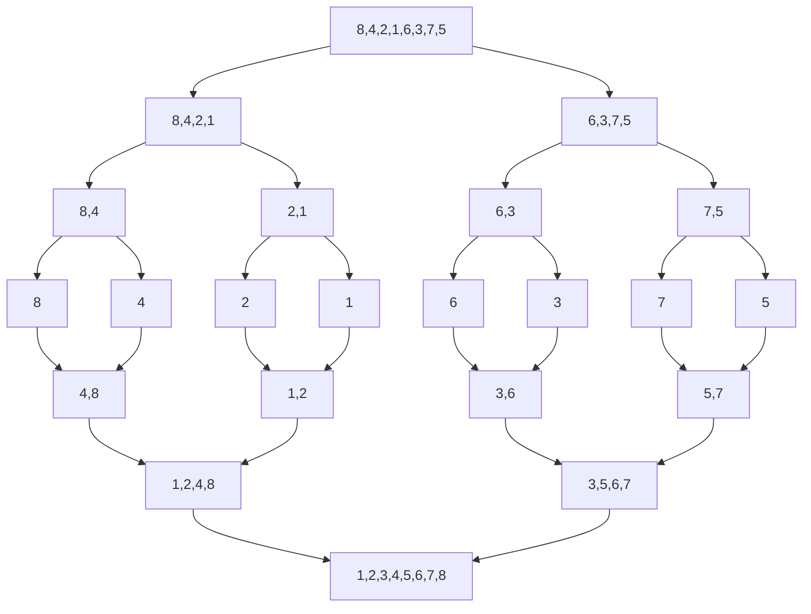

# 归并排序（Merge Sort）

## 1. 算法思想
归并排序是一种分治算法，其基本思想是：
1. **分解**：将待排序数组递归地分成两个较小的子数组
2. **排序**：对两个子数组分别进行排序
3. **合并**：将排好序的子数组合并成一个有序数组

## 2. 图解过程



## 3. 代码实现

```java
public class MergeSort {
    public void sort(int[] arr) {
        if (arr == null || arr.length <= 1) {
            return;
        }
        mergeSort(arr, 0, arr.length - 1);
    }

    private void mergeSort(int[] arr, int left, int right) {
        if (left < right) {
            // 找到中间点
            int mid = left + (right - left) / 2;
            
            // 递归排序左半部分
            mergeSort(arr, left, mid);
            // 递归排序右半部分
            mergeSort(arr, mid + 1, right);
            
            // 合并两个有序数组
            merge(arr, left, mid, right);
        }
    }

    private void merge(int[] arr, int left, int mid, int right) {
        // 计算左右两个子数组的长度
        int n1 = mid - left + 1;
        int n2 = right - mid;

        // 创建临时数组
        int[] L = new int[n1];
        int[] R = new int[n2];

        // 将数据复制到临时数组
        for (int i = 0; i < n1; i++) {
            L[i] = arr[left + i];
        }
        for (int j = 0; j < n2; j++) {
            R[j] = arr[mid + 1 + j];
        }

        // 合并临时数组
        int i = 0, j = 0;
        int k = left;

        while (i < n1 && j < n2) {
            if (L[i] <= R[j]) {
                arr[k] = L[i];
                i++;
            } else {
                arr[k] = R[j];
                j++;
            }
            k++;
        }

        // 复制剩余元素
        while (i < n1) {
            arr[k] = L[i];
            i++;
            k++;
        }

        while (j < n2) {
            arr[k] = R[j];
            j++;
            k++;
        }
    }

    // 测试代码
    public static void main(String[] args) {
        int[] arr = {8, 4, 2, 1, 6, 3, 7, 5};
        MergeSort mergeSort = new MergeSort();
        
        System.out.println("排序前：");
        printArray(arr);
        
        mergeSort.sort(arr);
        
        System.out.println("\n排序后：");
        printArray(arr);
    }

    private static void printArray(int[] arr) {
        for (int num : arr) {
            System.out.print(num + " ");
        }
    }
}
```

## 4. 算法分析

### 4.1 时间复杂度
- **最好情况**：O(nlogn)
- **最坏情况**：O(nlogn)
- **平均情况**：O(nlogn)

### 4.2 空间复杂度
- O(n)：需要额外的数组空间

### 4.3 稳定性
- 稳定排序：相同元素的相对位置在排序后不会改变

## 5. 优缺点

### 5.1 优点
1. 稳定的排序算法
2. 时间复杂度稳定，不会因输入数据的不同而改变
3. 适合处理大数据量的排序
4. 可以轻松实现并行化

### 5.2 缺点
1. 需要额外的空间复杂度O(n)
2. 对于小规模数据，可能不如插入排序等简单排序算法

## 6. 应用场景

1. **外部排序**：当数据量太大，无法一次性加载到内存中时
2. **大数据排序**：适合用于排序大量数据
3. **稳定性要求**：当排序需要保持相同元素的相对位置时

## 7. 优化方案

1. **小规模数组使用插入排序**：
   - 当子数组规模小于某个阈值（通常为10-15）时，使用插入排序
   
2. **避免重复复制**：
   - 在合并前就判断是否需要合并
   - 如果arr[mid] <= arr[mid+1]，则说明数组已经有序，无需合并

3. **使用缓存数组**：
   - 避免在每次合并时都创建新的临时数组
   - 可以在排序开始时创建一个辅助数组，重复使用

## 8. 代码示例（优化版）

```java
public class OptimizedMergeSort {
    private static final int INSERTION_SORT_THRESHOLD = 10;

    public void sort(int[] arr) {
        if (arr == null || arr.length <= 1) {
            return;
        }
        
        // 创建辅助数组，避免重复创建
        int[] temp = new int[arr.length];
        mergeSort(arr, 0, arr.length - 1, temp);
    }

    private void mergeSort(int[] arr, int left, int right, int[] temp) {
        // 小规模数组使用插入排序
        if (right - left <= INSERTION_SORT_THRESHOLD) {
            insertionSort(arr, left, right);
            return;
        }

        int mid = left + (right - left) / 2;
        mergeSort(arr, left, mid, temp);
        mergeSort(arr, mid + 1, right, temp);

        // 如果已经有序，则不需要合并
        if (arr[mid] <= arr[mid + 1]) {
            return;
        }

        merge(arr, left, mid, right, temp);
    }

    private void insertionSort(int[] arr, int left, int right) {
        for (int i = left + 1; i <= right; i++) {
            int key = arr[i];
            int j = i - 1;
            while (j >= left && arr[j] > key) {
                arr[j + 1] = arr[j];
                j--;
            }
            arr[j + 1] = key;
        }
    }

    private void merge(int[] arr, int left, int mid, int right, int[] temp) {
        // 复制到临时数组
        System.arraycopy(arr, left, temp, left, right - left + 1);

        int i = left;
        int j = mid + 1;
        int k = left;

        while (i <= mid && j <= right) {
            if (temp[i] <= temp[j]) {
                arr[k++] = temp[i++];
            } else {
                arr[k++] = temp[j++];
            }
        }

        while (i <= mid) {
            arr[k++] = temp[i++];
        }
    }
}
```

## 9. 总结

归并排序是一个经典的分治算法，它的核心思想是将大问题分解成小问题，解决小问题后再合并结果。它的主要特点是：

1. **稳定的时间复杂度**：不管输入数据如何，都能保持O(nlogn)的时间复杂度
2. **稳定性好**：能保持相同元素的相对位置不变
3. **空间换时间**：需要额外的空间来存储临时数据
4. **适合大数据**：特别适合处理大规模数据的排序

通过合理的优化（如对小规模数组使用插入排序、避免不必要的合并操作等），可以进一步提高归并排序的性能。在实际应用中，归并排序常用于外部排序和大数据处理场景。
