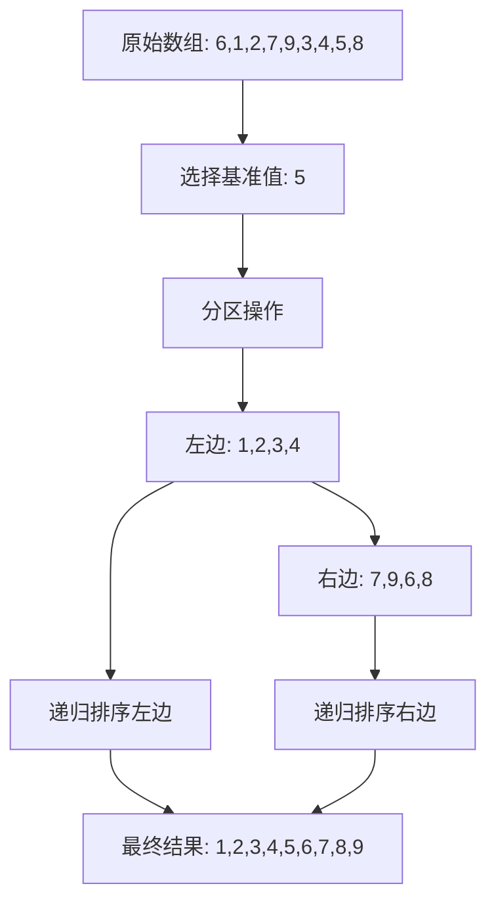

# 1 快速排序算法（Quick Sort）

## 1.1 算法思想

快速排序是一种高效的排序算法，基于分治（Divide and Conquer）的思想。其基本思路是：

1. **选择基准值**：从数组中选择一个元素作为基准值（pivot）
2. **分区操作**：将数组中小于基准值的元素放在左边，大于基准值的元素放在右边
3. **递归排序**：对左右两个子数组重复上述过程，直到子数组的长度小于等于1

### 1.1.1 排序过程可视化



## 1.2 Java实现

### 1.2.1 基本实现

```java
public class QuickSort {
    public void sort(int[] arr) {
        if (arr == null || arr.length <= 1) return;
        quickSort(arr, 0, arr.length - 1);
    }
    
    private void quickSort(int[] arr, int left, int right) {
        if (left < right) {
            // 获取分区点
            int pivot = partition(arr, left, right);
            // 递归排序左子数组
            quickSort(arr, left, pivot - 1);
            // 递归排序右子数组
            quickSort(arr, pivot + 1, right);
        }
    }
    
    private int partition(int[] arr, int left, int right) {
        // 选择最右边的元素作为基准值
        int pivot = arr[right];
        // i 表示小于基准值的区域边界
        int i = left - 1;
        
        // 遍历数组，将小于基准值的元素放到左边
        for (int j = left; j < right; j++) {
            if (arr[j] <= pivot) {
                i++;
                swap(arr, i, j);
            }
        }
        
        // 将基准值放到正确的位置
        swap(arr, i + 1, right);
        return i + 1;
    }
    
    private void swap(int[] arr, int i, int j) {
        int temp = arr[i];
        arr[i] = arr[j];
        arr[j] = temp;
    }
}
```

## 1.3 性能分析

### 1.3.1 时间复杂度

- **最好情况**：O(nlogn)
  - 每次分区都能将数组平均分成两部分
  - 递归树的深度为logn，每层需要O(n)的比较操作

- **平均情况**：O(nlogn)
  - 大部分情况下都能较均匀地分区

- **最坏情况**：O(n²)
  - 当数组已经有序或逆序时
  - 每次分区都极不均匀（一边为n-1个元素，另一边为0个元素）

### 1.3.2 空间复杂度

- O(logn)：递归调用栈的深度
- 是一种原地排序算法，不需要额外的数组空间

## 1.4 优化策略

### 1.4.1 基准值选择优化

```java
private int getPivot(int[] arr, int left, int right) {
    // 三数取中法
    int mid = left + (right - left) / 2;
    // 将中间值、左端值、右端值排序
    if (arr[left] > arr[mid]) swap(arr, left, mid);
    if (arr[left] > arr[right]) swap(arr, left, right);
    if (arr[mid] > arr[right]) swap(arr, mid, right);
    // 将中间值放到倒数第二个位置
    swap(arr, mid, right - 1);
    return arr[right - 1];
}
```

### 1.4.2 小规模数组优化

```java
private void quickSort(int[] arr, int left, int right) {
    // 当数组长度小于等于10时，使用插入排序
    if (right - left <= 10) {
        insertionSort(arr, left, right);
        return;
    }
    int pivot = partition(arr, left, right);
    quickSort(arr, left, pivot - 1);
    quickSort(arr, pivot + 1, right);
}

private void insertionSort(int[] arr, int left, int right) {
    for (int i = left + 1; i <= right; i++) {
        int key = arr[i];
        int j = i - 1;
        while (j >= left && arr[j] > key) {
            arr[j + 1] = arr[j];
            j--;
        }
        arr[j + 1] = key;
    }
}
```

## 1.5 应用场景

1. **大规模数据排序**
   - 平均性能优秀
   - 内存占用少

2. **基础算法库**
   - Java Arrays.sort()
   - C++ std::sort()

3. **系统实现**
   - 文件系统
   - 数据库索引

## 1.6 注意事项

1. **稳定性**
   - 快速排序是不稳定的排序算法
   - 相同值的相对顺序可能改变

2. **递归深度**
   - 最坏情况下可能导致栈溢出
   - 可以使用迭代版本或限制递归深度

3. **数据特征**
   - 对于有大量重复元素的数组，使用三路快排更高效
   - 对于接近有序的数组，需要随机选择基准值
