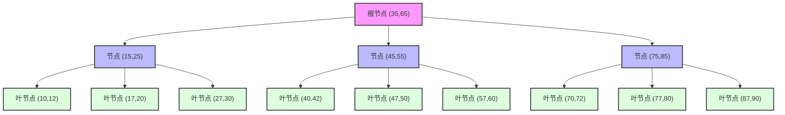
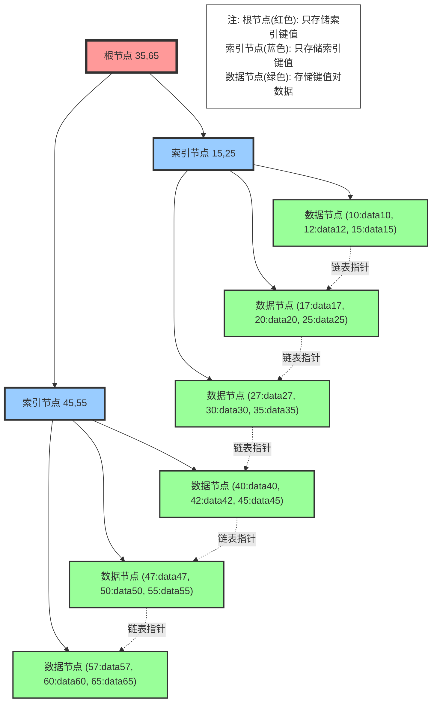
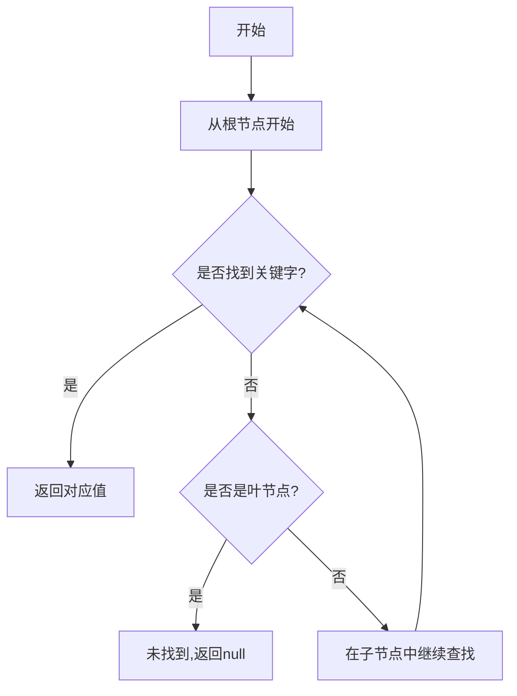
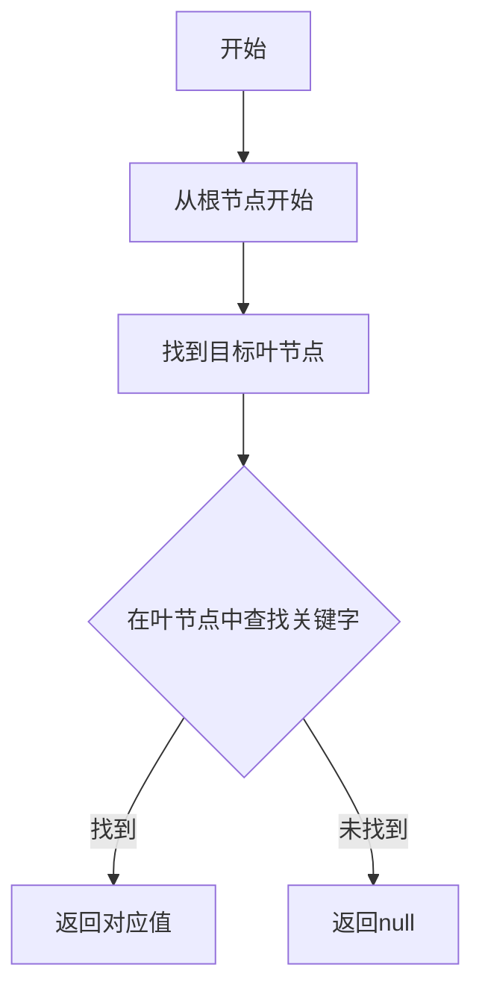
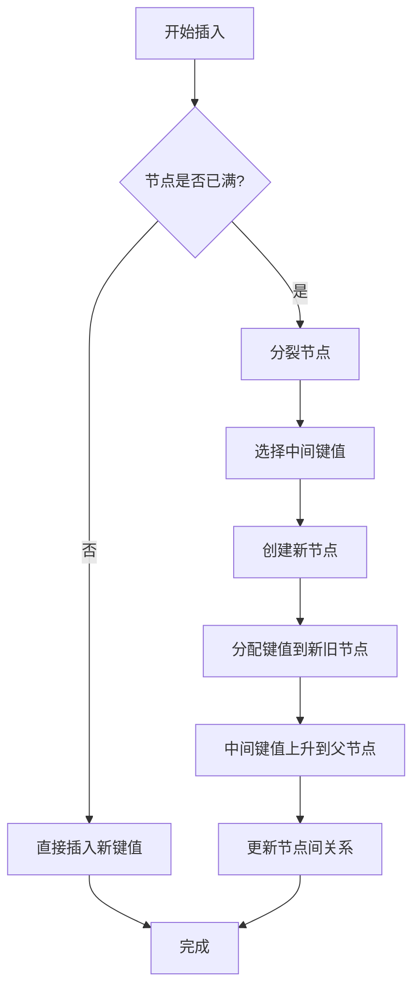

# 1 B 树和 B+树

## 1.1 B 树 (B-Tree)

### 1.1.1 基本概念

- m 阶 B 树是一种平衡的多路搜索树
- 每个节点最多有 m 个子节点
- 除根节点和叶节点外，每个节点至少有⌈m/2⌉个子节点
- 所有叶节点都在同一层



### 1.1.2 性质

1. **节点特征**

   - 所有节点的数据有序
   - 节点中的关键字互不相同
   - 节点的子树数比关键字数多 1

2. **平衡特性**
   - 所有叶节点具有相同的深度
   - 插入和删除操作自动保持平衡

### 1.1.3 节点结构

```java
public class BTreeNode<K extends Comparable<K>, V> {
    private int m;                  // B树的阶数
    private Entry<K,V>[] entries;   // 键值对数组
    private BTreeNode<K,V>[] children; // 子节点数组
    private int size;              // 当前节点中的键值对数量
    private boolean isLeaf;        // 是否是叶子节点

    static class Entry<K,V> {
        K key;
        V value;
        Entry(K key, V value) {
            this.key = key;
            this.value = value;
        }
    }
}
```

## 1.2 B+树

### 1.2.1 基本概念

- B+树是 B 树的变种
- 所有数据都存储在叶子节点
- 叶子节点通过链表相连
- 非叶节点只存储索引信息



### 1.2.2 特点

1. **数据存储**

   - 只有叶节点存储数据
   - 非叶节点只存储键值
   - 叶节点包含所有键值

2. **节点结构**
   - 叶节点通过指针连接
   - 便于范围查询
   - 支持顺序访问

### 1.2.3 节点实现

```java
public class BPlusTreeNode<K extends Comparable<K>, V> {
    private boolean isLeaf;
    private BPlusTreeNode<K,V> next;     // 叶子节点的下一个节点
    private List<K> keys;                // 键列表
    private List<V> values;              // 值列表（仅叶子节点）
    private List<BPlusTreeNode<K,V>> children; // 子节点列表

    public BPlusTreeNode(boolean isLeaf) {
        this.isLeaf = isLeaf;
        this.keys = new ArrayList<>();
        if (isLeaf) {
            this.values = new ArrayList<>();
        } else {
            this.children = new ArrayList<>();
        }
    }
}
```

## 1.3 操作实现

### 1.3.1 查找操作

1. **B 树查找流程**



2. **B 树查找代码**

```java
public V search(K key) {
    return searchInNode(root, key);
}

private V searchInNode(BTreeNode<K,V> node, K key) {
    int i = 0;
    while (i < node.size && key.compareTo(node.entries[i].key) > 0) {
        i++;
    }

    if (i < node.size && key.compareTo(node.entries[i].key) == 0) {
        return node.entries[i].value;
    }

    if (node.isLeaf) {
        return null;
    }

    return searchInNode(node.children[i], key);
}
```

3. **B+树查找流程**



4. **B+树查找代码**

```java
public V search(K key) {
    BPlusTreeNode<K,V> leaf = findLeaf(key);
    int index = Collections.binarySearch(leaf.keys, key);
    return index >= 0 ? leaf.values.get(index) : null;
}
```

### 1.3.2 插入操作

1. **节点分裂**

   - 当节点满时进行分裂
   - 中间键值向上提升
   - 保持树的平衡性



2. **具体步骤**
   - 找到插入位置
   - 插入键值对
   - 必要时分裂节点
   - 更新父节点信息

## 1.4 性能分析

### 1.4.1 时间复杂度

| 操作  | B 树      | B+树      |
| --- | -------- | -------- |
| 查找  | O(log n) | O(log n) |
| 插入  | O(log n) | O(log n) |
| 删除  | O(log n) | O(log n) |
| 范围  | O(n)     | O(k)     |

### 1.4.2 空间利用

1. **B 树**

   - 每个节点空间利用率约 50%
   - 适合随机访问

2. **B+树**
   - 叶节点紧凑存储
   - 更高的空间利用率
   - 适合顺序访问

## 1.5 应用场景

### 1.5.1 数据库应用

1. **B 树适用场景**

   - 数据量较小
   - 读写频率接近
   - 随机访问为主

2. **B+树适用场景**
   - 大型数据库
   - 索引系统
   - 文件系统

### 1.5.2 具体实例

1. **数据库索引**

   - MySQL 的 InnoDB 引擎
   - Oracle 的索引实现
   - MongoDB 的索引

2. **文件系统**
   - NTFS
   - ext4
   - HFS+

## 1.6 实现考虑

### 1.6.1 设计要点

1. **节点大小**

   - 考虑磁盘块大小
   - 平衡访问效率
   - 考虑缓存行大小

2. **分裂策略**
   - 选择分裂点
   - 处理边界情况
   - 维护平衡性

### 1.6.2 优化方向

1. **缓存优化**

   - 节点缓存
   - 预读机制
   - 批量操作

2. **并发控制**
   - 锁粒度
   - 事务支持
   - 版本控制

## 1.7 比较分析

### 1.7.1 B 树 vs B+树

1. **结构差异**

   - 数据存储位置
   - 索引节点内容
   - 叶节点连接

2. **性能特点**
   - 范围查询
   - 空间利用
   - 查询稳定性

### 1.7.2 使用选择

1. **选择 B 树**

   - 单一数据访问
   - 内存存储
   - 随机访问频繁

2. **选择 B+树**
   - 范围查询多
   - 磁盘存储
   - 顺序访问频繁

