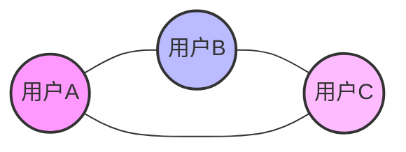
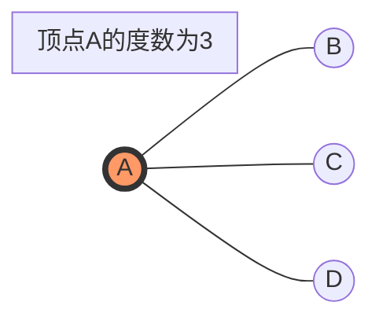
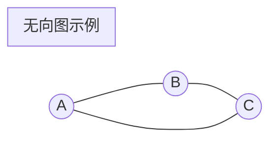
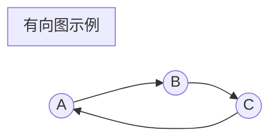
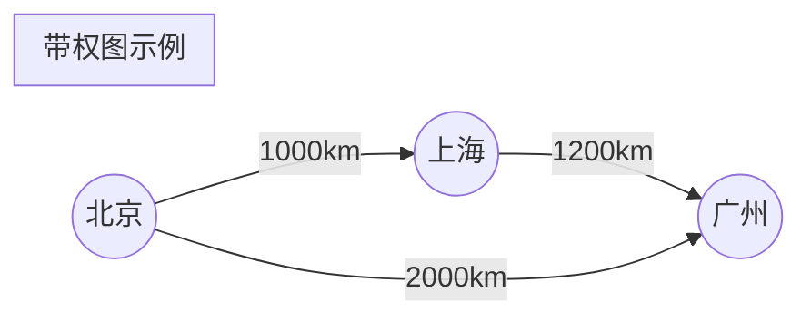
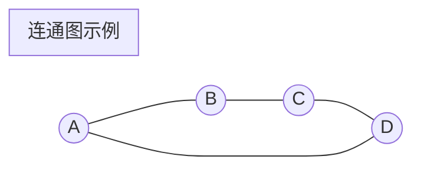

# 1 图论基础 (Graph Theory)

## 1.1 基本概念

### 1.1.1 什么是图？

图是一种非常直观的数据结构，它由顶点（节点）和边组成。想象一下社交网络：
- 每个用户是一个顶点
- 好友关系就是连接用户的边

数学表示：图 G = (V, E)
- V：顶点集合（Vertices）
- E：边集合（Edges）



### 1.1.2 基础术语

#### 1.1.2.1 顶点的概念

1. **度（Degree）**：与顶点相连的边的数量
   - 在社交网络中就是一个人的好友数量



2. **入度和出度**：在有向图中
   - 入度：指向该顶点的边数
   - 出度：从该顶点出发的边数

```mermaid
graph LR
    B((B)) -->|入边| A((A))
    C((C)) -->|入边| A
    A -->|出边| D((D))
    subgraph A的入度=2, 出度=1
    end
    style A fill:#f96,stroke:#333,stroke-width:4px
```

### 1.1.3 图的类型

#### 1.1.3.1 基本分类

1. **无向图**：边没有方向，就像双向的朋友关系



2. **有向图**：边有方向，像社交媒体的关注关系



3. **带权图**：边有权重，如地图上城市间的距离



4. **连通图**：任意两点都有路径相连



## 1.2 图的表示

### 1.2.1 邻接矩阵

```java
public class AdjacencyMatrix {
    private int[][] matrix;
    private int vertices;

    public AdjacencyMatrix(int vertices) {
        this.vertices = vertices;
        matrix = new int[vertices][vertices];
    }

    // 添加边
    public void addEdge(int source, int destination) {
        matrix[source][destination] = 1;
        matrix[destination][source] = 1;  // 无向图需要这行
    }

    // 添加带权边
    public void addWeightedEdge(int source, int destination, int weight) {
        matrix[source][destination] = weight;
        matrix[destination][source] = weight;  // 无向图需要这行
    }
}
```

### 1.2.2 邻接表

```java
public class AdjacencyList {
    private ArrayList<ArrayList<Integer>> adjList;

    public AdjacencyList(int vertices) {
        adjList = new ArrayList<>(vertices);
        for (int i = 0; i < vertices; i++) {
            adjList.add(new ArrayList<>());
        }
    }

    // 添加边
    public void addEdge(int source, int destination) {
        adjList.get(source).add(destination);
        adjList.get(destination).add(source);  // 无向图需要这行
    }
}
```

## 1.3 图的遍历

### 1.3.1 深度优先搜索 (DFS)

```java
public class GraphDFS {
    private boolean[] visited;
    private ArrayList<ArrayList<Integer>> adjList;

    public void dfs(int vertex) {
        visited[vertex] = true;
        System.out.print(vertex + " ");

        for (Integer neighbor : adjList.get(vertex)) {
            if (!visited[neighbor]) {
                dfs(neighbor);
            }
        }
    }
}
```

### 1.3.2 广度优先搜索 (BFS)

```java
public class GraphBFS {
    private boolean[] visited;
    private ArrayList<ArrayList<Integer>> adjList;

    public void bfs(int start) {
        Queue<Integer> queue = new LinkedList<>();
        visited[start] = true;
        queue.offer(start);

        while (!queue.isEmpty()) {
            int vertex = queue.poll();
            System.out.print(vertex + " ");

            for (Integer neighbor : adjList.get(vertex)) {
                if (!visited[neighbor]) {
                    visited[neighbor] = true;
                    queue.offer(neighbor);
                }
            }
        }
    }
}
```

## 1.4 最短路径算法

### 1.4.1 Dijkstra 算法

```java
public class Dijkstra {
    public int[] shortestPath(int[][] graph, int start) {
        int vertices = graph.length;
        int[] distance = new int[vertices];
        boolean[] visited = new boolean[vertices];

        Arrays.fill(distance, Integer.MAX_VALUE);
        distance[start] = 0;

        for (int i = 0; i < vertices - 1; i++) {
            int minVertex = findMinDistance(distance, visited);
            visited[minVertex] = true;

            for (int j = 0; j < vertices; j++) {
                if (!visited[j] && graph[minVertex][j] != 0 &&
                    distance[minVertex] != Integer.MAX_VALUE &&
                    distance[minVertex] + graph[minVertex][j] < distance[j]) {
                    distance[j] = distance[minVertex] + graph[minVertex][j];
                }
            }
        }
        return distance;
    }
}
```

### 1.4.2 Floyd-Warshall 算法

```java
public class FloydWarshall {
    public int[][] allPairsShortestPath(int[][] graph) {
        int vertices = graph.length;
        int[][] distance = new int[vertices][vertices];

        // 初始化距离矩阵
        for (int i = 0; i < vertices; i++) {
            for (int j = 0; j < vertices; j++) {
                distance[i][j] = graph[i][j];
            }
        }

        // 核心算法
        for (int k = 0; k < vertices; k++) {
            for (int i = 0; i < vertices; i++) {
                for (int j = 0; j < vertices; j++) {
                    if (distance[i][k] != Integer.MAX_VALUE &&
                        distance[k][j] != Integer.MAX_VALUE &&
                        distance[i][k] + distance[k][j] < distance[i][j]) {
                        distance[i][j] = distance[i][k] + distance[k][j];
                    }
                }
            }
        }
        return distance;
    }
}
```

## 1.5 最小生成树

### 1.5.1 Prim 算法

```java
public class Prim {
    public void primMST(int[][] graph) {
        int vertices = graph.length;
        int[] parent = new int[vertices];
        int[] key = new int[vertices];
        boolean[] mstSet = new boolean[vertices];

        Arrays.fill(key, Integer.MAX_VALUE);
        key[0] = 0;
        parent[0] = -1;

        for (int count = 0; count < vertices - 1; count++) {
            int u = minKey(key, mstSet);
            mstSet[u] = true;

            for (int v = 0; v < vertices; v++) {
                if (graph[u][v] != 0 && !mstSet[v] && graph[u][v] < key[v]) {
                    parent[v] = u;
                    key[v] = graph[u][v];
                }
            }
        }
    }
}
```

### 1.5.2 Kruskal 算法

```java
public class Kruskal {
    class Edge implements Comparable<Edge> {
        int src, dest, weight;

        public int compareTo(Edge other) {
            return this.weight - other.weight;
        }
    }

    public void kruskalMST(ArrayList<Edge> edges, int vertices) {
        Collections.sort(edges);
        DisjointSet ds = new DisjointSet(vertices);

        for (Edge edge : edges) {
            int x = ds.find(edge.src);
            int y = ds.find(edge.dest);

            if (x != y) {
                System.out.println(edge.src + " - " + edge.dest);
                ds.union(x, y);
            }
        }
    }
}
```

## 1.6 拓扑排序

### 1.6.1 DFS 实现

```java
public class TopologicalSort {
    private Stack<Integer> stack;
    private boolean[] visited;

    public void topologicalSort(ArrayList<ArrayList<Integer>> graph) {
        int vertices = graph.size();
        stack = new Stack<>();
        visited = new boolean[vertices];

        for (int i = 0; i < vertices; i++) {
            if (!visited[i]) {
                topologicalSortUtil(i, graph);
            }
        }
    }

    private void topologicalSortUtil(int v, ArrayList<ArrayList<Integer>> graph) {
        visited[v] = true;

        for (Integer neighbor : graph.get(v)) {
            if (!visited[neighbor]) {
                topologicalSortUtil(neighbor, graph);
            }
        }

        stack.push(v);
    }
}
```

## 1.7 应用场景

### 1.7.1 实际应用

1. **社交网络**

   - 好友关系图
   - 社交影响力分析
   - 群组发现

2. **交通网络**

   - 路径规划
   - 交通流量分析
   - 网络优化

3. **计算机网络**
   - 网络拓扑
   - 路由算法
   - 网络流量分析

### 1.7.2 算法应用

1. **最短路径**

   - 导航系统
   - 网络路由
   - 资源调度

2. **最小生成树**

   - 网络设计
   - 电路布线
   - 集群分析

3. **拓扑排序**
   - 任务调度
   - 编译依赖
   - 工程规划

## 1.8 性能分析

### 1.8.1 空间复杂度

| 表示方法 | 空间复杂度 |
| -------- | ---------- |
| 邻接矩阵 | O(V²)      |
| 邻接表   | O(V + E)   |

### 1.8.2 时间复杂度

| 算法           | 时间复杂度 |
| -------------- | ---------- |
| DFS            | O(V + E)   |
| BFS            | O(V + E)   |
| Dijkstra       | O(V²)      |
| Floyd-Warshall | O(V³)      |
| Prim           | O(V²)      |
| Kruskal        | O(E log E) |
| 拓扑排序       | O(V + E)   |

## 1.9 实践建议

### 1.9.1 选择建议

1. **图的表示**

   - 稠密图用邻接矩阵
   - 稀疏图用邻接表
   - 考虑内存限制

2. **算法选择**
   - 单源最短路径用 Dijkstra
   - 所有点对最短路径用 Floyd
   - 最小生成树根据图的稠密度选择

### 1.9.2 优化方向

1. **数据结构优化**

   - 使用优先队列
   - 使用并查集
   - 合理使用缓存

2. **算法优化**
   - 剪枝
   - 启发式搜索
   - 并行计算

