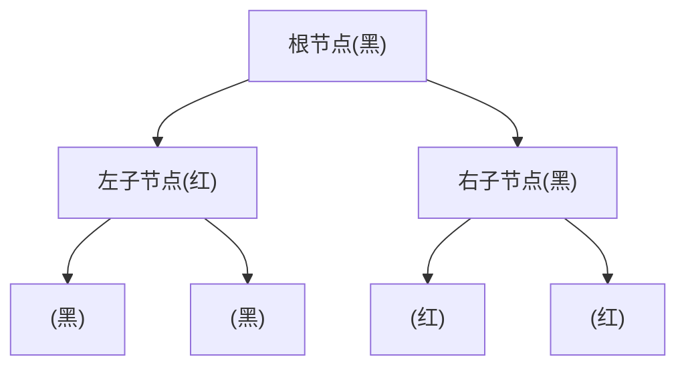
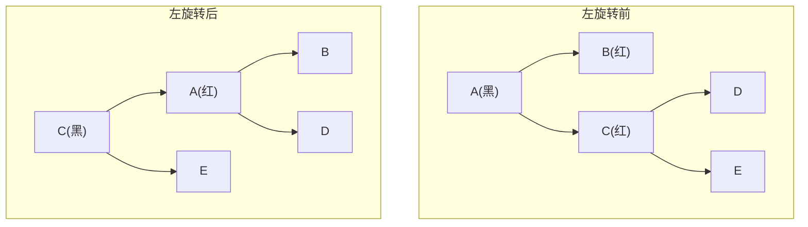
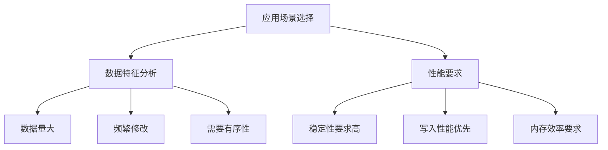

# 红黑树 (Red-Black Tree)

## 1. 基本原理

### 1.1 定义

红黑树是一种自平衡的二叉搜索树，它通过为每个节点着色（红色或黑色）来保持树的平衡性。红黑树在1972年由Rudolf Bayer发明，最初被称为"对称二叉B树"。

### 1.2 颜色选择的原因

红黑树选择使用红色和黑色两种颜色是经过深思熟虑的设计：

1. **二元性**
   - 使用两种颜色是最简单且高效的选择
   - 每个节点只需要1位(bit)来存储颜色信息
   - 便于在计算机中实现和存储

2. **对比性**
   - 红黑分明，便于直观理解和调试
   - 有助于清晰地展示树的结构特征

3. **平衡性表达**
   - 黑色节点：**代表树的骨架结构**，确保基本平衡
   - 红色节点：**作为黑色节点的补充**，提供灵活的调整空间

### 1.3 核心特性

红黑树必须满足以下五个基本性质：

1. **节点颜色**：每个节点要么是红色，要么是黑色
2. **根节点**：根节点必须是黑色
3. **叶子节点**：所有叶子节点（NIL节点）都是黑色
4. **红色节点**：如果一个节点是红色，则其两个子节点都是黑色（不能有两个连续的红色节点）
5. **黑色平衡**：对于每个节点，从该节点到其所有后代叶子节点的简单路径上，均包含相同数量的黑色节点

### 1.4 平衡原理

红黑树通过以下机制保持平衡：

1. **颜色约束机制**
   - **红色节点限制**：通过禁止连续的红色节点，控制了树的生长速度
   - **黑色节点平衡**：保证了树的基本骨架结构的平衡性
   - **路径长度控制**：最长路径不会超过最短路径的两倍

2. **自平衡操作**
   - **颜色调整**：通过改变节点颜色维持红黑树性质
   - **旋转操作**：通过左旋和右旋调整树的结构
   - **组合优化**：颜色调整和旋转操作的组合使用

### 1.5 为什么选择红黑树

1. **性能保证**
   - **时间复杂度**：查找、插入、删除操作都保证在O(log n)时间内完成
   - **实际效率**：虽然不如AVL树平衡，但重平衡操作更少，整体性能更优

2. **空间效率**
   - **存储开销小**：每个节点只需要1位来存储颜色信息
   - **内存利用率高**：相比其他平衡树结构，额外空间开销最小

3. **实用性强**
   - **适应性好**：能够很好地处理随机和非随机的数据
   - **应用广泛**：被广泛应用于各种系统实现中，如Linux内核、Java集合框架等



## 2. 节点结构与基本操作

### 2.1 节点结构

```java
public class RedBlackNode<T extends Comparable<T>> {
    private T data;           // 节点数据
    private boolean isRed;    // 节点颜色
    private RedBlackNode<T> left;    // 左子节点
    private RedBlackNode<T> right;   // 右子节点
    private RedBlackNode<T> parent;  // 父节点
    
    public RedBlackNode(T data) {
        this.data = data;
        this.isRed = true;    // 新插入的节点默认为红色
    }
}
```

### 2.2 基本操作

1. **旋转操作**
   - 左旋：将节点的右子树变为该节点的父节点
   - 右旋：将节点的左子树变为该节点的父节点

2. **颜色调整**
   - 重新着色：改变节点的颜色
   - 通过重新着色和旋转的组合来维持红黑树性质



## 3. 树结构对比分析

### 3.1 红黑树与其他树结构对比

| 特性 | 红黑树 | AVL树 | 普通二叉搜索树 | B树 |
|------|--------|-------|----------------|-----|
| 平衡条件 | 黑色节点数量相等 | 左右子树高度差≤1 | 无平衡要求 | 所有叶节点同层 |
| 平衡程度 | 中等 | 严格平衡 | 可能不平衡 | 完全平衡 |
| 调整频率 | 中等 | 频繁 | 无调整 | 较少 |
| 树高范围 | ≤ 2log(n+1) | ≈ 1.44log(n+1) | 最坏O(n) | ≈ logm(n) |
| 插入性能 | O(log n) | O(log n) | O(log n)~O(n) | O(logm n) |
| 查找性能 | O(log n) | O(log n) | O(log n)~O(n) | O(logm n) |
| 删除性能 | O(log n) | O(log n) | O(log n)~O(n) | O(logm n) |
| 空间开销 | 每节点1位 | 每节点存储高度 | 最小 | 每节点多个关键字 |

### 3.2 优势分析

1. **相比AVL树**
   - 插入和删除时旋转次数更少，性能更好
   - 实际应用中内存占用更小
   - 适合频繁写入的场景

2. **相比普通BST**
   - 保证了最坏情况下的时间复杂度
   - 避免了树的退化
   - 查找性能稳定

3. **相比B树**
   - 实现相对简单
   - 更适合内存存储
   - 单个节点的开销更小

### 3.3 劣势分析

1. **实现复杂度**
   - 平衡调整逻辑复杂
   - 代码实现难度大
   - 调试和维护成本高

2. **性能特点**
   - 相比AVL树，查找性能略低
   - 旋转操作可能影响效率
   - 不适合频繁查询的场景

3. **资源消耗**
   - 需要额外的存储空间（颜色信息）
   - 旋转操作消耗计算资源
   - 可能增加内存碎片

## 4. 应用场景分析

### 4.1 适用场景

1. **数据库系统**
   - 索引实现
   - 数据组织结构

2. **内存数据结构**
   - Java中的TreeMap和TreeSet
   - 需要有序性的集合实现

3. **文件系统**
   - 文件目录组织
   - 快速检索结构

### 4.2 最佳实践

1. **使用建议**
   - 数据量较大时使用
   - 需要保证稳定性能
   - 写操作频繁的场景

2. **优化方向**
   - 合理设置初始容量
   - 批量操作时优化
   - 考虑缓存策略



## 5. 总结

红黑树是一种高效的自平衡二叉搜索树，通过巧妙的颜色规则和平衡操作，在保证性能的同时，也保持了较好的实用性。它在各种实际应用中都发挥着重要作用，特别是在需要兼顾查询和修改性能的场景中。虽然实现复杂，但其提供的性能保证和稳定性使其成为了许多系统中不可或缺的数据结构。

