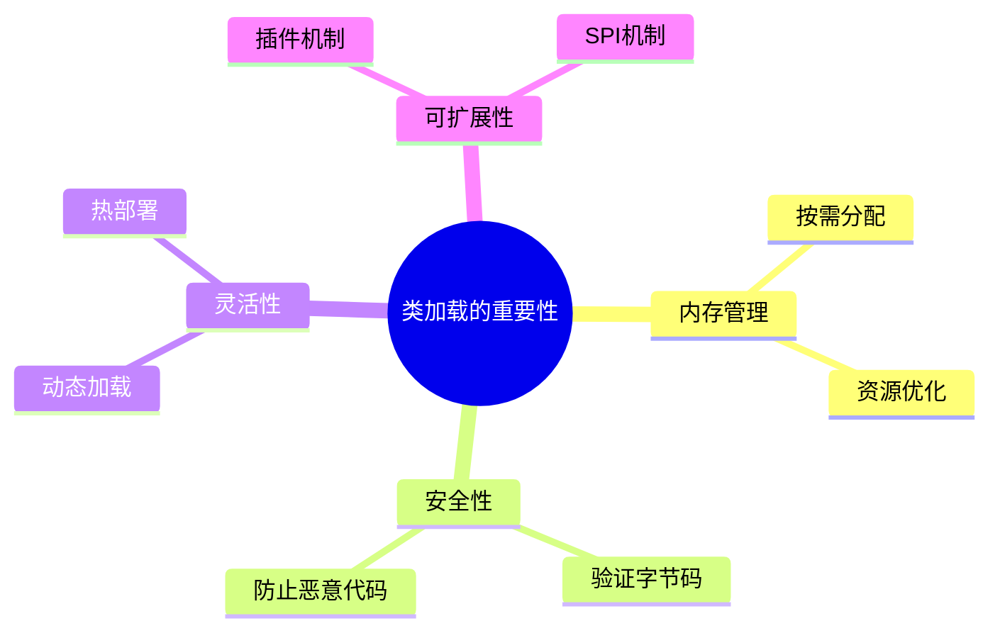
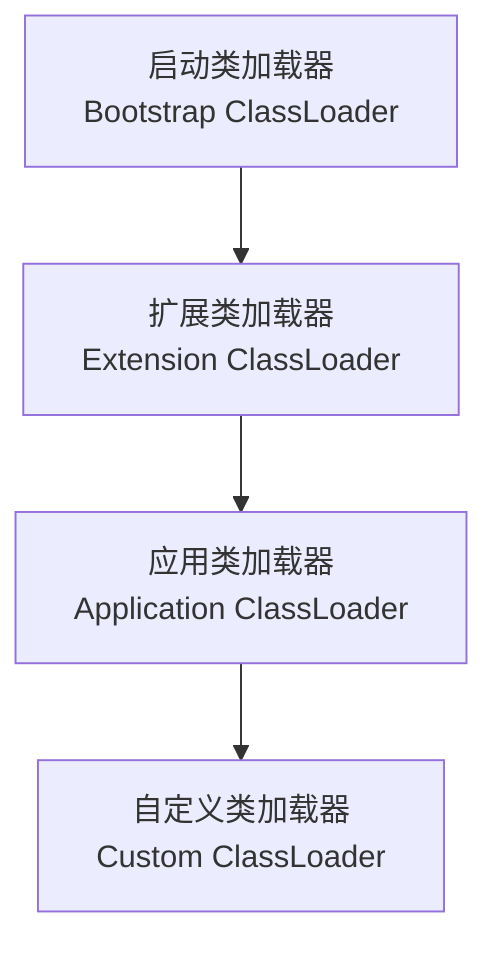
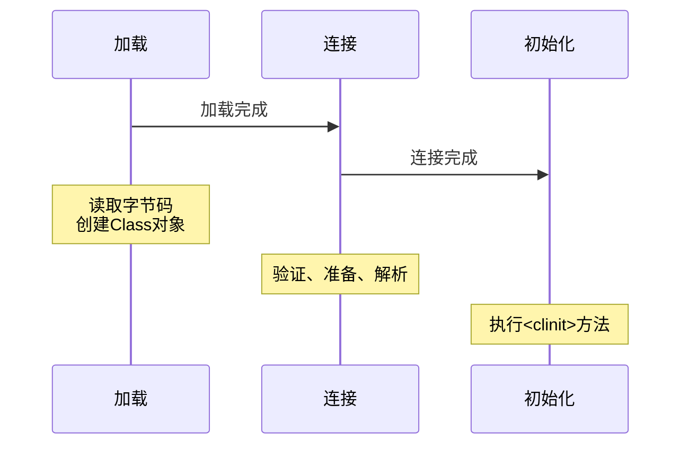
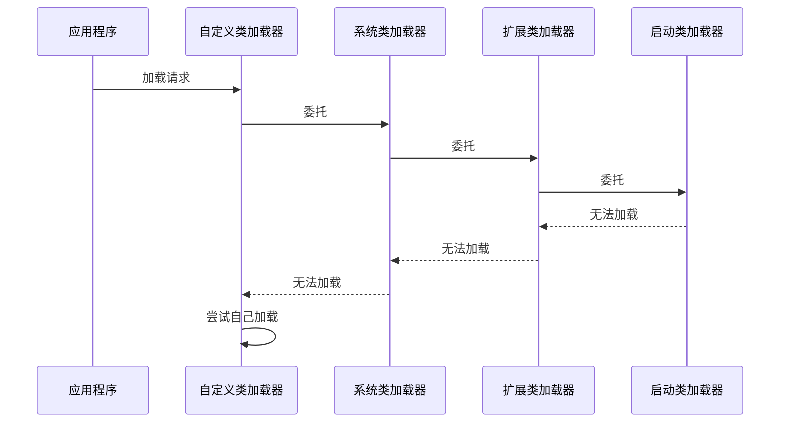
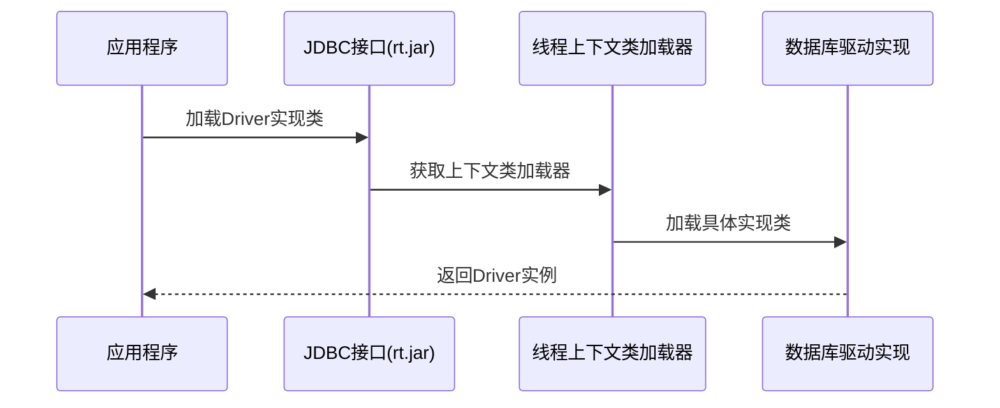
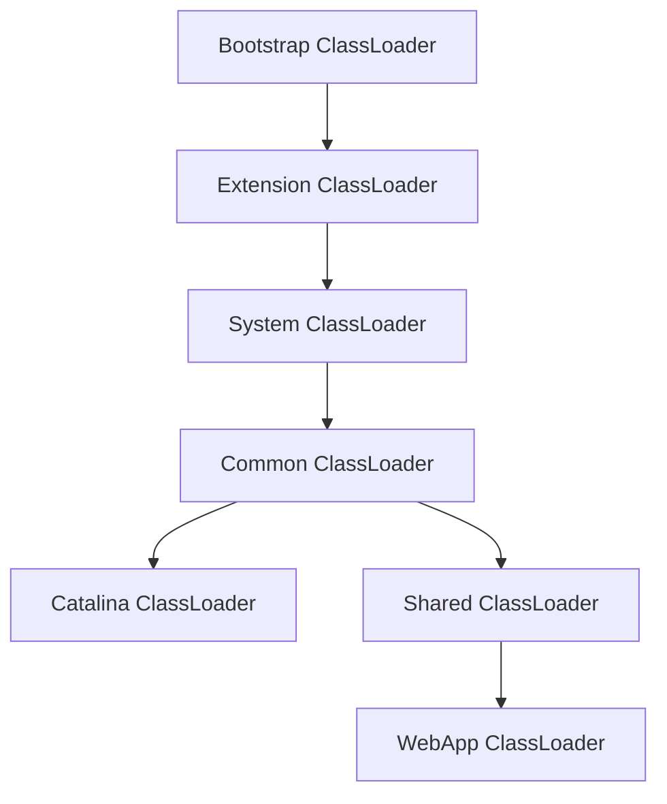
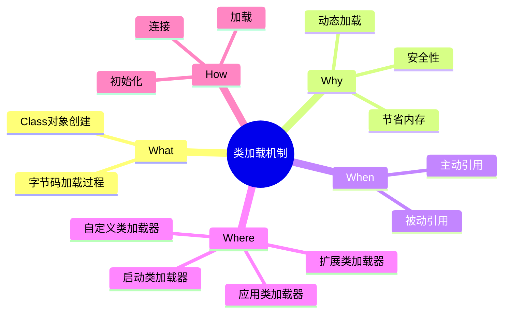

# 1 JVM类加载机制

## 1.1 类加载基础概念（What）

### 1.1.1 什么是类加载
类加载是JVM将Java类的字节码文件（.class文件）加载到内存，创建对应的Class对象，并进行连接、初始化等操作的过程。


### 1.1.2 类加载的主要任务
- 将字节码文件加载到内存
- 创建类的运行时数据结构
- 生成Class对象作为访问入口

## 1.2 为什么需要类加载（Why）

### 1.2.1 动态加载的优势
- **节省内存空间**：按需加载，避免一次性加载所有类
- **提高系统灵活性**：运行时动态加载，支持热部署
- **实现Java的可扩展性**：通过自定义类加载器扩展功能

### 1.2.2 类加载的重要性


## 1.3 类加载的时机（When）

### 1.3.1 主动引用（会触发类加载）
1. 使用new关键字实例化对象
2. 访问类的静态变量或静态方法
3. 使用Class.forName()加载类
4. 初始化子类时会先初始化父类
5. 启动类（main方法所在类）

### 1.3.2 被动引用（不会触发类加载）
```java
// 示例1：通过子类引用父类的静态字段
class Parent {
    public static int value = 123;
}
class Child extends Parent {
    public static int childValue = 234;
}
// 只会加载Parent类
System.out.println(Child.value);

// 示例2：通过数组定义来引用类
Parent[] parents = new Parent[10]; // 不会触发Parent类初始化

// 示例3：常量引用
class Constants {
    public static final String HELLO = "hello";
}
// 不会触发Constants类初始化
System.out.println(Constants.HELLO);
```

## 1.4 类加载的位置（Where）

### 1.4.1 类加载器层次结构


### 1.4.2 各类加载器的职责
1. **启动类加载器（Bootstrap ClassLoader）**
   - 加载Java核心类库（JAVA_HOME/lib）
   - 如rt.jar、tools.jar等
   - 使用C++实现，在Java中显示为null

2. **扩展类加载器（Extension ClassLoader）**
   - 加载扩展类库（JAVA_HOME/lib/ext）
   - 如javax开头的类
   - Java实现，sun.misc.Launcher$ExtClassLoader

3. **应用类加载器（Application ClassLoader）**
   - 加载应用程序classpath下的类
   - 程序默认的类加载器
   - Java实现，sun.misc.Launcher$AppClassLoader

4. **自定义类加载器（Custom ClassLoader）**
   - 加载特定路径下的类文件
   - 实现特殊的加载逻辑

## 1.5 类加载的过程（How）

### 1.5.1 类加载的三个阶段


### 1.5.2 详细加载过程

#### 1.5.2.1 加载（Loading）
- **步骤**：
  1. 通过类的全限定名获取二进制字节流
  2. 解析字节流为方法区内的数据结构
  3. 创建Class对象

```java
// 示例：不同方式加载类
// 1. Class.forName()
Class<?> clazz1 = Class.forName("com.example.MyClass");

// 2. ClassLoader.loadClass()
ClassLoader loader = ClassLoader.getSystemClassLoader();
Class<?> clazz2 = loader.loadClass("com.example.MyClass");
```

#### 1.5.2.2 连接（Linking）
1. **验证（Verification）**
   ```mermaid
graph LR
    A[文件格式验证] --> B[元数据验证]
    B --> C[字节码验证]
    C --> D[符号引用验证]
   ```
   - 确保Class文件格式正确
   - 验证元数据和字节码的安全性
   - 检查符号引用的合法性

2. **准备（Preparation）**
   ```java
   public class PreparationDemo {
       // 准备阶段赋默认值0，初始化阶段赋值123
       public static int a = 123;
       
       // 准备阶段直接赋值123（final常量）
       public static final int b = 123;
   }
   ```

3. **解析（Resolution）**
   - 将符号引用替换为直接引用
   - 解析类、字段、方法和接口的符号引用

#### 1.5.2.3 初始化（Initialization）
```java
public class InitializationDemo {
    // 静态变量和静态代码块的执行顺序
    static {
        System.out.println("1. 静态代码块执行");
        // 此时value为0
        System.out.println("value = " + value);
    }
    
    public static int value = 123;
    
    static {
        System.out.println("2. 第二个静态代码块执行");
        // 此时value为123
        System.out.println("value = " + value);
    }
}
```

### 1.5.3 双亲委派模型

#### 1.5.3.1 工作原理


#### 1.5.3.2 自定义类加载器示例
```java
public class CustomClassLoader extends ClassLoader {
    private String classPath;

    public CustomClassLoader(String classPath) {
        this.classPath = classPath;
    }

    @Override
    protected Class<?> findClass(String name) throws ClassNotFoundException {
        try {
            byte[] classData = loadClassData(name);
            return defineClass(name, classData, 0, classData.length);
        } catch (IOException e) {
            throw new ClassNotFoundException("Could not load class " + name, e);
        }
    }

    private byte[] loadClassData(String name) throws IOException {
        String path = classPath + "/" + name.replace('.', '/') + ".class";
        try (InputStream is = new FileInputStream(path)) {
            ByteArrayOutputStream baos = new ByteArrayOutputStream();
            int bufferSize = 4096;
            byte[] buffer = new byte[bufferSize];
            int bytesRead;
            while ((bytesRead = is.read(buffer)) != -1) {
                baos.write(buffer, 0, bytesRead);
            }
            return baos.toByteArray();
        }
    }
}
```

### 1.5.4 自定义类加载器详解

#### 1.5.4.1 自定义类加载器的目的
- **隔离加载类**：在多模块开发中，避免类的重复加载
- **修改类加载方式**：可以自定义类加载的方式，如从数据库、网络等加载
- **扩展加载源**：除了从文件系统加载外，还可以从其他来源加载类
- **实现热部署**：在运行时重新加载类，实现不停机更新

#### 1.5.4.2 实现原理
```java
public abstract class ClassLoader {
    // 加载类的入口方法
    public Class<?> loadClass(String name) throws ClassNotFoundException {
        return loadClass(name, false);
    }
    
    // 实现双亲委派的核心方法
    protected Class<?> loadClass(String name, boolean resolve) throws ClassNotFoundException {
        synchronized (getClassLoadingLock(name)) {
            // 首先检查类是否已经加载
            Class<?> c = findLoadedClass(name);
            if (c == null) {
                try {
                    // 委派给父类加载器加载
                    if (parent != null) {
                        c = parent.loadClass(name, false);
                    } else {
                        c = findBootstrapClassOrNull(name);
                    }
                } catch (ClassNotFoundException e) {
                    // 父类加载器无法加载时
                }
                
                if (c == null) {
                    // 父类加载器无法加载时，调用自己的findClass方法
                    c = findClass(name);
                }
            }
            if (resolve) {
                resolveClass(c);
            }
            return c;
        }
    }
    
    // 自定义类加载器需要重写的方法
    protected Class<?> findClass(String name) throws ClassNotFoundException {
        throw new ClassNotFoundException(name);
    }
}
```

#### 1.5.4.3 常见应用场景
1. **热部署实现**
```java
public class HotDeployClassLoader extends ClassLoader {
    private String classPath;
    private Set<String> dynaclazns; // 需要热部署的类名集合
    
    @Override
    public Class<?> loadClass(String name, boolean resolve) throws ClassNotFoundException {
        Class<?> clazz = null;
        // 热部署类不走双亲委派
        if (dynaclazns.contains(name)) {
            clazz = findClass(name);
            if (resolve) {
                resolveClass(clazz);
            }
            return clazz;
        }
        return super.loadClass(name, resolve);
    }
}
```

2. **网络类加载器**
```java
public class NetworkClassLoader extends ClassLoader {
    private String host;
    private int port;

    public NetworkClassLoader(String host, int port) {
        this.host = host;
        this.port = port;
    }

    @Override
    protected Class<?> findClass(String name) throws ClassNotFoundException {
        byte[] classData = downloadClassData(name); // 从网络下载类数据
        if (classData == null) {
            throw new ClassNotFoundException();
        }
        return defineClass(name, classData, 0, classData.length);
    }

    private byte[] downloadClassData(String name) {
        // 实现从网络下载类文件的逻辑
        return null;
    }
}
```

### 1.5.5 破坏双亲委派模型

#### 1.5.5.1 为什么需要破坏
1. **SPI机制的实现**：Java的SPI机制需要加载接口实现类
2. **热部署的实现**：实现类的热替换
3. **OSGi模块化系统**：实现模块化和隔离
4. **Tomcat类加载机制**：实现Web应用间的隔离

#### 1.5.5.2 破坏方式
1. **重写loadClass方法**
```java
public class CustomClassLoader extends ClassLoader {
    @Override
    public Class<?> loadClass(String name, boolean resolve) throws ClassNotFoundException {
        Class<?> clazz = findLoadedClass(name);
        if (clazz == null) {
            // 优先自己加载
            try {
                clazz = findClass(name);
            } catch (ClassNotFoundException e) {
                // 找不到时委派给父加载器
                clazz = super.loadClass(name, resolve);
            }
        }
        if (resolve) {
            resolveClass(clazz);
        }
        return clazz;
    }
}
```

2. **线程上下文类加载器**
```java
// 设置线程上下文类加载器
Thread.currentThread().setContextClassLoader(new CustomClassLoader());

// 使用线程上下文类加载器加载类
ClassLoader contextClassLoader = Thread.currentThread().getContextClassLoader();
Class<?> clazz = contextClassLoader.loadClass("com.example.MyClass");
```

#### 1.5.5.3 典型案例分析

1. **JDBC SPI实现**


2. **Tomcat类加载器结构**


### 1.5.6 类加载机制的局限性

1. **类加载的不可逆性**
- 一旦类被加载就无法卸载
- 重新加载需要使用新的类加载器

2. **命名空间冲突**
```java
// 不同类加载器加载相同类会创建不同的命名空间
ClassLoader loader1 = new CustomClassLoader();
ClassLoader loader2 = new CustomClassLoader();

Class<?> class1 = loader1.loadClass("com.example.MyClass");
Class<?> class2 = loader2.loadClass("com.example.MyClass");

// 虽然是同一个类文件，但在JVM中是不同的类
System.out.println(class1 == class2); // false
```

3. **性能影响**
- 类加载过程会影响启动性能
- 动态加载类会增加JVM内存负担

4. **安全限制**
- 自定义类加载器可能绕过安全管理器
- 需要合理的权限控制

## 1.6 实践与优化建议

### 1.6.1 性能优化
- **类加载优化**
  - 使用缓存机制
  - 延迟加载
  - 并行加载

- **内存优化**
  - 及时回收Class对象
  - 控制加载类的数量

### 1.6.2 常见问题解决
1. **ClassNotFoundException**
   - 原因：类路径下找不到指定类
   - 解决：检查类路径、jar包依赖

2. **NoClassDefFoundError**
   - 原因：类定义在编译时存在，运行时不存在
   - 解决：检查类文件完整性、依赖关系

3. **LinkageError**
   - 原因：类加载器加载了不兼容的类版本
   - 解决：检查类版本、类加载器层次

### 1.6.3 最佳实践
```java
// 1. 使用线程上下文类加载器
ClassLoader contextClassLoader = Thread.currentThread().getContextClassLoader();

// 2. 资源加载最佳实践
URL resource = getClass().getResource("/config.properties");

// 3. 动态加载类
try {
    Class<?> dynamicClass = Class.forName("com.example.DynamicClass");
    Object instance = dynamicClass.newInstance();
} catch (Exception e) {
    // 异常处理
}
```

## 1.7 总结



