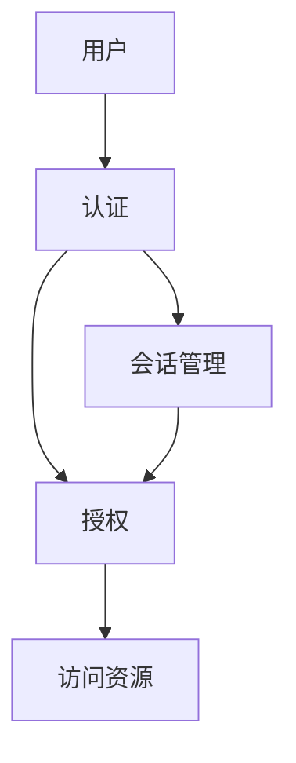
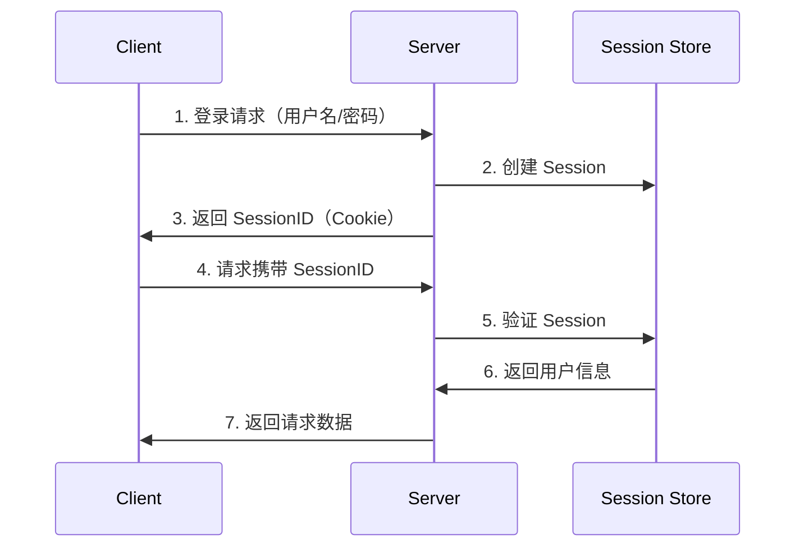
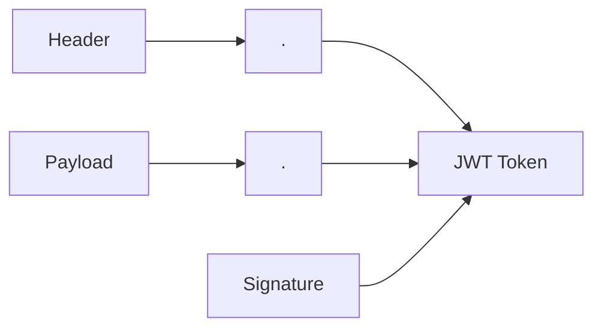
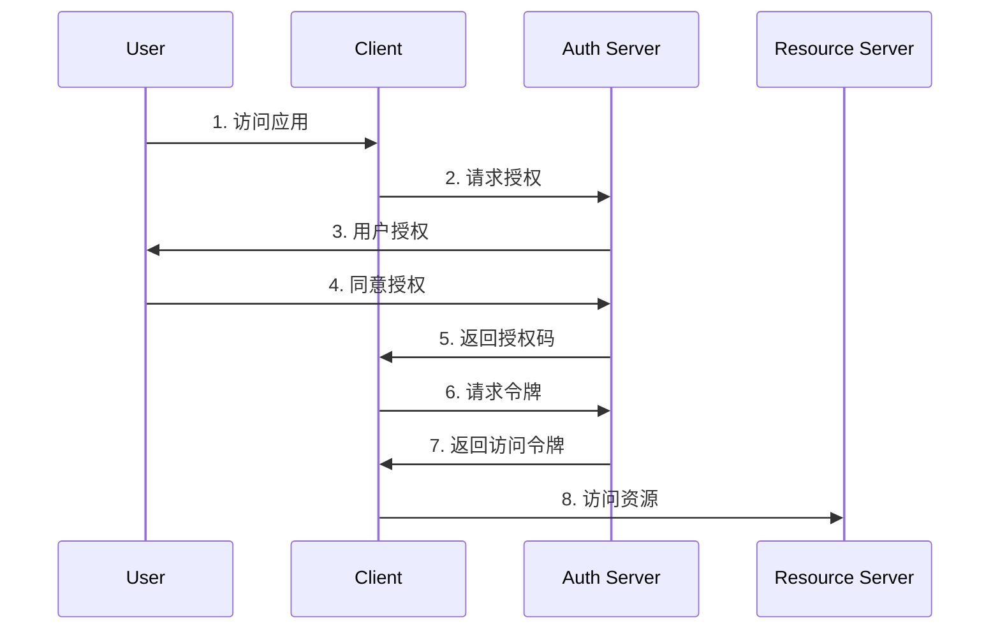
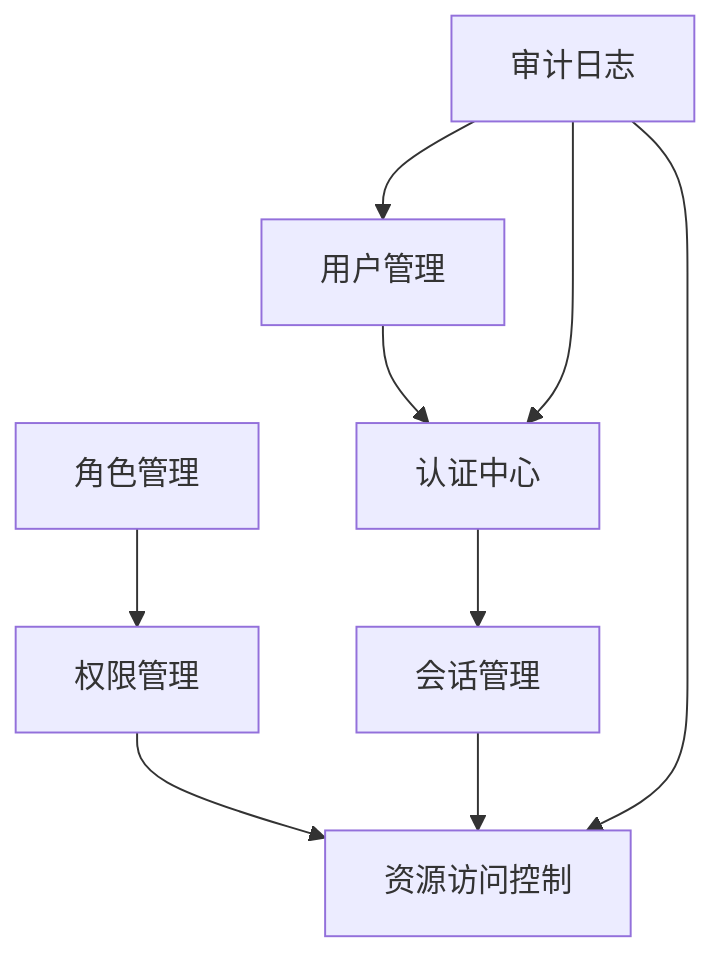
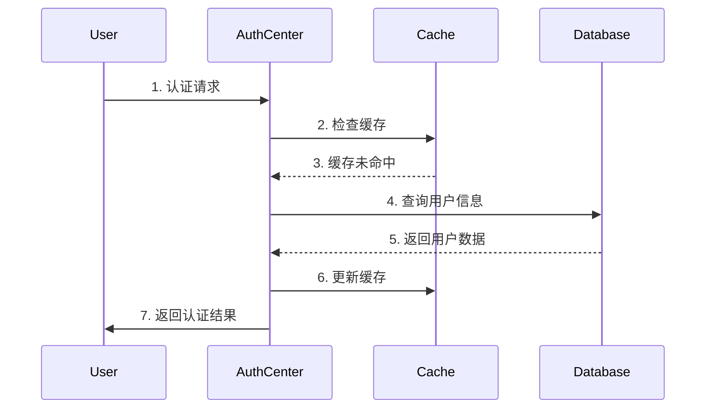

# 1 认证与授权

## 1.1 基础概念

### 1.1.1 认证（Authentication）
- **定义**：验证用户身份的过程，确认「你是谁」
- **目的**：确保用户是其声称的身份
- **核心要素**：
  - 身份标识（Identification）：用户名、邮箱、手机号等
  - 凭证验证（Verification）：密码、验证码、证书等
  - 认证强度（Strength）：单因素、双因素、多因素认证
- **认证方式**：
  - 知识因素：用户名密码（Something you know）
  - 所有因素：手机令牌、U盾（Something you have）
  - 特征因素：指纹、人脸（Something you are）
  - 行为因素：手势、签名（Something you do）
- **认证协议**：
  - Basic Authentication：基本认证
  - Digest Authentication：摘要认证
  - Form-based Authentication：表单认证
  - Certificate-based：证书认证

### 1.1.2 授权（Authorization）
- **定义**：确定用户权限的过程，判断「你能做什么」
- **目的**：控制用户可以访问的资源和执行的操作
- **授权模型**：
  - 自主访问控制（DAC）：
    - 资源所有者自行决定访问权限
    - 典型如文件系统权限
  - 强制访问控制（MAC）：
    - 系统强制执行的安全策略
    - 多用于军事和政府系统
  - 角色基础访问控制（RBAC）：
    - 基于角色分配权限
    - 用户-角色-权限三层模型
    - 支持角色继承和权限传递
  - 基于属性的访问控制（ABAC）：
    - 根据属性（用户、资源、环境）动态决策
    - 更灵活但实现复杂
  - 访问控制列表（ACL）：
    - 详细列出每个用户的权限
    - 适用于精细化权限控制

### 1.1.3 会话管理
- **定义**：跟踪和维护用户登录状态的机制
- **目的**：
  - 避免用户频繁登录
  - 提供连续的用户体验
  - 保护用户安全
- **核心功能**：
  - 会话创建：用户认证成功后建立
  - 会话维护：保持用户登录状态
  - 会话更新：延长会话有效期
  - 会话销毁：用户注销或超时
- **实现方式**：
  - Session：服务器端存储会话信息
    - 优点：安全性高，便于控制
    - 缺点：服务器资源消耗大
  - Token：客户端存储会话信息
    - 优点：无状态，扩展性好
    - 缺点：撤销和更新不便
  - Cookie：浏览器存储会话标识
    - 优点：实现简单，广泛支持
    - 缺点：受同源策略限制
- **安全考虑**：
  - 会话标识的随机性和唯一性
  - 传输加密（HTTPS）
  - 会话超时机制
  - 会话并发控制
  - 防止会话固定攻击
  - 防止会话劫持

## 1.2 认证方案详解

### 1.2.1 Session-Cookie 认证
- **工作流程**：
  1. 用户登录成功后，服务器创建 Session
  2. 服务器返回 SessionID 存储在 Cookie 中
  3. 后续请求携带 Cookie 中的 SessionID
  4. 服务器验证 SessionID

### 1.2.2 Token 认证
- **特点**：
  - 无状态
  - 可扩展性好
  - 跨域支持好
- **工作流程**：
  1. 用户登录成功后，服务器生成 Token
  2. 客户端存储 Token
  3. 后续请求携带 Token
  4. 服务器验证 Token

### 1.2.3 JWT（JSON Web Token）
- **结构**：
  - Header（头部）
  - Payload（负载）
  - Signature（签名）
- **特点**：
  - 自包含（包含用户信息）
  - 无需查询数据库
  - 支持跨域

### 1.2.4 OAuth 2.0
- **角色**：
  - 资源所有者
  - 客户端
  - 授权服务器
  - 资源服务器
- **授权模式**：
  1. 授权码模式
  2. 简化模式
  3. 密码模式
  4. 客户端模式

### 1.2.5 SSO（单点登录）
- **定义**：一次登录，访问多个系统
- **实现方式**：
  1. 基于 Cookie
  2. 基于 Token
  3. 基于 SAML
  4. 基于 OAuth

## 1.3 认证方案对比

| 方案             | 优点            | 缺点                   | 适用场景   |
| -------------- | ------------- | -------------------- | ------ |
| Session-Cookie | 实现简单 安全性好  | 服务器压力大 扩展性差       | 单体应用   |
| Token          | 无状态 扩展性好   | Token 管理复杂 无法主动失效 | 分布式系统  |
| JWT            | 自包含 性能好    | 无法撤销 数据大小受限       | API 服务 |
| OAuth 2.0      | 功能完善 安全性高  | 实现复杂 配置繁琐         | 第三方授权  |
| SSO            | 用户体验好 统一管理 | 配置复杂 单点故障         | 企业应用   |

## 1.4 安全考虑

### 1.4.1 常见攻击及防范

#### 1.4.1.1 CSRF（跨站请求伪造）
- **防范措施**：
  - CSRF Token
  - 验证 Referer
  - SameSite Cookie

#### 1.4.1.2 XSS（跨站脚本攻击）
- **防范措施**：
  - 输入过滤
  - 输出转义
  - CSP 策略

#### 1.4.1.3 密码安全
- **最佳实践**：
  - 密码加密存储
  - 密码强度要求
  - 登录失败限制
  - 定期修改密码

### 1.4.2 安全加固建议

1. **传输安全**
   - 使用 HTTPS
   - 敏感数据加密

2. **认证增强**
   - 多因素认证
   - 验证码机制
   - 会话超时设置

3. **授权控制**
   - 最小权限原则
   - 权限细粒度控制
   - 定期权限审计

## 1.5 最佳实践

### 1.5.1 认证设计原则

1. **安全性**
   - 使用成熟的认证框架
   - 实施必要的安全措施
   - 定期安全审计

2. **可用性**
   - 简化认证流程
   - 提供密码找回机制
   - 合理的会话管理

3. **扩展性**
   - 支持多种认证方式
   - 便于集成新功能
   - 考虑未来扩展

## 1.6 实践：权限认证框架设计

### 1.6.1 核心组件

1. **用户管理模块**
   - 用户信息管理
   - 用户状态维护
   - 用户组织关系

2. **角色管理模块**
   - 角色定义与维护
   - 角色层级关系
   - 角色分配管理

3. **权限管理模块**
   - 权限定义与分类
   - 权限分配规则
   - 权限继承关系

4. **认证中心**
   - 统一认证服务
   - 多因素认证支持
   - 认证策略配置

5. **会话管理模块**
   - 会话创建与维护
   - 会话状态同步
   - 会话安全控制

6. **审计日志模块**
   - 操作日志记录
   - 安全事件追踪
   - 审计报告生成

### 1.6.2 组件职责

1. **数据层**
   - 用户数据存储
   - 角色权限映射
   - 会话信息持久化
   - 操作日志存储

2. **业务层**
   - 认证逻辑处理
   - 权限校验规则
   - 会话状态管理
   - 数据同步策略

3. **接口层**
   - RESTful API 设计
   - 统一认证接口
   - 权限验证接口
   - 日志查询接口

### 1.6.3 框架特性

1. **可扩展性**
   - 插件化架构
   - 自定义认证方式
   - 灵活的权限模型

2. **高可用性**
   - 多节点部署
   - 数据一致性保证
   - 故障自动转移

3. **安全性**
   - 加密传输
   - 防暴力攻击
   - 异常检测

4. **性能优化**
   - 缓存机制
   - 权限预加载
   - 批量操作支持

### 1.6.4 实现建议

1. **技术选型**
   - Spring Security
   - Apache Shiro
   - Keycloak
   - 自研框架

2. **存储方案**
   - 关系型数据库
   - 缓存（Redis）
   - 分布式存储

3. **部署架构**
   - 微服务架构
   - 集中式部署
   - 混合部署

### 1.6.5 注意事项

1. **性能考虑**
   - 合理使用缓存
   - 优化权限检查
   - 控制数据同步频率

2. **安全考虑**
   - 定期安全审计
   - 敏感数据加密
   - 异常监控预警

3. **运维考虑**
   - 监控告警
   - 容量规划
   - 备份恢复

