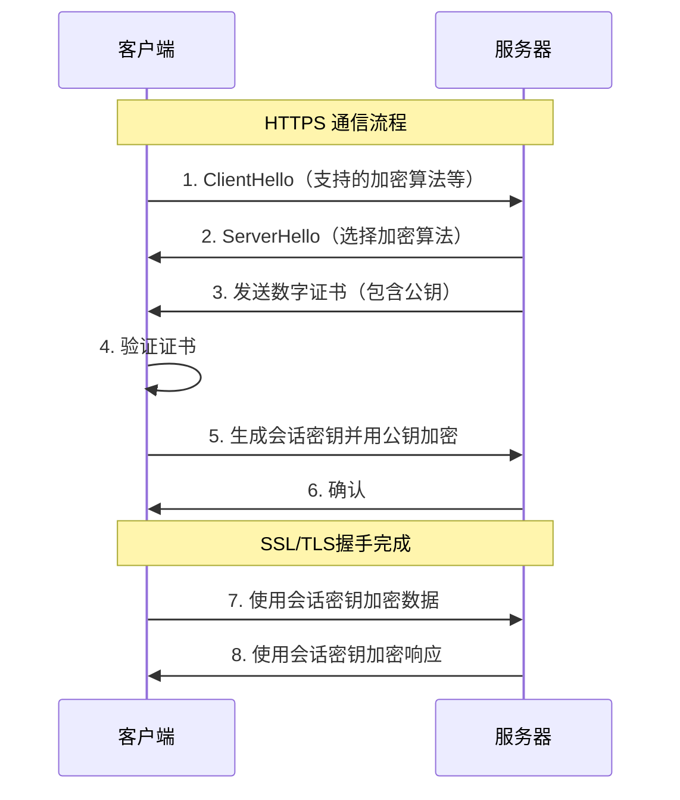

# 1 HTTP 和 HTTPS 的区别是什么？

^9d9f3c

HTTP（超文本传输协议）和 HTTPS（安全超文本传输协议）是用于在网络上传输数据的两种协议。它们的主要区别在于安全性。

**==HTTP==**

- **明文传输**：HTTP 数据在传输过程中是未加密的，这意味着数据可以被任何能够截获网络流量的第三方读取。
- **无身份验证**：HTTP 不提供服务器身份验证，客户端无法确认其通信的服务器是否为真正的目标服务器。
- **无数据完整性检查**：HTTP 不提供数据完整性检查，数据可能在传输过程中被篡改而不被发现。

==**HTTPS**==

- **加密传输**：HTTPS 在 HTTP 的基础上增加了 SSL/TLS 加密层，所有传输的数据都是加密的，确保数据在传输过程中的隐私和安全。
- **服务器身份验证**：HTTPS 使用 SSL/TLS 证书对服务器进行身份验证，客户端可以确认其通信的服务器是合法的。
- **数据完整性检查**：HTTPS 提供数据完整性检查，确保数据在传输过程中未被篡改。

==**具体区别**==

1. **安全性**：
   - **HTTP**：不安全，数据以明文形式传输，容易被窃听和篡改。
   - **HTTPS**：安全，数据加密传输，防止窃听和篡改。
2. **端口**：
   - **HTTP**：默认使用端口 80。
   - **HTTPS**：默认使用端口 443。
3. **证书**：
   - **HTTP**：不需要证书。
   - **HTTPS**：需要 SSL/TLS 证书，通常由受信任的证书颁发机构（CA）签发。
4. **性能**：
   - **HTTP**：由于没有加密和解密的开销，理论上 HTTP 的性能略高于 HTTPS。
   - **HTTPS**：由于加密和解密的过程，HTTPS 的性能稍低，但现代硬件和优化的协议版本（如 TLS 1.3）已经显著减少了性能差异。
5. **用途**：
   - **HTTP**：适用于对安全性要求不高的场景，如公开的网页浏览。
   - **HTTPS**：适用于对安全性要求高的场景，如在线交易、个人信息传输等。

==**总结**==

- **HTTP** 提供了一种**简单、快速**的传输方式，但不适合传输敏感信息。
- **HTTPS** 提供了**安全、可靠**的传输方式，适合所有类型的数据传输，特别是涉及隐私和安全的信息。

# 2 HTTP 方法有哪些？

^f38095

==**常见的 HTTP 方法**==

1. **GET**

   - 用于获取资源
   - 请求参数包含在 URL 中
   - 无副作用（不会修改服务器数据）
   - 可以被缓存
   - 有长度限制

2. **POST**

   - 用于提交数据
   - 请求参数在请求体中
   - 有副作用（会修改服务器数据）
   - 不能被缓存
   - 无长度限制

3. **PUT**

   - 用于更新资源
   - 幂等性：多次请求效果相同
   - 完整替换资源

4. **DELETE**

   - 用于删除资源
   - 幂等性：多次请求效果相同

5. **HEAD**

   - 类似于 GET，但只返回头部信息
   - 用于检查资源是否存在

6. **OPTIONS**

   - 获取服务器支持的 HTTP 方法
   - 用于 CORS 预检请求

7. **PATCH**

   - 用于部分更新资源
   - 与 PUT 的区别：PATCH 更新部分内容，PUT 替换整个资源

8. **TRACE**

   - 回显服务器收到的请求
   - 用于调试

9. **CONNECT**
   - 建立隧道连接
   - 用于代理服务器

# 3 HTTP 状态码

^54b114

==**1xx：信息性状态码**==

- **100 Continue**：继续发送请求
- **101 Switching Protocols**：切换协议

==**2xx：成功状态码**==

- **200 OK**：请求成功
- **201 Created**：资源创建成功
- **204 No Content**：请求成功但无返回内容
- **206 Partial Content**：部分内容请求成功

==**3xx：重定向状态码**==

- **301 Moved Permanently**：永久重定向
- **302 Found**：临时重定向
- **304 Not Modified**：资源未修改，使用缓存
- **307 Temporary Redirect**：临时重定向，保持请求方法

==**4xx：客户端错误状态码**==

- **400 Bad Request**：请求语法错误
- **401 Unauthorized**：未授权
- **403 Forbidden**：禁止访问
- **404 Not Found**：资源不存在
- **405 Method Not Allowed**：方法不允许
- **408 Request Timeout**：请求超时

==**5xx：服务器错误状态码**==

- **500 Internal Server Error**：服务器内部错误
- **501 Not Implemented**：服务器不支持请求功能
- **502 Bad Gateway**：网关错误
- **503 Service Unavailable**：服务不可用
- **504 Gateway Timeout**：网关超时

# 4 HTTP/1.0、HTTP/1.1、HTTP/2.0 的区别

^ea8229

==**HTTP/1.0 特点**==

1. **简单性**：
   - 每次请求建立一个 TCP 连接
   - 请求完成后断开连接
2. **缺点**：
   - 连接无法复用
   - 队头阻塞
   - 无 Host 头部

==**HTTP/1.1 改进**==

1. **长连接**：
   - Keep-Alive 机制
   - 复用 TCP 连接
2. **管道化请求**：
   - 支持管道化（pipelining）
   - 但受限于队头阻塞
3. **缓存机制**：
   - 更多的缓存控制策略
   - ETag、If-None-Match 等
4. **Host 头部**：
   - 支持虚拟主机
   - 必须包含 Host 头部

==**HTTP/2.0 革新**==

1. **多路复用**：
   - 单个 TCP 连接处理多个请求
   - 解决队头阻塞问题
2. **二进制分帧**：
   - 将信息分割为更小的帧
   - 提高传输效率
3. **服务器推送**：
   - 服务器主动推送资源
   - 减少请求次数
4. **头部压缩**：
   - HPACK 压缩算法
   - 减少传输数据量
5. **优先级和依赖**：
   - 设置请求优先级
   - 优化传输顺序

# 5 DNS 解析过程

==**DNS 查询类型**==

1. **递归查询**：
   - DNS 服务器帮助客户端完成查询
   - 返回最终结果
2. **迭代查询**：
   - DNS 服务器返回下一级 DNS 服务器地址
   - 客户端自行查询

==**解析过程**==

1. **浏览器缓存**：
   - 检查浏览器 DNS 缓存
   - 缓存未过期则直接使用
2. **系统缓存**：
   - 检查操作系统 DNS 缓存
   - 查看 hosts 文件
3. **本地 DNS 服务器**：
   - 向本地 DNS 服务器查询
   - ISP 提供的 DNS 服务器
4. **根域名服务器**：
   - 获取顶级域名服务器地址
5. **顶级域名服务器**：
   - 获取权威域名服务器地址
6. **权威域名服务器**：
   - 返回最终的 IP 地址

==**优化策略**==

1. **DNS 预解析**：
   - 使用 dns-prefetch
   - 提前解析域名
2. **DNS 缓存**：
   - 合理设置 TTL
   - 利用 CDN 就近解析
3. **智能 DNS**：
   - 根据用户地理位置
   - 返回最优服务器地址

