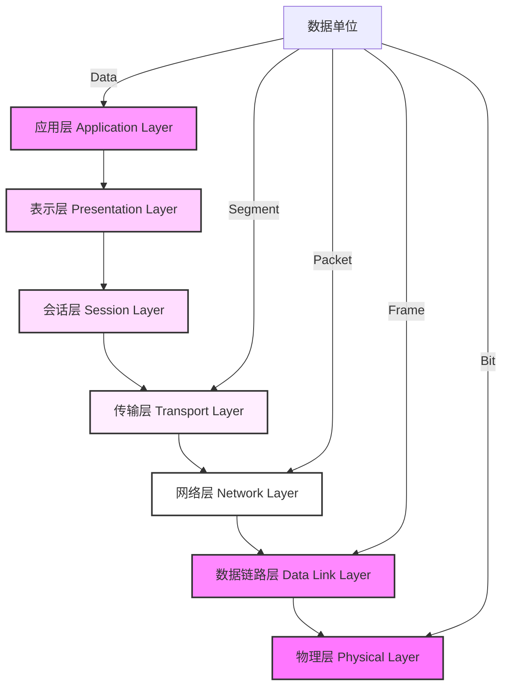

# 1 OSI 七层模型

==**概述**==
OSI（Open Systems Interconnection）模型是国际标准化组织（ISO）制定的一个用于计算机或通信系统间互联的标准体系。

==**分层详解（从上到下）**==

## 1.1 应用层（Application Layer）

- **功能**：为应用程序提供网络服务
- **协议**：
  - HTTP/HTTPS：网页访问
  - FTP：文件传输
  - SMTP：邮件发送
  - POP3/IMAP：邮件接收
  - DNS：域名解析
  - Telnet：远程登录
- **数据单位**：数据（Data）

## 1.2 表示层（Presentation Layer）

- **功能**：
  - 数据格式转换
  - 数据加密解密
  - 数据压缩和解压缩
- **作用**：
  - 确保数据可以在不同系统间正确理解
  - 处理数据格式和编码问题
- **例子**：
  - ASCII、JPEG、MPEG
  - SSL/TLS 加密

## 1.3 会话层（Session Layer）

- **功能**：
  - 建立、维护和终止会话
  - 管理数据交换
  - 同步会话
- **作用**：
  - 控制会话连接
  - 管理数据的发送和接收
- **例子**：
  - RPC（远程过程调用）
  - SQL

## 1.4 传输层（Transport Layer）

- **功能**：
  - 端到端的可靠传输
  - 流量控制
  - 差错控制
- **协议**：
  - TCP：可靠传输，面向连接
  - UDP：不可靠传输，无连接
- **数据单位**：段（Segment）
- **重要特性**：
  - 复用和分用
  - 端口寻址
  - 连接控制

## 1.5 网络层（Network Layer）

- **功能**：
  - 路由选择
  - 分组转发
  - 拥塞控制
- **协议**：
  - IP：网际协议
  - ICMP：控制报文协议
  - IGMP：组管理协议
- **数据单位**：包（Packet）
- **设备**：
  - 路由器
  - 三层交换机

## 1.6 数据链路层（Data Link Layer）

- **功能**：
  - 帧编码和帧定界
  - 差错控制
  - 流量控制
- **协议**：
  - MAC：介质访问控制
  - LLC：逻辑链路控制
- **数据单位**：帧（Frame）
- **设备**：
  - 交换机
  - 网桥

## 1.7 物理层（Physical Layer）

- **功能**：
  - 比特流传输
  - 物理接口规范
  - 传输介质规范
- **传输介质**：
  - 双绞线
  - 光纤
  - 同轴电缆
- **数据单位**：比特（Bit）
- **设备**：
  - 中继器
  - 集线器

# 2 TCP/IP 四层模型

==**概述**==
TCP/IP 是互联网的基础协议栈，是 OSI 模型的简化实现。

## 2.1 应用层（Application Layer）

- **对应 OSI 层**：应用层、表示层、会话层
- **主要协议**：
  - HTTP/HTTPS：Web 服务
  - FTP：文件传输
  - SMTP/POP3：电子邮件
  - DNS：域名解析
  - Telnet：远程登录
  - SSH：安全远程登录

## 2.2 传输层（Transport Layer）

- **对应 OSI 层**：传输层
- **主要协议**：
  - **TCP**：
    - 面向连接
    - 可靠传输
    - 流量控制
    - 拥塞控制
  - **UDP**：
    - 无连接
    - 不可靠传输
    - 高效简单

## 2.3 网络层（Internet Layer）

- **对应 OSI 层**：网络层
- **主要协议**：
  - **IP**：
    - 分组转发
    - 路由选择
  - **ICMP**：
    - 差错报告
    - 网络探测
  - **ARP**：
    - IP 地址到 MAC 地址的转换

## 2.4 网络接口层（Network Access Layer）

- **对应 OSI 层**：数据链路层、物理层
- **功能**：
  - 物理地址寻址
  - 数据帧的传输
  - 媒体访问控制
- **协议**：
  - 以太网协议
  - PPP 协议

# 3 两种模型的对比

==**主要区别**==

1. **层次数量**：

   - OSI：7 层，更细致
   - TCP/IP：4 层，更实用

2. **设计理念**：

   - OSI：理论完整，实现复杂
   - TCP/IP：实践导向，广泛应用

3. **应用情况**：
   - OSI：主要用于理论学习和参考
   - TCP/IP：实际网络的基础协议

==**优缺点分析**==

1. **OSI 模型**：

   - 优点：
     - 细分层次，边界清晰
     - 标准化程度高
     - 利于理解网络通信
   - 缺点：
     - 过于理论化
     - 实现复杂
     - 效率较低

2. **TCP/IP 模型**：
   - 优点：
     - 简单实用
     - 易于实现
     - 广泛应用
   - 缺点：
     - 层次不够清晰
     - 某些功能界定模糊

# 4 面试重点

==**常见面试题**==

1. OSI 七层模型分别是什么？每层的功能是什么？
2. TCP/IP 四层模型与 OSI 七层模型的对应关系？
3. 为什么网络要分层？分层的好处是什么？
4. TCP/IP 协议族中有哪些重要协议？分别在哪一层？

==**答题要点**==

1. **分层原因**：

   - 降低复杂度
   - 标准化接口
   - 易于实现和维护
   - 支持技术更新

2. **协议重点**：

   - 应用层：HTTP、FTP、DNS
   - 传输层：TCP、UDP
   - 网络层：IP、ICMP
   - 数据链路层：以太网协议

3. **数据封装过程**：
   - 应用层：数据
   - 传输层：添加端口信息
   - 网络层：添加 IP 地址
   - 数据链路层：添加 MAC 地址

