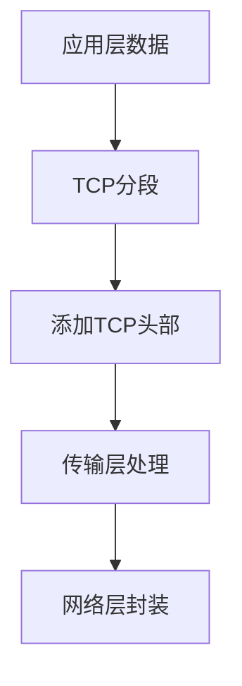
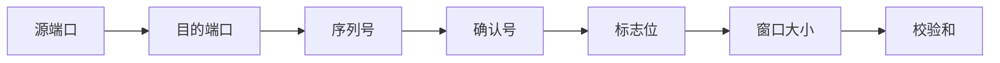
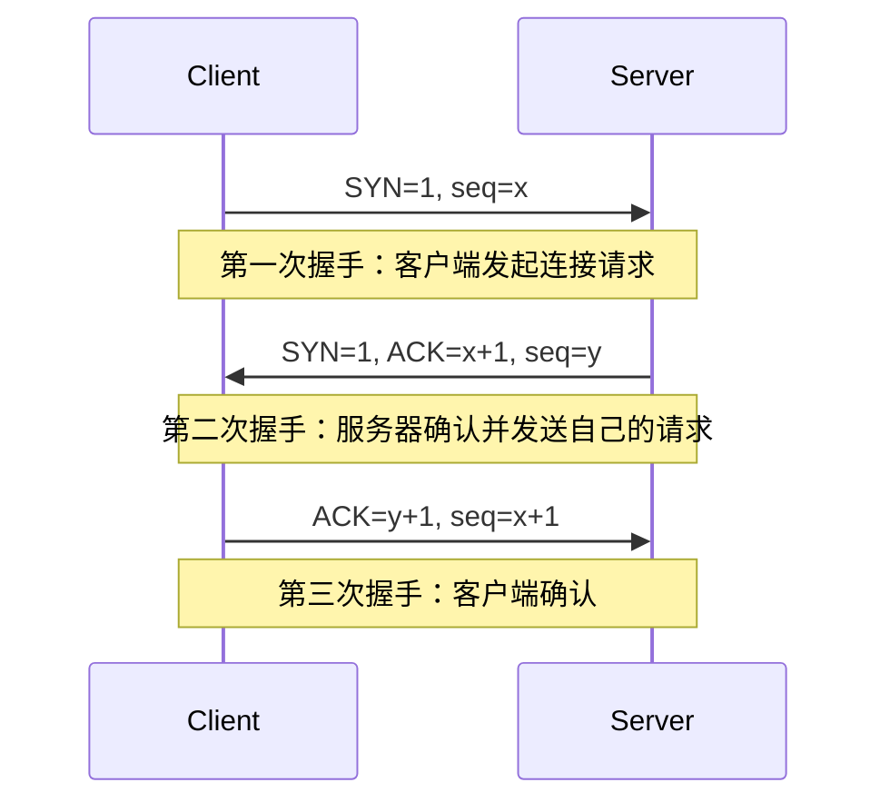
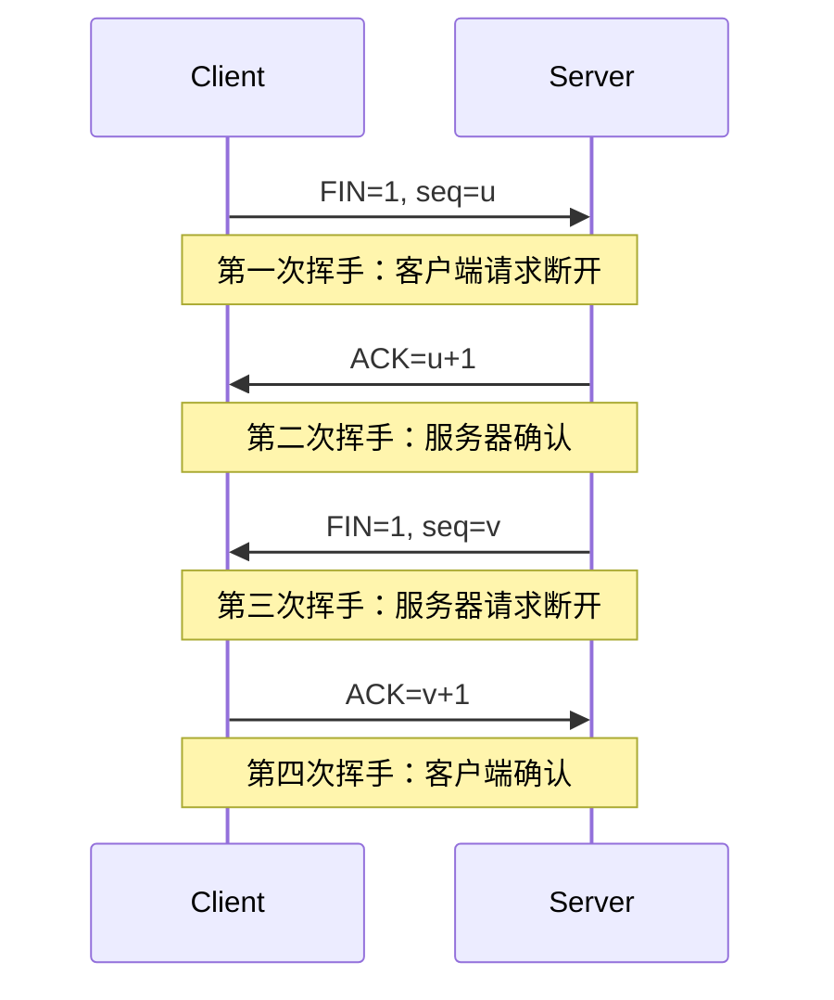
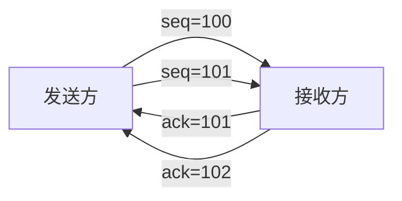
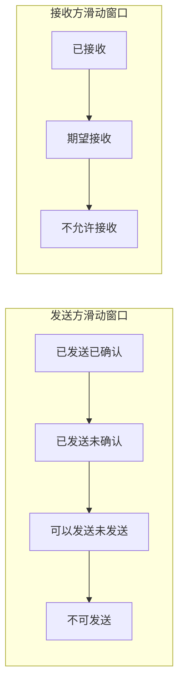
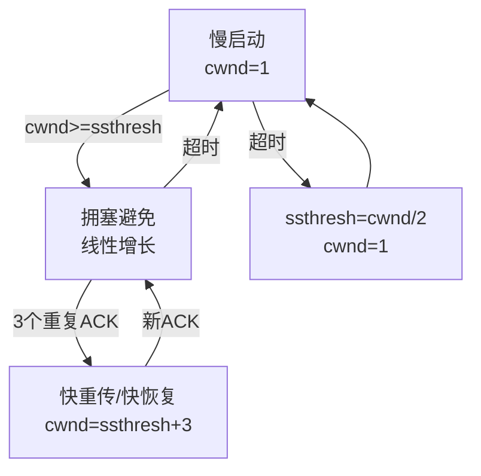
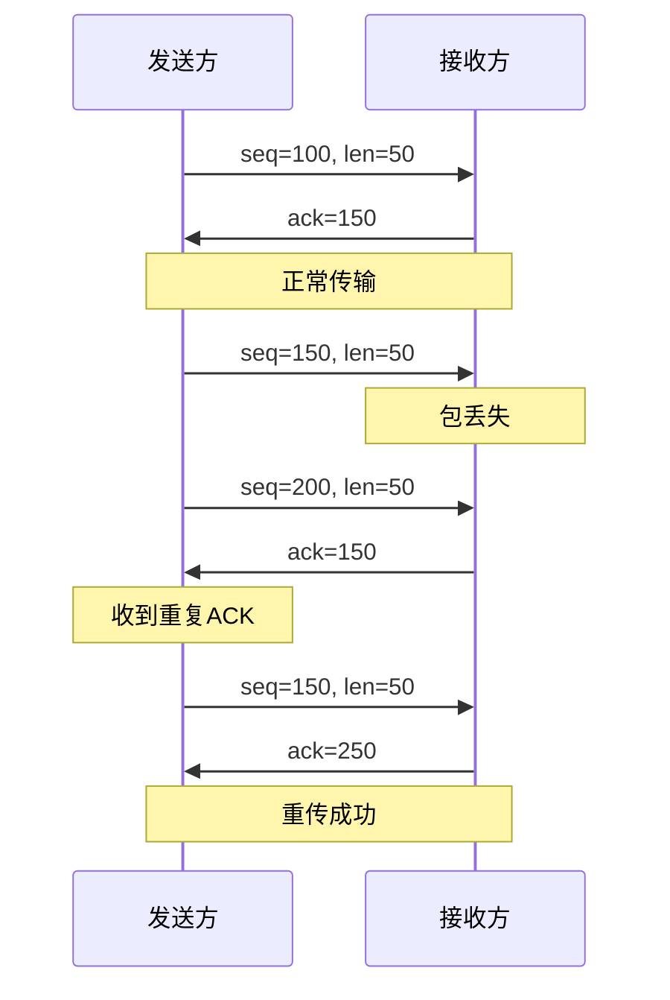
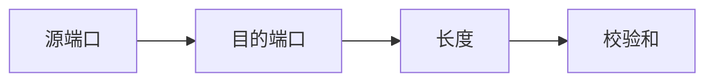
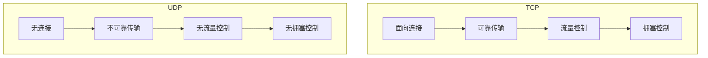

# 1 TCP和UDP协议详解

## 1.1 TCP协议基础

^51a540

### 1.1.1 TCP协议概述
- TCP（传输控制协议）是一种**面向连接的、可靠的、基于字节流**的传输层通信协议
- 核心特点：
  - **面向连接**：通信前需要建立连接（三次握手），通信结束需要断开连接（四次挥手）
  - **可靠传输**：使用确认和重传机制保证数据可靠传输 ^1294c9
  - **全双工通信**：双方可以同时发送和接收数据
  - **面向字节流**：将应用层数据看作字节流，根据MSS（最大报文段长度）分段传输

### 1.1.2 TCP报文结构
- 报文头部字段（20字节固定部分）：
  - **源端口号（16位）**：发送方端口
  - **目的端口号（16位）**：接收方端口
  - **序列号（32位）**：标识报文段的顺序
  - **确认号（32位）**：期望收到的下一个字节序号
  - **标志位**：
    - URG：紧急指针有效
    - ACK：确认号有效
    - PSH：接收方应尽快将数据交付应用层
    - RST：重置连接
    - SYN：建立连接
    - FIN：断开连接
  - **窗口大小（16位）**：接收窗口大小，用于流量控制
  - **校验和（16位）**：用于差错检测

### 1.1.3 TCP连接管理
#### 1.1.3.1 三次握手详解

^a21cf9

**三次握手的必要性**：
1. 防止历史连接的建立：避免旧的重复连接请求被服务器接受
2. 同步双方初始序列号：确保双方都知道对方的初始序列号
3. 避免资源浪费：三次握手可以确保双方都有发送和接收能力

#### 1.1.3.2 四次挥手详解

^f04c89

四次挥手的必要性：
1. 确保数据完整性：等待双方数据都完全发送
2. 避免数据丢失：通过确认机制保证断开过程的可靠性
3. 处理半关闭状态：允许单方面关闭连接

### 1.1.4 TCP可靠传输机制
#### 1.1.4.1 序列号和确认号
- 序列号（Sequence Number）：
  - 标识报文段的顺序
  - 解决网络包乱序问题
  - 初始序列号随机生成
- 确认号（Acknowledgment Number）：
  - 期望收到的下一个字节的序号
  - 采用累积确认机制
  - 只确认最后一个连续收到的包

#### 1.1.4.2 超时重传
- RTT（往返时延）计算：
  - 采样RTT：测量数据包往返时间
  - 平滑RTT：加权移动平均
  - RTO（重传超时时间）：RTT + 4倍RTT偏差
- 快速重传：
  - 收到3个重复ACK触发重传
  - 不等待超时，提高传输效率

#### 1.1.4.3 流量控制

^efb7a2

- 滑动窗口机制： ^32b1fa
  - 发送窗口：
    - 已发送已确认：可以释放的数据
    - 已发送未确认：等待确认的数据
    - 可以发送未发送：允许发送的数据
    - 不可发送：超出窗口大小的数据
  - 接收窗口：
    - 已接收：已经接收并确认的数据
    - 期望接收：允许接收的新数据
    - 不允许接收：超出接收窗口的数据
  - 动态调整机制：
    - 接收方通过TCP头部的窗口字段通告窗口大小
    - 发送方根据接收方通告的窗口大小调整发送速率
    - 当接收方处理能力不足时，可以通告窗口大小为0（零窗口）

#### 1.1.4.4 拥塞控制

^f7cf09

- 拥塞控制算法：
  1. 慢启动（Slow Start）：
     - 初始拥塞窗口cwnd = 1 MSS
     - 每收到一个ACK，cwnd = cwnd * 2
     - 指数增长直到达到慢启动阈值ssthresh
  2. 拥塞避免（Congestion Avoidance）：
     - 每个RTT，cwnd = cwnd + 1
     - 线性增长，谨慎试探网络容量
     - 当出现拥塞时，ssthresh = cwnd/2，cwnd = 1
  3. 快重传（Fast Retransmit）：
     - 接收方收到失序报文段时立即发送重复ACK
     - 发送方收到3个重复ACK时立即重传，不等待超时
     - 进入快恢复阶段
  4. 快恢复（Fast Recovery）：
     - 收到3个重复ACK时，ssthresh = cwnd/2
     - cwnd = ssthresh + 3
     - 每收到一个重复ACK，cwnd = cwnd + 1
     - 收到新ACK后，cwnd = ssthresh

#### 1.1.4.5 可靠传输机制
- 序列号和确认号：
  - 序列号：标识发送数据字节的编号
  - 确认号：期望收到的下一个字节序号
  - 累积确认：确认号N表示N-1及之前的字节都已正确收到

- 超时重传机制：
  - RTO（Retransmission Timeout）计算：
    - 采样RTT：测量数据包往返时间
    - SRTT = (1-α)×SRTT + α×RTT（平滑RTT）
    - RTTVAR = (1-β)×RTTVAR + β×|RTT-SRTT|（RTT变化量）
    - RTO = SRTT + 4×RTTVAR
  - 超时指数退避：每次超时RTO翻倍

- 校验和机制：
  - 对TCP头部和数据进行校验
  - 发送方计算校验和并填充
  - 接收方验证校验和是否正确
  - 校验失败则丢弃数据包

## 1.2 UDP协议基础

### 1.2.1 UDP协议概述
- UDP（用户数据报协议）特点： ^16d9c0
  - 无连接：不需要建立连接即可传输数据
  - 不可靠传输：不保证数据到达
  - 面向报文：保留应用层报文的边界
  - 高效简单：头部开销小，处理速度快

### 1.2.2 UDP报文结构
- 报文头部（8字节）：
  - 源端口号（16位）
  - 目的端口号（16位）
  - 长度（16位）：UDP头部和数据的总长度
  - 校验和（16位）：可选的差错检测

### 1.2.3 UDP应用场景
- 实时音视频：
  - 直播推流
  - 视频会议
  - VoIP电话
- DNS查询：
  - 域名解析
  - 轻量级查询
- 游戏数据：
  - 实时游戏状态
  - 位置更新
- IoT设备：
  - 传感器数据
  - 设备状态报告

## 1.3 TCP vs UDP对比

^a79ee9

### 1.3.1 主要区别

### 1.3.2 性能对比
- TCP：
  - 优点：可靠、有序、错误重传
  - 缺点：延迟大、开销大、建立连接慢
- UDP：
  - 优点：延迟小、开销小、无需连接
  - 缺点：不可靠、可能丢包、无序

### 1.3.3 应用场景选择
- 选择TCP的场景：
  - Web应用（HTTP/HTTPS）
  - 文件传输（FTP）
  - 电子邮件（SMTP/POP3）
  - 远程登录（SSH）
- 选择UDP的场景：
  - 视频直播
  - 在线游戏
  - VoIP通话
  - DNS查询

## 1.4 实践应用

### 1.4.1 TCP最佳实践
- 连接管理优化：
  - 使用长连接（Connection: keep-alive）
  - 实现心跳机制
  - 优化连接池配置
- 性能调优：
  - 调整TCP缓冲区大小
  - 配置TCP_NODELAY（禁用Nagle算法）
  - 启用TCP快速打开（TCP Fast Open）

### 1.4.2 UDP最佳实践
- 可靠性增强：
  - 实现确认机制
  - 添加序列号
  - 设计重传策略
- 性能优化：
  - 合理分包
  - 实现流量控制
  - 使用多路复用

### 1.4.3 常见问题解决
- TCP连接问题：
  - 连接建立慢：优化TCP参数
  - 连接断开：实现重连机制
  - 性能下降：调整窗口大小
- UDP传输问题：
  - 丢包严重：实现QoS
  - 数据乱序：添加序列号
  - 带宽受限：控制发送速率

## 1.5 新技术发展

### 1.5.1 QUIC协议
- 基于UDP的可靠传输协议
- 特点：
  - 0-RTT连接建立
  - 多路复用无队头阻塞
  - 加密传输
  - 连接迁移

### 1.5.2 TCP最新进展
- TCP BBR拥塞控制：
  - 基于带宽和延迟的拥塞控制
  - 更好的网络利用率
- 多路径TCP（MPTCP）：
  - 同时使用多个网络路径
  - 提高带宽利用率
  - 增强可靠性
